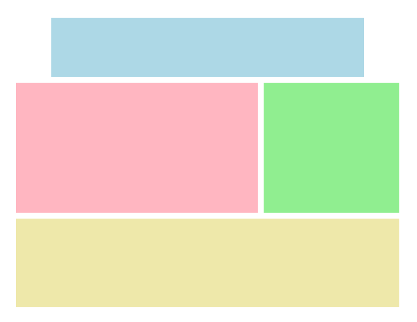
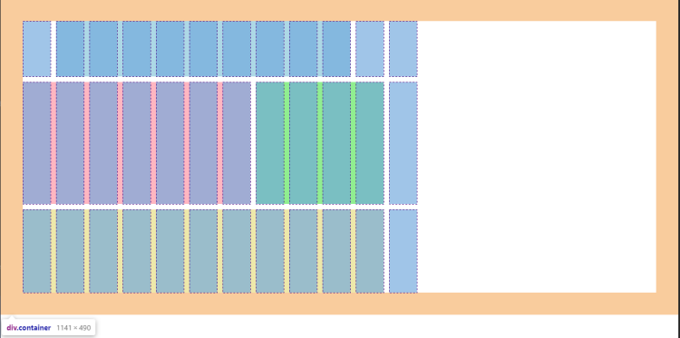

# **Concepto de cuadricula**

<br>

## **_Objetivos:_**

- Comprender el concepto de grid-container y de grid-elements

- Familiarizarse con los términos relacionados con CSS Grid: line, cell, track y area

- Ver un primer ejemplo de cuadricula.

---

---

<br>

---

## **Contexto**

---

<br>

CSS Grid resuelve el problema de la colocación vertical de elementos, parcialmente manejado por flexbox.

Ambas herramientas tienen diferentes usos y son perfectamente complementarias.

Grid permite construir diseños de página complejos en dos dimensiones; mientras que flexbox se utilizará para gestionar la posición de los elementos dentro de los grandes bloques definidos por la cuadrícula.

No hay que ver flexbox y Grid como dos herramientas en competencia, cada una brilla en el contexto adecuado de uso.

Grid es compatible desde 2017 en todos los principales navegadores.

<br>

---

---

<br>

<br>

---

## **El funcionamiento base**

---

<br>

---

Grid, al igual que flexbox, define propiedades que se deben usar en el elemento padre, el contenedor cuadrícula.

En el siguiente ejemplo, se trata del elemento `<div>` con la clase .container.

También hay propiedades que se deben usar en los hijos directos del contenedor de la cuadrícula.

En este caso, son los `<div`> con las clases .header, .content y .footer.

Estos elementos se llaman elementos de la cuadrícula (grid items).

El `<div>` con la clase .sponsors no está afectado por la cuadrícula, ya que no es un hijo directo.

<br>

---

**EJEMPLO**

```html
<div class="container">
  <div class="header"></div>

  <div class="content"></div>

  <div class="footer">
    <div class="sponsors"></div>
  </div>
</div>
```

<br>

---

---

<br>
<br>

---

## **Constitución de una cuadricula Grid**

---

<br>

Es importante estar familiarizado con varios términos al trabajar con CSS Grid.

Una línea de cuadrícula, o línea, es la separación entre dos filas o dos columnas.

<svg>
    <svg viewBox="0 0 375 255" xmlns="http://www.w3.org/2000/svg"><path d="M369.36 37.91c.12-4.71 18.11-22.11-100.86-12.7C206.87 14.77 83.71 32.11 46 24 35.21 18.71-1.93 18.91 5.63 53c-4.2 29.57 1.94 53.89.24 118.75 8 32.94-7.8 37.86 2 58.81 19.73 1.86 38.72-1.49 58.46.17s164.07 9.93 244.61.78c59.6 10.18 51.44-1.53 58-16.09 6.06-43.08-7.6-46.18.42-177.51z" fill="#c9c9c9" style="--darkreader-inline-fill: #363b3d;" data-darkreader-inline-fill=""></path><path d="M127.61 22.29c-1.55 22.51-1.16 106-1.13 125 0 24.3.77 81.72.83 84.73a1.28 1.28 0 0 0 2.56 0c-1-44.67.69-184.59-.31-209.7a1 1 0 0 0-2 0z" fill="#1e1e1e" style="--darkreader-inline-fill: #171819;" data-darkreader-inline-fill=""></path><path d="M365.38 125.75c-53.1-1.52-345.47 1.33-356.74 1.44a1.26 1.26 0 0 0 0 2.51c32-.31 216.83-1.77 277.28-1.93 26.49-.08 53 .12 79.46-.1a1 1 0 0 0 0-1.92z" fill="#1e1e1e" style="--darkreader-inline-fill: #171819;" data-darkreader-inline-fill=""></path><path d="M369.67 213.23c.07-5.35-.32-165.82-.33-172.13 0-6.78 2.15-17.49-6.86-18.8-10.7-1.55-22-1-32.81-1-17.22 0-300 .05-303.45.1-6.44.1-16.62-.87-18.22 7.41a.74.74 0 0 0 0 .26c-1.1 12.15-.22 24.8-.28 37-.12 24.85-.58 144.76-.57 148.55 0 4.46-.67 10.12 1.34 14.26 1 2 2.26 2.52 4.37 3a69.81 69.81 0 0 0 15.84 1.77c28.12.31 290.39-.46 318.11-1.14 6.56-.16 19.77 1.91 22.05-6.53 1.07-3.88.75-8.66.81-12.75zm-2.25 1c-.21 7 .06 14.93-8.89 15.69-5.68.49-22.71.48-25.45.49l-301.65 1A87.38 87.38 0 0 1 14.88 230c-5.55-1-5.41-5.77-5.52-10.54v-5.89c-.08-14.35-.13-130.91 0-174.83 0-3.14-.19-6.39.07-9.53 1.86-9 19.49-6 26.29-5.95l305.82.15c5.91 0 20.88.71 22.11 1.2 3.91 1.55 3.8 6.43 3.7 9.91 0 1.5.74 140.12.06 178.88 0 .29.02.6.01.86z" fill="#1e1e1e" style="--darkreader-inline-fill: #171819;" data-darkreader-inline-fill=""></path><path d="M246.65 24.19c-1 11.74-.29 23.76-.28 35.55 0 10.65-.89 164-.88 166.74 0 .73.11 3.54.12 3 0 2.75 4.22 2.75 4.26 0a22.52 22.52 0 0 0 .2-2.34c.1-2.21.47-151.17.42-162.81-.07-13.3.67-26.91-.59-40.15a1.63 1.63 0 0 0-3.25 0z" fill="#ffdb00" style="--darkreader-inline-fill: #998300;" data-darkreader-inline-fill=""></path></svg>
</svg>

---

<br>

Una celda de la cuadrícula, o grid cell, es una casilla de la cuadrícula.

<svg>
<svg viewBox="0 0 375 255" xmlns="http://www.w3.org/2000/svg"><path d="M369.36 38.61c.12-4.71 18.11-22.1-100.86-12.7C206.87 15.47 83.71 32.81 46 24.7c-10.81-5.29-47.95-5.09-40.39 29-4.2 29.57 1.94 53.89.24 118.75 8 32.94-7.8 37.86 2 58.81 19.73 1.86 38.72-1.49 58.46.17s164.07 9.93 244.61.79c59.6 10.17 51.44-1.54 58-16.1 6.08-43.12-7.58-46.18.44-177.51z" fill="#c9c9c9" style="--darkreader-inline-fill: #363b3d;" data-darkreader-inline-fill=""></path><path d="M251.09 107.27c-11.1-57.88 15.55-88.49-11-85.64-22.83 12-82.77 1.83-99.7 1.91-7 0-24.22 6.63-12.33 27.1 4.8 48.6-13.47 77.13 2.88 79.25 19.12.34 94.65.77 99.21.85 21.06 2.06 22.74-16.31 20.94-23.47z" fill="#ffdb00" style="--darkreader-inline-fill: #998300;" data-darkreader-inline-fill=""></path><path d="M127.61 23c-1.55 22.51-1.16 106-1.13 125 0 24.3.77 81.72.83 84.73a1.28 1.28 0 0 0 2.56 0c-1-44.67.69-184.59-.31-209.7a1 1 0 0 0-2 0z" fill="#1e1e1e" style="--darkreader-inline-fill: #171819;" data-darkreader-inline-fill=""></path><path d="M365.38 126.45c-53.1-1.52-345.47 1.33-356.74 1.44a1.26 1.26 0 0 0 0 2.52c32-.32 216.83-1.78 277.28-1.94 26.49-.07 53 .12 79.46-.09a1 1 0 0 0 0-1.93z" fill="#1e1e1e" style="--darkreader-inline-fill: #171819;" data-darkreader-inline-fill=""></path><path d="M369.67 213.93c.07-5.35-.32-165.82-.33-172.12 0-6.79 2.15-17.5-6.86-18.81-10.7-1.55-22-1-32.81-1-17.22 0-300 0-303.45.1-6.44.1-16.62-.87-18.22 7.41a.74.74 0 0 0 0 .26c-1.1 12.16-.22 24.8-.28 37-.12 24.85-.58 144.76-.57 148.56 0 4.45-.67 10.11 1.34 14.25 1 2 2.26 2.52 4.37 3.05a70.39 70.39 0 0 0 15.84 1.78c28.12.3 290.39-.47 318.11-1.14 6.56-.16 19.77 1.9 22.05-6.54 1.07-3.93.75-8.73.81-12.8zm-2.25 1c-.21 7 .06 14.93-8.89 15.69-5.68.49-22.71.48-25.45.49l-301.65 1a87.38 87.38 0 0 1-16.55-1.4c-5.55-1-5.41-5.77-5.52-10.54v-5.89C9.25 200 9.2 83.4 9.35 39.48c0-3.14-.19-6.39.07-9.53 1.86-9 19.49-6 26.29-5.95l305.82.15c5.91 0 20.88.71 22.11 1.2 3.91 1.55 3.8 6.43 3.7 9.91 0 1.5.74 140.12.06 178.88.01.25.03.53.02.86z" fill="#1e1e1e" style="--darkreader-inline-fill: #171819;" data-darkreader-inline-fill=""></path><path d="M247.3 25.5c-1.1 22.4-.1 45.07-.11 67.51 0 18.66-.69 135-.73 137.79a1.28 1.28 0 0 0 2.56 0c.62-42.39 1.7-180.42.23-205.3a1 1 0 0 0-1.95 0z" fill="#1e1e1e" style="--darkreader-inline-fill: #171819;" data-darkreader-inline-fill=""></path></svg>
</svg>

---

<br>

Una track grid es una línea o columna rellena de cuadricula.

<svg>
<svg viewBox="0 0 375 255" xmlns="http://www.w3.org/2000/svg"><path d="M369.36 37.54c.12-4.71 18.11-22.1-100.86-12.7C206.87 14.4 83.71 31.74 46 23.63c-10.81-5.29-47.95-5.09-40.39 29-4.2 29.57 1.94 53.89.24 118.76 8 32.94-7.8 37.85 2 58.8 19.73 1.86 38.72-1.48 58.46.18s164.07 9.92 244.61.78c59.6 10.18 51.44-1.54 58-16.1 6.08-43.05-7.58-46.18.44-177.51z" fill="#c9c9c9" style="--darkreader-inline-fill: #363b3d;" data-darkreader-inline-fill=""></path><path d="M370.43 209.25c-3.52-9.2-1-69.81-1.1-71-.56-8.09-6.31-9.81-13.34-10.32-11.73-.85-83-1.18-107 1-23.38 2.17-203.38-3.35-229.92-1.39-7.09.52-19 9.11-12.68 27.08-.94 3.11-.4 69 2.3 75 2.77 6.18 8.68 5.53 14.35 5 6.35-.57 69.08-4.89 94.13-5.4 25.7-.52 158.48 9.5 237.73 2.58 5.1-.07 17.71-8.07 15.53-22.55z" fill="#ffdb00" style="--darkreader-inline-fill: #998300;" data-darkreader-inline-fill=""></path><path d="M127.61 21.93c-1.55 22.51-1.16 106-1.13 125 0 24.3.77 81.72.83 84.74a1.28 1.28 0 0 0 2.56 0c-1-44.68.69-184.6-.31-209.7a1 1 0 0 0-2 0z" fill="#1e1e1e" style="--darkreader-inline-fill: #171819;" data-darkreader-inline-fill=""></path><path d="M365.38 125.39c-53.1-1.52-345.47 1.32-356.74 1.44a1.26 1.26 0 0 0 0 2.51c32-.32 216.83-1.78 277.28-1.94 26.49-.07 53 .12 79.46-.09a1 1 0 0 0 0-1.92z" fill="#1e1e1e" style="--darkreader-inline-fill: #171819;" data-darkreader-inline-fill=""></path><path d="M369.67 212.87c.07-5.36-.32-165.83-.33-172.13 0-6.79 2.15-17.5-6.86-18.81-10.7-1.55-22-1-32.81-1-17.22 0-300 0-303.45.09-6.44.1-16.62-.87-18.21 7.41a.69.69 0 0 0 0 .25c-1.1 12.16-.22 24.81-.28 37-.12 24.84-.58 144.76-.57 148.55 0 4.46-.67 10.12 1.34 14.25 1 2 2.26 2.53 4.37 3.05a70.39 70.39 0 0 0 15.84 1.78c28.12.3 290.39-.47 318.11-1.14 6.56-.16 19.77 1.91 22.05-6.53 1.06-3.9.74-8.64.8-12.77zm-2.25 1c-.21 7 .06 14.93-8.89 15.7-5.68.48-22.71.48-25.45.49l-301.65 1a86.58 86.58 0 0 1-16.55-1.41c-5.55-1-5.41-5.76-5.52-10.53v-5.9c-.08-14.35-.13-130.9 0-174.83 0-3.14-.19-6.39.07-9.52v-.05c1.86-9 19.49-6 26.29-5.95l305.83.13c5.91 0 20.88.72 22.11 1.2 3.91 1.55 3.8 6.43 3.7 9.92 0 1.49.74 140.11.06 178.87-.01.33.01.62 0 .9z" fill="#1e1e1e" style="--darkreader-inline-fill: #171819;" data-darkreader-inline-fill=""></path><path d="M247.3 24.43c-1.1 22.4-.1 45.08-.11 67.51 0 18.66-.69 135-.73 137.8a1.28 1.28 0 0 0 2.56 0c.62-42.4 1.7-180.43.23-205.31a1 1 0 0 0-1.95 0z" fill="#1e1e1e" style="--darkreader-inline-fill: #171819;" data-darkreader-inline-fill=""></path></svg>
</svg>

---

<br>

Una área de cuadrícula es una zona compuesta por varias celdas adyacentes.

<svg>
<svg viewBox="0 0 375 255" xmlns="http://www.w3.org/2000/svg"><path d="M369.36 37.58c.12-4.71 18.11-22.1-100.86-12.69C206.87 14.45 83.71 31.78 46 23.67c-10.81-5.29-47.95-5.09-40.39 29-4.2 29.56 1.94 53.89.24 118.75 8 32.94-7.8 37.85 2 58.8 19.73 1.87 38.72-1.48 58.46.18s164.07 9.92 244.61.78c59.6 10.18 51.44-1.54 58-16.1 6.08-43.08-7.58-46.17.44-177.5z" fill="#c9c9c9" style="--darkreader-inline-fill: #363b3d;" data-darkreader-inline-fill=""></path><path d="M249.48 212.19c3.49-8.58-.56-169.13-.48-169.67 3.34-4 3.67-23.49-2.55-21.62-17.37 5.22-227.89-.5-230.82 1.38C10.44 25.61 1.14 34.16 7 46.56c-4.84 8-2.71 17.83-.44 27 1.27 5.17-3.09 84.37 0 103.85 7.59 28.74-17.47 54.1 12.52 57 74.45-2.43 162.08 4.91 163.74-1.83 11 4.06 44.65-.23 56.19 2.26 11.05 2.42 11.56-17.28 10.47-22.65z" fill="#ffdb00" style="--darkreader-inline-fill: #998300;" data-darkreader-inline-fill=""></path><path d="M127.61 22c-1.55 22.51-1.16 106-1.13 125 0 24.3.77 81.73.83 84.74a1.28 1.28 0 0 0 2.56 0c-1-44.67.69-184.6-.31-209.7a1 1 0 0 0-2 0z" fill="#1e1e1e" style="--darkreader-inline-fill: #171819;" data-darkreader-inline-fill=""></path><path d="M365.38 125.43c-53.1-1.52-345.47 1.32-356.74 1.44a1.26 1.26 0 0 0 0 2.51c32-.32 216.83-1.78 277.28-1.94 26.49-.07 53 .13 79.46-.09a1 1 0 0 0 0-1.92z" fill="#1e1e1e" style="--darkreader-inline-fill: #171819;" data-darkreader-inline-fill=""></path><path d="M369.67 212.91c.07-5.36-.32-165.83-.33-172.13 0-6.78 2.15-17.49-6.86-18.8-10.7-1.56-22-1-32.81-1-17.22 0-300 0-303.45.09-6.44.1-16.62-.87-18.21 7.41a.76.76 0 0 0 0 .26c-1.1 12.15-.22 24.8-.28 37-.12 24.85-.58 144.76-.57 148.55 0 4.46-.67 10.12 1.34 14.26 1 2 2.26 2.52 4.37 3a70.39 70.39 0 0 0 15.84 1.78c28.12.31 290.39-.46 318.11-1.14 6.56-.16 19.77 1.91 22.05-6.53 1.06-3.88.74-8.66.8-12.75zm-2.25 1c-.21 7 .06 14.93-8.89 15.7-5.68.49-22.71.48-25.45.49l-301.65 1a86.58 86.58 0 0 1-16.55-1.41c-5.55-1-5.41-5.76-5.52-10.53v-5.9c-.08-14.35-.13-130.9 0-174.83 0-3.14-.19-6.38.07-9.52v-.05c1.86-9 19.49-6 26.29-5.95l305.82.15c5.91 0 20.88.72 22.11 1.2 3.91 1.55 3.8 6.43 3.7 9.92 0 1.49.74 140.12.06 178.87 0 .31.02.6.01.88z" fill="#1e1e1e" style="--darkreader-inline-fill: #171819;" data-darkreader-inline-fill=""></path><path d="M247.3 24.47c-1.1 22.4-.1 45.08-.11 67.51 0 18.66-.69 135-.73 137.8a1.28 1.28 0 0 0 2.56 0c.62-42.4 1.7-180.43.23-205.31a1 1 0 0 0-1.95 0z" fill="#1e1e1e" style="--darkreader-inline-fill: #171819;" data-darkreader-inline-fill=""></path></svg>
</svg>

<br>

---

---

<br>
<br>

---

## **Una primera cuadricula**

---

<br>

Tomemos el ejemplo de una estructura de página que se encuentra comúnmente en un sitio web:

una página con un encabezado, un pie de página, un contenido principal y un bloque lateral que podría corresponder a un menú de navegación.

Para implementar este modelo, simplemente debemos colocar estos cuatro elementos en un grid container.

Aquí, la cuadricula en sí misma se ha dividido en doce columnas de 50 px cada una y tres filas de 100 px, 220 px y 150 px.

<br>

---

**EJEMPLO**

```html
<!DOCTYPE html>

<html>
  <head>
    <meta charset="utf-8" />

    <meta name="viewport" content="width=device-width" />

    <title>repl.it</title>

    <link href="style.css" rel="stylesheet" type="text/css" />
  </head>

  <body>
    <div class="container">
      <div class="header"></div>

      <div class="content"></div>

      <div class="aside"></div>

      <div class="footer"></div>
    </div>
  </body>
</html>
```

<br>

```css
html,
body {
  margin: 0;
}

.container {
  display: grid;
  grid-template-columns: 50px 50px 50px 50px 50px 50px 50px 50px 50px 50px 50px 50px;
  grid-template-rows: 100px 220px 150px;
  gap: 10px;
  margin: 40px;
}

.header {
  grid-column-start: 2;
  grid-column-end: 11;
  grid-row-start: 1;
  background: lightblue;
}

.content {
  grid-column-start: 1;
  grid-column-end: 8;
  grid-row-start: 2;
  background: lightpink;
}

.aside {
  grid-column-start: 8;
  grid-column-end: 12;
  grid-row-start: 2;
  background: lightgreen;
}

.footer {
  grid-column-start: 1;
  grid-column-end: 12;
  grid-row-start: 3;
  background: palegoldenrod;
}
```

<br>



<br>

---

---

<br>
<br>

---

### **Complemento: Inspeccionar el elemento**

---

<br>

Si inspeccionamos el elemento utilizando las herramientas de desarrollo del navegador, podemos distinguir fácilmente la plantilla que se creó, así como los diferentes elementos que la componen.

<br>



<br>

---

---

<br>
<br>

---

## **A recordar**

---

<br>

**Para utilizar CSS Grid, es necesario aplicar las propiedades en un elemento padre: solo sus hijos directos se verán afectados por los cambios.**

**Es importante estar familiarizado con algunos términos:**

- **línea de cuadrícula (grid line) para la separación entre dos filas o columnas.**

- **celda de cuadrícula (grid cell) para representar una casilla en una cuadrícula.**

- **pista de cuadrícula (grid track) para representar una fila o columna de la cuadrícula.**

- **área de cuadrícula (grid area) para representar una zona de varias celdas adyacentes.**

<br>

---

---

<br>
<br>

---

### **Complemento**

---

<br>

[Documentación: CSS Grid](https://developer.mozilla.org/fr/docs/Web/CSS/CSS_Grid_Layout)

<br>

---

---
