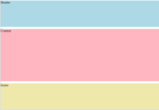
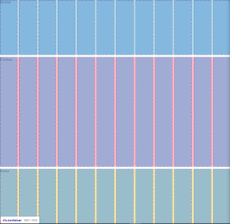

# **Las propiedades del elemento padre**

<br>

## **_Objetivos:_**

- Comprender cómo configurar filas y columnas.

- Saber cómo nombrar separadores de filas/columnas.

- Saber cómo crear áreas para agrupar varias celdas.

- Saber cómo crear espaciado entre filas y columnas en una cuadrícula.

---

---

<br>

---

## **Contexto**

---

<br>

Ahora que hemos identificado cómo se compone una cuadrícula, podemos adentrarnos en el tema y aprender cómo definir nuestra primera cuadrícula.

Algunos elementos de la sintaxis ya han aparecido en el capítulo anterior, aquí los veremos en detalle, centrándonos en el elemento padre y en las diferentes propiedades que se pueden aplicarle.

<br>

---

---

<br>

<br>

---

## **Definir el modo de visualización con Display: grid**

---

<br>

---

La creación de una cuadricula comienza con el uso de la propiedad CSS display con el valor grid.

El elemento heredará ciertas características de un elemento con display: block. Ocupará todo el espacio disponible en anchura y ningún elemento podrá colocarse al lado de la cuadricula.

También es posible utilizar el valor inline-grid: el elemento se comportará de manera similar a un elemento inline-block, manteniendo el sistema de cuadricula, es decir, el elemento será del mismo tamaño que su contenido.

Una vez establecido este modo de visualización, este elemento se considera nuestro contenedor de cuadricula.

<br>

---

---

<br>
<br>

---

## **Constitución de la plantilla de grid**

---

<br>

Una vez declarado el contenedor, es necesario definir el cuerpo de la cuadrícula o la expresión de las "grid tracks".

Para ello, CSS proporciona dos propiedades:

- "grid-template-columns"

y

- "grid-template-rows".

<br>

---

---

<br>
<br>

---

## **Definir columnas (columns)**

---

<br>

---

**EJEMPLO**

```css
.container {
  grid-template-columns: 50px 50px 50px 50px;
}
```

<br>

grid-template-columns define las columnas de la cuadrícula.

Aquí hemos definido cuatro columnas de 50 px cada una.

La propiedad acepta una lista de tamaños que pueden expresarse en píxeles, pero también en porcentaje de la página o en "fracción" del espacio restante, expresada en forma de una nueva unidad (fr).

<br>

---

---

<br>
<br>

---

## **La unidad FR**

---

<br>

En la propiedad CSS flex, encontramos la misma lógica que nos permite expresar el tamaño de un elemento en función del espacio disponible restante en el contenedor.

Es decir, que 1 "fr" representa una unidad de espacio disponible restante.

Por ejemplo, si definimos las siguientes columnas, se creará una cuadrícula con cuatro columnas: la primera de 50 píxeles, y las otras tres se dividirán respectivamente en 1/4 del espacio que quede aunque engrandezcamos la pantalla o empequeñecemos seguirá ocupando el espacio que queda, 1/4 del espacio restante y 2/4 del espacio restante.

solo los 50px serán asi y se quedaran asi fijos.
<br>

```css
.container {
  grid-template-columns: 50px 1fr 1fr 2fr;
}
```

<br>

---

---

<br>
<br>

---

### **Complemento: Combinar las unidades**

---

<br>

Es posible combinar la expresión de tamaños para nuestras columnas.

También es posible usar el valor "auto", que tomará el 100% del tamaño restante después de que las otras columnas hayan reservado su tamaño.

<br>

---

---

<br>
<br>

---

### **Complemento: Repetir la declaración**

---

<br>

Finalmente, en el caso de un gran número de columnas, es posible utilizar la expresión "repeat" en la definición de la plantilla para expresar un bucle.

Es una función que toma dos parámetros: el número de iteraciones y el tamaño del elemento.

<br>

---

**EJEMPLO**

```css
.container {
  grid-template-columns: repeat(12, 1fr);
}
```

Este ejemplo producirá una cuadrícula similar a la propuesta por Bootstrap, es decir, doce columnas de tamaños iguales, 1 fr o una unidad de tamaño restante para cada columna.

<br>

---

---

<br>
<br>

---

## **Definir filas**

---

<br>

---

**EJEMPLO**

```css
.container {
  grid-template-rows: 100px 220px 150px;
}
```

<br>

La segunda propiedad, grid-template-rows, permite definir las filas de la cuadrícula.

Al igual que con la definición de las columnas, es posible utilizar todas las unidades que hemos visto (px, porcentaje, fr, auto) y también es posible definir varias filas de manera repetida con la función repeat.

<br>

---

---

<br>
<br>

---

## **Espaciar celdas**

---

<br>

En el primer ejemplo, había una propiedad "gap" en el contenedor de la cuadrícula.

Esta propiedad determinará el espaciado entre las celdas de una cuadrícula.

Por defecto, no hay espaciado, pero es posible usar esta propiedad con uno o dos valores.

En el caso de usar dos valores, estos se refieren respectivamente al espaciado entre dos filas de la cuadrícula y entre dos columnas de la cuadrícula.

<br>

---

**EJEMPLO**

```css
.container {
  gap: 10px 15px;
}
```

<br>

---

---

<br>
<br>

---

## **Estructurar una pagina web**

---

<br>

Retomemos el ejemplo de una página web clásica y ensaquémonos en la definición de las propiedades del elemento padre .container.

<br>

---

**EJEMPLO**

```html
<!DOCTYPE html>

<html>
  <head>
    <meta charset="utf-8" />
    <meta name="viewport" content="width=device-width" />
    <title>repl.it</title>
    <link href="style.css" rel="stylesheet" type="text/css" />
  </head>

  <body>
    <div class="container">
      <div class="header">Header</div>
      <div class="content">Content</div>
      <div class="footer">footer</div>
    </div>
  </body>
</html>
```

<br>

---

<br>

Nuestro elemento .container tomará toda la altura de la pantalla, se dividirá en 12 columnas, cada una de las cuales tomará una porción del espacio disponible.

Las 3 filas tomarán respectivamente una fracción del espacio disponible, dos fracciones y una fracción.

También se indica que se desea un espacio de 10 píxeles entre nuestras filas y columnas.

<br>

---

**EJEMPLO**

```css
html,
body {
  margin: 0;
}

.container {
  display: grid;
  grid-template-columns: repeat(12, 1fr);
  grid-template-rows: 1fr 2fr 1fr;
  gap: 10px;
  height: 100vh;
}

.header {
  grid-column-start: 1;
  grid-column-end: 13;
  grid-row-start: 1;
  background: lightblue;
}

.content {
  grid-column-start: 1;
  grid-column-end: 13;
  grid-row-start: 2;
  background: lightpink;
}

.footer {
  grid-column-start: 1;
  grid-column-end: 13;
  grid-row-start: 3;
  background: palegoldenrod;
}
```

<br>



Si inspeccionamos nuestro elemento, nos damos cuenta de que todos nuestros elementos están bien posicionados.

<br>



<br>

---

---

<br>
<br>

---

### **Complemento: Nombrar las separaciones (las grid: line)**

---

<br>

<svg>
<svg viewBox="0 0 375 255" xmlns="http://www.w3.org/2000/svg"><path d="M369.36 37.91c.12-4.71 18.11-22.11-100.86-12.7C206.87 14.77 83.71 32.11 46 24 35.21 18.71-1.93 18.91 5.63 53c-4.2 29.57 1.94 53.89.24 118.75 8 32.94-7.8 37.86 2 58.81 19.73 1.86 38.72-1.49 58.46.17s164.07 9.93 244.61.78c59.6 10.18 51.44-1.53 58-16.09 6.06-43.08-7.6-46.18.42-177.51z" fill="#c9c9c9" style="--darkreader-inline-fill: #363b3d;" data-darkreader-inline-fill=""></path><path d="M127.61 22.29c-1.55 22.51-1.16 106-1.13 125 0 24.3.77 81.72.83 84.73a1.28 1.28 0 0 0 2.56 0c-1-44.67.69-184.59-.31-209.7a1 1 0 0 0-2 0z" fill="#1e1e1e" style="--darkreader-inline-fill: #171819;" data-darkreader-inline-fill=""></path><path d="M365.38 125.75c-53.1-1.52-345.47 1.33-356.74 1.44a1.26 1.26 0 0 0 0 2.51c32-.31 216.83-1.77 277.28-1.93 26.49-.08 53 .12 79.46-.1a1 1 0 0 0 0-1.92z" fill="#1e1e1e" style="--darkreader-inline-fill: #171819;" data-darkreader-inline-fill=""></path><path d="M369.67 213.23c.07-5.35-.32-165.82-.33-172.13 0-6.78 2.15-17.49-6.86-18.8-10.7-1.55-22-1-32.81-1-17.22 0-300 .05-303.45.1-6.44.1-16.62-.87-18.22 7.41a.74.74 0 0 0 0 .26c-1.1 12.15-.22 24.8-.28 37-.12 24.85-.58 144.76-.57 148.55 0 4.46-.67 10.12 1.34 14.26 1 2 2.26 2.52 4.37 3a69.81 69.81 0 0 0 15.84 1.77c28.12.31 290.39-.46 318.11-1.14 6.56-.16 19.77 1.91 22.05-6.53 1.07-3.88.75-8.66.81-12.75zm-2.25 1c-.21 7 .06 14.93-8.89 15.69-5.68.49-22.71.48-25.45.49l-301.65 1A87.38 87.38 0 0 1 14.88 230c-5.55-1-5.41-5.77-5.52-10.54v-5.89c-.08-14.35-.13-130.91 0-174.83 0-3.14-.19-6.39.07-9.53 1.86-9 19.49-6 26.29-5.95l305.82.15c5.91 0 20.88.71 22.11 1.2 3.91 1.55 3.8 6.43 3.7 9.91 0 1.5.74 140.12.06 178.88 0 .29.02.6.01.86z" fill="#1e1e1e" style="--darkreader-inline-fill: #171819;" data-darkreader-inline-fill=""></path><path d="M246.65 24.19c-1 11.74-.29 23.76-.28 35.55 0 10.65-.89 164-.88 166.74 0 .73.11 3.54.12 3 0 2.75 4.22 2.75 4.26 0a22.52 22.52 0 0 0 .2-2.34c.1-2.21.47-151.17.42-162.81-.07-13.3.67-26.91-.59-40.15a1.63 1.63 0 0 0-3.25 0z" fill="#ffdb00" style="--darkreader-inline-fill: #998300;" data-darkreader-inline-fill=""></path></svg>
</svg>

Es posible nombrar las 👆 líneas de separación **(grid lines)** entre dos columnas o entre dos filas de la cuadrícula para poder colocar los elementos más fácilmente posteriormente.

Para nombrar estos separadores, simplemente se debe agregar entre corchetes un nombre entre dos columnas o entre dos filas.

<br>

---

**EJEMPLO**

```css
.container {
  grid-template-rows: [start] 1fr [spacing-left] auto [spacing-right] 1fr [end];
}
```

<br>

---

---

<br>
<br>

---

### **Complemento: Nombrar las zonas**

---

<br>

Es posible nombrar en las propiedades del contenedor de la cuadrícula las zonas o áreas de la cuadrícula para facilitar la colocación de los elementos posteriormente y dar un poco de semántica a las filas y columnas.

<br>

---

**EJEMPLO**

```css
body {
  grid-template-columns: 50px 50px 50px 50px;
  grid-template-rows: 100px 220px 150px;
  grid-template-areas:
    "header header header header"
    "main main . sidebar"
    "footer footer footer footer";
}
```

<br>

La sintaxis es un poco particular:

consiste en dibujar las áreas deseadas.

Aquí, se ha definido que la primera fila se dedicará al encabezado, que la segunda fila llevará la sección principal en las dos columnas más a la izquierda, luego se dejará una columna vacía para crear un espacio (representado por el carácter "."), y finalmente, en la última columna a la derecha, un elemento de barra de herramientas.

Toda la fila inferior contendrá el pie de página.

Se abordará la forma de posicionar un elemento en relación con estas áreas en la sección sobre las propiedades de los elementos de la cuadrícula.

<br>

---

---

<br>
<br>

---

## **A recordar**

---

<br>

- **Para crear una cuadrícula se utiliza la propiedad display en un elemento con los valores `grid` o `inline-grid`.**

- **Las filas se definen con la propiedad `grid-template-rows` y las columnas con la propiedad `grid-template-columns`.**

- **La unidad `fr` se utiliza para representar una _fracción_ del espacio restante.**

- **_Para repetir_ una configuración se puede utilizar la función _repeat_.**

- **Las separaciones entre líneas o columnas pueden ser nombradas con la sintaxis `[nombre_de_separación]`.**

- **Las diferentes zonas de la cuadrícula pueden ser nombradas con la propiedad `grid-template-areas`.**

- **Los nombres de las separaciones y zonas permiten posicionar elementos más fácilmente.**

- **La propiedad gap se utiliza para espaciar las celdas de la cuadrícula.**

<br>

---

---
