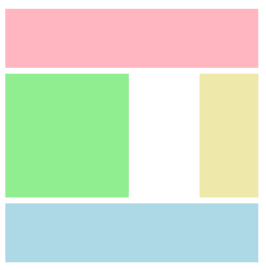

# **Las propiedades de los elementos hijos**

<br>

## **_Objetivos:_**

- Situar elementos sobre una cuadricula con grid-row-x y grid-column-x.

- Situar elementos con los separadores nombrados.

- Situar elementos sobre los grid-area.

---

---

<br>

---

## **Contexto**

---

<br>

Acabamos de ver la configuración global de una cuadrícula CSS con las propiedades del contenedor de cuadrícula.

Ahora veamos la posición de los elementos en la cuadrícula.

A diferencia del contenedor de cuadrícula, no es necesario definir explícitamente un elemento como grid item: el navegador lo considerará automáticamente como tal si es un hijo directo del contenedor de cuadrícula.

También es importante tener en cuenta que, como resultado, las propiedades float, display y vertical-align no tendrán ningún efecto en un grid-item.

Su posición será dictada por la cuadrícula.

Para los siguientes ejemplos, consideremos este contenedor de cuadrícula: una cuadrícula de 4 por 4, cada celda mide 100 px por 100 px, y están separadas por 10 px vertical y horizontalmente.

<br>

---

**EJEMPLO**

```css
.container {
  display: inline-grid;
  grid-template-columns: repeat(4, 100px);
  grid-template-rows: repeat(4, 100px);
  gap: 10px;
  background: lightgray;
}
```

```
Para saber que hace inline-grid 👇
```

[Min 15:12](https://youtu.be/x63kKPlnLO0)

<br>

---

---

<br>

<br>

---

## **Posicionar un elemento**

---

<br>

---

Las primeras propiedades para posicionar un elemento hijo en la cuadrícula son grid-column-start y grid-row-start.

Estas propiedades permiten indicar respectivamente el separador (grid-line) de inicio para las columnas y las filas de la cuadrícula.

Para ubicar un elemento en la primera fila, segunda columna, se indica:

<br>

---

**EJEMPLO**

```css
.item1 {
  grid-row-start: 1;
  grid-column-start: 2;
  background: #0984e3;
}
```


<br>

---

---

<br>
<br>

---

## **Manejar las dimensiones**

---

<br>

Por defecto, un elemento colocado en la cuadrícula medirá una columna de ancho y una fila de altura, pero es posible configurar la línea/columna final, retomando el código anterior.

Agregando las propiedades grid-column-end y grid-row-end, es posible definir el tamaño del elemento en la cuadrícula.

<br>

---

**EJEMPLO**

```css
.item1 {
  grid-column-start: 2;
  grid-column-end: 4;

  grid-row-start: 1;
  grid-row-end: 3;

  background: #0984e3;
}
```

<br>


<br>

Para cada una de estas propiedades, es posible especificar dos valores separados por una barra ( / ): el elemento se extenderá así sobre varias filas o varias columnas.

**"grid-row" es una propiedad abreviada para:**

- **"grid-row-start":** número de la fila donde comenzará el elemento.

- **"grid-row-end":** número de la fila hasta la cual se extenderá el elemento, o con la palabra clave "span", el número de filas que abarcará el elemento.

"grid-column" es una propiedad abreviada para:

- **"grid-column-start":** número de la columna donde comenzará el elemento.

- **"grid-column-end":** número de la columna hasta la cual se extenderá el elemento, o con la palabra clave "span", el número de columnas que abarcará el elemento.

<br>

---

---

<br>
<br>

---

## **Posicionamiento con respecto a separadores nombrados.**

---

<br>

---

**EJEMPLO**

Si la cuadricula estuviera definida por separadores nombrados, por ejemplo:

```css
.container {
  display: inline-grid;

  grid-template-columns: [start-col] 100px [middle-col] 100px [end-col];

  grid-template-rows: auto;
}
```

Habría sido posible indicar el nombre del separador como valor de las propiedades grid-column-start, grid-row-start, grid-column-end o grid-row-end en lugar del número del separador.

<br>

---

**EJEMPLO**

```css
.item1 {
  grid-column-start: start-col;
  grid-row-start: 1;
  grid-column-end: end-col;
}
```

<br>

---

---

<br>
<br>

---

## **Posicionamiento en cuanto a zonas**

---

<br>

También es posible utilizar la propiedad grid-area, que reemplazará a grid-column-start, grid-row-start, grid-column-end y grid-row-end para indicar una zona si la cuadrícula ha sido definida con zonas (grid-area), como esta cuadrícula:

<br>

```css
.container {
  display: inline-grid;
  grid-template-columns: repeat(4, 100px);
  grid-template-rows: repeat(4, 100px);
  gap: 10px;
  grid-template-areas:
    "header header header header"
    "main main . aside"
    "main main . aside"
    "footer footer footer footer";
}

.page-header {
  grid-area: header;
  background: lightpink;
}

section.content {
  grid-area: main;
  background: lightgreen;
}

nav.toolbar {
  grid-area: aside;
  background: palegoldenrod;
}

footer {
  grid-area: footer;
  background: lightblue;
}
```



<br>

---

---

<br>
<br>

---

## **A recordar**

---

<br>

Aquí tienes la traducción al español:


- **La posición de un elemento en la cuadrícula es dictada por la cuadrícula, por lo que las propiedades float, display y vertical-align no tienen ningún impacto sobre ella.**

- **Las propiedades grid-column-start y grid-row-start permiten indicar la fila y la columna de inicio de un elemento.**

- **Las dimensiones de un elemento se pueden gestionar indicando su fila y columna final con las propiedades grid-column-end y grid-row-end.**

- **Las propiedades grid-column y grid-row son atajos para las propiedades grid-column-start, grid-column-end, grid-row-start y grid-row-end.**

- **Por defecto, estas propiedades toman como valor el número de la fila/columna. Sin embargo, si se han nombrado separadores, se puede utilizar su nombre.**

- **Al utilizar la propiedad grid-area en un elemento, y si se han nombrado zonas, se puede indicar que el elemento ocupará toda esa zona.**

<br>

---

---
