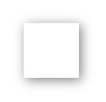
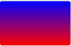

# **Estilizar pagina web**

<br>

## **_Objetivos:_**

- Descubrir una serie de propiedades para resaltar el contenido HTML.

- Darle a tu sitio web un aspecto más moderno y profesional.

- Saber dónde colocar el cursor para efectos visuales exitosos.

---

---

<br>

---

## **Mas colores**

---

<br>

Hasta ahora hemos visto dos formas de expresar un color en CSS: ya sea mediante un nombre de color, por ejemplo "negro", "rojo" o "rosa claro" puede encontrar [la lista en la página w3 School en](https://www.w3schools.com/colors/colors_names.asp) o mediante la representación del color en forma de código hexadecimal.

<br>

---

**EJEMPLO**

```css
/* Los cuatro ejemplos de aquí abajo están escritos en cuanto al color negro */
color: black;
color: #000000;
color: rgb(0, 0, 0);
color: hsl(0, 0%, 0%);

/* Los cuatro ejemplos de aquí abajo están escritos en cuanto al color blanco */
color: white;
color: #ffffff;
color: rgb(255, 255, 255);
color: hsl(0, 0%, 100%);
```

---

<br>

Una característica muy interesante que proporcionan las dos últimas notaciones es la posibilidad de crear un color semi-transparente. Para hacerlo, es muy sencillo: solo hay que añadir un cuarto parámetro expresado como un número entre 0 (transparente) y 1 (opaco).

Las notaciones se convierten entonces en RGBA y HSLA (la a significa "alfa").

<br>

---

**EJEMPLO**

```css
color: rgb(0, 0, 0); /* Negro opaco */

color: rgba(0, 0, 0, 0.8); /* Negro con 80% de opacidad */

color: hsl(0, 0%, 0%); /* Negro opaco */

color: hsla(0, 0%, 0%, 0.2); /* Negro con 20% de opacidad */
```

<br>

---

---

<br>

<br>

---

### **Observación**

---

<br>

Hasta ahora hemos visto dos formas de expresar un color en CSS: ya sea mediante un nombre de color, por ejemplo "negro", "rojo" o "rosa claro" puede encontrar [la lista en la página w3 School en](https://www.w3schools.com/colors/colors_names.asp) o mediante la representación del color en forma de código hexadecimal.

<br>

---

---

<br>

<br>

---

## **Box-shadow**

---

<br>

La propiedad box-shadow permite agregar una sombra a una caja como un `<div>`.

Esto permite dar un efecto de profundidad a la página web al resaltar ciertos elementos.

<br>



Con el fin de entender como se usa esta propiedad, podemos dirigirnos a la [documentación MDN](https://developer.mozilla.org/fr/docs/Web/CSS/box-shadow)

<br>

---

**EJEMPLO**

```css
/* desplazamiento sobre el eje "x", desplazamiento sobre el eje "y", "radio" de desenfoque, color */

box-shadow: 2px 4px 10px hsla(0, 0%, 0%, 0.8);
```

Volviendo a estos parámetros juntos:

- **Desplazamiento en el eje "x":**

  Un valor positivo, como "2px" aquí, significa que la sombra se desplazará hacia la derecha en relación a la caja sobre la que se aplica el efecto.

  También podríamos indicar un valor negativo, por ejemplo "-2px", para hacer el efecto opuesto y desplazar la sombra hacia la izquierda de la caja.

- **Desplazamiento del eje "y":**

  Lo mismo, un valor positivo desplazará la sombra hacia abajo, un valor negativo, hacia arriba.

- **"Radio" de desenfoque:**

  Representa la intensidad de la sombra. Hay que entender que una sombra no es más que un degradado del color elegido hacia el transparente. Cuanto más alta sea la valor, más difusa será la sombra: el degradado será más suave, pero ocupará más espacio para volver al color transparente. Cuidado, box-shadow puede en algunos casos sobresalir en otras cajas.

- **Color:**

  Se pueden utilizar todos los modos de color admitidos por CSS3: color nombrado, código hexadecimal, RGB, HSL.

  También es posible dar un color semi-transparente, como hemos visto anteriormente. Este efecto debe usarse con moderación: es más efectivo cuando la sombra no es demasiado pronunciada. El uso de grises más claros o negros con transparencia suele atenuar el efecto de la sombra.

<br>

---

---

<br>

<br>

---

### **Observación**

---

<br>

Es posible poner varias sombras en un elemento.

Para ello, es necesario escribir la propiedad box-shadow y separar cada conjunto de parámetros con una coma.

<br>

---

**EJEMPLO**

```css
.item {
  box-shadow: 2px 4px 10px hsla(0, 0%, 0%, 0.8), 0 0 5px red, -4px 0 8px #0984e3;
}
```

<br>

---

**Método**

```
Puede ser tedioso probar muchas combinaciones de valores para obtener una sombra visualmente satisfactoria, por lo que existen varios generadores de box-shadow que se pueden encontrar buscando los términos "box-shadow generator" en un motor de búsqueda.

Estas herramientas suelen funcionar con varios cursores para cada valor de box-shadow y ofrecen una vista previa en tiempo real.
```

<br>

---

---

<br>

<br>

---

## **Text-shadow**

---

<br>

Acabamos de ver cómo agregar una sombra a una caja: también es posible hacer lo mismo directamente en un texto, con la propiedad text-shadow.

<br>

**Esta propiedad se usa de la misma manera que box-shadow, hay cuatro parámetros para completar:**

---

- **el desplazamiento en el eje "x",**

- **el desplazamiento en el eje "y",**

- **el "radio" de difuminado y**

- **el color.**

Al igual que box-shadow, es posible dar varios sombras para aplicar al texto.

**Tengamos en cuenta que, al igual que box-shadow, el orden en que especifiquemos las sombras será importante:**

su navegador las mostrará de adelante hacia atrás, es decir, la primera sombra de la lista se mostrará "arriba" y las siguientes debajo.

<br>

---

**EJEMPLO**

```css
/* desplazamiento sobre el eje "x", desplazamiento sobre el eje "y", "radio" de desenfoque, couleur */

text-shadow: 2px 4px 10px hsla(0, 0%, 0%, 0.8);
```

<br>

---

---

<br>

<br>

---

## **border-radius**

---

<br>

Todos los ejemplos usados hasta ahora han demostrado que en HTML CSS, todos los elementos son rectángulos.

Sin embargo, es posible crear elementos redondeados con la ayuda de la propiedad border-radius.

Para esto, simplemente agregue la propiedad a una caja, por ejemplo, una `<div>`:

<br>

---

**EJEMPLO**

```css
.miCaja {
  background-color: blue;
  border-radius: 10px;
}
```

<br>

---

---

<br>

<br>

---

### **Complemento**

---

<br>

La propiedad border-radius también se aplica a las imágenes.

En sitios de redes sociales como Facebook o Twitter, las fotos de perfil suelen ser redondas.

Para obtener un resultado similar, solo es necesario especificar un border-radius mayor que la mitad del tamaño del lado de la imagen.

Por ejemplo, para una imagen de 300 px por 300 px, se deberá especificar un border-radius de 150 px para que sea redonda.

<br>

---

**EJEMPLO**

```html

```

```css
.bear {
  border-radius: 150px;
}

/* o 50% debajo de la foto se explica*/
```


<br>

---

También es posible crear un border-radius con un valor en porcentaje.

Para redondear completamente una imagen, el border-radius debe ser del 50%.

<br>

---

---

<br>

<br>

---

### **Atención!**

---

<br>

Para obtener un círculo, es necesario que la imagen sea cuadrada;

en el caso de un rectángulo, el resultado será una forma ovalada.

<br>

---

**EJEMPLO**

Border-radius también es una propiedad que toma un número variable de parámetros.

En el ejemplo anterior, hemos ingresado un solo valor, lo que indica al navegador que los cuatro bordes deben ser redondeados de la misma manera.

Sin embargo, es posible especificar cuatro valores distintos para dar a los cuatro bordes un redondeo más o menos importante.

El orden de escritura será entonces: arriba izquierda, arriba derecha, abajo derecha y abajo izquierda.

```css
#example1 {
  border-radius: 1em / 5em;

  /* equivale a */

  border-top-left-radius: 1em 5em;
  border-top-right-radius: 1em 5em;
  border-bottom-right-radius: 1em 5em;
  border-bottom-left-radius: 1em 5em;
}

#example2 {
  border-radius: 4px 3px 6px / 2px 4px;

  /* equivale a : */

  border-top-left-radius: 4px 2px;
  border-top-right-radius: 3px 4px;
  border-bottom-right-radius: 6px 2px;
  border-bottom-left-radius: 3px 4px;
}
```

Esta explicación es muy mala ....

[mejor verla aquí ❤️](https://youtu.be/iLyzg72cD_E)

<br>

---

---

<br

<br>

---

## **Background: Syntaxis**

---

<br>

```
La propiedad CSS background es una propiedad abreviada (propiedades que permiten definir el valor de varias propiedades en una sola declaración), que permite definir los diferentes valores de las propiedades relacionadas con la gestión de fondos de un elemento (color, imagen, origen, tamaño, repetición, etc.).
```

<br>

---

<br>

---

## **Fondos**

---

<br>

Hemos visto el uso de la etiqueta  para mostrar una imagen en la página, pero CSS también propone una técnica para mostrar una imagen.

Con la ayuda de la propiedad background-image, podemos apuntar a un cuadro y aplicarle una o varias imágenes de fondo, y configurar la forma en que estas imágenes se comportarán.

El caso de uso más simple es el siguiente:

<br>

---

**EJEMPLO**

```css
.maBoite {
  background-image: url("lien/vers/mon/image");
}
```

Más posibilidades están disponibles para nosotros.

El enlace a nuestra imagen puede ser un enlace a una imagen local que se encontraría en el directorio de nuestro sitio web: el enlace es entonces un enlace relativo que permite llegar a la imagen desde la ubicación del archivo donde se escribe la propiedad CSS.

El enlace también puede ser una URL absoluta para una imagen almacenada en la web.

<br>

---

**EJEMPLO**

```html
<div class="with-background"></div>
```

```css
.with-background {
  background-image: url("https://placebear.com/400/250");
}
```

[Aquí hay un ejemplo](https://repl.it/@Mesian/background-image) de background-image con una imagen alojada en la web.

<br>

---

---

<br>

<br>

---

### **Atención!**

---

<br>

```
En programación, si estás usando una imagen que proviene de la web y no tienes control sobre su alojamiento, es posible que un día el autor de la imagen la elimine o la mueva de lugar.

En ese caso, ¡la imagen ya no se mostrará en tu sitio web!
```

Es posible superponer varias imágenes de fondo.

En ese caso, solo se requiere una propiedad background-image y se colocan varias url() separadas por comas.

Las imágenes se mostrarán en orden: la primera se superpondrá a las demás.

Como mencionamos antes, existen varias otras propiedades CSS que nos permiten controlar cómo se mostrará la imagen de fondo.

En cualquier caso hay que recordar que hay que visitar la **[MDN background-image css](https://developer.mozilla.org/en-US/docs/Web/CSS/background-image)** para cualquier duda.

<br>

---

---

<br>

<br>

---

## **background-repeat**

---

<br>

Por defecto, si intentas cubrir una caja con una imagen demasiado pequeña, la imagen se repetirá automáticamente como un patrón de papel tapiz para cubrir toda el área disponible.

Puedes controlar este mecanismo con los valores:

- **repeat-x: repite la imagen solo en el eje X.**

- **repeat-y: repite la imagen solo en el eje Y.**

- **no-repeat: no repite la imagen.**

Hay otros valores que puedes consultar y experimentar en la [documentación](https://developer.mozilla.org/fr/docs/Web/CSS/background-repeat).

<br>

---

---

<br>

<br>

---

## **background-position**

---

<br>

Esta propiedad permite controlar la posición de la imagen de fondo con respecto a la caja seleccionada.

Hay varias combinaciones de parámetros que acepta esta propiedad y no cubriremos todas aquí.

Puedes encontrar la lista en [la documentación](https://developer.mozilla.org/fr/docs/Web/CSS/background-position).

El uso más simple es indicar:

- top
- left
- bottom
- right
- center

para alinear la imagen respectivamente en la parte superior
izquierda, inferior, derecha o centro de la caja.

También es posible dar dos valores en porcentaje, que son respectivamente el desplazamiento desde la izquierda y el desplazamiento desde arriba.

<br>

---

**EJEMPLO**

```css
/* centre la imagen de fondo en la caja. */
background-position: center;

/* situa la imagen 25% de la izquierda y 75% de arriba de la caja.*/
background-position: 25% 75%;

/* situa la imagen 10% desde abajo y 30% desde la derecha de la caja.*/
background-position: bottom: 10% right: 30%;
```

<br>

---

---

<br>

<br>

---

## **background-size**

---

<br>

Esta propiedad configura el tamaño de la imagen de fondo en relación a la caja.

También se le pueden dar valores que calcularán automáticamente el tamaño en función de la configuración deseada.

```css
background-size: contain;
```

El valor `contain` redimensionará la imagen para que se muestre completamente en la caja.

Se respetará la relación de aspecto ancho/alto.

---

<br>

```css
background-size: cover;
```

Por otro lado, cover redimensionará la imagen para que cubra toda la caja, incluso si parte de la imagen debe ser ocultada;

la relación de aspecto ancho/alto también se respetará.

---

<br>

```css
background-size: 50%;
```

También es posible configurar manualmente el tamaño de la imagen, dando un valor en porcentaje.

La imagen se redimensionará manteniendo su relación de aspecto.

---

<br>

Finalmente, es posible dar dos valores: ancho y alto.

```css
background-size: 200px 150px;
```

<br>

---

---

<br>

<br>

---

## **Degradados**

---

<br>

Hemos podido ver que la propiedad background puede ser utilizada para mostrar un color de fondo simple, una o varias imágenes con la ayuda de background-image, ahora veremos cómo aplicar un degradado de colores.



Existen varios tipos de degradados que vamos a poder usar.

<br>

---

---

<br>

<br>

---

## **Linear-gradient**

---

<br>

¡Es muy fácil de entender!

Toma un número variable de parámetros, pero en su forma más sencilla, toma dos colores y se llena de arriba hacia abajo:

<br>

---

**EJEMPLO**

```css
background: linear-gradient(blue, red);
/* Muestra un degradado azul hacia un rojo partiendo de arriba de la caja hasta abajo*/
```

---

<br>

Podemos agregar tantos colores como queramos:

se agregarán al degradado y compartirán el espacio disponible.

Es posible agregar un parámetro en primera posición para determinar la orientación del degradado.

Este parámetro se escribe con una unidad un poco particular, "deg", y representa un ángulo.

<br>

---

**EJEMPLO**

```css
background: linear-gradient(45deg, blue, red);

/* Muestra un degradado azul hacia un rojo que parte de izquierda hacia la derecha */
```

<br>

---

---

<br>

<br>

---

## **radial-gradient**

---

<br>

Este funciona de manera similar a linear-gradient, con la diferencia de que este degradado es circular.

De la misma manera que con un degradado lineal, es posible indicar tantos colores como se desee:

el primer parámetro define el origen del degradado, por defecto un círculo en el centro de la pantalla.

[¡Te invito a consultar la documentación para obtener más información sobre los parámetros disponibles!](https://developer.mozilla.org/en-US/docs/Web/CSS/gradient/radial-gradient)

<br>

---

---

<br>

<br>

---

### **Complemento**

---

<br>

Es importante destacar que es totalmente posible superponer varios fondos, como hemos visto hasta ahora con varias propiedades.

Siempre será el primer elemento el que se mostrará en la parte superior (osea por encima de las otras que iremos añadiendo).

<br>

[Un oso multicolor!](https://repl.it/@Mesian/background-multiple) Diviértete probando diversas combinaciones de fondos, es una herramienta bastante fácil de usar, pero al mismo tiempo muy poderosa!

<br>

---

---

<br>

<br>

---

### **Recordatorio**

---

<br>

Ahora sabe un poco más sobre estas propiedades CSS que le permiten crear efectos visuales avanzados en su HTML.

Hay más propiedades que las que hemos visto, y lo invito a consultar la documentación para obtener más información.

<br>

---

---

<br>

<br>

---

### **Atención!**

---

<br>

Es importante tener en cuenta que la mayoría de estas propiedades son calculadas por la tarjeta gráfica del ordenador del usuario.

Una configuración modesta o antigua (elementos de hardware "de gama baja", por ejemplo) tendría dificultades para ejecutar un sitio web demasiado cargado de estilos.

El tiempo de carga de un sitio web es crucial en la experiencia del usuario, y es importante considerar estos aspectos al realizar un sitio web.

<br>

---

---

<br>

<br>

---

### **Complemento**

---

<br>

Como ya hemos mencionado, estos elementos visuales permiten crear estilos modernos y complejos, pero su uso debe ser controlado.

De hecho, demasiados efectos de estilo o estilos demasiado pronunciados podrían afectar negativamente la legibilidad de tu página.

Una buena práctica en caso de duda sobre cómo estilizar una página web es buscar inspiración en otros diseñadores.

El sitio [Dribbble](https://dribbble.com/) es un buen ejemplo de referencia para los diseñadores web que buscan inspiración.

<br>

---

---
