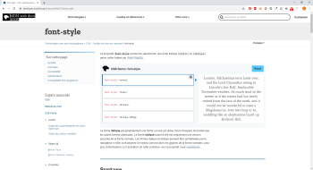

# **Acceder a la información**

## **_Objetivos:_**
---
 

- Aprender a usar la documentación

---

---

 

---

## **Contexto**

---

 

Un sitio web sin diseño y sin estilo es solo una página de contenido en blanco y negro.

Es importante agregar estilo y un diseño de calidad para resaltar el contenido y guiar al usuario en su navegación.

Con este fin, es posible utilizar el lenguaje `CSS`.

El lenguaje `CSS` lenguaje reúne una gran cantidad de propiedades que se pueden aplicar a los elementos `HTML` para modificar su apariencia de innumerables formas.

Para crear interfaces de calidad, es necesario saber cómo utilizar la documentación y los recursos disponibles relacionados con este lenguaje.

 

---

---

 
 

---

## **Donde documentarse**

---

 

Deberemos adaptar la búsqueda de la documentación según la necesidad y la problemática encontrada.

 

---

**Existen diferentes fuentes de documentación sobre CSS y sus propiedades:**

- Documentación oficial

- Foros 

    o 
    
- cursos en línea

---

 

Según la complejidad de la solicitud, algunos formatos son más adecuados que otros.

Si la búsqueda se refiere a una propiedad específica, la documentación será más apropiada.

Mientras que si la búsqueda se refiere a un problema más amplio, como un error, puede resultar más fructífera una búsqueda en un foro.

Por último, para búsquedas relacionadas con elementos generales, como la implementación global de una página de inicio de sesión, sería más apropiado utilizar un sitio de cursos o tutoriales en línea como Studi, que explique en profundidad las diferentes propiedades de diseño.

 

---

**Ejemplo: Búsqueda de una propiedad**

 

****

 

En este ejemplo, queremos saber cómo formatear un texto en cursiva.

Una simple búsqueda de palabras clave _**("css cursiva")**_ nos permite encontrar la documentación de la propiedad correspondiente.

 

El primer sitio que encontramos es **MDN Web docs**, que nos remite a la propiedad `font-style`, que efectivamente nos permitirá poner el texto en cursiva.

 

---

---

 

 

---

## **Como buscamos ?**

---

 

Saber lo que estamos buscando y saber cómo formular la búsqueda correspondiente es fundamental, ya que nos permite obtener resultados de calidad que responden completamente al problema inicial.

La relevancia de los resultados nos permite ahorrar tiempo, evitando así perder energía en búsquedas infructuosas.

En CSS, hay tantas posibilidades de estilos diferentes que puede ser necesario lidiar con diferentes resultados de búsqueda.

Por lo tanto, es importante conocer las propiedades principales y su comportamiento, practicando y leyendo documentación.

 

---

---

 

 

---

## **Como leemos ?**

---

 

**Una vez que se encuentra el término de búsqueda, se obtiene una página de documentación que contiene varias secciones.**

 

---

<u>`Estas secciones pueden variar de una instrucción a otra.`</u>

 

- **La primera sección** indica qué hace la instrucción buscada, su interés y utilidad.

- **Parte de la sintaxis:** es lo que se debe escribir en el programa para poder utilizar esa instrucción.

- **Parte de los parámetros:** son valores que se pasarán al momento de llamar a la instrucción y que modificarán su comportamiento.

- **Parte de la descripción:** contiene una descripción detallada de la instrucción con ejemplos.

- **Parte de la especificación:** se encuentran enlaces a las especificaciones de la instrucción.

- **Parte de la compatibilidad con los navegadores:** aquí se indica qué navegadores y versiones son compatibles con esta instrucción.

- **Bloque de demostración:** esta sección permite ejecutar código y ver cómo reacciona.

    - También se puede realizar modificaciones en el navegador.

     

- **Bloque de ejemplo:** contiene ejemplos de diferentes usos de la instrucción.

 

---

---

 

 

---

## **Complemento: La comunidad**

---

 

A veces, la documentación no podrá resolver todos los problemas.

En ese caso, no dudes en hacer preguntas en un foro especializado.

Uno de los más conocidos es **[Stack Overflow](https://stackoverflow.com)**, pero existen foros para todos los temas.

 

---

 

Stack Overflow es un sitio web creado en 2008 por "Jeff Atwood" y "Joel Spolsky", que proporciona preguntas y respuestas sobre diversos temas de programación informática.

 

---

 

Cada miembro puede votar por las preguntas y respuestas publicadas, lo que permite ganar puntos, llamados reputación, a sus autores.

El objetivo de estos votos es destacar respuestas de calidad y recompensar a sus autores, otorgándoles privilegios cuando alcanzan ciertos niveles de reputación.

También puedes votar en contra para mostrar a los futuros lectores que la respuesta no es relevante.

 

---

 

Sin embargo, Stack Overflow tiene sus limitaciones.

Es posible que no encuentres la respuesta adecuada a los problemas que tienes durante el desarrollo.

Por otro lado, la falta de conocimientos de inglés puede ser un obstáculo.

 

---

 

También existen sitios especializados en el intercambio de código escrito por la comunidad, como ayuda, ejemplos o simplemente para compartir componentes de código reutilizables en proyectos.

Las plataformas más conocidas son **[GitHub](https://github.com)** y **[CodePen](https://codepen.io)**.

Estos fragmentos de código pueden ser interesantes para descubrir posibilidades hasta entonces desconocidas.

 

---

 

Algunos incluso son de código abierto, lo que significa que se pueden reutilizar y modificar en proyectos propios.

Sin embargo, ten en cuenta que siempre debes verificar las licencias de los recursos antes de usarlos, especialmente en proyectos comerciales.

 

---

---

 

 

---

## **A recordar**

---

 

`Hemos visto que existen numerosos sitios web que permiten documentarse, y será necesario adaptar la búsqueda al problema encontrado:`

- **Los sitios web comunitarios y los foros serán más adecuados para responder a problemas relacionados con errores o bugs.**

- **La documentación oficial permite conocer las propiedades y sus detalles.**

- **Los cursos en línea permiten aprender a utilizar las funcionalidades de manera más general.**

 

---

---
