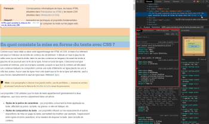

# **Aprender a debuguear**


## **_Objetivos:_**
---
<br>

- Saber identificar los diferentes tipos de bugs

- Usar el inspector del navegador para debuguear el problema/bug

---

---

<br>

---

## **Contexto**

---

<br>

Ahora aprenderemos a tener los hábitos adecuados cuando el código no funciona como quisiéramos o nos enfrentamos a un error.

Veremos cómo determinar el tipo de errores que encontramos, lo que nos ayudará a encontrar una solución de manera más eficiente.

Luego, veremos cómo depurar para corregir los errores que causan que el resultado obtenido no sea el esperado.

<br>

---

---

<br>
<br>

---

## **Diferentes tipos de bugs**

---

<br>

**Un bug puede tener varias fuentes:** 

<br>

puede ser el navegador que no responde como debería de responder, pero muchas veces proviene de un error humano o de una comprensión incorrecta de los comportamientos del lenguaje.

<br>

---

```
Por ejemplo, la herencia en CSS puede causar problemas si no se domina adecuadamente.
```

<u>Antes de que nos preguntemos el porque el navegador no muestra correctamente el estilo del elemento aplicado para nuestro sitio web, siempre es necesario y muy recomendable verificar en la documentación oficial que la propiedad utilizada es la más adecuada para la situación y el resultado deseado.</u>

<br>

**Una vez descartada esta posibilidad, es posible que el problema de visualización provenga de diferentes fuentes:**

<br>

- <mark><b>Diseño responsive:</b><mark>
  
  cuando las pruebas se realizan en un dispositivo móvil o una tableta, por ejemplo, y los elementos no se muestran en el orden deseado o se desbordan de la página, lo que hace que aparezcan barras de scroll de desplazamiento.
  
  Esto puede ser un problema de resolución o de tamaño de los elementos.
  
  El diseño del sitio debe adaptarse para mostrarse correctamente, ya sea modificando las dimensiones de los bloques o agregando reglas adicionales a las hojas de estilo.

---  

<br>

- <mark><b>Propiedad con soporte deficiente:</b><mark> 

  a veces, la propiedad que podríamos necesitar es demasiado nueva para ser compatible con todos los navegadores, y solo se puede utilizar en aquellos navegadores capaces de interpretarla.

  En estos casos, se recomienda usar los prefijos correspondientes a este tipo de propiedades.
  
  Estos prefijos nos permitirán utilizar estas propiedades que aún están en desarrollo sin tener que esperar su validación.

  ---
  
  <br>

  **Aquí están los prefijos por navegador:**

  - -o- para Opera

  - -moz- para Gecko (Mozilla)

  - -webkit- para Webkit (Chrome, Safari, Android...)

  - -ms- para Microsoft (Internet Explorer)

<br>

---  

Para evitar escribirlos manualmente, se puede utilizar un **"autoprefixer"**(En visual studio code lo tenemos).

<br>

Autoprefixer es un complemento que agrega automáticamente los prefijos mencionados anteriormente a las propiedades que los requieren.

Solo es necesario proporcionarle una hoja de estilo CSS y él lo revisará para agregar los prefijos automáticamente donde sea necesario.

<br>

---

<br>

---

**Ejemplo**

```
Tomemos la propiedad `box-shadow` que permite agregar y manipular una sombra alrededor de un elemento.

Todavía no está soportada correctamente en la versión 9 del navegador Internet Explorer.
```

<br>

---

**Si queremos usarla, se recomienda aplicar el siguiente prefijo a la propiedad:**

```css
.scrollbar {
  box-shadow: 10px 5px 5px grey;
  /*Propiedad 👆 declarada por nosotros*/
  
  -ms-box-shadow: 10px 5px 5px grey;
  /* Propiedad 👆 creada por prefixer
  (extension/plugin de vsc), la podemos crear
  nosotros o como mencionamos anteriormente,
  con una extension prefixer */
}
```

---

---

<br>

<br>

---

## **Verificar la compatibilidad**

---

<br>


En caso de duda, es necesario verificar que la propiedad a utilizar sea compatible con los navegadores objetivo.

Para ello, existen sitios especializados que indican el estado de compatibilidad de la propiedad en los navegadores, como **[CanIUse](https://caniuse.com/)**.

La documentación en el sitio de **[MDN](https://developer.mozilla.org/fr/)** también destaca esta información al final de la página.

<br>

---

---

<br>

<br>

---

## **Debuguear**

---

<br>

**Existen algunos trucos para simplificar el desarrollo y verificar instantáneamente el comportamiento de una propiedad en el navegador.**

---

<br>

<mark><b>Es posible utilizar el inspector del navegador</b></mark>

  - haciendo clic derecho y seleccionando "Inspeccionar" en el elemento que deseamos modificar. 
  
    - Se abrirá una consola que nos permitirá modificar directamente el contenido HTML, pero sobre todo el estilo CSS, y el resultado se aplicará instantáneamente en la página.
    
    - Sin embargo, debemos tener en cuenta que presionar la tecla F5 o actualizar la página eliminará estas modificaciones.

---
<br>    

```
Podremos utilizar este inspector para editar y agregar propiedades CSS directamente en la herramienta y ver el resultado en tiempo real.

El navegador también puede proporcionar indicaciones y ayuda si una propiedad se utiliza incorrectamente.
```

<br>

---

<u>**por ejemplo:**</u>

<br>

<b><mark>Un consejo al utilizar esta herramienta:</b></mark>

**también es posible agregar fondos de color a elementos y bloques para visualizar mejor los espacios y dimensiones de los elementos.**

<br>

---

---

<br>

<br>

---

### **Ejemplo**

---

<br>

En el inspector, cuando seleccionamos un elemento, las propiedades que se le aplican se muestran en la pestaña "Estilos" en Google Chrome.

Es posible modificar estas propiedades o agregar otras desde esta pestaña: el resultado se mostrará directamente en la página.

<br>



<br>

---

<br>


<br>

Los colores de fondo modificados usando la propiedad CSS background-color permiten resaltar instantáneamente las diferentes partes del sitio y facilitan la maquetación.

<br>

---

---

<br>

<br>

---

## **A recordar**

---

<br>

- **En caso de un error de visualización, siempre es necesario verificar que las propiedades utilizadas sean correctas y que los comportamientos `CSS` estén bien comprendidos, para evitar buscar la fuente de un error que no lo sea.**

- **Sin embargo, es posible que el problema provenga del navegador. De hecho, no todos los navegadores interpretan el CSS de la misma manera, a veces es necesario utilizar prefijos antes de ciertas propiedades que aún están en desarrollo.**

- **Para verificar el comportamiento de una propiedad, es posible utilizar la herramienta integrada en el navegador: el inspector de elementos. Permite modificar o agregar propiedades CSS directamente en los elementos y el resultado se muestra en tiempo real.**

- **También es posible utilizar el truco de los fondos de color con la propiedad background-color para visualizar mejor el espacio alrededor de los elementos.**

<br>

---

---
