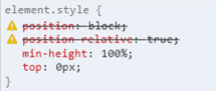
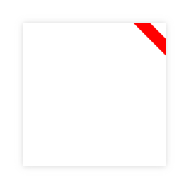

# **Calidad del código `CSS`**

<br>

## **_Objetivos:_**

---

- Identificar los diferentes errores de sintaxis que se pueden cometer en `CSS`.

- Comprender el concepto de especificidad.

- Diseñar estilos de manera atómica.

---

---

<br>

---

## **Contexto**

---

<br>

De la misma manera que existen varias formas de escribir código inválido en `HTML`, **`CSS` también es muy permisivo.**

<br>

---

---

<br>

<br>

---

## **Verificar las propiedades utilizadas**

---

<br>

**Un error común es utilizar una propiedad CSS inexistente o un valor de propiedad que no es válido.**

```css
position: block;
/* Código invalido, "block" no es un valor correcto para position */

position: relative;

position-relative: true;
/* Código invalido, la propiedad "position-relative" no existe */
```

---

<br>

El sitio no necesariamente dejará de funcionar si se utilizan propiedades `CSS` inexistentes, pero esto podría tener un fuerte impacto en el resto del código `CSS` sin que lo podamos ver.

**La consola de desarrollo** de `Google Chrome` **muestra un mensaje de advertencia cuando detecta una propiedad inválida**, junto con información adicional al pasar el cursor sobre esas propiedades.

<br>



```
CSS propiedad invalida
```

<br>

---

---

<br>

<br>

---

## **Evitar las repeticiones**

---

<br>

Algunas prácticas **no se consideran errores** a nivel del lenguaje, **pero sí** se consideran **malas prácticas**.

**Una de ellas es repetir `CSS` en varios selectores, como:**

```css
header {
  font-size: 18px;

  color: lightyellow;
}

main {
  font-size: 18px;

  margin: 10px;
}

footer {
  font-size: 18px;

  background: black;
}
```

---

<br>

---

**Aquí, sería preferible:**

```css
body {
  font-size: 18px;
}

header {
  color: lightyellow;
}

main {
  margin: 10px;
}

footer {
  background: black;
}
```

---

<br>

---

**O bien agrupar las propiedades dentro de un mismo selector, para no duplicar las reglas comunes a todos los elementos:**

```css
header,
main,
footer {
  font-size: 18px;
}

header {
  color: lightyellow;
}

main {
  margin: 10px;
}

footer {
  background: black;
}
```

<br>

---

---

<br>

<br>

---

## **Respectar la especificidad**

---

<br>

Otro elemento que, si no se comprende y maneja correctamente por parte del desarrollador, puede volverse problemático en una aplicación grande es la especificidad.

<br>

---

<br>

En CSS, cuando dos reglas entran en conflicto en un elemento, el lenguaje calcula la prioridad de aplicación de las reglas, teniendo en cuenta la especificidad del selector.

<br>

---

<br>

La especificidad es un concepto bastante simple de entender, pero bastante complejo de dominar.

Al agregar una clase a una etiqueta en `HTML` e indicar ese elemento `HTML`, el selector de clase será más específico que un selector sin la clase, y por lo tanto, se aplicará la regla de especificidad.

<br>

---

**EJEMPLO**

```html
<body>
  <main class="content">
    <span class="contact-email"> test@example.com </span>
  </main>
</body>
```

<br>

```css
span {
  color: blue;
}

/* Este 👆 no es tan especifico como el de abajo */

span.contact-email {
  color: red;
}

/* Este 👆 (span.contact-email) selector es más específico que el anterior */
```

---

<br>

**Sería tentador ser muy específico para asegurarse de que el estilo deseado se aplique correctamente.**

<br>

---

**Tomando nuestro ejemplo nuevamente:**

```css
/* Este selector es muy específico, probablemente demasiado... */

/*DEMASIADO ESPECIFICO!*/

body > main.content > span.contact-email {
  color: red;
}
```

---

<br>

Aquí, hay demasiada especificidad en este selector.

Es cierto que hay muchas posibilidades de que el color del texto sea rojo, pero no debemos perder de vista el funcionamiento en cascada de CSS.

<br>

---

<br>

**Con demasiada especificidad, estamos matando la cascada:**

se vuelve muy complicado cambiar este estilo y se enfoca en un solo elemento de la página.

Lo ideal sería poder reutilizar este estilo `color: red` en otros lugares.

<br>

---

<br>

La especificidad funciona en una sola dirección, no es posible retroceder.

Para superarla, se debe ser aún más específico.

Por lo tanto, se debe aplicar contextualmente, donde sea necesario y no de manera excesiva al comienzo del proyecto.

<br>

---

---

<br>

<br>

---

### **Evitar la palabra clave `!important`**

---

<br>

**Del mismo modo, el uso de la palabra clave `!important` debe evitarse en el código `CSS`.**

**Esto fuerza la prioridad de una regla, ignorando por completo el contexto de la cascada, y es considerado un anti-patrón en `CSS`.**

<br>

---

---

<br>
<br>

---

## **No ser demasiados específicos**

---

<br>

Otro error a evitar es tener un selector `CSS` con estilos demasiado específicos, que hacen demasiadas cosas.

Para respetar la estructura de `CSS` y mejorar la mantenibilidad del código, es preferible utilizar estilos más atómicos y reutilizables.

De hecho, esto es parte de la filosofía del enfoque utility-first.

<br>

---

---

<br>

<br>

---

### **Ejemplo: Mostrar una Cinta**

---

<br>

En este ejemplo, mostramos una caja con un efecto de cinta en la esquina superior derecha.

**Podríamos decir que este selector es demasiado específico:**

nos gustaría poder reutilizar el efecto de cinta en otro elemento que no sea nuestra caja.

En el estado actual de este selector, eso es imposible, tendríamos que duplicar el código de la cinta.

<br>



<br>

```
Cinta en esquina derecha
```

<br>

---

**Código css repetitivo**

```css
.card-with-ribbon {
  position: relative;

  background: white;

  height: 200px;

  width: 200px;

  padding: 20px;

  overflow: hidden;

  box-shadow: 0 0 10px lightgray;
}

.card-with-ribbon::after {
  content: "";

  position: absolute;

  top: -10px;

  right: -30px;

  background: red;

  height: 20px;

  width: 140px;

  transform: rotate(45deg);
}
```

---

<br>

Por otro lado, si modificamos 👆 el código para separar los dos efectos, por un lado el aspecto de la tarjeta y por otro el de la cinta, todavía podemos aplicar la cinta a nuestra tarjeta, pero ahora también es posible aplicar la cinta a otros elementos.

<br>

---

**Código css reciclado**

```css
.card {
  position: relative;

  background: white;

  height: 200px;

  width: 200px;

  padding: 20px;

  overflow: hidden;

  box-shadow: 0 0 10px lightgray;
}

.with-ribbon::after {
  content: "";

  position: absolute;

  top: -10px;

  right: -30px;

  background: red;

  height: 20px;

  width: 140px;

  transform: rotate(45deg);
}
```

<br>

Este código permite obtener el mismo resultado, pero los dos estilos ahora están desacoplados y pueden funcionar de forma independiente uno del otro.

<br>

---

---

<br>

<br>

---

## **A Recordar**

---

<br>

- **Es importante utilizar los nombres correctos de las propiedades y valores.**

- **Se debe evitar duplicar estilos al ascenderlos a un padre común o al crear un selector CSS múltiple.**

- **Se debe tener cuidado de no ser demasiado específico en los selectores CSS.**

- **Es recomendable diseñar los estilos de forma que sean atómicos y reutilizables.**

<br>

---

---
