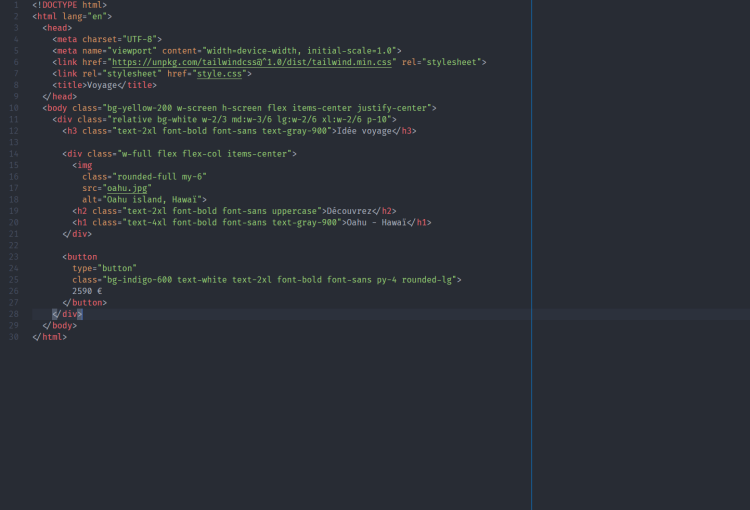
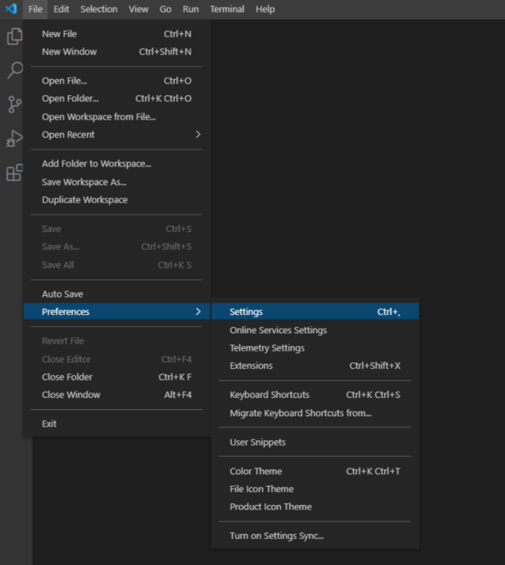
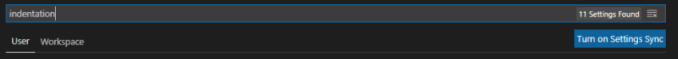
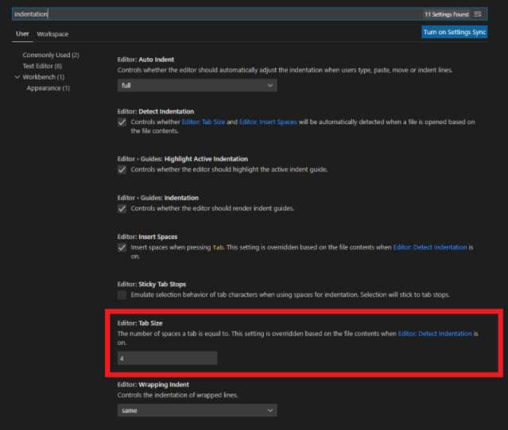
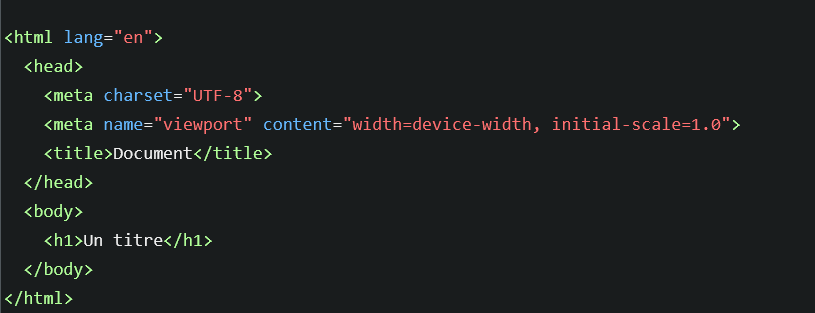
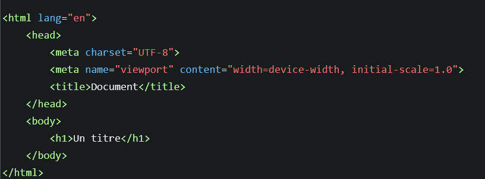

# **Normas del desarrollo**

<br>

## **_Objetivos:_**

---

- Observar algunos elementos de sintaxis para mejorar

- Comprender las diferencias de opinión sobre algunas prácticas de desarrollo.

---

---

<br>

---

## **Contexto**

---

<br>

Para hacer frente a los problemas causados por la permisividad de los lenguajes web, puede ser beneficioso establecer reglas adicionales más allá de los requisitos mínimos del lenguaje para su funcionamiento.

Estas reglas suelen agruparse en lo que se conoce como estándares de desarrollo o guías de estilo de código.

<br>

---

<br>

**Estas guías de estilo suelen ser ampliamente seguidas por los desarrolladores, lo que tiene otra ventaja:**

si todos desarrollan con las mismas reglas arbitrarias, el código es mucho más homogéneo.

Por lo tanto, resulta más fácil de entender para los nuevos desarrolladores en un proyecto, ya que encontrarán la sintaxis que ya están acostumbrados a utilizar.

<br>

---

---

<br>

<br>

---

## **Fijar un limite de caracteres**

---

<br>

**Esto también ayuda a cumplir con otra regla que los desarrolladores intentan aplicar:** 

No escribir líneas de código que excedan un cierto número de caracteres.

Por lo general, se recomienda evitar superar los 100 caracteres, pero algunos desarrolladores prefieren limitarlo a 80 caracteres.

<br>

---

<br>

VSCode ofrece una configuración adicional que permite agregar una línea vertical en un carácter específico, como una indicación para no excederlo.

---

<br>

**Para aplicar esta configuración en VSCode, debes seguir estos pasos:**

1. Abre **VSCode**.

2. Ve al menú **`Archivo`** y selecciona **`Preferencias`**.

3. Selecciona **`Configuración`**.

4. **Aparecerá una ventana con dos paneles:** el panel de Configuración del Usuario y el 
  
    panel de Configuración de Workspace.

5. **En el** panel de Configuración **del Usuario**, **busca** la opción **`Editor: Rulers`**.

6. **Haz clic** en **`Editar en settings.json`** (ubicado a la derecha de la opción).

7. Se abrirá el archivo settings.json en el panel de la derecha.

8. **En el archivo settings.json**, 👇 agrega el siguiente código dentro de los corchetes **`{}`**:

```json
"editor.rulers": [
    {
        "column": 100,
        "color": "#0984e3"
    }
]
```

9. **Guarda el archivo settings.json.**

---

Con esta configuración, se agregará una línea vertical de color azul (`#0984e3`) en la columna 100
de cada línea en el editor de VSCode, lo que te ayudará a visualizar el límite de caracteres 
recomendado.

Puedes ajustar el número de columna y el color según tus preferencias.

---

<br>



<br>

---

```
linea indicadora para limite de caracteres, para mantener un código legible
```

---

<br>

**La indentación también es un tema muy importante a respetar:**

algunos desarrolladores prefieren indentar con cuatro espacios.

<br>

---

<br>

Debes ir a **"Archivo"** -> **"Preferencias"** -> **"Configuración"**.

<mark><b>También puedes usar el atajo "Ctrl + ,"</b></mark>

<br>



<br>

---

<br>

Por consiguiente, escribir **"Indentación"** en la barra de búsqueda.

<br>



<br>

---

<br>

Después, cambiaremos la indentación como nosotros queramos, aquí la indentación esta aplicada a 4:

<br>



<br>

---

<br>

---

**Ejemplo:**

```
2 Espacios de Indentación 👇
```



<br>

---

<br>

```
4 Espacios de Indentación
```



<br>

---

---

<br>

<br>

---

## **Mejorar legibilidad del código**

---

<br>

Cuando hay muchos atributos en un elemento HTML, se considera una buena práctica colocar cada atributo en una línea separada.

<br>

---

**Por ejemplo:**

```html
<form class="container form card lef-side" id="contact-form" action="/contact.php" method="POST"></form>

<form
  class="container form card lef-side"
  id="contact-form"
  action="/contact.php"
  method="POST"

>

</form>
```

---

<br>

---

---

<br>

<br>

---

## **Los comentarios**

---

<br>

Finalmente, entre los tipos de comentarios que se pueden escribir, algunos desarrolladores prefieren los comentarios concisos, en una sola línea.

<br>

---

**Ejemplo**

```html
<!-- Mi comentario HTML -->
```

---

<br>

```css
/* Mi comentario CSS */
```

<br>

---

<br>

**Otros prefieren agregar siempre comentarios de bloque para una mayor visibilidad:**

<br>

---

**EJEMPLO de bloque**

```html
<!-- 
  Mi comentario HTML
-->
```

---

<br>

```css
/* 
Mi comentario CSS
*/
```

---

<br>

**El cumplimiento de estas reglas no es obligatorio para que el código funcione, pero es una buena práctica seguir un estilo de código con una gran comunidad y mantenerse fiel a él.**

<br>

---

---

<br>

<br>

---

## **A Recordar**

---

<br>

- **Hay reglas de sintaxis que es conveniente seguir: colocar los atributos en líneas separadas cuando hay muchos, no escribir líneas de código demasiado largas y respetar la indentación establecida, por ejemplo.**

- **Es necesario elegir un estilo de código y tratar de aplicarlo de la mejor manera posible.**

<br>

---

---
