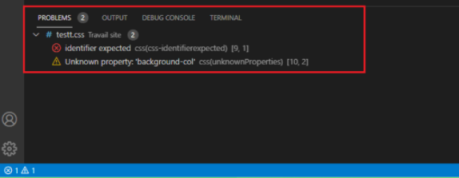

# **Herramientas para el desarrollo**

<br>

## **_Objetivos:_**

---

- Analizar la calidad de su código con el validador W3C.

- Utilizar un linter directamente desde la línea de comandos para HTML y CSS.

---

---

<br>

---

## **Contexto**

---

<br>

Algunas herramientas permiten validar la calidad del código `JavaScript`, `CSS` o `HTML`.

<br>

---

---

<br>

<br>

---

## **El W3C**

---

<br>

**La primera herramienta que nos viene a la mente cuando se habla de validación es la herramienta proporcionada por el W3C.**

**Está disponible en la siguiente dirección web: [W3C Checker](https://validator.w3.org/#validate_by_input)**

<br>


<br>

---

<br>

La herramienta ofrece la opción de probar la calidad del código de un sitio, ya sea a través de su URL, mediante el envío de un archivo, o ingresando directamente el código en un campo de texto.

---

<br>

**El siguiente código pasa por el validador sin generar ningún error:**

```html
<!DOCTYPE html>

<html lang="en">

    <head>

        <meta charset="UTF-8">

        <meta name="viewport" content="width=device-width, initial-scale=1.0">

        <title>Document</title>

    </head>

    <body>

        <h1>Un titre</h1>

    </body>

</html>
```

---

<br>


<br>

---

```
W3C Checker sin fallos en el código HTML, en caso de fallos, este indicaría
```

---

<br>

---

---

<br>

<br>

---

## **`HTMLHint`**

---

<br>

Una herramienta de linter como HTMLHint permite realizar un análisis similar al que ofrece el validador W3C.

<br>

---

**Solo necesitas instalar la extensión HTMLHint en Visual Studio Code, como se muestra a continuación:**

<br>


---

<br>

---

**La extensión HTMLHint muestra el error mediante una pequeña onda de color amarillo, como se muestra a continuación:**

<br>


---

<br>

**El detalle del error se muestra en la consola, en la sección "`Problems`".**

<br>


<br>

---

<br>


---

<br>

---

---

<br>

<br>

---

### **Error Lens, una increíble extension**

---

<br>

**Finalmente, con "Error Lens" podremos observar e identificar de "INMEDIATO" el fallo, este error a solucionar se mostrara en la misma linea indicada a resolver el problema, es decir, en el código.**

<br>

---

<br>

---

**Ejemplo: Aquí podéis ver como se llama su debida instalación en `VSCode`**

<br>


---

<br>

---

**Ejemplo: Vista en cuanto al código representativo**

<br>


---

<br>

---

---

<br>

<br>

---

## **Analizar `CSS` con StyleLint**

---

<br>

Existe una herramienta similar para analizar el código CSS llamada Stylelint.

<br>

---

**Stylelint se instala de la misma manera, a través de la extensión en Visual Studio Code:**

<br>


---

<br>

---

**La extensión Stylelint muestra el error mediante una pequeña onda de color rojo y una onda de color amarillo según el tipo de error, como se muestra a continuación:**

<br>


---

<br>

---

**La extensión Stylelint muestra el error mediante una pequeña onda de color rojo y una onda de color amarillo según el tipo de error, como se muestra a continuación:**

<br>


---

<br>

<br>



---

<br>

---

---

<br>

<br>

---

## **A Recordar**

---

<br>

- **El `validador W3C` permite verificar que el código `HTML` sea válido.**

- **`HTMLHint` también permite realizar estas verificaciones, pero está disponible desde la línea de comandos.**

- **`StyleHint` es una herramienta equivalente a `HTMLHint` para analizar el código CSS.**

- **`ErrorLens` nuestro favorito, ya que cuida el despiste del dev y muestra al instante el fallo en la misma linea de código**

<br>

---

---