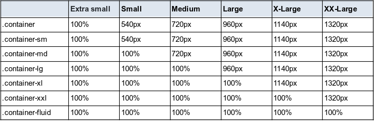
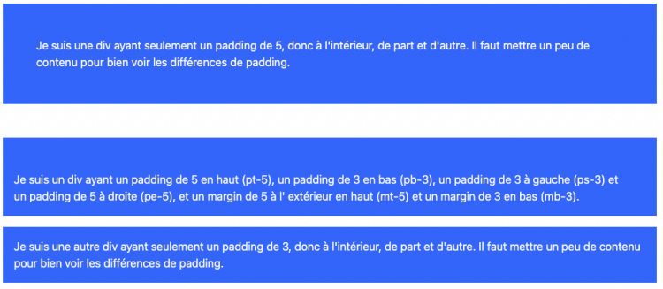
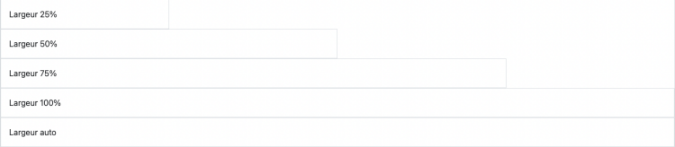
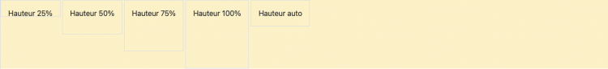

# **Introducción al framework Bootstrap**

---

<br>

---

## **Los breakpoints**

---

<br>

Los breakpoints son los puntos de quiebre, es decir, el ancho de la pantalla en píxeles que determinan el diseño según el tamaño de la pantalla del usuario.

Los elementos de una página se colocarán de manera diferente en un teléfono móvil o en una pantalla grande.

<br>

---

<br>

Bootstrap considera los teléfonos móviles como punto de referencia.

Cada breakpoint ha sido elegido para acomodar cómodamente los contenedores de Bootstrap cuyo ancho es un múltiplo de 12.

Son representativos de un subconjunto de tamaños de dispositivos y dimensiones de ventanas de visualización comunes.

No se dirigen específicamente a cada dispositivo en particular.

Por el contrario, los rangos proporcionan una base sólida y coherente en la que se puede confiar para casi todos los dispositivos.

<br>

---

<br>

---

**Bootstrap incluye 6 breakpoints que se pueden utilizar especificando las clases correspondientes:**

<br>

<table style="border-collapse: collapse; border: 1px solid white">
  <thead>
    <tr>
      <th style="padding: 10px; text-align: center; border: 1px solid white">Breakpoint</th>
      <th style="padding: 10px; text-align: center; border: 1px solid white">Clase</th>
      <th style="padding: 10px; text-align: center; border: 1px solid white" colspan="2">Dimension</th>
    </tr>
  </thead>
  <tbody>
    <tr>
      <td style="padding: 10px; text-align: center; border: 1px solid white">Extra small</td>
      <td style="padding: 10px; text-align: center; border: 1px solid white">Ninguno (punto de referencia)</td>
      <td style="padding: 10px; text-align: center;"> < 576px </a></td>
    </tr>
    <tr>
      <td style="padding: 10px; text-align: center; border: 1px solid white">Small</td>
      <td style="padding: 10px; text-align: center; border: 1px solid white">sm</td>
      <td style="padding: 10px; text-align: center;"> ≥ 576px </td>
    </tr>
    <tr>
      <td style="padding: 10px; text-align: center; border: 1px solid white">Medium</td>
      <td style="padding: 10px; text-align: center; border: 1px solid white">md</td>
      <td style="padding: 10px; text-align: center;">≥ 768px</td>
    </tr>
    <tr>
      <td style="padding: 10px; text-align: center; border: 1px solid white">Large</td>
      <td style="padding: 10px; text-align: center; border: 1px solid white">lg</td>
      <td style="padding: 10px; text-align: center;"> ≥ 992px </td>
    </tr>
    <tr>
      <td style="padding: 10px; text-align: center; border: 1px solid white">Extra large</td>
      <td style="padding: 10px; text-align: center; border: 1px solid white">xl</td>
      <td style="padding: 10px; text-align: center;">≥ 1200px</td>
    </tr>
    <tr>
      <td style="padding: 10px; text-align: center; border: 1px solid white">Extra extra large</td>
      <td style="padding: 10px; text-align: center; border: 1px solid white">xxl</td>
      <td style="padding: 10px; text-align: center;">≥ 1400px</td>
    </tr>
  </tbody>
</table>

<br>

---

---

<br>

<br>

---

## **Los contenedores**

---

<br>

**Los contenedores son los elementos fundamentales de Bootstrap que contienen y alinean el contenido en un dispositivo o ventana determinados.**

---

<br>

Son los **elementos de diseño** más **básicos de Bootstrap**.

Son necesarios cuando se utiliza **el sistema de cuadrícula predeterminado**.

Los **contenedores se utilizan para contener y, a veces, centrar el contenido que albergan**.

**Aunque pueden ser anidados, la mayoría de los diseños no requieren contenedores anidados.**

**Bootstrap ofrece tres tipos de contenedores diferentes:**

---

   - **.container:** define un ancho máximo en cada punto de interrupción. Este es el contenedor por defecto.

   - **.container-{punto de interrupción}:** el ancho es del 100% hasta el punto de interrupción especificado.

   - **.container-fluid:** el ancho es del 100% en todos los puntos de interrupción.

La tabla a continuación ilustra cómo se compara el ancho máximo de cada contenedor con el de **.container** y **.container-fluid** en cada punto de interrupción.

<br>



<br>

---

**.container-fluid :**

```html
<div class="container-fluid bg-primary text-light text-center">
    <p class="p-5">
        Soy un contenedor que toma un 100% de la anchura de la pantalla,
        sea cual sea la pantalla.
    </p>
</div>
```

<br>


<br>

---

**.container-md :**

```html
<div class="container-md bg-primary text-light text-center">

    	<p class="p-5">
            Soy un contenedor que toma el 100 % del ancho de la pantalla,
            Hasta que el tamaño de la pantalla sobrepase el breakpoint md,
            es decir ≥768px. Solo tendré 720 px de ancho en una pantalla media,
            luego 960px en una pantalla large (lg), 1140px en una pantalla 
            extra large (xl), y finalmente 1320px en una pantalla 
            extra extra large (xxl).
        </p>

	</div>
```

<br>


<br>

---

---

<br>

<br>

---

## **Las clases Bootstrap**

---

<br>

Para permitir el desarrollo rápido de sitios web sin sobrecargar demasiado la hoja de estilos, Bootstrap utiliza un sistema de clases bastante intuitivo.

Hay muchas clases, pero afortunadamente no necesitamos conocerlas todas de memoria.

Todas las clases utilizadas por Bootstrap están listadas en la documentación.

Sin embargo, no estamos limitados a las clases de Bootstrap, podemos agregar nuestras propias clases a nuestros componentes para una mayor personalización.

<br>

---

---

<br>

<br>

---

### **Observación**

---

<br>

Para un desarrollo más rápido, adaptado a dispositivos móviles y responsive, Bootstrap incluye docenas de clases utilitarias para mostrar, ocultar, alinear y espaciar el contenido.

<br>

---

---

<br>

<br>

---

## **Propiedad Display**

---

<br>

La propiedad **`CSS display`** define si un elemento se trata como un elemento en bloque o en línea, y la disposición utilizada para sus elementos hijos.

---

<br>

Bootstrap nos permite mostrar los elementos de nuestras páginas web de manera diferente según el tamaño de la pantalla del usuario.

La clase **`Display`** se representa con **`".d"`** seguida del valor de display.

Para una mayor personalización, podemos agregar un breakpoint a esta clase.

<br>

---

**Por ejemplo:**

   - **.d-none:** el elemento no se mostrará a partir del breakpoint más pequeño (xs), es decir, en absoluto.

   - **.d-md-none:** el elemento ya no se mostrará a partir de un tamaño de pantalla medium, es decir, ≥768px.

---

<br>

---

**Los posibles valores que puede tomar Display son:**

   - none

   - inline

   - inline-block

   - block

   - grid

   - table

   - table-cell

   - table-row

   - flex

   - inline-flex


<br>

---

---

<br>

<br>

---

## **Opciones Flexbox**

---

<br>

La mayoría de los elementos de Bootstrap se construyen sobre el concepto de **`flexbox`**.

Es un modelo de diseño de elementos en la página y la distribución de los espacios entre ellos.

**Los flexbox solo gestionan una dimensión a la vez:**

<br>

- **una línea (row):**

    - que corresponde al eje horizontal "x"
    
      o
        
- **una columna (column):** 
    
    - que corresponde al eje vertical "y".

<br>
    
**Cuando aplicamos display flex** a un contenedor, **los elementos "hijos directos"** se considerarán elementos flex. Ya no **se colocarán** uno encima del otro, sino **uno al lado del otro.**

<br>

---

---

<br>

<br>

---

## **`Margin` & `Padding`**

---

<br>

Margin y padding nos permiten controlar cómo se espacian y dimensionan los elementos y componentes.

Como recordatorio, margin es el espacio fuera del elemento, mientras que padding es el espacio dentro del elemento.

Podemos asignar valores de margin y/o padding en los lados izquierdo, derecho, superior e inferior.

---

<br>

También existen clases para margin y padding:

**la clase para margin es:**

- .m 

    y 
    
**la clase para padding es:**

-  .p.

---

<br>

**Para los lados, utilizamos las siguientes clases:**

- **t:** para el margen o padding superior **(top)**.
- **b:** para el margen o padding inferior **(bottom)**.
- **s:** para el margen o padding izquierdo **(start)**.
- **e:** para el margen o padding derecho **(end)**.
- **x:** para el margen o padding **izquierdo y derecho**.
- **y:** para el margen o padding **superior e inferior**.

Si no se especifica ningún lado, el margin o padding se aplicará en los 4 lados.

---

<br>

Es importante tener en cuenta que Bootstrap utiliza las clases `Start` y `End` en lugar de `Left` y `Right` para facilitar la maquetación cuando se utiliza un idioma de derecha a izquierda.

**En esos casos, Start se encuentra a la derecha y End a la izquierda.(por ejemplo con el Arabe)**

<br>

---

**Bootstrap incluye 6 niveles de espaciado por defecto basados en un valor de 1rem, siendo el nivel 3 igual a 1rem:**

<br>

- **0:** sin espaciado.

- **1:** para un margin o padding de 0.25rem.

- **2:** para un margin o padding de 0.5rem.

- **3:** para un margin o padding de 1rem.

- **4:** para un margin o padding de 1.5rem.

- **5:** para un margin o padding de 3rem.

- **Auto:** para un margin automático.

    - **Se utiliza a menudo para centrar horizontalmente un elemento.**

<br>

---

**Ejemplo:**

```html
<div class="container">

	<div class="bg-primary p-5 text-light"> Soy un div con solo un relleno de 5, por lo tanto, en el interior, a ambos lados. Es necesario agregar un poco de contenido para poder apreciar las diferencias de relleno. </div>

	<div class="bg-primary mt-5 mb-3 pt-5 pb-3 ps-3 pe-5 text-light">Soy un div con un relleno de 5 en la parte superior (pt-5), un relleno de 3 en la parte inferior (pb-3), un relleno de 3 a la izquierda (ps-3) y un relleno de 5 a la derecha (pe-5), y un margen de 5 en la parte superior (mt-5) y un margen de 3 en la parte inferior (mb-3).
	</div>

	<div class="bg-primary p-3 text-light"> Soy otro div con solo un relleno de 3, por lo tanto, en el interior, a ambos lados. Es necesario agregar un poco de contenido para poder apreciar las diferencias de relleno. </div>

  </div>
```

<br>



<br>

---

---

<br>

<br>

---

## **Sizing**

---

<br>

Podemos elegir fácilmente **el ancho** y **la altura** de un elemento **utilizando las clases `.w` (width)** y **`.h` (height)** en función del elemento padre o del tamaño de la pantalla.

**Las opciones que ofrece Bootstrap son 25%, 50%, 75%, 100% y auto por defecto.**

<br>

---

**Para el ancho en función del ancho del contenedor padre:**

```html
<div class="container">

<div class="w-25 p-3 border">Anchura 25%</div>

      <div class="w-50 p-3 border"> Anchura 50%</div>

      <div class="w-75 p-3 border"> Anchura 75%</div>

      <div class="w-100 p-3 border"> Anchura 100%</div>

      <div class="w-auto p-3 border"> Anchura auto</div>

  </div>

</div>
```

<br>



---

<br>

---

**Para la altura en función de la altura del contenedor padre:**

```html
<div class="bg-warning-subtle" style="height: 150px;">

      <div class="d-inline-block h-25 p-3 border">Altura 25%</div>

      <div class="d-inline-block h-50 p-3 border">Altura 50%</div>

      <div class="d-inline-block h-75 p-3 border">Altura 75%</div>

      <div class="d-inline-block h-100 p-3 border">Altura 100%</div>

      <div class="d-inline-block h-auto p-3 border">Altura auto</div>

 </div>
```

<br>



---

<br>

---

**En función al tamaño de la pantalla (viewport):**

```html
<div class="min-vw-100">Anchura minima 100% de la Anchura del viewport</div>

<div class="min-vh-100">Altura minima 100% de la Altura del viewport </div>

<div class="vw-100"> Anchura 100% de la Anchura del viewport </div>

<div class="vh-100">Altura 100% de la Altura del viewport </div>

<div class="min-vw-100">Anchura minima 100% de la Anchura del viewport</div>

<div class="min-vh-100">Altura minima 100% de la Altura del viewport </div>

<div class="vw-100"> Anchura 100% de la Anchura del viewport </div>

<div class="vh-100">Altura 100% de la Altura del viewport </div>
```

<br>

---

---