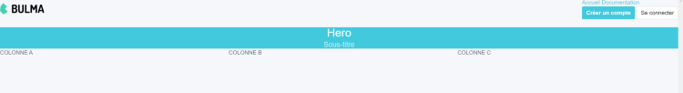
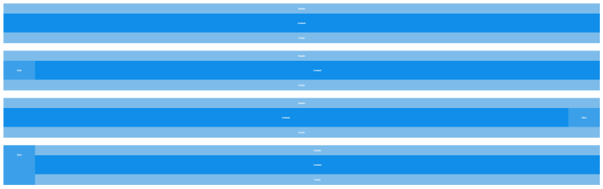
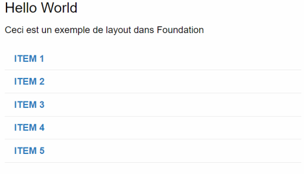
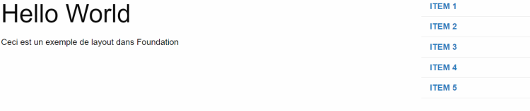
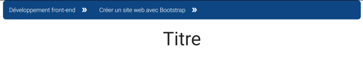

# **Introducción a otros frameworks CSS**

<br>

---

## **Frameworks CSS y su propósito**

---

<br>

```

Los frameworks CSS son conjuntos de código CSS predefinido que los desarrolladores pueden utilizar para acelerar el proceso de desarrollo de sus sitios web.

Estos frameworks consisten en colecciones de archivos CSS y, en algunos casos, archivos JavaScript, que contienen reglas y estilos predefinidos para componentes comunes de la interfaz de usuario, como botones, formularios y menús de navegación.

```

---

<br>

```
El objetivo de los frameworks CSS es proporcionar una forma rápida y sencilla de crear sitios web visualmente atractivos sin tener que escribir todo el código CSS desde cero.

Al utilizar un framework, los desarrolladores pueden ahorrar tiempo y esfuerzo, al tiempo que garantizan que su sitio web esté bien diseñado, sea receptivo y accesible.

```

---

<br>

```
Existen varios frameworks CSS populares, como Bootstrap, Bulma, Ant Design, Foundation y Materialize.

Cada uno de estos frameworks tiene sus propias características y ventajas, y la elección del framework adecuado dependerá de los requisitos del proyecto y de las preferencias personales del desarrollador.

```

---

<br>
<br>

Vamos a explorar algunos de los frameworks CSS más populares disponibles hoy en día.

Si bien Bootstrap es el framework más conocido y utilizado, existen otras opciones que ofrecen características similares con estilos y características únicas.

<br>

---

<br>

Uno de estos frameworks es Bulma, conocido por su diseño moderno y minimalista.

Está basado en Flexbox y es completamente receptivo, lo que lo convierte en una excelente opción para crear diseños simples y limpios.

<br>

---

<br>

Otra opción popular es Ant Design, que es un sistema de diseño completo que incluye una biblioteca de interfaz de usuario, iconos y un conjunto de principios de diseño.

Se utiliza principalmente para crear aplicaciones empresariales, con énfasis en la accesibilidad y la usabilidad.

<br>

---

<br>

Foundation es otro framework CSS muy utilizado, conocido por su enfoque "mobile-first" y su flexibilidad.

Ofrece una variedad de componentes de interfaz de usuario pre-construidos y admite la personalización a través de variables y mixins SASS.

<br>

---

<br>

Por último, Materialize es un framework basado en el lenguaje de diseño Material Design de Google, que ofrece un conjunto de componentes de interfaz de usuario pre-construidos con un diseño moderno y limpio.

Es completamente receptivo y fácil de usar, lo que lo convierte en una excelente opción para crear sitios web elegantes y funcionales.

<br>

---

<br>

Estos son solo algunos ejemplos, pero hay muchos otros frameworks CSS, cada uno con sus propias características y ventajas.

Al comprender las diferentes opciones disponibles, podrás elegir la que mejor se adapte a las necesidades de tu proyecto y tus requisitos de diseño.

<br>

---

---

<br>

<br>

---

### **BULMA**

---

<br>

Bulma es un moderno framework CSS que está ganando popularidad debido a su simplicidad y flexibilidad.

Ofrece una estructura modular que permite a los desarrolladores personalizar fácilmente sus diseños sin tener que escribir mucho código CSS desde cero.

<br>

---

<br>

Una de las principales características de Bulma es su diseño receptivo.

El framework proporciona un conjunto de clases que permiten a los desarrolladores crear diseños receptivos para diferentes dispositivos y tamaños de pantalla.

Estas clases son fáciles de usar y pueden ahorrar mucho tiempo al crear un sitio web o una aplicación.

<br>

---

<br>

Otra ventaja de Bulma es su completa documentación.

La documentación está bien organizada y fácil de navegar, con ejemplos y fragmentos de código para cada característica.

Además, la comunidad de Bulma es activa y solidaria, los desarrolladores comparten sus experiencias y consejos sobre el uso del framework.

<br>

---

<br>

Para comenzar a usar Bulma, los desarrolladores pueden descargar los archivos CSS y JavaScript directamente o utilizar un administrador de paquetes como NPM.

Una vez que los archivos se incluyen en el proyecto, los desarrolladores pueden comenzar a usar las clases proporcionadas por Bulma para estilizar sus elementos HTML.

<br>

---

<br>

Sin embargo, como cualquier framework, Bulma también tiene sus limitaciones.

Una de las desventajas es que puede no ser adecuado para diseños o aplicaciones más complejas, ya que carece de algunas características avanzadas que ofrecen otros frameworks.

Además, algunos desarrolladores pueden encontrar que la estructura modular de Bulma es demasiado rígida, ya que no permite tanta personalización como les gustaría.

<br>

---

<br>

En general, Bulma es una excelente opción para los desarrolladores que buscan un framework CSS liviano, receptivo y fácil de usar.

Gracias a su comunidad activa y su documentación completa, es fácil comenzar y crear sitios web y aplicaciones de calidad.

<br>

---

<br>

Las clases CSS en Bulma tienen nombres de clase predefinidos que se pueden agregar a tus elementos HTML para aplicar estilos y diseños predefinidos.

Estas clases te permiten crear fácilmente una interfaz de usuario receptiva y moderna sin tener que escribir mucho CSS personalizado.

<br>

---

<br>

**Aquí hay algunas clases CSS comunes en Bulma:**

<br>

- **button:** aplica estilos a un elemento de botón con los estilos de botones predeterminados de Bulma.

- **title:** aplica los estilos predeterminados para un título de página.

- **subtitle:** aplica los estilos predeterminados para un subtítulo.

- **hero:** un contenedor para elementos hero, como imágenes o títulos hero.

- **column:** una columna en el sistema de grillas de Bulma, que te permite crear fácilmente diseños receptivos.

- **notification:** aplica estilos a un elemento como notificación, que se puede usar para mostrar mensajes o alertas.

<br>

---

Para usar una clase CSS en Bulma, simplemente agrega el nombre de la clase a tu elemento HTML.

Por ejemplo, para crear un botón con los estilos predeterminados de Bulma, debes agregar la clase "button" a un elemento "button".

<br>

---

**así:**

```html
<button class="button">Clique ici</button>
```

---

<br>

También puedes combinar clases para aplicar múltiples estilos a un elemento.

Por ejemplo, para crear un botón con el estilo primario y el estilo grande, debes agregar las clases "is-primary" y "is-large".

<br>

---

**de la siguiente manera:**

```html
<button class="button is-primary is-large">Clique ici!</button>
```

---

<br>

En este ejemplo, la clase "is-primary" establece el color del botón como el color primario definido en tu tema de Bulma, y la clase "is-large" hace que el botón sea más grande.

<br>

---

**Ejemplo:**

```html
<nav class="navbar" role="navigation" aria-label="main navigation">
  <div class="navbar-brand">
    <a class="navbar-item" href="#">
      
    </a>

    <a
      role="button"
      class="navbar-burger burger"
      aria-label="menu"
      aria-expanded="false"
      data-target="navbarBasicExample"
    >
      <span aria-hidden="true"></span>

      <span aria-hidden="true"></span>

      <span aria-hidden="true"></span>
    </a>
  </div>

  <div id="navbarBasicExample" class="navbar-menu">
    <div class="navbar-start">
      <a class="navbar-item" href="#"> Inicio </a>

      <a class="navbar-item" href="#"> Documentación </a>
    </div>

    <div class="navbar-end">
      <div class="navbar-item">
        <div class="buttons">
          <a class="button is-primary">
            <strong>Crear una cuenta</strong>
          </a>

          <a class="button is-light"> Conectarse </a>
        </div>
      </div>
    </div>
  </div>
</nav>

<section class="hero is-primary">
  <div class="hero-body">
    <div class="container">
      <h1 class="title">Hero</h1>

      <h2 class="subtitle">Sub-titulo</h2>
    </div>
  </div>
</section>

<div class="columns">
  <div class="column">COLUMNA A</div>

  <div class="column">COLUMNA B</div>

  <div class="column">COLUMNA C</div>
</div>
```

---

<br>

**Lo que da como resultado a :**

<br>



```
Ejemplo de Bulma
```

---

<br>

---

---

<br>

<br>

---

### **Ant Design**

---

<br>

Ant Design es otro framework CSS que ha ganado popularidad en los últimos años. Fue desarrollado por Ant Financial, la subsidiaria financiera del grupo Alibaba, y originalmente fue diseñado para uso interno. Sin embargo, sus poderosas características y su diseño elegante rápidamente captaron la atención de toda la comunidad de desarrolladores web.

<br>

---

<br>

Una de las principales características de Ant Design es su conjunto completo de componentes de interfaz de usuario. Estos componentes están diseñados para ser utilizados en una amplia gama de aplicaciones web e incluyen desde botones básicos y controles de formulario hasta componentes más complejos como tablas y ventanas modales.

<br>

---

<br>

Ant Design también proporciona una amplia gama de clases de utilidad que permiten a los desarrolladores estilizar fácilmente sus aplicaciones, sin tener que escribir hojas de estilo CSS complejas. Estas clases se pueden utilizar para controlar elementos como la tipografía, el diseño y los esquemas de colores.

<br>

---

<br>

Al igual que Bulma, Ant Design también utiliza un sistema de rejilla receptivo que facilita la creación de diseños receptivos que se ven perfectos en una variedad de dispositivos diferentes. En general, Ant Design es un framework CSS poderoso y versátil que se puede utilizar para crear aplicaciones web hermosas y funcionales.

<br>

---

<br>

Ant Design se utiliza mejor con React, ya que fue diseñado originalmente para funcionar sin problemas con la arquitectura basada en componentes de React. Los componentes de interfaz de usuario de Ant Design ya están preestilizados y precodificados para satisfacer los requisitos específicos del desarrollo de React, lo que significa que los desarrolladores pueden integrarlos fácilmente en sus aplicaciones React sin tener que construir todo desde cero.

<br>

---

<br>

Además, Ant Design proporciona un conjunto de principios de diseño y pautas para garantizar la coherencia y accesibilidad de todos sus componentes, lo que permite a los desarrolladores crear interfaces de alta calidad que cumplen con los estándares web modernos. Al utilizar Ant Design con React, los desarrolladores pueden aprovechar la potencia y flexibilidad de ambas tecnologías para crear aplicaciones web modernas y robustas que satisfacen las necesidades de sus usuarios.

<br>

---

**Voici un exemple de Ant Design avec React :**

```Js
const { createRoot } = ReactDOM;

const {  Layout, Space  } = antd;

const { Header, Footer, Sider, Content } = Layout;

const headerStyle = {

  textAlign: 'center',

  color: '#fff',

  height: 64,

  paddingInline: 50,

  lineHeight: '64px',

  backgroundColor: '#7dbcea',

};

const contentStyle = {

  textAlign: 'center',

  minHeight: 120,

  lineHeight: '120px',

  color: '#fff',

  backgroundColor: '#108ee9',

};

const siderStyle = {

  textAlign: 'center',

  lineHeight: '120px',

  color: '#fff',

  backgroundColor: '#3ba0e9',

};

const footerStyle = {

  textAlign: 'center',

  color: '#fff',

  backgroundColor: '#7dbcea',

};

const App = () => (

  <Space

    direction="vertical"

    style={{

      width: '100%',

    }}

    size={[0, 48]}

  >

    <Layout>

      <Header style={headerStyle}>Header</Header>

      <Content style={contentStyle}>Content</Content>

      <Footer style={footerStyle}>Footer</Footer>

    </Layout>

    <Layout>

      <Header style={headerStyle}>Header</Header>

      <Layout>

        <Sider style={siderStyle}>Sider</Sider>

        <Content style={contentStyle}>Content</Content>

      </Layout>

      <Footer style={footerStyle}>Footer</Footer>

    </Layout>

    <Layout>

      <Header style={headerStyle}>Header</Header>

      <Layout>

        <Content style={contentStyle}>Content</Content>

        <Sider style={siderStyle}>Sider</Sider>

      </Layout>

      <Footer style={footerStyle}>Footer</Footer>

    </Layout>

    <Layout>

      <Sider style={siderStyle}>Sider</Sider>

      <Layout>

        <Header style={headerStyle}>Header</Header>

        <Content style={contentStyle}>Content</Content>

        <Footer style={footerStyle}>Footer</Footer>

      </Layout>

    </Layout>

  </Space>

);

const ComponentDemo = App;

createRoot(mountNode).render(<ComponentDemo />);
```

---

<br>

**Ant Design está relacionado con React y el DOM.**

React es una biblioteca de JavaScript utilizada para construir interfaces de usuario. Te permite crear componentes de interfaz de usuario reutilizables y gestionar el estado de tu aplicación de manera más organizada y eficiente.

---

<br>

---

---

<br>

<br>

---

#### **Definición**

---

<br>

```
El DOM (Document Object Model) es una interfaz de programación para documentos web.

Representa la página de manera que los programas puedan modificar la estructura, el estilo y el contenido del documento.

En otras palabras, es la interfaz entre el HTML de la página web y el JavaScript de tu aplicación.
```

<br>

---

<br>

En este ejemplo, se utiliza React para construir una aplicación web que utiliza la biblioteca Ant Design para los componentes de la interfaz de usuario.

La biblioteca ReactDOM se utiliza para modificar el DOM del navegador.

El código define varios elementos de diseño y los utiliza para construir un diseño complejo utilizando el componente Ant Design Layout.

<br>

---

<br>

Este código demuestra el uso de los componentes de Ant Design en una aplicación React.

Específicamente, el componente "Layout", que permite gestionar el diseño global de una página.

<br>

---

<br>

En primer lugar, se importan los módulos necesarios de las bibliotecas ReactDOM y Ant Design.

A continuación, se definen los estilos para varios elementos de diseño, como el encabezado, el contenido, el pie de página y el sider, utilizando objetos JavaScript.

<br>

---

<br>

Luego, se define un componente funcional de React llamado "App".

Este componente utiliza el componente "Space" de Ant Design para agregar espaciado vertical entre los elementos del diseño.

Dentro de "App", se utiliza el componente "Layout" de Ant Design para crear varios diseños con diferentes configuraciones de encabezado, contenido, pie de página y pantalla.

<br>

---

<br>

Por último, el componente "App" se renderiza en el DOM utilizando el método "createRoot" proporcionado por ReactDOM.

Este método renderiza el componente en un nodo DOM especificado, en este caso "mountNode".

<br>

---

**Véase el resultado**



```
Ejemplo de Ant
```

---

<br>

---

---

<br>

<br>

---

### **Foundation**

---

<br>

Foundation es un framework front-end responsive desarrollado por ZURB, que tiene como objetivo facilitar la creación de proyectos web responsivos y móviles. Ofrece un sistema de grillas que permite a los desarrolladores crear fácilmente diseños responsivos para sus páginas web. Foundation también incluye componentes y plantillas de interfaz de usuario predefinidos, como menús de navegación, formularios y ventanas modales, que pueden personalizarse para satisfacer las necesidades de un proyecto específico.

<br>

---

<br>

Una de las principales ventajas de Foundation es su flexibilidad, ya que permite a los desarrolladores elegir los componentes específicos que desean utilizar en sus proyectos. Por ejemplo, un desarrollador puede optar por utilizar solo el sistema de grillas y los estilos de tipografía de Foundation, mientras utiliza hojas de estilo CSS personalizadas para otros elementos de diseño.

<br>

---

<br>

Foundation también cuenta con una sólida documentación y una comunidad de soporte que pueden ayudar a los desarrolladores a encontrar soluciones rápidas a los problemas comunes que se encuentran al utilizar el framework. Además, Foundation hace hincapié en la accesibilidad, lo que lo convierte en una buena opción para proyectos que requieren cumplir con los estándares de accesibilidad.

<br>

---

<br>

Además de los archivos CSS tradicionales, Foundation incluye archivos Sass que se pueden utilizar para personalizar los estilos y las funcionalidades del framework.

<br>

---

<br>

Sass es un preprocesador de CSS que permite a los desarrolladores escribir un código CSS más fácil de mantener y modular. Con Sass, los desarrolladores pueden utilizar variables, mixins, funciones y bucles para crear código CSS reutilizable. Luego, el código Sass se compila en código CSS normal que se puede utilizar en una página web.

<br>

---

<br>

Al proporcionar un soporte integrado para Sass, Foundation permite a los desarrolladores personalizar fácilmente el aspecto de un proyecto aprovechando el poder de Sass. Esto significa que los desarrolladores pueden usar Sass para crear sus propios estilos y componentes personalizados basados en los estilos y componentes predefinidos de Foundation. También pueden modificar los estilos y componentes existentes proporcionados por Foundation para adaptarlos mejor a sus necesidades.

<br>

---

<br>

En resumen, Foundation es un framework front-end potente y flexible que puede ayudar a los desarrolladores a crear rápidamente proyectos web responsivos y móviles. Sus componentes y plantillas de interfaz de usuario predefinidos, junto con su sólida documentación y comunidad de soporte, lo convierten en una opción sólida para proyectos de desarrollo web de cualquier tamaño.

<br>

---

**Ejemplo de foundation:**

```html
<!DOCTYPE html>

<html>
  <head>
    <meta charset="UTF-8" />

    <title>Ejemplo</title>

    <link
      rel="stylesheet"
      href="https://cdnjs.cloudflare.com/ajax/libs/foundation/6.6.3/css/foundation.min.css"
    />
  </head>

  <body>
    <div class="grid-container">
      <div class="grid-x grid-margin-x">
        <div class="cell small-12 medium-8">
          <h1>Hello World</h1>

          <p>Este es un ejemplo de diseño en Foundation</p>
        </div>

        <div class="cell small-12 medium-4">
          <ul class="menu vertical">
            <li><a href="#">Item 1</a></li>

            <li><a href="#">Item 2</a></li>

            <li><a href="#">Item 3</a></li>

            <li><a href="#">Item 4</a></li>

            <li><a href="#">Item 5</a></li>
          </ul>
        </div>
      </div>
    </div>
  </body>
</html>
```

---

<br>

En este ejemplo, estamos utilizando las clases grid-container y grid-x para crear una cuadricula.

Las clases small-12 y medium-8 en el primer div especifican que ocupará todo el ancho del contenedor en pantallas pequeñas y 8/12 del contenedor en pantallas medianas.

El segundo div tiene un ancho de 4/12 en pantallas medianas, creando una disposición de dos columnas.

La clase menu vertical en el elemento ul crea un menú de navegación vertical.

En general, este ejemplo demuestra la flexibilidad y facilidad de uso de Foundation para crear diseños responsivos.

<br>

---

**He aquí el resultado en móvil:**



```
Ejemplo de Foundation en móvil
```

---

<br>

---

**Y en desk:**



```
Ejemplo de Foundation en Desktop
```

---

<br>

---

---

<br>

<br>

---

### **Materialize**

---

<br>

Materialize es un framework CSS creado por un grupo de empleados de Google.

Sigue los principios de diseño material de Google y proporciona un diseño responsive que funciona en todos los dispositivos.

<br>

---

<br>

Materialize ofrece una amplia gama de componentes de interfaz de usuario, como botones, formularios, tarjetas, navegación, etc.

También cuenta con un sistema de grid que te permite crear rápidamente diseños responsive.

<br>

---

<br>

Una de las características más destacadas de Materialize son sus componentes JavaScript.

Tiene una sólida colección de plugins JavaScript que permiten crear varios elementos de interfaz de usuario dinámicos, como modales, tooltips y carousels.

Estos plugins son fáciles de usar e integrar en tu proyecto.

<br>

---

<br>

Materialize es una excelente opción para aquellos que desean utilizar un framework CSS con el lenguaje y la filosofía de diseño de Google.

Su apariencia puede darle a tu sitio web o aplicación un aspecto moderno y elegante.

<br>

---

<br>

En el diseño de sitios web, un breadcrumb o breadcrumb trail es un elemento de navegación que permite a los usuarios rastrear su ubicación en un sitio web.

Por lo general, aparece horizontalmente en la parte superior de la página, justo debajo del encabezado o la barra de navegación, y muestra una serie de enlaces clicables que representan la jerarquía de navegación seguida por el usuario para llegar a la página actual.

<br>

---

<br>

Los breadcrumbs son especialmente útiles en sitios web con una navegación profunda o un gran número de páginas.

Al proporcionar una ruta clara hacia las páginas anteriores, ayudan a los usuarios a orientarse en el sitio web y a encontrar su camino más fácilmente.

También ayudan a los usuarios a comprender la estructura del sitio web y cómo se relacionan las diferentes páginas entre sí

<br>

---

**Aquí tienes un ejemplo que muestra un `breadcrumb` con Materialize:**

```html
<!DOCTYPE html>

<html>
  <head>
    <title>Fil d’Ariane</title>

    <link
      rel="stylesheet"
      href="https://fonts.googleapis.com/icon?family=Material+Icons"
    />

    <link
      rel="stylesheet"
      href="https://cdnjs.cloudflare.com/ajax/libs/materialize/0.97.3/css/materialize.min.css"
    />

    <script
      type="text/javascript"
      src="https://code.jquery.com/jquery-2.1.1.min.js"
    ></script>

    <script src="https://cdnjs.cloudflare.com/ajax/libs/materialize/0.97.3/js/materialize.min.js"></script>

    <style>
      .container {
        height: 64px;

        display: flex;

        align-items: center;
      }

      h1 {
        justify-content: center;

        text-align: center;
      }

      div {
        display: flex;

        align-items: center;

        color: white;

        background-color: rgb(0, 68, 128);

        padding: 0 10px;

        border-radius: 10px;

        margin-right: 10px;
      }

      span {
        font-family: Roboto;

        font-weight: 300;

        font-size: 20px;

        color: white;

        margin-right: 10px;
      }

      i {
        margin: 0 8px;

        font-size: 20px;
      }
    </style>
  </head>

  <body>
    <div class="container">
      <div>
        <span>Développement front-end</span>

        <i class="material-icons">double_arrow</i>
      </div>

      <div>
        <span>Créer un site web avec Bootstrap</span>

        <i class="material-icons">double_arrow</i>
      </div>
    </div>

    <h1>Titre</h1>
  </body>
</html>
```

---

<br>

Este es un código HTML que crea una sección de encabezado con una barra de navegación en forma de "breadcrumb" (fil d'Ariane) y un título. El encabezado tiene un fondo verde y contiene tres elementos de "breadcrumb", cada uno con una etiqueta y un ícono de flecha. La fuente utilizada para la etiqueta es Roboto con un tamaño de 20 px y un peso de 300.

<br>

---

<br>

El código HTML incluye enlaces a la fuente Material Icons y a las bibliotecas CSS y JavaScript de Materialize, que se utilizan para dar estilo y agregar funcionalidades a los elementos del "breadcrumb".

<br>

---

<br>

Los estilos CSS para la sección del encabezado establecen una altura de 64 px y alinean el contenido verticalmente al centro. La etiqueta h1 está centrada tanto horizontal como verticalmente en la sección del encabezado. Los elementos del "breadcrumb" se estilizan para mostrarse horizontalmente, centrados verticalmente y con un margen de 8 px entre la etiqueta y el ícono. Los elementos del "breadcrumb" tienen un fondo azul y una fuente blanca.

<br>

---

**He aquí el resultado:**



```
Ejemplo de Materialize
```

---

<br>

---

---

<br>

<br>

---

### **[Codepen.io](https://codepen.io/)**

---

<br>

```
Cómo usar CodePen.io para probar los diferentes frameworks.
```

<br>

---

<br>

Los frameworks CSS son herramientas populares utilizadas por los desarrolladores web para acelerar el proceso de creación de aplicaciones web.

Estos frameworks proporcionan componentes predefinidos de CSS y JavaScript, como cuadrículas, formularios y barras de navegación, que se pueden personalizar fácilmente para adaptarse al diseño de la aplicación.

Si bien utilizar un framework CSS tiene sus ventajas, también hay consideraciones potenciales a tener en cuenta.

<br>

---

**Ventajas**

<br>

- **Tiempo de desarrollo más corto:**

    - utilizar un framework CSS puede acelerar el proceso de desarrollo al proporcionar componentes pre-construidos que se pueden personalizar fácilmente para adaptarse al diseño de la aplicación.
    
    - Esto permite a los desarrolladores ahorrar tiempo y esfuerzo, centrándose en otros aspectos de la aplicación.

<br>

- **Diseño coherente:**

    - los frameworks CSS suelen tener un estilo de diseño coherente que puede ayudar a mantener la cohesión visual y la usabilidad en diferentes partes de la aplicación.
    
    - Esto puede hacer que la aplicación sea más fácil de usar y navegar para los usuarios.

<br>

- **Diseño responsive:**

    - muchos frameworks CSS están diseñados para ser móviles y responsivos, lo que significa que se adaptan a diferentes tamaños de pantalla y dispositivos.
    
    - Esto permite a los desarrolladores ahorrar tiempo y esfuerzo al diseñar una interfaz responsive desde cero.

<br>

- **Soporte de la comunidad:**

    - los frameworks CSS populares como Bootstrap y Foundation cuentan con grandes comunidades de desarrolladores que contribuyen a su desarrollo y brindan apoyo a través de foros y otros recursos.

<br>

---

**Desventajas:**

<br>

- **Curva de aprendizaje:**

    - si bien los frameworks CSS pueden ahorrar tiempo y energía, su uso a menudo implica una curva de aprendizaje.
    
    - Los desarrolladores pueden necesitar aprender la sintaxis y las convenciones del framework, lo cual puede llevar tiempo y esfuerzo.

<br>

- **Personalización compleja:**

    - aunque los frameworks CSS proporcionan componentes pre-construidos, no siempre son adecuados para todas las aplicaciones.
    
    - los desarrolladores pueden verse obligados a personalizar los componentes de manera más profunda, lo que puede requerir esfuerzos adicionales y estar limitado por el diseño del framework.

<br>

- **Código sobrecargado:**

    - los frameworks CSS a veces pueden generar código innecesario, ya que pueden incluir muchos componentes que no son necesarios para una aplicación específica.
    
    - Esto puede ralentizar el tiempo de carga de la aplicación y hacerla menos eficiente.

<br>

- **Dificultad para depurar:**

    - dado que los frameworks CSS son pre-construidos, puede resultar difícil solucionar problemas relacionados con componentes específicos.
    
    - Esto puede dificultar la depuración y llevar tiempo.

<br>


---

<br>

- **En conclusión, los frameworks CSS pueden ser herramientas útiles para los desarrolladores web para acelerar el proceso de desarrollo y mantener un diseño coherente.**

- **Sin embargo, también tienen posibles desventajas como una curva de aprendizaje, personalización limitada, código inflado y dificultades de depuración.**

- **Los desarrolladores deben evaluar los pros y los contras de utilizar un framework CSS antes de decidir usarlo en su aplicación.**

<br>

---

---
