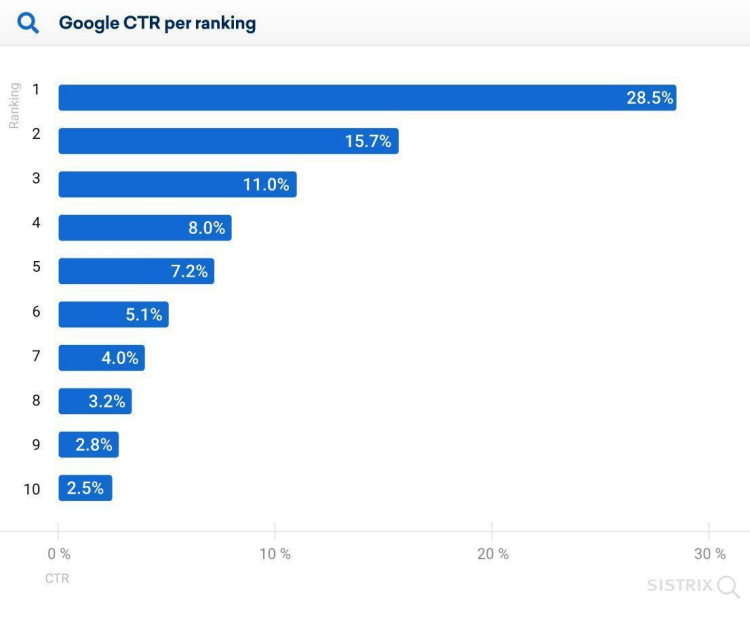

# **Qué engloba el término de referencia web?**

<br>

---

## **Conceptos previos**

<br>

---

### **Recordatorio sobre el posicionamiento web**

---

<br>

El posicionamiento web es una necesidad para cada sitio web existente en la web.

De hecho, **el posicionamiento se refiere a la técnica que permite que un sitio web esté presente en las bases de datos de los diferentes motores de búsqueda.**

<br>

---

<br>

Sin embargo, **aunque un sitio web esté indexado en los motores de búsqueda**, debe poder posicionarse adecuadamente en los resultados de búsqueda para tener una buena visibilidad.

**El propietario de un sitio web debe implementar una serie de técnicas adecuadas para garantizar su buen posicionamiento.**

<br>

---

<br>

**El objetivo es hacer que el sitio aparezca en la primera página de los resultados de búsqueda `(SERP)`, ya que la mayoría de los usuarios no van más allá de esta página.**

<br>

---

<br>

`El término SERP` **se refiere a Search Engine Results Page**, que significa **"página de resultados de motores de búsqueda"**.

Esta página se muestra en un motor de búsqueda después de la búsqueda web de un usuario.

**Los resultados presentados en la `SERP` toman la forma de enlaces hipertexto acompañados de una meta descripción que resume el contenido de la página.**

La lista de enlaces propuestos se clasifica según su relevancia para la consulta del usuario.

**Por lo tanto, los resultados ubicados en la parte superior se consideran los más relevantes** y confiables para la consulta de búsqueda realizada.

<br>

---

<br>

Se estima que el 75% de los usuarios se detienen en la primera página de los resultados de búsqueda.

<br>

---

<br>

Los primeros lugares son los más interesantes para obtener un buen tráfico.

De hecho, el resultado número 1 en Google genera en promedio más del 28% de todos los clics, según revela un estudio de Sistrix compartido por el blog du modérateur en 2020.

<br>

---

**Fuente: [BDM](https://www.blogdumoderateur.com/seo-etude-taux-de-clics-serp/)**

---

<br>

```
El posicionamiento web es, por lo tanto, un arte imprescindible para cualquier administrador de sitios web.
```

<br>

---



---

<br>

```
Tasa de clics según la posición - sistrix
```

<br>

---

---

<br>

<br>

---

### **Recordatorio sobre el posicionamiento web**

---

<br>

El posicionamiento web es una necesidad para cada sitio web existente en la web.

De hecho, **el posicionamiento se refiere a la técnica que permite que un sitio web esté presente en las bases de datos de los diferentes motores de búsqueda.**

<br>

---

<br>

Sin embargo, **aunque un sitio web esté indexado en los motores de búsqueda**, debe poder posicionarse adecuadamente en los resultados de búsqueda para tener una buena visibilidad.

**El propietario de un sitio web debe implementar una serie de técnicas adecuadas para garantizar su buen posicionamiento.**

<br>

---

<br>

**El objetivo es hacer que el sitio aparezca en la primera página de los resultados de búsqueda `(SERP)`, ya que la mayoría de los usuarios no van más allá de esta página.**

<br>

---

<br>

`El término SERP` **se refiere a Search Engine Results Page**, que significa **"página de resultados de motores de búsqueda"**.

Esta página se muestra en un motor de búsqueda después de la búsqueda web de un usuario.

**Los resultados presentados en la `SERP` toman la forma de enlaces hipertexto acompañados de una meta descripción que resume el contenido de la página.**

La lista de enlaces propuestos se clasifica según su relevancia para la consulta del usuario.

**Por lo tanto, los resultados ubicados en la parte superior se consideran los más relevantes** y confiables para la consulta de búsqueda realizada.

<br>

---

<br>

Se estima que el 75% de los usuarios se detienen en la primera página de los resultados de búsqueda.

<br>

---

<br>

Los primeros lugares son los más interesantes para obtener un buen tráfico.

De hecho, el resultado número 1 en Google genera en promedio más del 28% de todos los clics, según revela un estudio de Sistrix compartido por el blog du modérateur en 2020.

<br>

---

**Fuente: [BDM](https://www.blogdumoderateur.com/seo-etude-taux-de-clics-serp/)**

---

<br>

```
El posicionamiento web es, por lo tanto, un arte imprescindible para cualquier administrador de sitios web.
```

<br>

---


---

```
Tasa de clics según la posición - sistrix
```
---

<br>

---

---

<br>

<br>

---

### **Definición de `SEO`**

---

<br>

El SEO (Search Engine Optimization), que en español significa **"Optimización para Motores de Búsqueda"**, se refiere al **conjunto de técnicas que tienen como objetivo mejorar la visibilidad y posicionamiento de un sitio web en los resultados de búsqueda orgánica de los motores de búsqueda.**

<br>

---

<br>

**Mediante el `SEO`, podemos optimizar el contenido y la estructura de un sitio web para que aparezca en los primeros resultados durante una búsqueda en la web.**

<br>

---

**Las técnicas de `SEO` incluyen:**

<br>

- El contenido del sitio con la optimización de palabras clave, la creación de contenido de calidad y enlaces entrantes de calidad,

- La arquitectura del sitio, incluyendo la optimización de etiquetas meta,

- La mejora de la velocidad de carga del sitio.

<br>

---

El SEO, cuyas técnicas son gratuitas, también se conoce como posicionamiento orgánico o natural.

**Este es así el contrario de `SEA` (Search Engine Advertising).**

<br>

---
---

<br>

<br>

---

### **Definición de `SEA`**

---

<br>

**El `SEA` (Search Engine Advertising)** se refiere al **posicionamiento pagado**.

Permite posicionarse en una buena posición en ciertas consultas mediante la compra de palabras clave.

**Esto ofrece la posibilidad de generar un anuncio publicitario bien ubicado en los motores de búsqueda** y así generar tráfico hacia el sitio web.

**Los resultados de búsqueda relacionados con la compra de palabras clave aparecen en la parte superior de la SERP con la etiqueta "Anuncios".**

<br>

---

---

<br>

<br>

---

## **Los elementos a enfocar para el posicionamiento de un sitio web**

<br>

---

### **Recordatorio sobre el contenido de un sitio web**

---

<br>

El contenido de un sitio web tiene un impacto en su clasificación en los resultados de búsqueda de los motores de búsqueda.

Estos resaltan el contenido original, único e inédito.

<br>

---
---

<br>

También se priorizan los contenidos extensos.

De hecho, los resultados que se clasifican en la primera página de Google tienen en promedio más de 1,000 palabras.

Este contenido extenso también tiene más posibilidades de ser compartido en las redes sociales.

<br>

---

<br>

Para lograr una optimización del SEO, es necesario agregar palabras clave en elementos que estructuran las páginas web de un sitio, como el título de la página, títulos, texto, URL, atributos alt de las imágenes, enlaces internos y externos, meta-descripciones y meta-títulos.

<br>

---

<br>

Además, este contenido debe estar estructurado para resaltar las partes más importantes del texto.

Para ello, utilizamos etiquetas que destacan los títulos y subtítulos, y se aplican formatos en negrita o cursiva a ciertos términos.

Los enlaces optimizados también ayudan a mejorar la posición del sitio.

<br>

---

---

<br>

<br>

---

### **Definición de `metadatos`**

---

<br>

Las metadatos son elementos que forman parte del código HTML de un sitio web.

Estos corresponden a los primeros datos que permiten a los algoritmos de búsqueda de los motores de búsqueda identificar los sitios web más relevantes en una consulta realizada por los usuarios.

Aunque estos contenidos no siempre son visibles para los usuarios, son examinados minuciosamente por los motores de búsqueda.

<br>

---

<br>

Para el SEO de un sitio web, es imperativo optimizar estos elementos.

Se trata de introducir etiquetas HTML en la sección HEAD del código fuente de la página y completar estos metadatos con un texto descriptivo del sitio.

<br>

---

---

<br>

<br>

---

### **Los diferentes tipos de metadatos**

---

<br>

Existen diferentes tipos de metadatos en los que es importante trabajar para la optimización SEO de un sitio web.

En primer lugar, la etiqueta de título o etiqueta Title que proporciona un título a una página web.

Esta etiqueta es visible en la página de resultados de búsqueda (SERP) y en la barra del navegador.

Para mejorar el posicionamiento de la página web, es necesario incluir palabras clave en este título.

Estas palabras clave deben corresponder adecuadamente al contenido de la página.

La palabra clave principal debe estar al comienzo del título.

Además, este título no debe superar los 60 caracteres para evitar que se trunque.

<br>

---

**Por ejemplo, para un sitio web de comercio electrónico de cosméticos que desea posicionarse en las palabras clave `"ética"` y `"natural"`, y la palabra clave principal `"bio"`, los dos títulos siguientes son relevantes:**

<br>

- **Bio:** todos nuestros productos `éticos` y `naturales`.

- **Bio, `éticos` y `naturales`:** el ADN de nuestros cosméticos.

---
---

<br>

A continuación, está la meta descripción que brinda una vista previa del contenido de la página.

El texto de la meta descripción aparece en la SERP justo debajo de la etiqueta de título.

Su contenido debe despertar el interés del usuario para animarlo a hacer clic.

Una meta descripción relevante y atractiva puede mejorar significativamente la tasa de clics.

Su longitud ideal está entre 150 y 160 caracteres.

<br>

---

**Si retomamos el ejemplo del sitio web de comercio electrónico especializado en cosméticos orgánicos, las siguientes meta descripciones son relevantes:**

<br>

- Descubre nuestra amplia gama de cosméticos orgánicos, éticos y naturales en nuestra tienda en línea. Encuentra fácilmente el cuidado de tus sueños al alcance de un clic.

- Con nuestros productos cosméticos orgánicos, éticos y naturales, encontrarás fácilmente y con confianza cuidados de belleza efectivos y respetuosos con tu piel.

<br>

---
---

<br>

Los encabezados principales y sub-encabezados ayudan a estructurar el contenido textual de una página o artículo. Se utilizan la etiqueta H1 para los encabezados principales y las etiquetas H2, H3, H4, H5 y H6 para los sub-encabezados.

<br>

---

<br>

Por último, la etiqueta Alt Text o Atributo Alt permite proporcionar información sobre las imágenes presentes en el sitio. Es importante describir con precisión la imagen para que los motores de búsqueda puedan tener en cuenta este contenido visual.

<br>

---

---