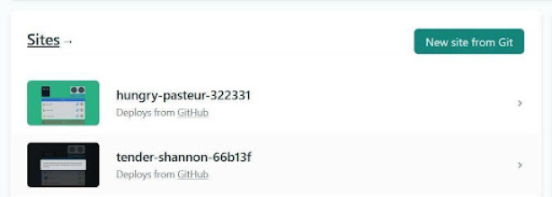
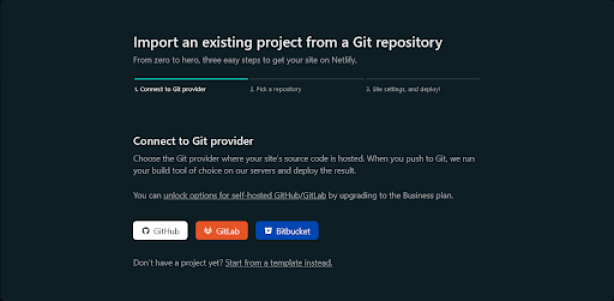
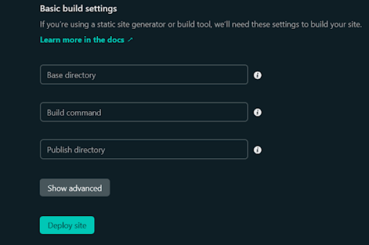
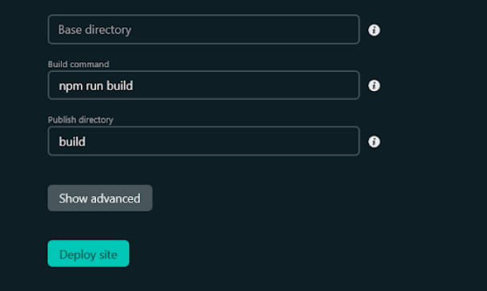
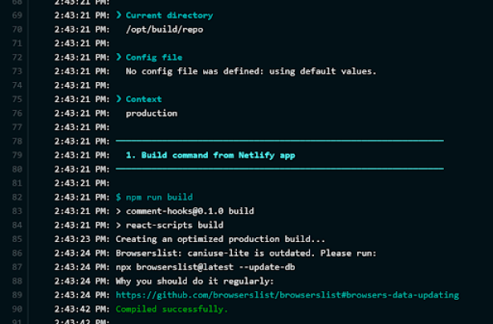
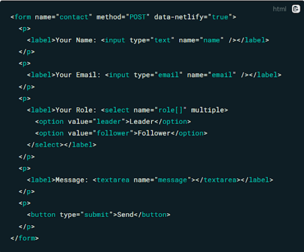
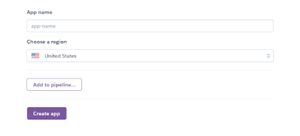

# **Alojamiento**

<br>

## **_Objetivos:_**

- Conocer los diferentes tipos de alojamiento posibles

---

---

<br>

---

## **Contexto**

---

<br>

Una vez creada nuestra aplicación web, debemos hacerla accesible en línea.

Para ello, utilizaremos un servidor HTTP, un software cuyo objetivo es responder a las solicitudes HTTP que nuestro navegador envía.

Pero ¿dónde instalaremos este servidor HTTP?

¿Dónde alojaremos nuestra aplicación?

Por razones de costo y también de infraestructura, la responsabilidad de los servidores web se confía a menudo a una empresa externa llamada proveedor de alojamiento.

<br>

---

---

<br>
<br>

---

## **Hospedaje compartido**

---

<br>

Destinado principalmente a sitios web, el hospedaje compartido consiste en compartir un mismo servidor físico entre varios sitios web.

De esta manera, los recursos disponibles (memoria, procesadores, etc.) se comparten entre los diferentes sitios alojados en este servidor y se distribuyen según el contrato establecido con el proveedor de alojamiento.

Solo el proveedor de alojamiento tendrá acceso directo a la configuración de la máquina.

Por lo general, los clientes solo tendrán acceso a una interfaz web con funcionalidades limitadas para garantizar la integridad de la máquina para todos los clientes alojados.

<br>

---

**Ventajas:**

- Solución de bajo costo

- Administración (actualización, mantenimiento, etc.) de la máquina realizada por el proveedor de alojamiento

<br>

---
---

<br>

---

**Desventajas:**

- Recursos de hardware limitados

- Administración muy limitada: no es posible administrar directamente la máquina mediante comandos en línea, por ejemplo

- Todo el servidor puede ser incluido en listas negras si alguno de los sitios web que aloja no cumple ciertas reglas (por ejemplo, el envío de spam)

<br>

---
---

<br>

---

**Destino:**

- Sitio web con tráfico bajo a moderado, generalmente utilizado para sitios web personales o de exhibición.

<br>

---

---

<br>
<br>

---

## **Servidor dedicado Físicamente**

---

<br>

Un servidor dedicado físico es un servidor exclusivo para un solo cliente.

Este servidor puede alojar un servidor HTTP, un servidor de correo electrónico, etc.

La administración será completamente realizada por el cliente del proveedor de alojamiento, a menos que se haya acordado un contrato de administración.

<br>

---

**Ventajas:**

- Posibilidad de administrar el servidor de forma remota a través de protocolos como SSH, terminal de servidor, etc.

- Permite aprovechar todos los recursos de la máquina (procesadores, memoria, discos, etc.)

<br>

---
---

<br>

---

**Desventajas:**

- Costo de mantenimiento elevado a cargo del cliente

- Riesgo de fallas físicas

- Obsolescencia rápida del hardware


<br>

---

---

<br>
<br>

---

## **Servidor dedicado Virtualmente**

---

<br>

Un servidor dedicado virtual (o VPS, por sus siglas en inglés) es la partición de un servidor físico en varias máquinas virtuales.

Cada una de las particiones ofrece las características de un servidor dedicado, es decir, acceso completo a la máquina y al sistema de archivos, sin riesgo de comprometer las otras particiones.


---

<br>

El proveedor de alojamiento puede asignar los recursos a cada partición utilizando un hipervisor.

<br>

---

**Ventajas:**

- Posibilidad de administrar el servidor de forma remota a través de protocolos como SSH, terminal de servidor, etc.

- Costo reducido en comparación con un servidor dedicado físico, ya que el mantenimiento de la infraestructura se comparte entre todos los clientes que tienen un VPS.

- Fácilmente redundante.


<br>

---
---

<br>

---

**Desventajas:**

- Sin acceso directo a la configuración de hardware.

- Menor rendimiento que un servidor dedicado físico (debido a la virtualización del entorno).


<br>

---

---

<br>
<br>

---

## **Cloud**

---

<br>

El alojamiento no se basa en una máquina física o virtual, sino en un conjunto de recursos distribuidos entre varios servidores y disponibles a través de una interfaz de administración.

---

<br>

Con el PaaS (Plataforma como Servicio), el proveedor de alojamiento ofrece hardware y software como servicio a través de Internet.

El usuario puede seleccionar servicios de un catálogo (servidor HTTP, herramientas de monitoreo, etc.) y configurarlos rápidamente utilizando una herramienta de administración, generalmente un portal web, sin necesidad de instalar software.

---

<br>

El usuario puede aumentar o disminuir la configuración de hardware asignada a cada servicio instantáneamente, a través de la interfaz de administración o mediante reglas automatizadas (por ejemplo, aumentar el número de servidores web si la audiencia del sitio aumenta significativamente, y viceversa).

<br>

---

**Ventajas:**

- El mantenimiento es realizado por el proveedor de alojamiento.

- El tamaño de la infraestructura puede ser dinámico.

- Redundancia de servidores que garantiza una alta disponibilidad del servicio.

- Pago por uso (facturación según los recursos consumidos).


<br>

---
---

<br>

---

**Desventajas:**

- Difícil de anticipar los costos de alojamiento.

- La seguridad de los datos depende del proveedor de alojamiento.

- Imposibilidad de acceder a ciertos servicios exóticos que el proveedor de alojamiento no ofrece en su catálogo.


<br>

---

---

<br>
<br>

---

## **Netlify**

---

<br>

Existe un sitio web que permite alojar el front-end de tus aplicaciones web, ya sea en HTML/CSS/JavaScript o con un framework como React, Vue, etc.

---

<br>

Netlify es un servicio de alojamiento en la nube.

Simplemente albergando tu repositorio Git en GitHub, GitLab o BitBucket, puedes construir tu aplicación y publicarla en Internet.

Hay un plan gratuito que te permitirá alojar todos tus prototipos y/o proyectos con solo unos clics.

<br>

---

**Los pasos a seguir para implementar tu aplicación en `Netlify` son los siguientes:**

- **Repositorio Git:**

    - Es necesario utilizar GitHub, GitLab o BitBucket para alojar tu código, ya que Netlify se conectará directamente al repositorio remoto (con tu autorización).

    - Una vez que hayas creado tu repositorio, empuja la última versión funcional de tu aplicación a tu rama principal (master o main) antes de pasar al siguiente paso.

<br>

---
---
    
<br>    

- **Crear una cuenta en Netlify:**

    - Para facilitar el acceso a la carpeta en el sitio donde almacenas tu código, se recomienda iniciar sesión con la cuenta correspondiente.

    - A diferencia de algunas soluciones de alojamiento, Netlify no te solicitará ingresar los detalles de tu tarjeta de crédito al momento de registrarte, lo que te permite probar el servicio de manera tranquila, sin recibir una factura no deseada.

<br>


---

<br>

- **Crear nuevo sitio**



<br>

---

No hay restricciones en cuanto al número de sitios que se pueden implementar en la red. Las restricciones se aplican al número de minutos de "build" y al ancho de banda utilizado.



---

<br>

Se te pedirá que elijas con qué aplicación deseas conectarte.

Netlify te solicitará autorización para acceder a tu cuenta y recuperar tus proyectos.

Una vez hecho esto, selecciona el proyecto que deseas agregar a la plataforma.

<br>

---

<br>

- Configurar el (CI/CD)

<br>

---

<br>

Para que Netlify pueda construir tu aplicación antes de implementarla.

Deberás indicarle la rama que deseas utilizar, el comando para iniciar la construcción y el directorio donde los archivos de construcción estarán disponibles.

<br>



```
Ejemplo de parámetros para una aplicación HTML CSS JS.
```

---

<br>

No se requiere ninguna especificación para HTML/CSS/JS, ya que no hay ningún comando que se deba ejecutar para construir la aplicación.

<br>



```
Ejemplo de parámetros para una aplicación ReactJS
```

- **Verificar la fase `build`**

<br>

Una vez confirmado, haga clic en "Deploy Site" y podrá verificar que la `build` se realiza correctamente.



<br>

- **Testear la app en directo**

---

**Una vez completados todos los pasos anteriores, podrás acceder a tu aplicación a través de un enlace que se verá así:**

- **`https://[palabra clave]-[palabra clave]-[hash].netlify.app/`**

<br>

Netlify también te permite gestionar formularios directamente en tu aplicación.

**Para ello, es necesario agregar la opción `data-netlify="true"` en la etiqueta `<form>` como se muestra en el siguiente ejemplo:**



<br>

---

Consulta **[la documentación](https://docs.netlify.com/forms/setup/)** en línea del sitio web de Netlify para obtener información detallada sobre todos los aspectos.

<br>

---

---

<br>
<br>

---

## **Heroku**

---

<br>

Heroku es una Plataforma como Servicio (PaaS) cuyo objetivo es facilitar al máximo el despliegue de aplicaciones en la nube. Aquí no configuraremos ningún servidor ni instalaremos un entorno completo. Simplemente escribiremos nuestra aplicación con Python y Flask, luego la enviaremos a Heroku. Acompañaremos la aplicación con algunos archivos de configuración para indicarle a Heroku cómo iniciarla, y eso es todo.

<br>

---

<br>

La desventaja de Heroku es que si deseamos, por ejemplo, alojar una base de datos, incluso con una función gratuita, Heroku nos pedirá que ingresemos nuestra información de tarjeta de crédito. Así que ten cuidado con las facturas sorpresa si no has sido lo suficientemente cuidadoso.

<br>

---

<br>

Una vez que te hayas conectado, se mostrará el panel de control de tu cuenta de Heroku. Indicará "Getting Started with Heroku" (Empezando con Heroku). Si eres nuevo en Heroku, selecciona el icono que representa tu lenguaje de programación y sigue la guía de inicio para crear una nueva aplicación.

<br>

---

<br>

Sin embargo, Heroku ofrece un método rápido de inicio utilizando una herramienta llamada "Buttons" (Botones). Con un clic en un botón, puedes desplegar una aplicación preconfigurada que contiene todos los elementos necesarios, incluyendo código, configuraciones y complementos. Al crear tu aplicación de Heroku con un botón, te darás cuenta de lo fácil que es utilizar la plataforma. También obtendrás una verdadera aplicación Node.js funcional que podrás explorar y modificar para familiarizarte con ella.

<br>

---

**Instala tu primera aplicación haciendo clic en este botón:**

<br>


---

<br>

**1.** Ingresa el nombre de tu aplicación o permite que Heroku elija uno por ti.

**2.** Selecciona la ubicación geográfica en la cual deseas crear tu entorno de ejecución: Estados Unidos o Europa.

**3.** Haz clic en "Create App" (crear aplicación) para desplegar la aplicación. Espera uno o dos minutos y tu aplicación estará lista para funcionar en Heroku.



<br>

---

---

<br>
<br>

---

## **A recordar**

---

<br>

- **Existen diferentes formas de alojar una aplicación web: hosting compartido (para uso personal) o un servidor dedicado físico. La empresa deberá elegir la solución que mejor se adapte al tráfico generado por su sitio**.

- **El cloud (especialmente PaaS) permite abstraerse de la arquitectura de hardware y aprovechar una oferta de servicios configurables de forma dinámica**.

- **Utiliza Netlify para probar tus front-end y prototipos, e incluso para alojar sitios simples de forma gratuita, como un portafolio, por ejemplo**.

- **Heroku puede ser una solución mucho más completa para alojar tus aplicaciones, especialmente en el lado del back-end. Por ejemplo, puede gestionar lenguajes como Node.js, PHP, Python, Symfony, etc. (Atención: la documentación está en inglés)**.

<br>

---

---


