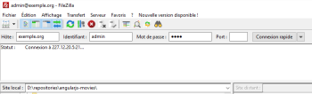
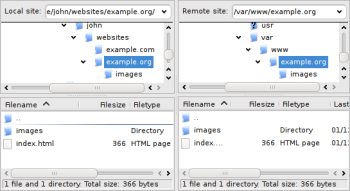
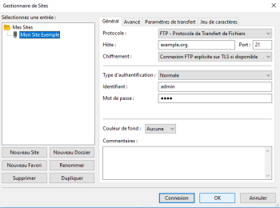

# **Usar cliente FTP**

 

## **_Objetivos:_**

- Saber transferir archivos a través del protocolo **`FTP`**

---

---

 

---

## **Contexto**

---

 

Una vez seleccionado el tipo de alojamiento, será necesario copiar los archivos de nuestra aplicación en el servidor web.

Por razones de seguridad, no siempre se permite el acceso a la línea de comandos.

De hecho, el usuario encargado de implementar la aplicación puede no tener los derechos para acceder a todo el servidor (sistema de archivos, sistema operativo, servidor HTTP, etc.).

Sin embargo, el protocolo FTP permite copiar archivos en una ubicación específica del servidor de destino.

 

---

---

 
 

---

## **El protocolo `FTP`**

---

 

El protocolo FTP, o Protocolo de Transferencia de Archivos, fue creado para transferir archivos a través de una red `TCP/IP`.

 

---

**FTP se basa en un modelo cliente/servidor:**

- **Servidor FTP:**

    - es un software instalado en el servidor web que permite acceder a una estructura de archivos desde el exterior.

 

- **Cliente FTP:**

    - es un software que permite conectarse al servidor FTP y transferir archivos.

---    

     

La dirección del servidor `FTP` será la dirección IP de la máquina de destino (o su nombre de dominio).

Por defecto, el puerto 21 se utiliza para los comandos FTP y el puerto 20 para los archivos.

El protocolo FTP puede ser seguro mediante el uso de TLS, en cuyo caso se denomina FTPS.

Su puerto por defecto es el 990.

 

---

---

 
 

---

## **FileZilla**

---

 

FileZilla es un cliente FTP de código abierto muy utilizado.

Está disponible para Windows, Mac y Linux en esta dirección.

 

---

**Después de instalar FileZilla, a continuación se explica cómo conectarse a un servidor FTP y transferir archivos:**

 

Para conectarse a un servidor FTP, es necesario ingresar la dirección del servidor (IP o dominio), el puerto (por defecto, 21), así como el nombre de usuario y la contraseña proporcionados por el administrador del servidor FTP.

 

---
---

 

Al hacer clic en "Conexión rápida", FileZilla intentará conectarse al servidor.

El estado de la conexión se mostrará en la ventana de abajo.

 

Una vez establecida la conexión, se mostrarán el sistema de archivos local y el del servidor.

Luego, debe copiar/pegar los elementos que desea transferir desde la fuente (estructura local, ventana izquierda) hacia el destino (estructura remota, ventana derecha).

Aparecerán en la cola de transferencia (en la parte inferior de la ventana).

FileZilla se encargará de transferir los archivos en espera.

Una vez procesados, desaparecerán de la cola y aparecerán en la lista de archivos transferidos o en la lista de fallos de transferencia.

 

---

---

 
 

---

### **Complemento**

---

 

**Para evitar tener que ingresar la información de conexión cada vez, FileZilla cuenta con un administrador de sitios.**

 

---

**En el menú Archivo / Administrador de sitios:**

 

---

---

 

 

---

## **A recordar**

---

 

- **El protocolo FTP fue creado para facilitar la transferencia de archivos entre un cliente y un servidor.**

- **Para interactuar con un servidor FTP, FileZilla es un cliente FTP de código abierto y completamente confiable.**

 

---

---

 

 

---

### **Complemento**

---

 

**[FileZilla](https://filezilla-project.org/)**

 

---

---