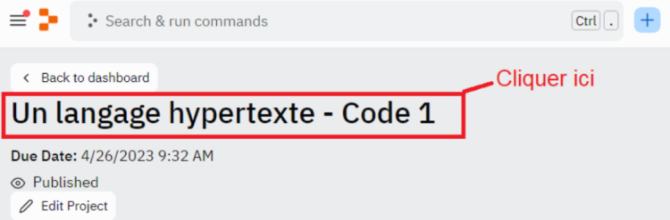

# **Contexto**

---

 

Cuando se habla de desarrollo web, los dos estándares que probablemente vienen a la mente son los famosos HTML y CSS.

Si queremos definir simplemente estos dos lenguajes, podemos decir que HTML es un lenguaje que permite organizar el contenido visual de un sitio web mediante etiquetas, mientras que CSS permite crear y asignar estilos visuales a los elementos HTML.

Estos dos lenguajes informáticos van de la mano. Se les llama lenguajes del lado del cliente.

---

Se distingue el lenguaje del lado del cliente del lenguaje del lado del servidor.

Estos dos términos diferentes identifican el lugar donde se ejecutarán las instrucciones del código.

Un tercer lenguaje del lado del cliente que será objeto de nuestra atención es el lenguaje de programación JavaScript.

---

JavaScript es una tecnología ampliamente utilizada en la web.

La mayoría de las veces, se utiliza para generar animaciones visuales, agregar interactividad, almacenar cookies, entre otras cosas, en sitios web.

Pero también se encuentra en entornos informáticos en el lado del servidor (gestión de servidores, migración de datos, etc.) como Node.js, Apache Couch DB, entre otros.

---

JavaScript es un lenguaje de programación muy ligero y universal.

También permite abordar la programación orientada a objetos.

Es un lenguaje interpretado.

El objetivo de este curso es presentar JavaScript, sus características y su historia.

 

---

---

 
 

---

### **Atención!**

---

 

Para tener acceso al código y  al IDE integrado de esta lección, tenemos que:

1. Conectarnos a nuestra cuenta en **[Repl.it](https://replit.com/)**

2. Unirnos al equipo de CODE STUDI de este tema via este enlace: **[JavaScript STUDI con lecciones del tema](https://replit.com/team/javascript-studi)** 

 

Una vez realizados estos pasos, es recomendable que actualicemos el navegador si no se muestra el código.

 

En caso de problema, reiniciaremos el navegador y verificaremos que hayamos aceptado las cookies de conexión necesarias antes de comenzar el procedimiento.

 

Para acceder al código de nuestro curso, tenemos que hacer clic en el nombre del enlace Repl.it en la ventana.

Por ejemplo :

 

 

---

---

 
 
