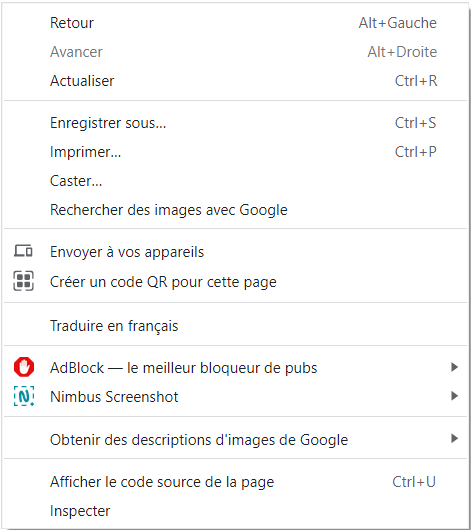
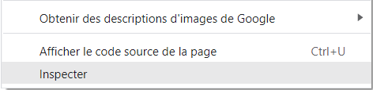

# **Bucle `for`**

<br>

En el marco de este curso, se nos pedirá que utilicemos nuestros ejemplos para comprender de qué se trata y obtener una visualización del código.

<br>

---

**Para hacerlo, debes:**

- Hacer F12 sobre la pagina

    o

- Hacer un click derecho sobre la pagina

    

<br>

- Seleccionar la opción `<<Inspeccionar>>`

    

<br>    

- Ir a `<<consola>>`

    

<br>

Una vez hecho esto, tendrás una vista previa de la información que se supone que debe estar en `console.log()`.

---

---

<br>
<br>

---

## **Primer uso del bucle `for`**

---

<br>

**El bucle for es realmente importante en programación.**

Para simplificar, podemos decir que se puede utilizar en todos los casos en los que, justo antes de la ejecución del bucle, el número de iteraciones `(vueltas de bucle)` está fijo.

En otras palabras, el número de iteraciones no cambiará ni se determinará durante la ejecución de las iteraciones del bucle.

<br>

---

### **Primera manera de como usar el bucle `for`**

---

<br>

**La primera forma de usar el bucle `for` es con esta sintaxis:**

```js

/* después de cada parámetro declarado en los paréntesis de control:

; punto y coma obligatorio! */

for (/* (1) inicialización*/; /* (2) condición*/; /* (3) incrementación*/) {

  //instrucciones;

}
```

---

<br>

**En los paréntesis de control for, vamos a especificar:**

- **(1)Inicialización:** <u>vamos a inicializar una variable de control que servirá como contador para nuestro bucle.</u>

<br>

- **(2)Condición:** <u>vamos a definir la condición que determinará el número de iteraciones, como el control de iteración.</u>

<br>

- **(3)Incremento/decremento/etc:** <u>vamos a definir el incremento de nuestro contador.</u>

<br>

---

**EJEMPLO: Para entender completamente, veamos un ejemplo simple**

```js

/*se suele declarar la letra i, ya que viene de incremento
no es nada de otro mundo en cuanto a saber el por que es i, y no otra cosa,
solo es la variable de control declarada con let que permite
comenzar la iteración dándole un valor de "START" y no la variable "var" para que
actué de local y no global, esta permite entrar en el array que esta
declarado después del operador "in" (esto se vera  mas adelante),
o simplemente darle un comienzo a la iteración*/

for (
  let i = 1; // empezamos a darle START a la iteración
  
  i <= 10; /*nuestra condiciones es que a cada iteración, si "i" es menor o 
            igual a 10 que siga iterando hasta llegar a 10, una vez llegado a 10 
            este parara el contador de control, es decir no subira mas de 10*/ 
  i ++) { /* como?, pues si "i" vale 1 en la primera iteración/vuelta 
          que se le añada 1 demás: i++*/

  console.log (i); /* con solo poner "i" este nos mostrara el valor indice osea 0, 1, 2,
                    depende de cuantos valores haya en el array
                    para que se muestre el valor verdadero y no el indice de su posición
                    console.log(el nombre del array u objeto y [entre corchetes la i]
                    aquí no viene el caso)*/ 

}

for (let i = 1; i <= 10; i ++) {
  
  console.log(i)
}
```

**[Enlace 1 bucles](https://replit.com/@javascript-studi/Les-boucles-Code-1-DumitruSF1)**

---

<br>

**En este ejemplo**, <u>en los parámetros del bucle for:</u>

- `inicializamos el contador i estableciéndolo en el número 1`.

<br>

- `Luego indicamos que el bucle se repetirá mientras i sea menor o igual a 10`.

<br>

- `Finalmente, incrementamos la variable i en cada iteración del bucle`.

<br>

La instrucción a repetir es imprimir en la consola el valor de la variable i.

<br>

---

**Podemos observar que el bucle funciona de la siguiente manera:**

1. El programa verifica si i es menor o igual a 10. En este caso, i es igual a 1. La expresión i <= 10 devuelve true. Se realiza la primera iteración del bucle y la consola muestra i, que es 1.

2. El programa verifica si i es menor o igual a 10. Sin embargo, i ha sido incrementada y ahora es igual a 2. La expresión i <= 10 sigue siendo true. Se realiza la segunda iteración del bucle y la consola muestra i, que es 2.

3. Y así sucesivamente.

---

<br>

Finalmente, **cuando se han realizado 10 iteraciones del bucle**, la `variable` `i` <u>se incrementa y se convierte en 11</u>.

La expresión `i <= 10` **devolverá false**, por que ya habrá llegado a su limite, `siendo en este caso su limite el 10`.

Entonces, el bucle se detiene.

---
<br>

Se puede observar que antes de cada iteración del bucle, se evalúa la condición y el resultado determina si se realizará una nueva iteración o no.

Antes de ver otro ejemplo un poco más complejo, introduzcamos rápidamente el concepto de arreglo (Array conocido mas comúnmente) (tabla conocido en francés).

---

---

<br>

<br>

---

### **Array**

---

<br>

En JavaScript, un "array" es una lista de datos que permite almacenar múltiples elementos en una única variable.

Los elementos pueden ser de cualquier tipo, y no es necesario que estén ordenados de forma específica, y si lo están, pues mejor (el caso de ordenarlos o no, no es obligatorio depende de factores).

Utilizamos corchetes para definir un array y almacenar valores en él.

<br>

---

**EJEMPLO:**

```js
let array = ["valor 1", "valor 2"];
```
---

<br>

<mark>**Cada elemento del array es accesible mediante su índice**</mark>, teniendo en cuenta que `el primer elemento del array tiene un índice de 0`, el segundo tiene un índice de 1, el tercero tiene un índice de 2, y así sucesivamente.

<br>

**👆 Podemos acceder a un elemento de este array de la siguiente manera:**

```js
array[1]; // = "valor 2"
```

---

---

<br>

<br>

---

### **Método un `bucle` con `array`**

---

<br>

**Ahora vamos a tomar otro ejemplo de un bucle `for` interactuando con un `array`:**

---

**Por ejemplo:**

```js
const numero = 10; // (1)

let array = []; // (2)

for (let i = 1; i <= 10; i ++) { // (3)

  let resultado = numero * i; // (4)

  array.push(resultado); // (5)
}
```

---

<br>

**Aquí, el objetivo de nuestro bucle es crear una tabla dentro de un array** y, en particular en nuestro caso, `hacer la tabla de multiplicar de un número`.

<br>

**Comenzamos definiendo la variable "numero = 10" (1)**, `y luego declaramos un array (con corchetes) al que llamamos "array" (2)`.

---
<br>
<br>

<u>Este `"array"` contendrá todos los números de la variable número (1).</u>

<br>

_Dentro del bucle for (3), no cambiamos nada, ya que queremos que el primer valor de "i" sea 1 y haya 10 iteraciones._

<br>

En `cada vuelta del bucle`, `declaramos` y definimos `una variable "resultado"` que almacenará el producto de la multiplicación del número por `"i"` (que será 1, luego 2, luego 3, etc., hasta 10).

<br>

Luego, en cada iteración, agregamos el resultado a nuestro array `"array"`.

Se puede observar que este script funciona correctamente.

De hecho, si imprimimos en la consola el cuarto valor de `"array"` **(con el índice 3), obtendremos:**

<br>

---

**Obtendremos ...**

```js
const numero = 10;

let array = [];

for (let i = 1; i <= 10; i ++) {

  let resultado = numero * i;

  array.push(resultado);

}

console.log(array[3]); // = 40 (10 x 4)
```

---

**[Enlace 2 bucles](https://replit.com/@javascript-studi/Les-boucles-Code-2-DumitruSF1)**

<br>

Por supuesto, podremos utilizar bucles con parámetros e instrucciones completamente diferentes, según sea necesario.

Ahora, veamos otra forma de utilizar el bucle `"for"`.

👇

<br>

---

---

<br>

<br>

---

### **Uso de `for/in` (for in es mas para objetos)**

---

<br>

El sistema `for/in` nos permitirá utilizar la estructura de control for a través de las propiedades de un objeto.

<mark>**(Recalcamos objeto por que esto se suele usar con objetos no con Arrays)**</mark>

---

**EJEMPLO: La sintaxis es la siguiente:**

```js
for (/*variable*/ in /*objeto*/) {

  //instrucciones;

}
```

<br>

El concepto de objeto en programación puede que no te resulte familiar, y eso es normal.

Por ahora, sin entrar en detalles, piensa en un objeto como una entidad, un conjunto de datos que contiene propiedades que lo caracterizan.

---

**Veamos un ejemplo:**

```js
let animation /*(1)*/ = new Animation(); /* (2) Estamos declarando un objeto

su fuera solo let animation seria solo variable pero es let animation  = new Animation()

esto señores ya no es una variable es una estructura objeto, para los

arrays igual, let array = [];*/

for (let i in animation) { // (3)

  console.log(i); // (4)

}
```

---

<br>

**[Enlace 3 bucles](https://replit.com/@javascript-studi/Les-boucles-Code-3-DumitruSF1)**

<br>

**Aquí estamos creando un objeto llamado "animation"** (es el nombre de la variable (1)).

y es del tipo

`"Animación"` (2).

👆
**Este objeto tiene muchas propiedades y**, `con el bucle "for/in"` (3), <u>podemos recorrer cada una de estas propiedades para mostrar sus nombres uno por uno (no sus valores)</u>.

<br>

En los parámetros (3), declaramos la variable `"i"` que representará en cada iteración una propiedad en el objeto "animación".

Podemos ver que la consola muestra el nombre de todas las propiedades del objeto.

Sin embargo, este concepto puede ser un poco confuso.

<br>

---

**Veamos cómo se comporta al recorrer un arreglo con este mismo método:**

```js
let array = ["Apple", "HP", "Acer"];

for (let i in array) {

  console.log(i);

}
```

---

<br>

**[Enlace 4 bucles](https://replit.com/@javascript-studi/Les-boucles-Code-4-DumitruSF1)**

<br>

Podemos ver que la consola muestra 0, 1, 2.

¿Por qué?

Pues por que `for in` nos devolverá siempre el INDICE, de ahi que viene el in de `for in`.

El indice siempre es en 0. 

Y simplemente porque la variable array tiene 3 propiedades correspondientes a los índices de los elementos que lo componen.

Con lo cual, el primero es 0 y no 1, y asi contando.

<br>

---

**En este sentido, podría ser interesante utilizar este sistema para mostrar los valores de los elementos de nuestro array de la siguiente manera:**

```js
let array = ["Apple", "HP", "Acer"];

for (let i in array) {

  console.log(array[i]);

}
```

👆 **ESTO:**

<br>

Vendría a ser esto👇

---

**Equivalente en `of`**

```js
let array = ["Apple", "HP", "Acer"];

for (let i of array) {

  console.log(i);

}
```

<br>

- Con `in` navegamos el indice de los valores del array (decimos array por dar un ejemplo),
  o también la propiedad en una tabla objeto y no el valor para el valor pondríamos
  el nombre del objeto y  entre corchetes la iteración `objet[i]`

- Con `of` navegamos los valores de lo que contiene la lista/tabla array,
for...of va mas para iterar sobre estructuras iterables como arreglos o cadenas de texto.

<br>

---

<br>

**[Enlace 5 bucles](https://replit.com/@javascript-studi/Les-boucles-Code-5-DumitruSF1)**

<br>

En efecto, esto funciona, la consola muestra cada valor del arreglo/array.

Sin embargo, no se recomienda hacerlo de esta manera para recuperar los valores de un arreglo.

¿Por qué?

Simplemente porque el `in` permite recorrer las propiedades del arreglo.

Si agregamos propiedades adicionales a nuestro arreglo (que no necesariamente son elementos del arreglo), entonces el bucle for también las recorrerá, lo cual puede generar problemas (ya que tendremos tanto los elementos del arreglo como las otras propiedades).

En este sentido, cuando queremos recorrer un arreglo, es importante utilizar el sistema for/of.

<br>

---

---

<br>

<br>

---

#### **Resumen: `for/in`**

---

**Código:**

```js
let array = ["Apple", "HP", "Acer"]; // (1)

for (let i in /*(3)*/ array) { // (2)
  console.log(array[i]);
}

```

---

<br>

- **(1)La línea `let array = ["Apple", "HP", "Acer"]`;** `declara` una variable llamada array y asigna `un` arreglo (o `array` /tabla) con tres elementos a esta variable.

  En efecto, "array" es un array que contiene los elementos "Apple", "HP" y "Acer".
  
  `Un array es una estructura de datos que permite almacenar múltiples valores en una sola variable`.

<br>  

- <u>**(2)La línea `for (let i in array)`;**</u><b><mark>La linea for establece un bucle for</mark></b> **que recorre las propiedades** <b>`(o índices)`<b> del "array" array.

  `En este caso, la variable de iteración se llama i`, <i><b>pero, el nombre de la variable de iteración es flexible y puede ser cualquier nombre válido.</b></i>

  ` "i" se declara o cualquier otro nombre antes de "in" para que el bucle for funcione sin dar mas instrucciones, simplemente es para que funcione, en otros temas veremos el por que se declara asi y no se inicializa (se inicializa automáticamente declarándose por consiguiente, con el operador in en el objeto o array indicado)`

<br>  

- **(3)El operador `in`;** se utiliza en este contexto para indicar que va a iterar sobre las propiedades de dentro (objeto, o como en este caso un array) del array, en este caso.

  <mark>Cada iteración del bucle asigna el nombre de la propiedad actual</mark> **[Gracias a que damos existencia a <mark>"i"</mark> (o cualquier nombre o letra <mark>antes de _in_</mark>)]** "i" a la variable de iteración y ejecuta el bloque de código dentro del bucle.

  👇

  ES ACONSEJABLE USAR UN NOMBRE COMO "name", si vamos a usar nombre, o dependiendo de lo que tenemos en el array u objeto.
  

  <b>_`Y con in antes del nombre de nuestro objeto o array`_.</b>

<br>

Dentro del bucle, la línea console.log(array[i]); imprime en la consola el valor correspondiente a la propiedad actual del array "array".

**En este caso, "i" representa el índice del "array", y array[i] accede al valor almacenado en esa posición del array.**

En resumen, el bucle for...in se utiliza para iterar sobre las propiedades de un objeto (en este caso, los índices del array) y permite acceder a los valores asociados a esas propiedades.

<br>

---

`FOR IN`, sirve mas que nada y comparado a otro que veremos, sacar los indices en vez de la propiedad en si.
---

---
<br>

---

Con "array" (o el nombre dado al objeto o al array),[i], "array[i]", se puede sacar la lista o las propiedades de la lista en vez del indice.
---

<br>

---

Pero para eso veremos for of que es mejor usarlo para esos casos.
---

---

---

<br>

<br>

---

### **Uso de `for/of` (es mas para todo aquellos que sea iterable, que se pueda partir en varios trozos)**

---

<br>

El bucle `for/of` <u>permite recorrer un objeto iterable</u> y **obtener sus valores**.

Esto es válido, por ejemplo, para los arrays.

<br>

---

**Si retomamos nuestro ejemplo anterior y queremos mostrar cada elemento del array en la consola, simplemente podemos hacer lo siguiente:**

```js
let array = ["Apple", "HP", "Acer"];

for (let i of array) {

  console.log(i);

}
```

---

<br>

**[Enlace 6 bucles](https://replit.com/@javascript-studi/Les-boucles-Code-6-DumitruSF1)**

<br>

Esto funciona porque en cada iteración del bucle, 'i' toma el valor de un elemento del array, y el bucle recorre todos los elementos del array.

Con el bucle for/of, podemos recuperar rápidamente los valores de un array.

---

**Método/Ejemplo: Modifiquemos esto para que nuestro programa permita concatenar en una cadena de caracteres los valores de los diferentes elementos del array:**

<br>

```js
let array = ["Apple", "HP", "Acer"]; // (1)

let marcas = ""; // (2)

for (let i /*(4)*/ of array) { // (3)

  marcas += i + ", "; // (5)

}

console.log (marcas); // (6)
```

---

<br>

**[Enlace 7 bucles](https://replit.com/@javascript-studi/Les-boucles-Code-7-DumitruSF1)**

<br>

**Que hace esta linea?:**

```
En cada iteración del bucle (3)

se toma un elemento del array (1) gracias a "i" (4)

y en la nueva asignación de la variable marca (5), "i" (4) se concatena con la variable marcas (2)

seguido de una coma y un espacio (5) en las instrucciones de dentro de `for`.

De esta manera, se van acumulando los elementos del array en la cadena marcas.

Al finalizar el bucle, la variable marcas contendrá todos los elementos del array concatenados, separados por comas y espacios.
```

<br>

---

**EJEMPLO: ESPECIAL ATENCIÓN: (5)**

```js
marcas += i + ", "; // (5)

/*
Significa que le asignaremos una nueva variable que valdrá, lo siguiente:

a marcas se le concatenaran las siguientes y se le quedara asignado lo siguiente: i (que sera lo que se obtiene del array + mas ", " mas una coma y espacio para que se de un aire entre string y string con coma claro) 
*/

```

<br>

**Podemos ver que la consola muestra:** Apple, HP, Acer.

En cada iteración del bucle, el programa agrega al final de la cadena de caracteres "array" el valor de "i", que contiene el valor de un elemento del arreglo.

Se recorren todos los elementos del arreglo.

---

---

<br>

<br>

---

## **Ayuda explicación**

---

<br>

---

**El primer código:**

```javascript
let ordenador = new Object();

ordenador.ram = 256;
ordenador.stockage = 512;

for (let i in ordenador) {
  console.log (i + " = " + ordenador[i]);
}
```

---

<br>

El primer uso: utiliza el bucle `for...in`, que itera sobre las propiedades enumerables de un `objeto`.

En cada iteración, `i` representa el nombre de la propiedad (no el valor dado) y `ordenador[i]` accede al valor de esa propiedad.

Por lo tanto, el código mostrará el nombre de la propiedad y su valor.

<br>
<br>
<br>

---

**En cambio, el segundo código:**

```javascript
for (let i of ordenador) {
  console.log (i + " = " + i);
}
```

---

<br>

**utiliza el bucle `for...of`, que se utiliza para iterar sobre elementos de una colección que son iterables, como arreglos/Arrays!.**

Sin embargo, `ordenador` no es un iterable en este caso, ya que es un objeto y no un arreglo.

Por lo tanto, el segundo código generaría un error diciendo que `ordenador` no es iterable. No se podrían recorrer las propiedades del objeto de esa manera.

En resumen, la forma correcta de recorrer las propiedades de un objeto en JavaScript es utilizando el bucle `for...in`, como se muestra en el primer código que proporcionaste.
```

Espero que esto te sea útil en el formato Markdown. Si tienes alguna otra pregunta, ¡estaré encantado de ayudarte!

---
---