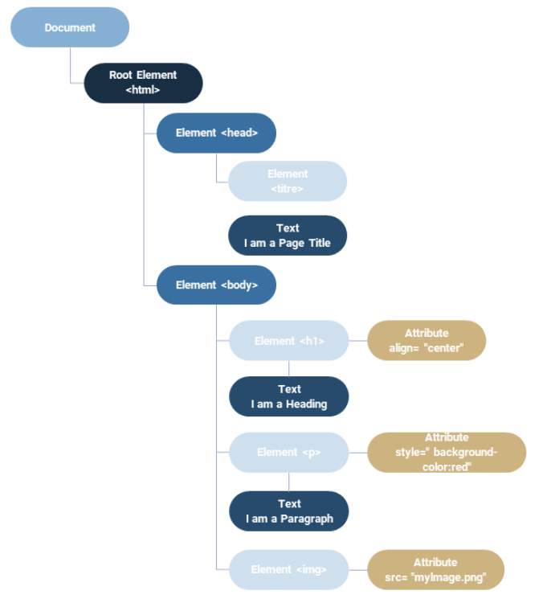

# **DOM, HTML, & XML**

<br>
<br>

---

## **Introducción al DOM**

---

<br>

---

### **La estructura del código de una página web**

---

<br>

Cuando **un navegador** muestra una página web, **interpreta el código que se le proporciona.**

Así, **interpreta el contenido con el código `HTML`, interpreta el diseño con `CSS`, y permite la gestión de contenido dinámico con `PHP` y `JavaScript`.**

**El usuario sólo debe ver frente a él una interfaz funcional.**

<br>

---

<br>

**Al crear su página web, `trabajará en primer lugar con archivos HTML y CSS` para establecer toda la presentación de la misma.**

Tendrá que utilizar las diferentes etiquetas HTML o XML de forma adecuada.

Dependiendo de la etiqueta en la que se coloque el contenido, éste será visible o no por el usuario.

**Por ejemplo, el contenido escrito en la etiqueta `<head>` sólo servirá para dar información sobre el documento que está escribiendo.**

**El contenido también `puede hacerse invisible` de otra forma, con un atributo `hidden` por ejemplo.**

<br>

---

<br>

**En nuestro caso, el `DOM (Document Object Model)` es lo que se llama una `"interfaz de programación" (API)` creada para el `HTML` y el `XML`.**

---

---

<br>

<br>

---

### **`HTML`**

---

<br>

**El `HTML` es un lenguaje de marcado** (también llamado mark up language, es decir, un lenguaje que permite estructurar o dar formato a los datos utilizando etiquetas) **que requiere el uso de paréntesis angulares (`< >`).**

**No es un lenguaje dinámico.**

```
De hecho, a diferencia de PHP o JavaScript que nos permiten utilizar bucles o condiciones, el HTML simplemente permite mostrar contenido como imágenes, texto, enlaces, etc., mediante etiquetas específicas.
```

<br>

---

<br>

El `HTML` es una serie de etiquetas abiertas y cerradas.

Cada etiqueta abierta ( `< ... >` ) se empareja con una etiqueta cerrada ( `</ ... >` ) que establece el límite del contenido.

---

<br>

---

#### **Ejemplo: Recordatorio sobre las etiquetas en HTML**

---

<br>

```html
<section></section>
```

<br>

---

**Ejemplo: Cada etiqueta puede contener uno o más elementos, también etiquetados.**

```html
<section>
  <div></div>
</section>
```

<br>

---

**Una etiqueta abierta puede incluir uno o más atributos (por ejemplo, `class` o `id`) que asociarán información, enlaces, especificaciones al contenido del marcado.**

```html
<section class="comment">
  <div class="name"></div>
  <div id="important"></div>
</section>
```

Y es el lenguaje JavaScript o el css los que van a dinamizar, embellecer o animar los elementos html mostrados.

<br>

---

**Ejemplo:**

- **Tomemos el ejemplo de una sección que contiene 2 `div` (EL TERMINO `div` ES LA ABREVIATURA DE DIVISION).**

- **El primer `div` contiene un texto, el segundo una imagen.**

- **El código `HTML` se compondrá entonces de esta manera**

```html
<section>
  <div><p>Un texto que acompaña a la imagen</p></div>
  <div></div>
</section>
```

---

---

<br>

<br>

---

### **El `DOM`**

---

<br>

En informática, **el DOM** `(Document Object Model)` **es una** interfaz de programación **`(API)`** que **permite representar un documento `HTML` o `XML` en forma de un árbol binario, o árbol de nodos.**

**Cada nodo representa un elemento del documento, ya sea:** 

- una `etiqueta`

- un `atributo`

- un `texto`

- `etc`

---

<br>

**El DOM permite** a los programadores **manipular elementos de un documento utilizando lenguajes** de programación **como JavaScript** por ejemplo.

Cuando se realizan modificaciones en el DOM, éstas se retransmiten automáticamente al documento HTML o XML.

Así, el DOM permite crear páginas web dinámicas e interactivas.

---

---

<br>

<br>

---

### **La relación entre el `HTML` y el `DOM`**

---

<br>

**El `DOM` (Document Object Model)** en JavaScript **sirve para:**

- **proporcionar una interfaz de programación (API) para interactuar con los elementos de una página `HTML`, tales como:**

    - los elementos de `formulario`

    - las `imágenes`

    - los `enlaces`

        y

    - los `contenedores` de texto

    ---

<br>

- **lo que permite a los desarrolladores:** 

    - modificar la estructura

    - el contenido en respuesta a las interacciones del usuario u otros eventos
    
      y
        
    - el estilo de una página web dinámicamente

---

<br>

**Gracias al `DOM`, es posible crear páginas web más interactivas y reactivas al permitir la modificación de la página en tiempo real sin recargarla.**

**Además, el `DOM` permite crear animaciones y efectos visuales en la página, lo que puede mejorar la experiencia del usuario.**

<br>

---

<br>

**El `DOM` se puede utilizar para diversas tareas, tales como:**

- la **validación** de formularios

- la **adición** o **eliminación** de elementos `HTML`

- la **modificación** de texto y atributos

- el **posicionamiento** y el **dimensionamiento** de elementos en la página

- así como la **gestión de** los **eventos** del ratón y del teclado.

---

<br>

**Además, el `DOM` es utilizado por muchas bibliotecas y frameworks JavaScript populares, tales como:** 

- jQuery

- React

- Vue.js

    y
    
- Angular

<br>

**para crear aplicaciones web más complejas y avanzadas.**

---

---

<br>

<br>

---

### **`XML`**

---

<br>

**El `XML` es la extensión del formato de marcado `HTML`, utilizando el mismo principio de etiquetas abiertas y cerradas, pero donde los nombres de las etiquetas escritas en el código son más libres.**

<br>

---

**Ejemplo:**

```xml
<especies>
  <animales>
    <gato>felix</gato>
    <perro>médor</perro>
  </animales>
  <vegetales>
    <arbol>chêne</arbol>
    <flor>paquerette</flor>
  </vegetales>
</especies>
```

---

---

<br>

<br>

---

### **`JSON`**

---

<br>

**Un formato apareció en los años 2000:** el formato **JSON**

---

<br>

- **más fácil de leer**

- **de elaborar**

- **más rápido de analizar para un ordenador**

- **gestiona algunos tipos de datos que `XML` NO GESTIONA, por ejemplo:**

    - **los datos numéricos**
    
      o
      
    - **los valores booleanos**
    
<br>

---

Su **sintaxis** es además **muy cercana al `XML` y** el lenguaje en sí mismo **es compatible con el lenguaje JavaScript.**

**Ejemplo:**

```json
"'espece": {
  "animale": { "chat": "felix", "chien": "'médor" },
  "'vegetale": { "arbre": "chêne", "fleur": "pâquerette" }
}
```

---

---

<br>

<br>

---

### **Origen del `DOM`**

---

<br>

**Desde un punto de vista técnico:**

- **el `DOM` es una `API` (interfaz de programación)** que **permite la visualización y la traducción de los elementos que componen la página web y su contenido**, incluido hoy en día en todos los navegadores.

Se trata de una estandarización y una optimización que se han hecho progresivamente, a partir de mediados de los años 1990, con el auge de las nuevas tecnologías de internet y el desarrollo de los lenguajes asociados.

Antiguamente, `ECMAScript`, hoy conocido bajo la denominación de JavaScript, formaba parte de este auge.

<br>

---

<br>

**A partir de mediados de los años 2000, una gran parte de los `DOM` desplegados eran compatibles con una norma estándar definida por el W3C** (World Wide Web Consortium), **un organismo** central **creado** a finales de los años 90 **para**, precisamente, **estandarizar y compatibilizar los diferentes navegadores y las tecnologías asociadas a los navegadores.**

**Estas evoluciones y estandarizaciones se han llevado hasta hace poco con un `DOM` llamado `"level 4"` (nivel 4) que data de 2015.**

Por otra parte, **este DOM es una `API` siempre en curso de mejora.**

<br>

---

<br>

El DOM tiene una historia bastante larga y tumultuosa.

Las diferentes sociedades `Mozaic`, `Netscape`, `Microsoft`, estaban en competencia en los años `1990` buscando cada una elaborar el navegador más eficaz.

Hablamos de la guerra de navegadores.

Cada sociedad desarrollando sus propios estándares, el problema de la incompatibilidad entre los diferentes navegadores se planteó muy rápidamente.

A principios de los años 2000, es Microsoft con su Internet Explorer (IE) quien domina el mercado.

Hoy en día, el mercado es mucho más competitivo, con Google y su navegador Chrome, Mozilla con Firefox, Microsoft siempre presente con su Internet Explorer convertido en Edge y Apple con Safari.

<br>

---

<br>

Hoy en día, el Web Browser es un producto normalizado, estandarizado por el W3C, con un DOM y unas herramientas ampliamente compatibles entre sí.

---

---

<br>

<br>

---

### **Definición El `DOM tree`**

---

<br>

Un DOM (Document Object Model) es una representación jerárquica de una página web o de un documento XML.

El DOM tree (o árbol DOM) es un árbol de nodos que representa la estructura de un documento HTML o XML.

Cada elemento HTML está representado por un nodo en el árbol DOM, que contiene información como el nombre del elemento, los atributos y el contenido.

Los nodos de texto, los comentarios y las instrucciones de procesamiento también están representados en el árbol DOM.

<br>

---

<br>

El DOM tree permite a los desarrolladores web manipular dinámicamente el contenido y la estructura de una página web utilizando lenguajes de programación como JavaScript.

Por ejemplo, se puede utilizar para añadir, eliminar o modificar elementos HTML, cambiar los atributos de un elemento, o responder a eventos del usuario como clics o pulsaciones de teclas.

<br>

---

**El DOM tree se compone de varios tipos de nodos, incluyendo:**

- **Nodos de elementos:**

    - Representan elementos HTML como `<div>`, `<span>`, `<a>`, etc.

    ---

    <br>

- **Nodos de texto:**

    - Representan el contenido textual de un elemento.

    ---

    <br>

- **Nodos de atributo:**

    - Representan los atributos de un elemento, como:
    
      - `class`
      
      - `id`
      
      - `src`
      
      - etc.

    ---

    <br>

- **Nodos de comentario:**

    - Representan los comentarios en el código `HTML`

    ---

    <br>
    
- **Nodos de documento:**

    - Representan todo el documento HTML.

    ---

<br>     

Cada nodo en el DOM tree tiene una relación con otros nodos.

Por ejemplo, un nodo puede ser el padre, el hijo o el hermano de otro nodo.

Estas relaciones permiten a los desarrolladores navegar y manipular el `DOM tree` de manera eficiente.

---

---

<br>

<br>

---

### **Los tipos de `nodos`**

---

<br>

En programación web, **existen varios tipos de nodos (o nodes)** **en el `DOM`** (Document Object Model).

**Vamos a ver los principales tipos de nodos con un ejemplo para cada uno de ellos.**

<br>

---

#### **Elemento (Element node)**

---

<br>

Este tipo de nodo **es el más común en el `DOM`**, representando un elemento HTML.

<br>

---

**Por ejemplo: un elemento div es representado por un nodo de tipo "Element".**

```html
<div id="example">Esto es un ejemplo</div>
```

<br>

---

#### **Atributo (attribute node)**

---

<br>

**Un atributo:**

- **"permite dar información adicional sobre un elemento" HTML.**

---

<br>

Por ejemplo, una etiqueta `` puede tener un atributo `"alt"` que permite dar una descripción para los usuarios que no pueden ver la imagen.

En el `DOM`, los atributos permiten al programador manipular los objetos `HTML` usando lenguajes de programación como JavaScript.

---

<br>

**Se pueden usar métodos como:**

- `"getAttribute"` para leer el valor de un atributo

- `"setAttribute"` para modificar el valor de un atributo

    o 

- `"removeAttribute"` para eliminar un atributo

<br>

---

**Ejemplo html:**

```html

```

---

<br>

**Ejemplo JavaScript:**

```javascript
// Acceder al elemento img
let img = document.getElementsByTagName("img")[0];

// Leer el valor del atributo alt
let altValor = img.getAttribute("alt");
```

<br>

---

#### **Texto (text node)**

---

<br>

Un nodo "texto" corresponde simplemente al texto contenido en una etiqueta.

De la misma forma que para los atributos, un texto se puede modificar usando el `DOM`.

<br>

---

**Ejemplo html:**

```html
<p>Este es un texto corto</p>
```

---

<br>

**Ejemplo JavaScript:**

```javascript
// Acceder al elemento p
let p = document.getElementsByTagName("p")[0];

// Acceder al texto del elemento p
let textNode = p.childNodes[0];

// Modificar el texto
textNode.nodeValue = "Este es un texto un poco más largo";
```

<br>

---

#### **Comentario (comment node)**

---

<br>

Un comment node corresponde a un `comentario HTML`, que solo es visible en el código por el programador, y que permite dar información sobre el programa.

<br>

---

**Ejemplo html:**

```html
<!-- Este es un comment node -->
```

<br>

---

#### **Tipo de documento (document type node)**

---

<br>

**El `document type` node es simplemente la etiqueta que especifica el tipo de documento.**

<br>

---

**Ejemplo html:**

```html
<!DOCTYPE html>
```

<br>

---

#### **Documento (document node)**

---

<br>

**El document node representa TODO EL DOCUMENTO `HTML` o `XML`, incluyendo todos:** 

- los elementos

- los atributos

- los "text nodes"

- los "comment nodes"

    y

- otros nodos que lo componen

<br>

**Es el nodo más alto en la jerarquía del `DOM`**

<br>

---

**Ejemplo html:**

```html
<!DOCTYPE html>
<html>
  <head>
    <title>Este es mi document node</title>
  </head>
  <body>
    <h1>Título de la página</h1>
    <p>Este es un texto</p>
  </body>
</html>
```

---

---

<br>

<br>

---

## **Estructura de un documento**

---

<br>

El DOM está estructurado como un árbol y, si lo comparamos con un árbol genealógico, el "document" es el padre de todos los elementos y de todos los nodos hijos que a su vez contienen elementos y nodos que son sus hijos y de los que son padres.

<br>



<br>

Todos los elementos tienen un nodo padre, excepto el nodo contenedor, es decir, el "document", el "document" no tiene padre.

Éste es el elemento raíz, es padre de todos los demás.

Del mismo modo, todos los nodos o elementos pueden tener cero, uno o varios nodos hijos.

Los elementos que se encuentran en el mismo nivel jerárquico se denominan elementos hermanos `(sibling)`.

<br>

---

### **Creación de nuestro documento**

---

<br>

**Vamos a crear nuestro primer documento siguiendo estos pasos:**

- Empezamos por elegir el tipo de documento.

    - Por convención, queremos que una página web sea establecida como un documento `DOCTYPE`.
    
    - **El encabezado del documento será entonces éste:**
    
      - `<!DOCTYPE html>`.

    ---

    <br>

- A continuación, podemos añadir las etiquetas `html`, que nos permiten especificar la naturaleza del documento.

- Luego viene una parte `<head>` (cabeza del documento) que permitirá dar información sobre el documento, invisibles para el usuario, al navegador o al motor de búsqueda.

- Por último, la etiqueta body, que corresponde al contenido de nuestra página.

<br>

---

**Ejemplo html:**

```html
<!DOCTYPE html>
<html lang="en">
<head>
  <meta charset="UTF-8" />
  <title>Hello World!</title>
</head>
<body></body>
</html>
```

---
---
