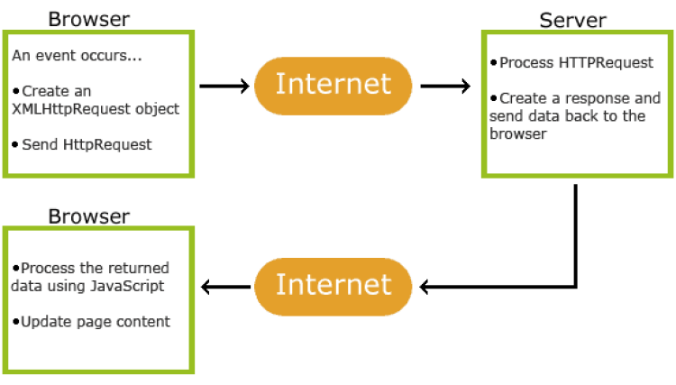

# El formato JSON y AJAX

## AJAX

AJAX significa **A**synchronous **J**avascript **A**nd **X**ML. No se trata de un lenguaje de programación. Es una combinación de peticiones (request) integradas en el navegador y de JavaScript y HTML DOM para mostrar o utilizar los datos.

El acrónimo puede inducir a confusión. A pesar de su nombre, AJAX puede transportar datos XML, pero también otros formatos de texto como JSON o txt.



Fuente: [w3schools](https://www.w3schools.com/)

## ¿Cómo funciona AJAX?

Para responder a esta pregunta, aquí hay un esquema.

1. Un evento ocurre en el navegador, se crea y se envía una petición HTTP al servidor.
2. El servidor procesa la petición HTTP, genera una respuesta y envía los datos de vuelta al navegador.
3. Los datos enviados por el servidor son leídos por JavaScript y se actualiza la página.

## XMLHttp

La piedra angular de AJAX es el objeto XMLHttpRequest. Todos los navegadores modernos lo soportan. Se puede utilizar para intercambiar datos con un servidor en segundo plano. Esto significa que es posible actualizar partes de una página web, sin recargar la página.

Además, hay que saber que por razones de seguridad los navegadores no permiten el acceso entre dominios. Esto significa que la página web y el archivo XML, o texto, que intenta cargar deben estar en el mismo servidor. Si quieres cargar los archivos XML, deben estar en tu propio servidor.

También, el objeto XMLHttpRequest puede tener diferentes métodos. Aquí hay una tabla para resumir estos métodos:

| Método | Descripción |
| --- | --- |
| new XMLHttpRequest() | Crea un nuevo objeto XMLHttpRequest |
| abort() | Cancela la petición en curso |
| getAllResponseHeaders() | Devuelve la información de cabecera |
| getResponseHeader() | Devuelve una información específica de cabecera |
| open(method, url, async, user, psw) | Especifica la petición <br> method: la petición de tipo GET o POST <br> url: la ubicación del archivo <br> async: true(asíncrono) o false(síncrono) <br> user: nombre de usuario opcional <br> psw: contraseña opcional |
| send() | Envía la petición al servidor <br> Utilizado para las peticiones GET |
| send(string) | Envía la petición al servidor <br> Utilizado para las peticiones POST |
| setRequestHeader() | Añade una etiqueta/valor a la cabecera a enviar |

El objeto XMLHttpRequest también tiene diferentes propiedades. Aquí hay una tabla para resumirlas:

| Propiedad | Descripción |
| --- | --- |
| onreadystatechange | Define una función a llamar cuando la propiedad readyState cambia |
| readyState | Contiene el estado de XMLHttpRequest <br> 0: petición no inicializada <br> 1: conexión al servidor establecida <br> 2: petición recibida <br> 3: procesamiento en curso <br> 4: petición terminada y la respuesta está lista |
| responseText | Devuelve los datos en forma de cadena |
| responseXML | Devuelve los datos en forma de datos XML |
| status | Devuelve el número de estado de una petición <br> 200: "OK" <br> 403: "Forbidden" <br> 404: "Not Found" <br> Para una lista completa, haz clic en este enlace: [HTTP response status codes](^1^) |
| statusText | Devuelve el texto de estado (por ejemplo "OK" o "Not Found") |

## Enviar una petición al servidor con GET o POST

Para enviar una petición a un servidor, usamos los métodos open() y send() del objeto XMLHttpRequest, usando GET o POST.

Hay que saber que GET es simple y más rápido que POST, y se puede usar en la mayoría de los casos. Sin embargo, hay que usar siempre POST cuando un archivo en caché no es una opción (actualizar un archivo o una base de datos en el servidor), enviar una gran cantidad de datos al servidor (POST no tiene limitación de tamaño), y enviar entradas del usuario (que pueden contener caracteres desconocidos). POST es más robusto y seguro que GET.

## Ejemplo

### Realizar una petición al servidor con POST

En este ejemplo, a partir de los elementos que hemos visto arriba, debes realizar una petición POST con el objeto XMLHttpRequest. En este caso, vas a crear un archivo .txt y lo "consumirás". Los datos del archivo .txt deberán aparecer al hacer clic en un botón. Además, tendrás que hacer que la petición sea asíncrona y añadir la función "onreadystatechange". Para ello, tendrás que referirte a la tabla sobre las propiedades del objeto XMLHttpRequest.

Explicación:

1. Creamos un archivo de texto.

```txt
<p>Salut, je m’appelle Charles, j’ai 34 ans et j’habite Paris.</p>
<p>Aussi, j’apprends AJAX.</p>
```

2. Creamos nuestro archivo HTML con nuestro botón.

```html
<!DOCTYPE html>
<html>
<head>
  <meta charset="utf-8">
  <meta name="viewport" content="width=device-width">
  <title>El formato JSON y AJAX</title>
  <link href="style.css" rel="stylesheet" type="text/css" />
</head>
<body>

  <div id="demo">
    <h1>El objeto XMLHttpRequest</h1>
    <button type="button" onclick="loadDoc()">Ver el texto</button>
  </div>

</body>
</html>
```

3. Luego, creamos nuestro script.

```javascript
<!DOCTYPE html>
<html>
<head>
  <meta charset="utf-8">
  <meta name="viewport" content="width=device-width">
  <title>El formato JSON y AJAX</title>
  <link href="style.css" rel="stylesheet" type="text/css" />
</head>
<body>

  <div id="demo">
    <h1>El objeto XMLHttpRequest</h1>
    <button type="button" onclick="loadDoc()">Ver el texto</button>
  </div>

  <script>
    //Creación de la función
    function loadDoc() {
      var xhttp = new XMLHttpRequest();
      xhttp.onreadystatechange = function() {
        if (this.readyState == 4 && this.status == 200) {
          document.getElementById("demo").innerHTML =
          this.responseText;
        }
      };
      xhttp.open("GET", "demo.txt", true);
      xhttp.send();
    }
  </script>

</body>
</html>
```

4. Aquí está el resultado en el navegador.

Salut, je m’appelle Charles, j’ai 34 ans et j’habite Paris.
Aussi, j’apprends AJAX.

**Atención**

Las peticiones XMLHttpRequest síncronas (async = false) no son recomendadas porque JavaScript se detendrá hasta que la respuesta del servidor esté lista. Si el servidor está ocupado o lento, la aplicación se "congelará". Es por esta razón que esta petición está siendo eliminada de la norma web.

**Atención**

Las versiones de Internet Explorer anteriores a IE 10 no soportan el objeto XMLHttpRequest, que es la base de las peticiones AJAX.

## Respuesta del servidor

En este vídeo, vamos a ver cómo obtener una respuesta del servidor a través de diferentes ejemplos.

## El archivo XML

AJAX puede ser usado de forma interactiva con los archivos XML. Es lo que vamos a ver en este vídeo.

Hemos visto en este vídeo cómo mostrar los datos de un archivo .xml en forma de tabla. Así, las posibilidades para crear aplicaciones interactivas usando XML, HTTP, DOM y JavaScript son amplias.
