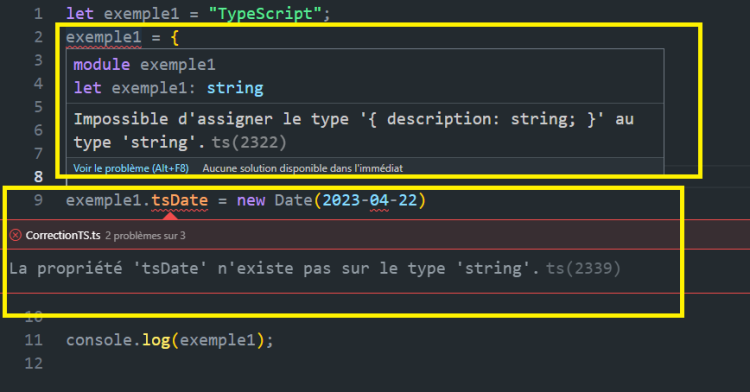

# Historia

## ¿Qué es TypeScript?

TypeScript es un superconjunto de JavaScript, lo que significa que JavaScript es un subconjunto de TypeScript. Para ser más preciso, TypeScript es como JavaScript, pero con tipado adicional. También se puede definir como una versión mejorada de JavaScript.

### Reconocimientos y popularidad

Fue elegido como el segundo lenguaje de programación más querido en la encuesta para desarrolladores de StackOverflow en 2020, y el tercer lenguaje de programación más deseado en 2022.

### Historia y desarrollo de TypeScript

TypeScript fue desarrollado en 2010 por Microsoft para abordar las limitaciones que tenía JavaScript en el desarrollo de proyectos de gran envergadura. Inicialmente, se utilizó para proyectos internos de Microsoft antes de estar disponible a nivel mundial en 2012. Desde entonces, se han lanzado nuevas versiones. TypeScript 0.9 se lanzó en 2013, TypeScript 1.0 se publicó en 2014, TypeScript 2.0 en 2016, TypeScript 3.0 en 2018, la versión 4 salió en febrero de 2021, y la versión más reciente es la versión 5, que se lanzó en marzo de 2023.

### Importancia de aprender TypeScript

Esto es una breve historia para contextualizarte. Ahora vamos a entender la importancia de aprender este lenguaje. ¿Qué tiene de tan especial? ¿No es mejor JavaScript?

## ¿Por qué aprender TypeScript en lugar de JavaScript?

JavaScript es, de lejos, el lenguaje más utilizado según las estadísticas. Tiene una comunidad muy fuerte y ha existido durante muchos años tanto en navegadores como en servidores. Entonces, ¿por qué usar TypeScript?

De hecho, JavaScript tiene muchos méritos, pero también tiene muchas deficiencias, especialmente para el desarrollo de proyectos grandes.

### La necesidad en proyectos grandes

¿Por qué proyectos grandes? Los proyectos grandes requieren más rigor, y ese es el talón de Aquiles de JavaScript. Además, para la cohesión de los equipos que trabajan en el proyecto, documentar el código durante todo el desarrollo no es automático en JavaScript. Además, JavaScript es demasiado permisivo y difícil de depurar. Es importante recordar que JavaScript sigue siendo el lenguaje de programación más comúnmente utilizado para el desarrollo de aplicaciones. Además, es necesario compilar las aplicaciones desarrolladas en TypeScript a JavaScript para poder ejecutarlas, lo que hace que este lenguaje sea indispensable.

### ¿Cómo TypeScript soluciona estos problemas?

TypeScript se considera una versión mejorada de JavaScript, lo cual no es incorrecto, ya que elimina los defectos mencionados anteriormente, mientras mantiene lo mejor de JavaScript.

### Ventajas de TypeScript

Aquí hay una lista no exhaustiva de las ventajas de TypeScript:

- **Compatibilidad perfecta con JavaScript**: basta con cambiar la extensión .ts a .js para tener un archivo JavaScript y viceversa.
- **TypeScript puede ser transpilado a JavaScript**: esto significa que todo lo que JavaScript puede hacer, TypeScript también lo puede hacer.
- **Todas las bibliotecas de JavaScript pueden usarse con TypeScript**.
- **Es posible crear una biblioteca con TypeScript y exportarla para usarla con JavaScript**.
- **TypeScript también puede ser flexible como su homólogo JavaScript**: al agregar tipado dinámico.
- **Capa de seguridad con el tipado**: al igual que Java y C++, TypeScript es un lenguaje fuertemente tipado, lo que lo hace ganar popularidad entre la comunidad Java y C++.
- **TypeScript es un lenguaje multiparadigma**: podemos hacer programación funcional y programación orientada a objetos.

## TypeScript Vs JavaScript: ¿Conocer JavaScript es necesario?

Como se mencionó anteriormente, no es obligatorio conocer JavaScript, sin embargo, tener un conocimiento básico de JavaScript será de gran utilidad. Si observamos el código a continuación, entenderemos por qué.

```ts
// Objeto en TypeScript
let cliente = {
      nombre: "Aubergine",
      tel: 7777777777
};
console.log(cliente.nombre);
```

---

```js
// Objeto en JavaScript
let cliente = {
      nombre: "Aubergine",
      tel: 7777777777
};
console.log(cliente.nombre);
```

En el caso de la declaración de objetos como los de arriba, no hay diferencia entre TypeScript y JavaScript, excepto por el punto y coma. En la declaración de variables, también es idéntico. Vea el ejemplo a continuación:

```ts
// TypeScript (tipado)
let estudiante1 = "Lola";
let calificacion1 = 13;
```

```js
// JavaScript (no tipado)
let estudiante1 = "Lola";
let calificacion1 = 13;
```

### Flexibilidad y Tipado Dinámico en JavaScript

JavaScript es un lenguaje dinámico, lo que significa que es muy flexible en cómo te permite definir y usar variables. En el siguiente ejemplo, hemos declarado dos variables sin asignar un tipo como en TypeScript.

```js
// JavaScript (no tipado)
let estudiante1 = "Lola";
let calificacion1 = 13;
// Reasignar un número a una cadena de texto (String)
estudiante1 = 17;
// Reasignar una cadena de texto a un número
calificacion1 = "Blabla";
console.log(estudiante1); // 17
```

Algunos desarrolladores dirían que esto es una ventaja, pero puede causar mucha confusión. Más específicamente, la naturaleza dinámica de JavaScript nos permite hacer prácticamente cualquier cosa, y por lo tanto, cometer todos los errores posibles e imaginables.

### Problemas de Error y Debugging en JavaScript

Si tomamos otro ejemplo, hay al menos un error por línea de código en el ejemplo a continuación, y los errores solo aparecen después de la ejecución.

```js
// Error de código en JavaScript no detectable
let ejemplo1 = "TypeScript";
ejemplo1 = {
      descripcion: "Awesome TypeScript"
};
ejemplo1.tsDate = new Date(2023-04-22);
console.log(ejemplo1);  // descripcion: 'Awesome TypeScript', tsDate:...
```

Si dejamos este código como está en nuestra aplicación, corre el riesgo de causar muchos problemas sin poder determinar la fuente de los errores. En otras palabras, nuestra aplicación no funcionará, y no tendremos la menor idea del origen del problema. Este tipo de problema puede hacer perder mucho tiempo.

### Ventajas de TypeScript sobre JavaScript

Estamos hablando de JavaScript para entender precisamente las ventajas de TypeScript. TypeScript, por ejemplo, no permitirá este tipo de errores.

Como mostramos en la imagen aqui abajo.



¿Cómo?

De hecho, TypeScript agrega un tipado estático fuerte, lo que lo convierte en un lenguaje fuertemente tipado, a diferencia de JavaScript que es un lenguaje débilmente tipado o no tipado.

Esto le permite verificar el código en el momento de la compilación y no en la ejecución.

## Ventajas y Desventajas: Un Desglose de TypeScript y JavaScript

Para aclarar las ventajas y desventajas de TypeScript y JavaScript, aquí hay una lista de algunos de sus puntos fuertes y limitaciones:

| **Ventajas de TypeScript**                             | **Ventajas de JavaScript**                         |
|--------------------------------------------------------|----------------------------------------------------|
| Detección de errores en compilación                    | No necesita instalación                            |
| Código más mantenible y legible                        | Apto para principiantes                            |
| Soporta Programación Orientada a Objetos (POO)         | Uso tanto en servidor como en cliente              |
| Uso tanto en servidor como en cliente                  | Fácil de usar en el cliente                        |
| Tipado estático y dinámico                             | Ejecución rápida                                   |
| Utiliza bibliotecas de JavaScript                      | Flexibilidad con tipado dinámico                   |
| Depuración más sencilla                                | Sintaxis simple                                    |
| Soporte en IDEs populares                              | Funciona en todos los navegadores                  |
|--------------------------------------------------------|----------------------------------------------------|
| **Desventajas de TypeScript**                          | **Ventajas de JavaScript**                         |
| Requiere instalación                                   | Errores solo detectables tras la ejecución         |
| Necesita transpilación a .js                           | Demasiado permisivo                                |
| Mayor tiempo en la ejecución debido a la compilación   | Más apto para proyectos pequeños                   |
|                                                        | Difícil de depurar                                 |
|                                                        | Complejo para el lado del servidor                 |


## Notas adicionales

Cabe destacar que las desventajas de TypeScript no tienen realmente un impacto en la calidad del código, simplemente tenemos un paso adicional que hacer, que es la compilación.

Sin embargo, si trabajamos en otro entorno de ejecución que no sea Node.js, como Deno o Bun, por ejemplo, ya no necesitamos hacer una compilación para ejecutar nuestro código; estos soportan de forma nativa TypeScript. Más adelante en el curso, veremos en detalle los entornos de ejecución Deno y Node.js.

Además, muchos frameworks frontend están desarrollados con TypeScript, como Angular, Vue, Nest, etc. También hemos visto surgir varios entornos de ejecución que soportan nativamente TypeScript, como Bun, Deno, etc.