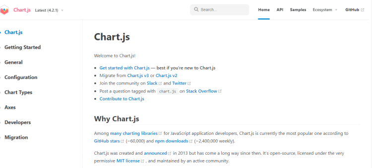
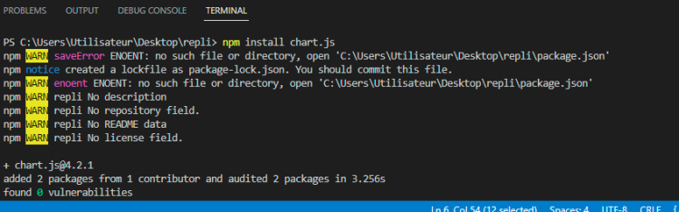
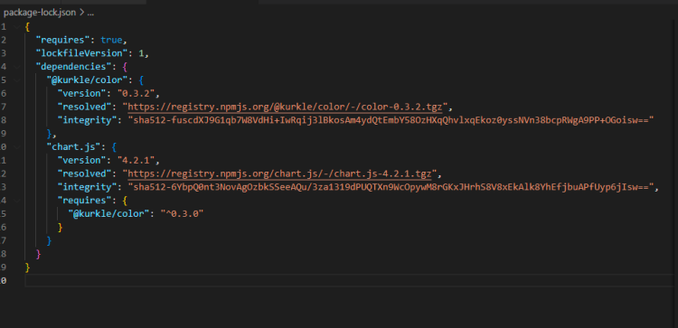
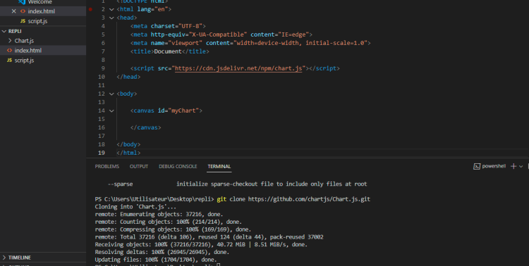

# Presentación de Chart.js
En el entorno de Javascript, Chart.js y Plotly.js son bibliotecas muy populares que tienen como objetivo facilitar la implementación de gráficos. Estos gráficos pueden renderizarse tanto en el front-end como en el back-end.

### Elección de la Biblioteca
Regularmente, tendrás que hacer una elección sobre qué bibliotecas vas a utilizar. Estas elecciones te llevarán a considerar varios aspectos como:

- El alcance de la biblioteca
- El tamaño de la biblioteca y la mantenibilidad de tu código

### Criterios de Elección
La elección de una biblioteca se realiza en base a criterios específicos, como:

- Su popularidad
- La fecha de su última actualización
- El número de descargas
- La compatibilidad de la biblioteca en el entorno

Según estos criterios precisos y objetivos, dos grandes bibliotecas se destacan: Chart.js y Plotly.js. Conocer al menos una de estas bibliotecas puede ser necesario en diversas situaciones. Este curso presentará Chart.js.

## ¿Por Qué Usarla?
A lo largo de tu carrera te enfrentarás a la necesidad de enriquecer tus páginas web con gráficos y elementos dinámicos. Es el momento de entender el funcionamiento y las ventajas de una biblioteca como Chart.js, que te permitirá renderizar tus gráficos ahorrándote horas de código y optimizando tu tiempo de producción. Se detallará más sobre este tema más adelante.

## Entorno de Chart.js
Chart.js es una biblioteca de Javascript compatible con todos los frameworks modernos como React, Vue, Svelte, etc. También, en el entorno de Chart.js, encontrarás elementos HTML con la etiqueta `<canvas></canvas>`. Profundizaremos en la etiqueta Canvas más adelante.

### Consulta de Documentación
Antes de proceder con la instalación de la biblioteca, es importante que estés familiarizado con la navegación en su documentación para profundizar y continuar con el aprendizaje de esta biblioteca. Puedes encontrar la documentación en [chartjs.org](https://www.chartjs.org/).

### Navegación en la Documentación
A la izquierda de tu pantalla, verás una columna con un número de pestañas. Para esta introducción, nos centraremos en las siguientes:

- Getting Started
- Configuration
- Charts Types

La pestaña "Getting Started" te permitirá iniciar tu proyecto y encontrar los CDN y otros elementos necesarios para la instalación. La pestaña "Configuration" será más importante ya que contiene todas las opciones que necesitarás, como la visualización del nombre del gráfico. Finalmente, la última pestaña te mostrará todos los tipos de gráficos posibles.

### Atención a la Versión
Se debe prestar especial atención a la versión que estás a punto de descargar. Al revisar la documentación, notarás que hay un menú desplegable que muestra la última versión y también las versiones anteriores.

### Fuente



```
Página principal del sitio Chart.js.
```
  
Fuente: [chartjs.org](https://www.chartjs.org/)

## Opciones de Instalación de Chart.js
Es posible instalar Chart.js de diferentes maneras. En los siguientes capítulos verás cómo llevar a cabo esta instalación.

### Uso de NPM en la Vida Cotidiana del Desarrollador
Primero, comencemos con lo que es el pan de cada día para los desarrolladores de Javascript: NPM. Como habrás aprendido, NPM es el gestor de paquetes para Javascript.

### Preparación del Archivo HTML
Para comenzar la instalación, es necesario crear nuestro primer archivo HTML. Para ello, debes abrir tu IDE y crear un archivo HTML.

```html
<!DOCTYPE html>
<html>
<head>
<title>Chart Js Project</title>
</head>
<body>
The content of the document......
</body>
</html>
```

### Verificación de Node.js antes de la Instalación
En la siguiente parte, vamos a proceder a la instalación concreta de la biblioteca a través de NPM, pero será necesario asegurarse de que Node.js esté bien instalado. Para ello, deberás abrir tu línea de comandos y escribir `node -v`.

### Confirmación de la Versión de Node.js
Normalmente, esto debería mostrarte la versión de Node.js instalada en tu ordenador.

## Instalación de Chart.js usando NPM
Una vez completada esta etapa, es ahora imprescindible abrir tu terminal y escribir el siguiente comando:

```bash
npm install chart.js
```

### Confirmación de la Instalación Exitosa
Deberías obtener, si todo ha ido bien, el siguiente resultado visual:



### Detalles de la Instalación Exitosa
Como puedes ver en la imagen anterior, Chart.js ha sido instalado y se han instalado correctamente 2 paquetes. También notarás que en la estructura de tu carpeta, ahora existe un archivo `node`.

## Generación de Archivo JSON Post-Instalación

Esta instalación ha generado un archivo JSON en la estructura de tu carpeta. Si lo abres, encontrarás lo siguiente:



## Instalación de Chart.js mediante CDN
Esta forma de instalación es muy sencilla, ya que simplemente consiste en copiar y pegar enlaces que se encuentran en las bibliotecas correspondientes. Estos enlaces deben copiarse entre las etiquetas `<head> </head>` y al final de la página antes de cerrar la etiqueta `<body>`. Para obtener el enlace, es crucial consultar la documentación y abrir la pestaña "Getting Started".

En cuanto a las ventajas de este método, destaca la simplicidad de la instalación, que se reduce a un simple copiar y pegar del enlace. El principal inconveniente es que si cambia la dirección del enlace, tu aplicación dejará de funcionar. Esto puede ser particularmente problemático.

## Método de Instalación a través de GitHub
El beneficio de esta forma de instalación es la seguridad que proporciona en comparación con un simple CDN. Dado que la librería se almacena en tu aplicación, no hay riesgo de que se mueva y afecte directamente la presentación de tus gráficos. Para llevar a cabo la instalación a través de GitHub, no es necesario tener una cuenta de GitHub, aunque, por supuesto, el manejo de una herramienta de control de versiones es un requisito para cualquier futuro desarrollador. Para descargar el código, dirígete al enlace que se encuentra en la documentación. Para realizar este procedimiento, abre un terminal como se muestra en la imagen a continuación. La instalación a través de GitHub se realiza utilizando el comando: `git clone`.



## Complemento: sobre la Descarga desde GitHub
Es importante tener en cuenta que cuando Chart.js se descarga directamente desde el repositorio de GitHub, este ya no contiene todas las dependencias. Por lo tanto, es necesario agregar un script autónomo, en este caso, se trata de `pnpm`.

### Instalación de Dependencias con pnpm
Para hacer esto, es necesario abrir un terminal y escribir el siguiente comando:

```bash
iwr https://get.pnpm.io/install.ps1 -useb | iex
```

Este comando te permitirá instalar Chart.js e instalará todas las dependencias necesarias para el correcto funcionamiento de la librería.

🤖🤖

## Preparación para Graficar con Chart.js
Cualquier gráfico realizado con Chart.js comenzará con ciertas necesidades y nos impondrá un cierto formalismo. Primero, necesitaremos insertar un `div` en nuestro archivo HTML que contendrá un ID, que podrás nombrar como desees. Para continuar con este curso y facilitar el seguimiento, el ID se identificará como "myChart", aunque no hay ninguna obligación de mantener ese nombre para el ID.

```html
<body>
<canvas id="myChart" width="400" height="400"></canvas>
</body>
```

### La Importancia de la Etiqueta Canvas
Como puedes ver, el inicio del gráfico se realiza mediante la implementación de una etiqueta `<canvas> </canvas>`. Esta es una etiqueta que se abre y se cierra, dedicada al entorno de los gráficos. Por sí sola, esta etiqueta es una imagen y no proporciona ninguna ayuda para la accesibilidad. Por lo tanto, es necesario no depender únicamente de esta etiqueta para satisfacer las necesidades de accesibilidad. El elemento `canvas` es un nuevo elemento HTML que generalmente se asocia con scripts en Javascript. Permite a los desarrolladores front-end crear gráficos y resulta más rápido en la carga.

## Complemento: Incorporación de JavaScript en nuestro archivo HTML
Para simplificar el proceso y la comprensión, vamos a implementar Chart.js utilizando un enlace CDN.

```html
<script src="https://cdn.jsdelivr.net/npm/chart.js"></script>
```

El enlace CDN debe colocarse entre las etiquetas `<head></head>`. Es el mismo procedimiento que se usaría al incorporar el enlace de Bootstrap. Una vez copiado el enlace, es necesario implementar nuestro código JavaScript. Para simplificar este tutorial, utilizaremos la etiqueta `script` directamente en nuestro archivo HTML. Sin embargo, habría sido igualmente posible incorporar nuestro JavaScript creando un archivo dedicado llamado `script.js`. En nuestro archivo JS, se mostrará el código que nos permitirá llevar a cabo la acción.

### Detalles del Código JavaScript

```javascript
let ctx = document.querySelector("#myChart");
new Chart(ctx, {
  type: "pie",
  data: {
      labels: ['Paris', 'New-York', 'Madrid', 'Moscou', 'Berlin', 'Auckland'],
      datasets: [{
        label: 'Nombre d’habitants',
        data: [12, 19, 7, 5, 2, 3],
        backgroundColor: ['red', 'blue', 'yellow', 'green', 'purple', 'orange']
    }]
  },
  options: {
      plugins: {
         title: {
          display: true,
          text: 'Mon premier graphique avec Chart Js'
       },
      },
      legend: {
          position: 'bottom'
      }
  }
});
```

### Interpretación del Código

Un análisis de nuestro código nos dará las claves para entender lo que acabamos de hacer. En primer lugar, hemos pasado un ID "myChart" en la etiqueta `canvas`. Este ID fue recuperado mediante el método `document.querySelector`. Luego usamos `new Chart`. Esta sintaxis es un requisito impuesto por Chart.js.

En esta variable hemos implementado la etiqueta `ctx` (context = getContext). Esta sintaxis también es impuesta por Chart.js. De hecho, este método nos es impuesto por el uso de la etiqueta `<canvas>`.

Finalmente, hemos creado un objeto en el cual hemos definido todo el conjunto de datos de nuestro gráfico, su tipo, sus datos, etc.

🤖🤖

## Configuración de Opciones
Notarás al leer el código que hay un conjunto de opciones que son posibles; también existen otros tipos de gráficos que puedes hacer con esta biblioteca.

### Tipos de Gráficos Disponibles
Sin enumerar todos los gráficos, sin embargo, es posible identificar tres o cuatro tipos que encontramos regularmente:

- El radar
- El gráfico de línea
- El pie (gráfico de pastel)
- El gráfico de barras

### ¿Qué son Data y Datasets?
Data y datasets son dos elementos esenciales de Chart.js. Data es principalmente un objeto que contendrá un conjunto de datos como se describe en el siguiente ejemplo. Este ejemplo te muestra qué son los datos en Chart.js y qué contienen.

```javascript
type: 'line',
data: {
  labels: ['Paris', 'London', 'New York', 'Singapore', 'Shanghai', 'Sydney'],
}
```

En este objeto se incluirá el conjunto de variables que se representarán en un gráfico.

En cuanto a Datasets, se trata de transcribir un dato que es una matriz que contendrá objetos como los que ves a continuación.

```javascript
datasets: [{
    label: 'Nombre de residentes en millones',
    data: [12, 19, 3, 5, 2, 3],
    borderWidth: 1
}]
```

Por lo tanto, Datasets contendrá las siguientes variables:

- Las etiquetas (labels) que son cadenas de texto,
- Los datos (data) que son números,
- Y finalmente, elementos de CSS como el tamaño y el color de una línea o punto.

### Opciones Posibles para Configurar
Una opción es un objeto en el cual colocamos otros objetos como muestra el siguiente código. Una opción particularmente interesante es `chartContainer`, que te permitirá asegurar los aspectos responsivos de tu gráfico.

```html
<div class="chart-container">
    <canvas id="myChart"></canvas>
</div>
```

### Desventajas en Mantenibilidad
La desventaja del tipo de estructura propuesta por Chart.js radica en la mantenibilidad del código cuando un gráfico se vuelve más complejo. De hecho, cada opción se declara en un objeto. Por lo tanto, si el gráfico es complejo, el código puede volverse rápidamente difícil de leer, como muestra el siguiente código.

```javascript
options: {
    title: {
        display: true,
        text: 'Mon premier graphique avec Chart Js'
    },
    legend: {
        position: 'bottom'
    }
}
```

### Observación
Los gráficos desarrollados a través de Chart.js no comienzan en cero en los ejes X e Y, por lo que puede ser importante configurar el inicio de la numeración configurando y para que comience en 0.

