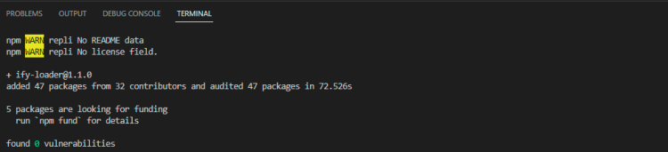

# Presentación de Plotly.js
Otra biblioteca especializada en la creación de gráficos es Plotly.js.

## Instalación de Plotly.js
Al igual que Chart.js, Plotly.js es una biblioteca que te ayudará a enriquecer tus páginas con gráficos responsivos y dinámicos. Esta biblioteca también es de código abierto. Una de las principales diferencias radicará en los métodos de instalación.

Además, tiene la característica de estar disponible para muchos lenguajes de programación.

### Instalación a través de NPM
Claro está, hay la posibilidad de instalar Plotly.js a través de NPM. Para hacerlo, es necesario abrir tu terminal y ejecutar el siguiente comando:

```bash
npm i plotly.js
```

### Otras Formas de Instalación
También se puede instalar a través del CDN, así como desde el repositorio de GitHub. Dado que ya se discutió cómo hacer estas cosas con la introducción de Chart.js, es más relevante explorar la última forma de instalar esta biblioteca, que es a través de Webpack.

## Uso de Webpack para la instalación de Plotly.js en un proyecto HTML
Una diferencia entre la instalación de Plotly.js y Chart.js es que es posible instalar Plotly.js mediante webpack.

### Procedimiento de Instalación con Webpack
El procedimiento será un poco más complejo si quieres utilizar webpack para instalar esta biblioteca; sin embargo, una vez que lo domines, es bastante sencillo de implementar.

### Pasos Iniciales: Instalación de ify-loader
La instalación a través de webpack requiere de varios pasos, el primero de ellos es la instalación de `ify-loader` usando npm.

```bash
npm install --save ify-loader
```

### Resultado de la Instalación de ify-loader
La instalación de esta dependencia debería mostrarte el siguiente resultado visual:



### Instalación de Webpack en el Proyecto
Una vez descargado `ify-loader`, necesitarás instalar webpack en tu proyecto:

```bash
npm install --save-dev webpack
```

### Confirmación de la Instalación de Webpack
Si la instalación se ha realizado correctamente, deberías ver el siguiente resultado visual:


### Configuración de Webpack
Finalmente, tendrás que configurar webpack añadiendo un script a tu `webpack.config.json`. Por lo tanto, tendrás que añadir el siguiente código:

```json
...
      module: {
          rules: [
              {
                  test: /\.js$/,
                  loader: 'ify-loader'
              }
          ]
      },
...

```

## Requisitos Iniciales: Una Etiqueta HTML para Empezar
Al igual que con Chart.js, el primer paso es crear un archivo HTML. Entre las dos etiquetas `<body></body>`, es necesario colocar una etiqueta `<div></div>`.

```html
<div id="tester" style="width:600px;height:250px;"></div>
```

### Creación del Archivo Javascript
Una vez colocada la `<div>`, será necesario crear nuestro archivo Javascript donde se inyectarán todos los datos.

```javascript
<script>
  let graphDiv = document.getElementById('tester');
  
  let data = [{
    x: [1999, 2000, 2001, 2002],
    y: [10, 15, 13, 17],
    type: 'scatter'
  }];
  
  let layout = {
    title: 'Sales Growth',
    xaxis: {
      title: 'Year',
      showgrid: false,
      zeroline: false
    },
    yaxis: {
      title: 'Percent',
      showline: false
    }
  };
  Plotly.newPlot(graphDiv, data, layout);
  let dataRetrievedLater = graphDiv.data;
  let layoutRetrievedLater = graphDiv.layout;
</script>
```

## Consejo sobre el Uso de `Plotly.newPlot`
`Plotly.newPlot(graphDiv, data, layout);` esta clase es un requisito en Plotly.js: siempre se introduce dentro de una `<div>`. Contiene todos los elementos del gráfico, como los datos, el título, el eje de las x y el eje de las y, etc.

### Importancia de la Variable `layout`
La variable `layout` está incluida en un objeto; el objeto `layout` se utilizará para almacenar variables como el título, el inicio en cero del gráfico, etc.

Espero que esta traducción te sea de ayuda. Si tienes más preguntas o necesitas más aclaraciones, no dudes en preguntar.

## Configuración de Opciones del Gráfico
Es posible configurar todo el gráfico para obtener un resultado que cumpla con nuestras expectativas. Dado que la biblioteca cuenta con más de 40 tipos de gráficos, es más relevante enfocarse en el método para añadir una o varias opciones. Para hacerlo, será necesario declarar una variable que, en un objeto, contenga las opciones deseadas, como el nombre, el diseño responsivo, etc. Observa el código de abajo, su objetivo es permitir el zoom y el desplazamiento.

```javascript
<script>
  let graphDiv = document.getElementById('tester');
  
  let data = [{
    x: [1999, 2000, 2001, 2002],
    y: [10, 15, 13, 17],
    type: 'scatter'
  }];
  
  let layout = {
    title: 'Sales Growth',
    xaxis: {
      title: 'Year',
      showgrid: false,
      zeroline: false
    },
    yaxis: {
      title: 'Percent',
      showline: false
    }
  };
  
  Plotly.newPlot(graphDiv, data, layout);
  let dataRetrievedLater = graphDiv.data;
  let layoutRetrievedLater = graphDiv.layout;
</script>
```

### Implementación de Opciones en la Variable "Layout"
Las opciones se configuran en una variable llamada "Layout", en el ejemplo anterior se trataba de las opciones de desplazamiento y zoom, pero el proceso sería el mismo para aspectos responsivos.

### Ejemplo de un Proyecto con Plotly.js
Aquí tienes un ejemplo de un proyecto con Plotly.js.

```html
<!DOCTYPE html>
<html lang="fr">
<head>
  <!-- cdn Plotly.js entre las etiquetas head -->
  <script src="https://cdn.plot.ly/plotly-latest.min.js"></script>
</head>
<body>
  <!-- Los gráficos se instalan en una div -->
  <div id="tester" style="width:90%;height:250px;"></div>
  <script src="script.js"></script>
</body>
</html>
```

```javascript
<script>
  let tester = document.getElementById('tester');
  Plotly.newPlot( tester, [
    {
      x: [1, 2, 3, 4, 5],
      y: [1, 2, 4, 8, 16]
    }
  ],
    {
      margin: { t: 0 }
    });
</script>
```

### Conclusión
El uso de estos fragmentos de código te permitirá realizar tu primer gráfico en línea con Plotly.js.

Espero que esta traducción sea de utilidad. Si tienes más preguntas o necesitas más clarificaciones, no dudes en preguntar.