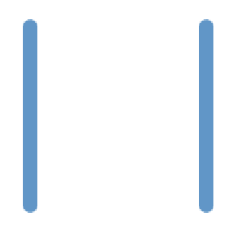
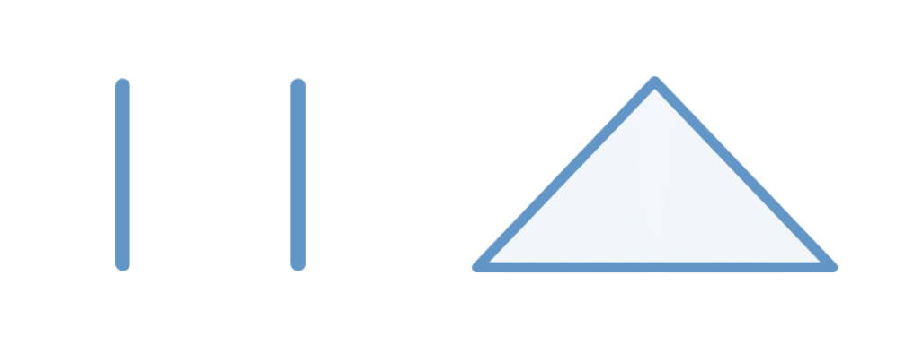

# Introducción al elemento `<canvas>` et su `API`

## Definición de `<canvas>` en HTML

Primero que nada, es importante saber que `<canvas>` es un elemento HTML de la categoría "embedded content" o "contenido incrustado" en español. Esto significa que este elemento se utiliza para importar o insertar un recurso en tu documento HTML. Otros ejemplos de elementos del tipo "Contenido incrustado" son ``, `<audio>` o `<video>`.

### Consejo sobre las Categorías de Contenido en HTML

Si quieres saber más sobre las diferentes categorías de contenido de los elementos HTML, no dudes en visitar MDN Web Docs para informarte, o realizar una búsqueda con las palabras clave "content categories HTML" o "categorías de contenido HTML".

### Ejemplo Básico de Uso de `<canvas>`

```html
<canvas id="example" title="Example of a canvas element" width="1280px" height="720px"></canvas>
```

Arriba se muestra un ejemplo básico del uso del elemento `<canvas>`. Este tiene atributos comunes a todos los elementos HTML como `id`, `title`, o `lang`.

Además, específicamente tiene 2 atributos adicionales:

- `width`: la anchura en píxeles del elemento.
- `height`: la altura en píxeles del elemento.

## Complemento: Sobre la Baliza de Cierre de `<canvas>`

Es importante tener en cuenta que `<canvas>` debe tener obligatoriamente una etiqueta de cierre `</canvas>`, a diferencia de sus homólogos en la categoría de contenido de flujo como `` o `<audio>`.

La razón de la presencia de una etiqueta de cierre es debido al contenido "fallback".

### Contenido "Fallback" en `<canvas>`

El concepto de contenido "fallback" en informática se refiere a una solución alternativa, especialmente en nuestro contexto, a un contenido que reemplazará el `<canvas>` si este no funciona o no es compatible con el navegador.

Aquí, el contenido "fallback" para insertar entre las etiquetas `<canvas>` podría ser texto simple o otro elemento HTML, como se demuestra en los 2 ejemplos a continuación.

### Ejemplos de Contenido "Fallback"

```html
<canvas id="example" title="Example of a canvas element" width="1280px" height="720px">Canvas no compatible con su navegador</canvas>
```

```html
<canvas id="example" title="Example of a canvas element" width="1280px" height="720px">
    
</canvas>
```

🤖🤖

## API canvas js
Primero que nada, antes de aprender más sobre la API de Canvas, no debemos olvidar los métodos JavaScript que proporciona el elemento `<canvas>`.

Aparte de los métodos comunes a todos los elementos HTML, `<canvas>` tiene 4 métodos específicos de JavaScript:

1. `getContext(contextId, options)`: Devuelve el contexto de dibujo del Canvas, que es su API para dibujar. El parámetro `contextId` permite especificar la API deseada ("2d", "bitmaprenderer", "webgl", "webgl2" o "webgpu"), y el parámetro `options` es un objeto opcional.
2. `toDataURL(type, quality)`: Devuelve la URL de la imagen del Canvas. Los dos parámetros son opcionales: el primero es el tipo de imagen (por defecto: PNG) y el segundo, `quality`, es la calidad deseada en un decimal entre 0 y 1.
3. `toBlob(callback, type, quality)`: Funciona de manera similar a `toDataURL`, pero en lugar de una URL, devuelve un objeto Blob que representa el archivo de imagen del Canvas. Tiene un parámetro adicional, que es una función de callback que se llamará después de generar el Blob.
4. `transferControlToOffscreen()`: Es un método avanzado que no es relevante en este contexto; devuelve un nuevo objeto Canvas denominado "offscreen" que ya no depende del DOM.

### Acceso a la API de `<canvas>` mediante `getContext()`
La API del `<canvas>` se puede obtener en JavaScript a través del método `getContext()` de este elemento. Como se mencionó anteriormente, en función del parámetro `type` de este método, podemos acceder a diferentes APIs. Por ejemplo, con el tipo "webgl", obtendremos lógicamente la API WebGL para dibujar en el Canvas.

No obstante, la que nos interesa será simplemente la API del tipo "2d", que permite dibujar formas en 2D.

### Ejemplo de Uso de `getContext()`
A continuación, un ejemplo de cómo se utiliza el método `getContext()` para obtener la API:

```javascript
const canvasElement = document.getElementById('example');
const ctx = canvasElement.getContext('2d');
```

### Categorías de Métodos en la API de Canvas
La API de Canvas tiene numerosos métodos que se pueden dividir en varias categorías. Sin embargo, solo nos centraremos en las nociones esenciales y básicas para dibujar en el Canvas.

### Los "Paths" en la API de Canvas
Una de estas categorías de métodos, sin duda la más esencial y básica, es la de los "Paths" (caminos). Un "Path" en la API corresponde a un camino, pero más precisamente a una lista de puntos y vectores que forman este camino.

### Métodos Principales para Manipular "Paths"
Estos son los principales métodos que permiten manipular los "Paths" en la API:

- `beginPath()`: abre un nuevo camino.
- `moveTo(x, y)`: añade un nuevo punto al camino sin conectarlo con el punto anterior.
- `lineTo(x, y)`: añade un nuevo punto al camino y lo conecta con el punto anterior en forma de línea (creando así un vector que conecta el punto anterior con el nuevo).
- `closePath()`: conecta el primer y el último punto en línea.
- `stroke()`: dibuja los contornos de los caminos (es decir, las conexiones entre los puntos).
- `fill()`: dibuja el interior de los caminos (es decir, el espacio creado por la conexión de varios puntos).

### Dibujar una Línea con un "Path"
Dibujar una línea con un "Path" consiste en abrir un camino en un punto A y agregar un vector hasta un punto B.

### Ejemplo de Dibujo de Líneas y Triángulo
Vamos a ver con un ejemplo cómo podemos dibujar 2 líneas paralelas y un triángulo.

```javascript
ctx.beginPath();
ctx.moveTo(75, 50);
ctx.lineTo(75, 75);
ctx.moveTo(100, 50);
ctx.lineTo(100, 75);
ctx.stroke();
```

Este código permite dibujar simplemente 2 líneas paralelas. Obtenemos el siguiente resultado visual:



```javascript
ctx.moveTo(150, 50);
ctx.lineTo(175, 75);
ctx.lineTo(125, 75);
ctx.closePath();
ctx.stroke();
```

Si agregamos el código de arriba, se dibujará un triángulo junto a las líneas paralelas:



### Consejo: Experimenta por ti mismo
No dudes en manipular los valores y en utilizar por ti mismo los métodos que hemos visto anteriormente para comprender bien su funcionamiento.

### Dibujar Formas más Complejas
Hemos visto los métodos para dibujar manualmente los contornos de las formas en el Canvas. Sin embargo, si deseamos realizar formas más complejas, limitarse a los métodos `moveTo()` y `lineTo()` podría hacer que la tarea sea difícil y tediosa.

### Métodos para Formas Específicas
Afortunadamente, en lugar de simplemente conectar puntos en línea recta, la API Canvas 2D también tiene ciertos métodos para realizar formas más específicas:

- `fillRect()`, `strokeRect()`, `clearRect()`: estos métodos permiten respectivamente dibujar un rectángulo lleno, los contornos de un rectángulo y borrar una parte del Canvas en forma de rectángulo. Todos ellos toman los mismos parámetros `x, y, width y height`, que corresponden a las coordenadas y dimensiones del rectángulo.
  
- `rect()`: funciona como los métodos anteriores, pero en lugar de dibujar un rectángulo, lo añade en forma de camino al Path actual.
  
- `fillText(), strokeText()`: respectivamente dibujan el texto y dibujan los contornos del texto utilizando los parámetros `text, x, y`, que corresponden respectivamente al texto y a sus coordenadas.
  
- `arc()`: añade un círculo o un arco en forma de camino al Path actual con los siguientes parámetros: `x, y, radius, startAngle, endAngle`, que corresponden respectivamente a las coordenadas del centro, al radio del círculo y las medidas del ángulo del arco en radianes.

### Métodos Complementarios
Existen otros métodos para dibujar formas en la API, como `quadraticCurveTo()`, `bezierCurveTo()` o `arcTo()` que se basan en conceptos geométricos complejos. Sin embargo, estos métodos son bastante avanzados y no son esenciales para nuestro contexto de aprendizaje.

### Estilización en la API de Canvas
La última noción esencial de la API es el estilo de la misma. Con ciertas variables de atributos, podemos estilizar el trazo de dibujo de la API:

- `strokeStyle`: color del contorno del dibujo.
- `fillStyle`: color de relleno del dibujo.
- `shadowOffsetX`: distancia del desplazamiento de la sombra en X.
- `shadowOffsetY`: distancia del desplazamiento de la sombra en Y.
- `shadowBlur`: nivel de desenfoque de la sombra.
- `shadowColor`: color de la sombra.
- `font`: parámetro de la fuente del texto.

### Precaución en el Estilo
Si deseas modificar el estilo del dibujo sin afectar lo que ha sido dibujado previamente, es imperativo comenzar un nuevo Path con el método `beginPath()`, ya que el estilo se aplicará al Path actual en su totalidad.

### Consejo: Documentación y más información
Si deseas obtener más detalles sobre la API, no dudes en visitar MDN Web Docs o hacer investigaciones con las palabras clave "CanvasRenderingContext2D API".