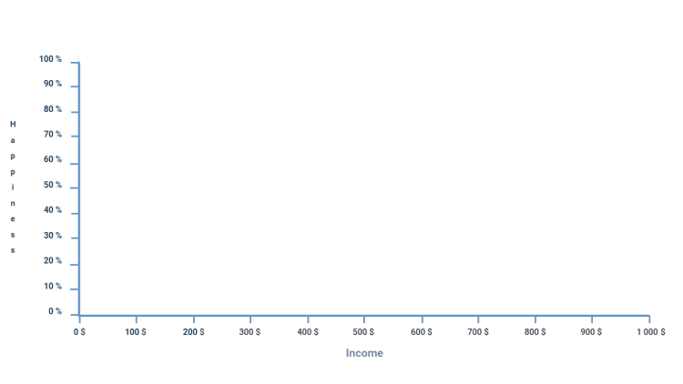
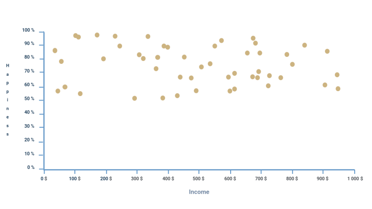

## Visualización gráfico estático

### Introducción y Puesta en Práctica
Ahora que hemos repasado todos los conceptos esenciales de la API de Canvas, vamos a aplicar estos conocimientos recién adquiridos y crear un gráfico de dispersión con `<canvas>`.

### Herramienta de Desarrollo Web
Para programar, vamos a utilizar la herramienta web Replit. Por lo tanto, dirígete al siguiente enlace: replit, para crear un nuevo espacio de trabajo HTML.

## Inicialización y Configuración de Archivos
Primero, vamos a establecer los cimientos. Al crear un espacio de trabajo con la plantilla HTML de Replit, por defecto se han creado 3 archivos: `index.html`, `script.js` y `style.css`.

Vayamos al archivo `index.html` y modifiquemos el `<body>` para agregar el `<canvas>` y cargar `script.js`.

```html
<body>
  <canvas id="graph" width="1000px" height="500px">Canvas not supported</canvas>
  <script src="script.js"></script>
</body>
```

### Importancia del Orden de los Elementos
Es importante que el script se cargue después del `<canvas>`. De lo contrario, cuando intentemos acceder al `<canvas>` en el script, este aún no existirá.

### Trabajando con JavaScript
Ahora ya no deberíamos necesitar interactuar más con el código HTML. Lo único que nos queda es acceder al `<canvas>` y su API en JavaScript. Por lo tanto, en el archivo `script.js`, implementemos el siguiente código:

```javascript
const canvasElement = document.getElementById('graph');
const ctx = canvasElement.getContext('2d');
```

### Consejo de Buenas Prácticas
Se considera una buena práctica en desarrollo web utilizar la herramienta "inspeccionar" de tu navegador para verificar que el código implementado esté funcionando correctamente.

## Visualización de los ejes

### Creación de los Ejes del Gráfico
La primera parte del algoritmo para crear un gráfico estadístico consiste en establecer los ejes del mismo.

Vamos a crear dos funciones gemelas que estarán vacías por ahora, pero que llamaremos `createAxeX()` y `createAxeY()`.

Estas dos funciones tomarán los mismos parámetros siguientes que permitirán personalizar los ejes:

- `marks`: número de medidas a mostrar en el eje,
- `scale`: escala de valores de las medidas,
- `unit`: unidad de medida del eje (opcional),
- `label`: nombre del eje (opcional).

Aquí es cómo deberían verse las dos funciones con todos estos elementos:

```javascript
const createAxeX = (marks, scale, unit, label) => {
}
```

### Enfocándonos en el Eje de las Abscisas
Ahora nos concentraremos en el eje de las abscisas, es decir, en la función `createAxeX()`.

Primero vamos a dibujar una línea para el eje que ocupará toda la anchura del Canvas, con un margen de 50 px. Para conocer las dimensiones del Canvas, la API contiene los atributos `ctx.canvas.width` y `ctx.canvas.height`.

```javascript
ctx.beginPath();
ctx.moveTo(50, ctx.canvas.height - 50);
ctx.lineTo(ctx.canvas.width - 50, ctx.canvas.height - 50);
ctx.stroke();
```

### Atención Sobre la Invocación de la Función
Para observar el resultado, no olvides llamar a la función `createAxeX()` en el script después de haberla definido.

### Añadiendo Etiquetas al Eje de las Abscisas
Ahora que se muestra este eje, agreguemos una etiqueta a la misma. Siendo un parámetro opcional, debemos colocar este código dentro de un bloque `if` condicional.

```javascript
if (label) {
    ctx.textAlign = "center";
    ctx.fillText(label, ctx.canvas.width / 2, ctx.canvas.height - 10);
}
```

### Prueba de Funcionamiento
Puedes probar el buen funcionamiento añadiendo parámetros ficticios cuando llames a la función, como en el siguiente ejemplo.

```javascript
createAxeX(0, 0, undefined, "Income");
```

### Uso de Alineación de Texto con ctx.textAlign
En el código anterior, utilizamos el atributo `ctx.textAlign` de la API que nos permite definir la alineación del texto, es decir, si este debe estar centrado, alineado a la izquierda o alineado a la derecha.

### Implementación de Marcadores en el Eje
Solo nos queda mostrar las medidas en el eje. El número de medidas a colocar está definido por el parámetro `marks`, mientras que la escala de cada una de estas medidas está definida por `scale`.

Por lo tanto, vamos a usar un bucle `for` y un poco de lógica matemática para decidir cómo colocar estas medidas.

Primero, aquí está el bucle que nos permitirá iterar para el número de medidas a colocar:

```javascript
for (var i = 0; i <= marks; i += 1) {

}
```

### Cálculo de la Distancia entre Marcadores
Dentro de este bucle, agregamos un cálculo que nos permitirá definir la distancia en píxeles entre cada medida. Esta distancia se calcula gracias al tamaño del eje, es decir, `ctx.canvas.width - 100` (el 100 corresponde al margen en píxeles), tamaño que dividimos por el número de medidas:

```javascript
const distance = (ctx.canvas.width - 100) / marks;
```

### Dibujando los Marcadores en el Eje
Debajo del cálculo de la distancia, podemos agregar directamente el código que dibujará la línea de las medidas:

```javascript
ctx.beginPath();
ctx.moveTo(50 + i * distance, ctx.canvas.height - 50);
ctx.lineTo(50 + i * distance, ctx.canvas.height - 45);
ctx.stroke();
```

### Añadir Valor y Unidad de Medida
Solo nos queda mostrar el valor de la medida en texto, sin olvidar que hay una unidad de medida opcional a tener en cuenta.

```javascript
ctx.textAlign = "center";
if (unit) ctx.fillText(scale * i + unit, 50 + i * distance, ctx.canvas.height - 35);
else ctx.fillText(scale * i, 50 + i * distance, ctx.canvas.height - 35);
```

### Probando la Función
Solo nos queda probar este método llamándolo con estos parámetros:

```javascript
createAxeX(10, 100, "$", "Income");
```

Deberías obtener el resultado visual siguiente:


### Creación de Función para Texto Vertical
Antes de continuar, también necesitamos reproducir la misma función, pero para el eje Y.

El concepto será el mismo, sin embargo, no existe un método en la API de Canvas que permita escribir texto verticalmente, lo cual es necesario dado que el eje Y es vertical. Aquí hay una función que puedes agregar. Al usarla, podrás escribir verticalmente de la misma manera que con el método `fillText()`.

```javascript
const fillTextVertically = (text, x, y) => {
    const lineHeight = 10;
    y = y - lineHeight * text.length / 2;
    ctx.textAlign = "center";
    for (var i = 0; i < text.length; i += 1) {
        ctx.fillText(text[i], x, y + i * lineHeight);
    }
}
```

### Elementos para Crear el Método createAxeY
Ahora tienes todos los elementos para crear el método `createAxeY()` por ti mismo, lo cual te alentamos a hacer para familiarizarte más con la API de Canvas.

Este es el resultado que deberías obtener al adaptar la función para el eje Y:

```javascript
const createAxeY = (marks, scale, unit, label) => {
    ctx.beginPath();
    ctx.moveTo(50, 50);
    ctx.lineTo(50, ctx.canvas.height - 50);
    ctx.stroke();
    if (label) {
        ctx.textAlign = "center";
        fillTextVertically(label, 10, ctx.canvas.height / 2);
    }
    for (var i = 0; i <= marks; i += 1) {
        const distance = (ctx.canvas.height - 100) / marks;
        ctx.beginPath();
        ctx.moveTo(50, ctx.canvas.height - 50 - i * distance);
        ctx.lineTo(45, ctx.canvas.height - 50 - i * distance);
        ctx.stroke();
        ctx.textAlign = "center";
        if (unit) ctx.fillText(scale * i + unit, 35, ctx.canvas.height - 50 - i * distance);
        else ctx.fillText(scale * i, 35, ctx.canvas.height - 50 - i * distance);
    }
}
```

### Prueba de las Funciones de Creación de Ejes con Parámetros Específicos
Ahora intentemos llamar a los métodos de creación de ejes con los siguientes parámetros:

```javascript
createAxeX(10, 100, "$", "Income");
createAxeY(10, 10, "%", "Happiness");
```

De esta manera, el resultado visual que obtendrás debería corresponder al siguiente ejemplo:



## Generación de Puntos en el Gráfico
Hemos logrado mostrar los ejes del gráfico, así que lo único que queda es colocar puntos en él.

Sin embargo, por ahora, todavía no tenemos datos que correspondan a los puntos a colocar, así que vamos a proceder a implementar una función utilitaria que genere estos puntos de forma aleatoria.

Nombraremos a esta función `generatePoints()`. Su primer parámetro es `size`, que representa el tamaño del array de puntos generados, seguido de `x_min`, `x_max`, `y_min`, `y_max`, que son las coordenadas límite para los puntos. Finalmente, `color`, que será el color del punto cuando lo mostremos.

Así es cómo se ve la definición de la función siguiendo las pautas anteriores:

```javascript
const generatePoints = (size, x_min, x_max, y_min, y_max, color) => {
    
}
```

### Inicialización del Array y Ciclo para Generar Puntos
Queremos crear un array de puntos e iterar con el parámetro `size` para agregar la cantidad correcta de puntos en el array.

Inicialicemos la variable que actuará como el array y creemos el bucle `for` donde generaremos el punto en cada iteración:

```javascript
const points = [];
for (var i = 0; i < size; i += 1) {
}
return points;
```

### Adición de Puntos con Coordenadas Aleatorias
Lo único que queda es agregar en el bucle un punto con coordenadas aleatorias y el color especificado como parámetro.

Para generar aleatoriamente las coordenadas, utilicemos la función `Math.random()` de JavaScript, que nos devuelve un número decimal aleatorio entre 0 y 1.

Aquí está el código para agregar un punto adaptando la función `Math.random()` para que se ajuste a las limitaciones dadas en los parámetros:

```javascript
points.push({
    x: Math.random() * (x_max - x_min) + x_min,
    y: Math.random() * (y_max - y_min) + y_min,
    color: color
});
```

### Llamada de la Función para Obtener Puntos
Con eso, la función está completa. Lo único que queda es llamarla para obtener los puntos generados en una variable.

```javascript
const points = generatePoints(50, 0, 1000, 50, 100, "red");
console.log(points);
```
Con esto, podrás ver los puntos generados almacenados en la variable `points`.

## Colocación de Puntos en el Gráfico
Ya tenemos todo lo necesario para colocar los puntos en el gráfico. Ahora finalmente vamos a crear la función que se encargará de ello.

Llamemos a esta función `placePoints()`. Esta tomará como parámetros `points`, que es el array de puntos, y `marks_x`, `scale_x`, `marks_y`, `scale_y`, que son los mismos valores dados durante la creación de los ejes. Necesitamos estos para ubicar correctamente nuestros puntos en la escala.

Aquí está el prototipo de la función que corresponde a las instrucciones:

```javascript
const placePoints = (points, marks_x, scale_x, marks_y, scale_y) => {
    
}
```

### Cálculo de las Escalas de Transformación
Por ergonomía, dentro de la función vamos a crear dos variables `scale_x` y `scale_y` que serán las escalas que necesitamos para adaptar las coordenadas nativas al gráfico.

El valor máximo de cada eje se puede calcular multiplicando el número de marcas `marks` y la escala de las medidas `scale` juntas, y dividiendo este valor por el tamaño en píxeles del eje. De esta manera, obtenemos la escala para transformar la coordenada nativa en coordenadas adaptadas al gráfico.

```javascript
const transform_x = marks_x * scale_x / (ctx.canvas.width - 100);
const transform_y = marks_y * scale_y / (ctx.canvas.height - 100);
```

### Bucle para Colocar Puntos
A continuación, añadiremos un bucle `forEach` que iterará a través de cada punto del array. Este será el bucle para colocar los puntos.

Lo primero que tenemos que hacer en este bucle es calcular las coordenadas escaladas. Por lo tanto, vamos a crear al mismo tiempo que el bucle, dos variables dentro de él que representarán las coordenadas transformadas.

```javascript
points.forEach(point => {
    const x = 0;
    const y = 0;
});
```

### Cálculo y Dibujo de las Coordenadas Escaladas
Tomando en cuenta el margen, la inversión del eje Y y la escala con las variables `transform_x` y `transform_y`, el resultado de las coordenadas adaptadas al gráfico debería corresponder al siguiente cálculo:

```javascript
const x = 50 + point.x / transform_x;
const y = ctx.canvas.height - 50 - point.y / transform_y;
```

Utilicemos estas coordenadas con el método `arc()` que habíamos visto anteriormente. Así, podemos añadir el siguiente código que dibujará en el gráfico los puntos en cada iteración:

```javascript
ctx.beginPath();
ctx.arc(x, y, 5, 0, 2 * Math.PI);
ctx.fillStyle = point.color;
ctx.fill();
```

### Llamada a la Función para Colocar los Puntos
Finalmente, aquí está la línea que vamos a escribir para mostrar nuestros puntos:

```javascript
placePoints(points, 10, 100, 10, 10);
```

### Observación: Final
Dado que los valores son aleatorios, sería complicado verificar correctamente el buen funcionamiento de la disposición de los puntos. Sin embargo, el código se puede considerar válido si el resultado es similar al mostrado a continuación:



**Nota:** No olvides que la disposición de los puntos depende de las limitaciones proporcionadas como parámetros a la función `generatePoints()`.