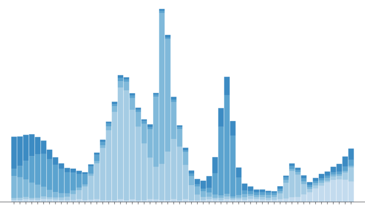
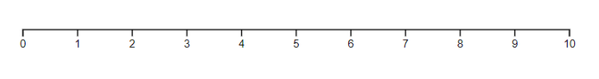

# Introducción a `D3.js`

## Por que D3.js?
D3.js, que significa "Document-Driven Data", es una librería gráfica basada en la visualización de datos interactiva y dinámica.

Esta librería combina JavaScript y, esencialmente, la tecnología SVG, o "Scalable Vector Graphics", para proporcionar a los usuarios una API que facilita la creación de gráficos detallados e interactivos, gracias en particular a las funcionalidades de transición y animación. Su aspecto de bajo nivel la hace flexible y compatible con todo tipo de algoritmos, siendo el único pivote de este framework la manipulación de datos.

### Ejemplo
Esta librería es una de las más populares para usuarios de todos los niveles. A menudo se utiliza para crear gráficos digitales como:



Fuente: [observablehq.com](https://observablehq.com/@d3/stacked-to-grouped-bars)

Pero también para crear estadísticas en forma de mapamundis:


Fuente: [observablehq.com](https://observablehq.com/@d3/world-choropleth)

## Funciones básicas
D3 tiene muchas características que son esenciales para realizar tareas básicas.

El primer paso en cualquier uso de D3 es recuperar un elemento con los métodos d3.select() y d3.selectAll(). Estos funcionan como getElement(), pero el elemento devuelto contendrá adicionalmente las funciones de la API D3. Por eso es esencial utilizarlos.

La diferencia entre d3.select() y d3.selectAll() simplemente radica en el número. La primera nos devuelve el primer elemento que satisface las condiciones, mientras que la segunda devuelve una lista que contiene todos los elementos, lo que permite que las funciones de la API se apliquen a todos estos elementos.

Además, podemos usar estos métodos recursivamente en los elementos obtenidos.

### Ejemplo

```javascript
const bodyElement = d3.select("body");
const divElementList = bodyElement.selectAll("div");
```
Una vez recuperados estos elementos, tenemos a nuestra disposición varios métodos para crear y modificar:

- `attr(name, value)`: aplica el atributo name con el valor value al elemento padre.
- `append(name)`: añade en el elemento padre un elemento correspondiente a name (ejemplo: 'div' para una `<div>`).
- `data(data)`: asocia virtualmente los datos data al elemento padre, y crea lugares vacíos en este último.
- `enter()`: a usar recursivamente con data(), recupera los lugares vacíos en la selección de entrada.
- `merge(list)`: fusiona la selección de entrada con la selección proporcionada como parámetro y devuelve la nueva selección, a menudo utilizado para actualizar una selección.
- `exit()`: devuelve una selección de elementos que ya no están asociados a datos, a menudo utilizado con `.remove()` que elimina estos elementos del DOM.

**Para resumir simplemente el funcionamiento de las selecciones en D3, existen 3 tipos de selecciones generadas al usar data():**

1. La selección de entrada que contiene elementos vacíos asociados a datos, es decir, que no hay un elemento correspondiente en el DOM.

2. La selección de actualización que contiene los elementos asociados a datos y a elementos en el DOM.

3. La selección de salida que contiene los elementos asociados a elementos en el DOM, pero a ningún dato.

## Funciones avanzadas
Crear un gráfico con un SVG conlleva complejidades matemáticas, especialmente debido a la escala entre las dimensiones del espacio de dibujo y las de los valores estadísticos.

Para resolver estos problemas, se diseñó la librería D3, y tenemos a nuestra disposición varias funciones de escalamiento:

- `scaleLinear()`: crea una escala lineal.
- `scaleOrdinal()`: crea una escala ordinal.
- `scaleBand()`: crea una escala de bandas, distribuye los valores en categorías que corresponden a estas bandas y les asigna un margen y un padding adecuado.
- `scaleLog()`: crea una escala logarítmica.
- `scaleQuantize()`: crea una escala cuantificada, es decir, con índices de categoría.

Estas 5 funciones toman los mismos parámetros de entrada, `domain` que corresponde al dominio de los valores de entrada y `range` que corresponde al rango de los valores de salida. Estas devuelven una función para usar para escalar un valor dado.

### Ejemplo

```javascript
// Crear una escala lineal
var scale = d3.scaleLinear(
    [0, 10], // Rango de entrada
    [0, 100] // Rango de salida
)
// Ejemplo de uso
console.log(scale(5)); // Salida: 50
```

También es posible definir el `domain` y la `range` en la inicialización y después gracias a los métodos miembros del mismo nombre:


```javascript
var scale = d3.scaleLinear()
  .domain([0, 10]) // Rango de entrada
  .range([0, 100]); // Rango de salida
```

Adicional al módulo de métodos de escalamiento, también existe un módulo para la creación de ejes.

D3.js nos ahorra el esfuerzo manual de crear los ejes y de configurar las medidas en estos últimos gracias a las 4 siguientes métodos: `axisBottom()`, `axisTop()`, `axisLeft()` y `axisRight()`.

Estas funciones son fundamentalmente las mismas, todas permiten crear un eje proporcionando como parámetro una función `scale` obtenida con los métodos previamente vistos, solo se diferencian en la dirección del eje indicada en su nombre.

A cambio, se nos da otra función: será necesario utilizar esta en un elemento SVG con el método `call()` para dibujar el eje.

### Ejemplo

```javascript
// Crear escala para el eje x
var scaleX = d3.scaleLinear()
    .domain([0, 10])
    .range([0, 500])
// Crear eje para el eje x
var axisX = d3.axisBottom(scaleX);
// Crear elemento SVG
    var svg = d3.select("body")
        .append("svg")
        .attr("width", 600)
        .attr("height", 200);
// Agregar eje al svg
svg.append("g")
    .attr("transform", 'translate(25, 25)')
    .call(axisX);
```




