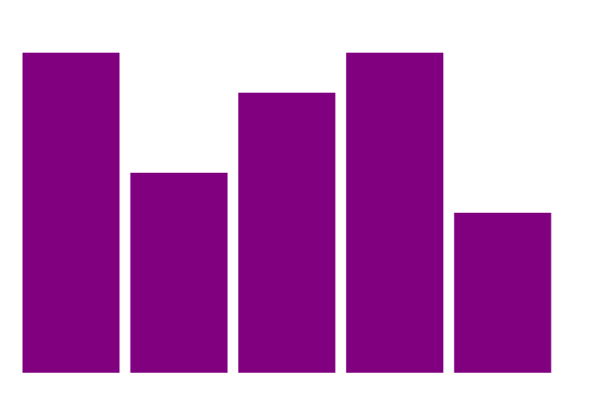
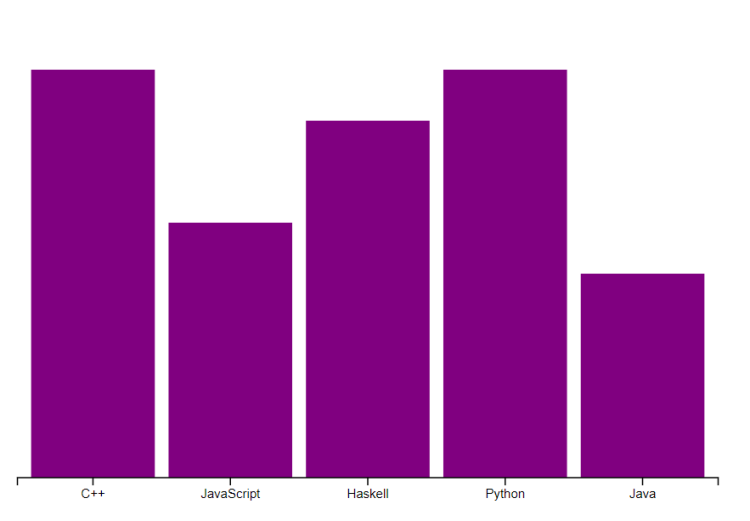
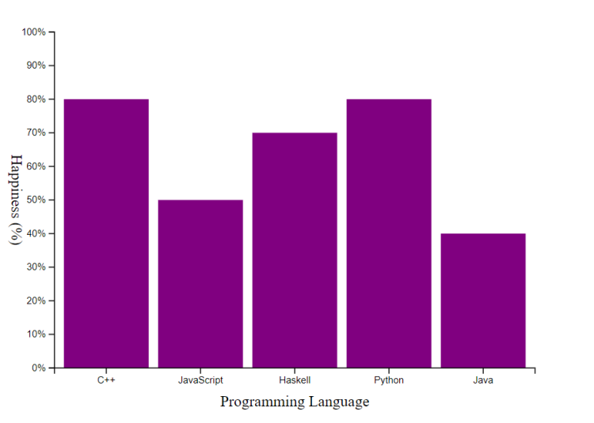

# Visualización de un Gráfico de Barras

## Intro

### Revisión de Conceptos y Preparación para la Práctica

Hemos revisado todas las nociones de D3.js necesarias para poder realizar nuestro primer algoritmo. Por lo tanto, ahora vamos a poner en práctica estos nuevos conocimientos creando un gráfico de barras con esta librería.

Para programar, vamos a utilizar la herramienta web Replit, así que dirígete al siguiente enlace: replit para crear un nuevo espacio de trabajo HTML.

## Inicialización

# Inicialización
Primero vamos a establecer las bases creando un espacio de trabajo con la plantilla HTML de Replit. Por defecto, se han creado 3 archivos: "index.html", "script.js" y "style.css".

Así que vamos al archivo "index.html", y modificamos el `<header>` para cargar la librería D3.js con una etiqueta `<script>`.

```html
<head>
  <meta charset="utf-8">
  <meta name="viewport" content="width=device-width">
  <title>D3.js Gráfico de Barras</title>
  <link href="style.css" rel="stylesheet" type="text/css" />
  <script src="https://d3js.org/d3.v7.min.js"></script>
</head>
```
También necesitamos agregar una etiqueta `<script>` en el `<body>` para cargar el código del "script.js":

```html
<body>
  <script src="script.js"></script>
</body>
```

Ya no necesitamos interactuar con el código HTML desde ahora, vamos al archivo "script.js" donde comenzaremos a codificar nuestro algoritmo.

### Configuración de Variables y Dimensiones

Primero, vamos a empezar creando algunas variables globales para definir las dimensiones y los márgenes del gráfico dentro del SVG.

```javascript
const MARGIN_LEFT = 50;
const MARGIN_RIGHT = 50;
const MARGIN_TOP = 50;
const MARGIN_BOTTOM = 50;
const WIDTH = 600;
const HEIGHT = 400;
```

### Creación del Elemento SVG

Luego vamos a agregar a nuestro body un SVG con las dimensiones anteriores. Este SVG será nuestro gráfico, necesitamos recuperarlo en una variable que llamaremos graph, te toca a ti completar el siguiente código para definir las dimensiones del SVG:

```javascript
// Crear el elemento SVG con los atributos width y height
const svg = d3.select("body").append("svg")
    .attr("width", WIDTH + MARGIN_LEFT + MARGIN_RIGHT)
    .attr("height", HEIGHT + MARGIN_TOP + MARGIN_BOTTOM);
// Agregar un grupo al elemento SVG para el gráfico
const graph = svg.append("g")
    .attr("transform", `translate(${MARGIN_LEFT}, ${MARGIN_TOP})`);
```

### Creación de un Grupo

Notarás la presencia adicional de `append('g')`, esto permite, gracias a D3.js, crear un grupo, así todas las modificaciones hechas a graph se reflejarán en los futuros elementos agregados a este grupo.

## Agregación de datos
El framework D3.js funciona con la entrada de datos, por lo que vamos a agregar un array de datos almacenado en una variable.

También puedes optar por colocar estos datos en un archivo JSON y cargarlo en el script.

```javascript
const data = [
    {
        language: "C++",
        happiness: 80
    },
    {
        language: "JavaScript",
        happiness: 50
    },
    {
        language: "Haskell",
        happiness: 70
    },
    {
        language: "Python",
        happiness: 80
    },
    {
        language: "Java",
        happiness: 40
    }
];
```

### Creación de Rectángulos en SVG
Luego necesitamos agregar un rectángulo para cada dato en el SVG. Los rectángulos corresponden a las barras del gráfico. Por lo tanto, debes completar el siguiente código.

Por el momento, no queremos configurar nada, así que es normal que las barras no se muestren, nos ocuparemos de sus coordenadas y dimensiones más adelante.

```javascript
graph
    .selectAll("rect")
    // vincular los datos
    // obtener la lista de elementos vacíos
    // agregar un elemento rect para cada elemento vacío
```

En este segmento, se está planteando la estructura básica para la vinculación de datos a elementos gráficos en D3.js, aunque aún no se han definido las propiedades específicas para la visualización de las barras.

## Escalamiento y Ejes
Las barras de datos están representadas en el SVG, pero se superponen indistintamente, por lo que vamos a implementar el escalamiento de los datos con las dimensiones del SVG para poder posicionar las barras correctamente.

### Creación de Función de Escalamiento para el Eje X

Comencemos creando la función de escalamiento de bandas en el eje X. Para los datos en este eje, utilizamos cadenas de texto (strings), por lo que no podemos proporcionar el rango a la función de escalamiento.

Sin embargo, podemos usar un array que contenga todas las cadenas de texto como parámetro, D3.js se encargará automáticamente de asignar cada cadena a una posición.

Completemos el siguiente código definiendo nosotros mismos el rango válido:

```javascript
const scaleX = d3.scaleBand()
    .domain(data.map((d) => d.language))
    .range([0, WIDTH])
    .padding(0.1);
```

### Creación de Función de Escalamiento para el Eje Y

Continuemos con el eje Y esta vez, pero usemos el método de escalamiento lineal. Los datos en este eje son numéricos, así que podemos proporcionar el rango como parámetro. Completemos esta vez el dominio de la escala:

```javascript
const scaleY = d3.scaleLinear()
    .domain([0, d3.max(data, (d) => d.happiness)])
    .range([HEIGHT, 0]);
```

### Actualización de la Representación de Barras
Es momento de actualizar la parte de nuestro código que agrega las barras al SVG, ahora tenemos las funciones necesarias para definir el tamaño y las coordenadas.

Los cálculos para el eje Y pueden parecer contra-intuitivos. Sin embargo, para el escalamiento, tuvimos que proporcionar un rango de salida inverso, ya que el eje Y del SVG está invertido, por lo que también debemos invertir los cálculos al definir el tamaño de las barras.

Definamos en el siguiente código las posiciones utilizando una función anónima y los métodos de escalamiento respectivos para obtener los valores correctos:

```javascript
graph
    .selectAll("rect")
    .data(data)
    .enter()
    .append("rect")
    .attr("width", scaleX.bandwidth())
    .attr("height", (d) => HEIGHT - scaleY(d.happiness))
    .attr("x", (d) => scaleX(d.language))
    .attr("y", (d) => scaleY(d.happiness))
    .attr("fill", "purple")
``` 



### Eje X
Solo nos queda agregar los ejes para completar nuestro gráfico. Empezaremos de nuevo ocupándonos del eje X:

```javascript
const axisX = d3.axisBottom(scaleX)
```

Con la función de escalamiento y `axisBottom()`, hemos recuperado el método a utilizar para crear el eje. Utilicémoslo para posicionarlo en el SVG:

```javascript
graph.append("g")
    .attr("transform", `translate(0, ${HEIGHT})`)
    .call(axisX);
```



### Eje Y
Repetimos el proceso para el eje Y, pero utilizando el método `tickFormat()` del eje para modificar la etiqueta mostrada y añadir la unidad de medida.

```javascript
const axisY = d3.axisLeft(scaleY)
    .tickFormat((d) => `${d}%`)
graph.append("g")
    .call(axisY);
```

### Nombres de los Ejes
Para el toque final, vamos a mostrar el nombre de los ejes. Para el eje Y, tendremos que aplicar una rotación vertical sobre el texto, no olvidemos tener en cuenta esta rotación cuando definamos las coordenadas de este eje.

Para definir el texto, podrás utilizar directamente el método `text()` en lugar de utilizar un atributo.

```javascript
graph.append("text")
    .attr("x", WIDTH / 2)
    .attr("y", HEIGHT + MARGIN_BOTTOM - 10)
    .style("text-anchor", "middle")
    .text("Programming languages");

graph.append("text")
    .attr("x", -HEIGHT / 2)
    .attr("y", -MARGIN_LEFT + 10)
    .style("text-anchor", "middle")
    .attr("transform", "rotate(-90)")
    .text("Happiness (%)");
```

