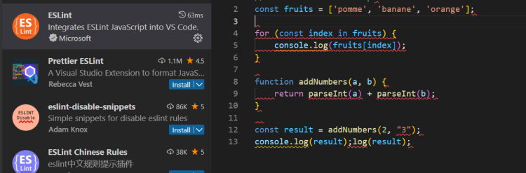

# Algunas Buenas Prácticas en JavaScript
Aquí se discuten algunas buenas prácticas para escribir código JavaScript más limpio y eficiente.

## Usar `const` y `let` en lugar de `var`
Se recomienda utilizar `const` y `let` para declarar variables en JavaScript en lugar de `var`. Las variables declaradas con `const` no pueden ser reasignadas, mientras que las declaradas con `let` sí pueden. Por otro lado, las variables declaradas con `var` tienen un alcance de función y pueden ser reasignadas. Aquí hay un ejemplo:

```javascript
// Buena práctica
const PI = 3.14159;
let message = "Hola";
// Mala práctica
var x = 10;
```

## Utilizar Funciones Flecha
Las funciones flecha son una nueva sintaxis para definir funciones en JavaScript. Tienen la ventaja de hacer que el código sea más conciso y fácil de leer. Aquí hay un ejemplo:

```javascript
// Buena práctica
const add = (a, b) => a + b;
// Mala práctica
function add(a, b) {
  return a + b;
}
```

## Usar Plantillas de Cadenas de Texto (Template Strings)
Las plantillas de cadenas de texto son una nueva sintaxis para crear cadenas de caracteres en JavaScript. Permiten incorporar expresiones JavaScript dentro de una cadena de caracteres. Aquí hay un ejemplo:

```javascript
// Buena práctica
const name = "John";
const message = `¡Hola, ${name}!`;
// Mala práctica
const name = "John";
const message = "¡Hola, " + name + "!";
```

## Evitar el Uso de Bucles `for-in` para Arreglos
Este segmento se centra en las mejores prácticas para iterar sobre arreglos en JavaScript, en particular, la recomendación de evitar el uso de bucles `for-in`.

### Usar `for-of` o `forEach` en Lugar de `for-in`
Se recomienda evitar el uso de bucles `for-in` para iterar sobre arreglos en JavaScript, ya que pueden provocar errores. Es mejor utilizar bucles `for-of` o `forEach`. Aquí hay un ejemplo:

```javascript
// Buena práctica
const frutas = ["manzana", "banana", "naranja"];
for (const fruta of frutas) {
  console.log(fruta);
}
frutas.forEach(fruta => console.log(fruta));

// Mala práctica
const frutas2 = ["manzana", "banana", "naranja"];
for (const index in frutas2) {
  console.log(frutas2[index]);
}
```

🤖🤖

## Evitar el Uso de Funciones Constructoras
Este segmento aborda la importancia de evitar funciones constructoras para crear objetos en JavaScript.

### Preferir Clases o Objetos Literales
Se recomienda evitar el uso de funciones constructoras para crear objetos en JavaScript, ya que pueden dar lugar a errores. Es preferible usar clases o objetos literales. Aquí hay un ejemplo:

```javascript
// Buena práctica
class Persona {
  constructor(nombre) {
    this.nombre = nombre;
  }
}
const john = new Persona("John");
const persona = { nombre: "John" };

// Mala práctica
function Persona(nombre) {
  this.nombre = nombre;
}
const john = new Persona("John");
const persona = new Object({ nombre: "John" });
```

## Utilizar Métodos de Array
Este segmento se centra en las mejores prácticas para manipular arrays en JavaScript, subrayando el uso de métodos de Array integrados.

### Ejemplos de Métodos de Array Útiles
Las métodos de Array son métodos incorporados que permiten manipular arrays en JavaScript. Se recomienda usarlos en lugar de iterar sobre los arrays con bucles. Aquí hay ejemplos de algunos métodos de Array útiles:

```javascript
// filter: permite filtrar los elementos de un array según un criterio
const numeros1 = [1, 2, 3, 4, 5];
const numerosPares = numeros1.filter(numero => numero % 2 === 0);
console.log(numerosPares); // [2, 4]

// map: permite transformar cada elemento de un array en otro elemento
const numeros2 = [1, 2, 3, 4, 5];
const numerosDoblados = numeros2.map(numero => numero * 2);
console.log(numerosDoblados); // [2, 4, 6, 8, 10]

// reduce: permite reducir los elementos de un array a un solo valor
const numeros3 = [1, 2, 3, 4, 5];
const suma = numeros3.reduce((acumulador, numero) => acumulador + numero, 0);
console.log(suma); // 15
```

## Evitar Bucles Anidados
Este segmento destaca la importancia de evitar los bucles anidados en JavaScript, debido a que pueden afectar negativamente el rendimiento de la aplicación.

### Utilizar Métodos de Array para Flattening
Se recomienda utilizar métodos de Array como `map`, `filter` o `reduce` para evitar bucles anidados. Aquí tienes un ejemplo:

```javascript
// Buena práctica
const matriz = [[1, 2], [3, 4], [5, 6]];
const matrizAplanada = matriz.flatMap(fila => fila);
console.log(matrizAplanada); // [1, 2, 3, 4, 5, 6]

// Mala práctica
const matriz = [[1, 2], [3, 4], [5, 6]];
const matrizAplanada = [];
for (let i = 0; i < matriz.length; i++) {
  for (let j = 0; j < matriz[i].length; j++) {
    matrizAplanada.push(matriz[i][j]);
  }
}
console.log(matrizAplanada); // [1, 2, 3, 4, 5, 6]
```

## Evitar Evaluaciones en Cascada
Este segmento enfatiza la necesidad de evitar evaluaciones en cascada en JavaScript, ya que pueden hacer que el código sea difícil de leer y mantener.

### Utilizar Métodos de Array o Funciones para Simplificar el Código
Es recomendable usar métodos de Array o funciones para simplificar el código. Aquí tienes un ejemplo:

```javascript
// Buena práctica
const persona = {
  nombre: "John",
  edad: 30,
  direccion: {
    ciudad: "París",
    pais: "Francia"
  }
};
const pais = persona.direccion?.pais;

// Mala práctica
const persona = {
  nombre: "John",
  edad: 30,
  direccion: {
    ciudad: "París",
    pais: "Francia"
  }
};

const pais = persona.direccion && persona.direccion.pais;
```

🤖🤖

## Lista Exhaustiva de Buenas Prácticas
Este párrafo menciona que puedes encontrar una lista más exhaustiva de buenas prácticas en JavaScript en el sitio web developer.mozilla.org.

```markdown
Puedes encontrar una lista más completa de buenas prácticas en JavaScript en [developer.mozilla.org](https://developer.mozilla.org/).
```

## Complemento: Las Extensiones
En este segmento, se habla de la utilidad de las extensiones que pueden ayudar a señalar errores directamente en el editor de código. Esto evita tener que escribir comandos de ESLint en la consola. La extensión ESLint desarrollada por Microsoft es un buen ejemplo para aquellos que usan VS Code.

Hay muchas extensiones disponibles que nos señalan errores directamente desde el editor de código. Estas resultan muy prácticas ya que nos evitan tener que escribir comandos ESLint en la consola. Por ejemplo, la extensión ESLint desarrollada por Microsoft puede ser de gran ayuda en VS Code, ya que resaltará el código con errores en rojo.


