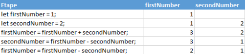

# Intercambiar dos números

## Objetivos

- Intercambiar el contenido numérico de dos variables
- Manipular las variables mediante operaciones matemáticas

## Contexto

Hemos visto cómo intercambiar dos palabras almacenadas en dos variables diferentes mediante una variable intermedia. Sin embargo, si hubiéramos querido intercambiar números, habría sido posible hacerlo sin usar una variable intermedia, gracias a simples operaciones matemáticas.

## Invertir dos números

Si no es posible sumar o restar palabras, es posible realizar estas operaciones con números. Así, si el contenido de nuestras variables son números, podemos manipularlos mediante las operaciones aritméticas básicas. Gracias a eso, es posible intercambiar el contenido de dos variables sin usar variables intermedias:

```javascript
let firstNumber = 1 ;
let secondNumber = 2 ;
firstNumber = firstNumber + secondNumber ; // firstNumber recibe 1 + 2 = 3
secondNumber = firstNumber - secondNumber ; // secondNumber recibe 3 - 2 = 1
firstNumber = firstNumber - secondNumber ; // firstNumber recibe 3 - 1 = 2
// La inversión ha terminado, firstNumber contiene 2 y secondNumber contiene 1
```

En este algoritmo, hemos podido sumar y restar nuestras variables entre sí, porque contenían números. Se observa que hay que almacenar el resultado de una operación en una variable. Así, escribir simplemente `firstNumber + secondNumber` no basta para modificar el valor de `firstNumber`. Hay que especificar que queremos reemplazar el valor de `firstNumber` por este resultado: `firstNumber = firstNumber + secondNumber`.

## Ejemplo

Hagamos la traza de este algoritmo:



## A recordar

- Si nuestras variables contienen números, es posible sumarlos o restarlos.
- Atención, hay que almacenar siempre el resultado de la operación en una variable, exista o no.