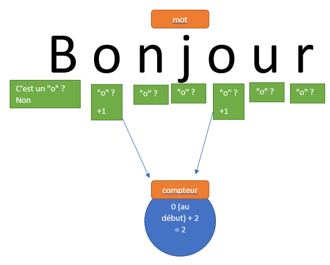
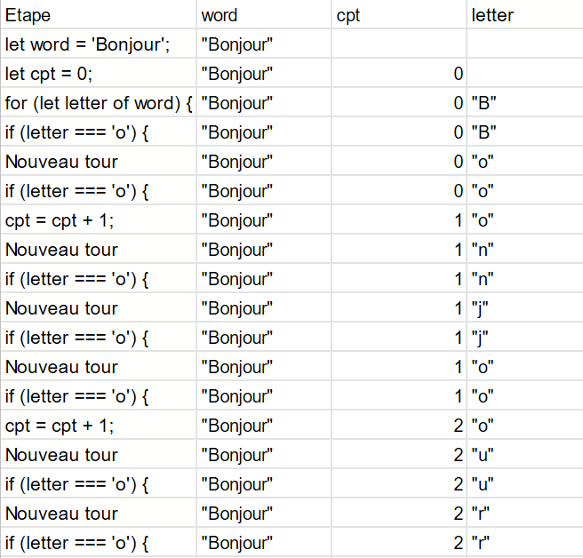

# Contar el número de ocurrencias de una letra en una palabra

## Objetivos
- Contar el número de ocurrencias de una letra en una palabra
- Ver un ejemplo de condición

## Contexto
Ya hemos visto cómo contar el número de letras en una palabra, ahora vamos a ver cómo contar el número de veces que una letra aparece en una palabra. 

## Contar ocurrencias
Para contar el número de ocurrencias de una letra en una palabra, el principio es el mismo que para calcular la longitud de una palabra: vamos a recorrer la palabra letra por letra. Pero, esta vez, en lugar de incrementar nuestro contador en cada letra, vamos a verificar primero si la letra en cuestión corresponde a la que buscamos. Para ello, vamos a utilizar una condición.

Por ejemplo, vamos a contar el número de "o" en la palabra "Bonjour". Entonces, para cada letra, si la letra es igual a "o", entonces vamos a incrementar nuestro contador.



Aquí está el código en JavaScript:

```javascript
let word = "Bonjour";
let cpt = 0;
for (let letter of word) {
  if (letter == "o") {
    // Si la letra actual es igual a "o", se realiza la operación entre las llaves, sino se ignora.
    cpt = cpt + 1; // Se incrementa nuestro contador.
  }
}
// Una vez salido del bucle, nuestro contador contendrá el número de "o". Lo mostramos con console.log:
console.log(cpt);
```

La instrucción `for` es otro tipo de bucle: se declara en el `for` una variable `letter`, que va a contener en cada paso una letra de la palabra `word`. Para hacer una condición, se utiliza la palabra clave `if`. En esta condición, se comparan dos valores gracias al símbolo `==`²[2].

## Ejemplo
Aquí está la traza del algoritmo anterior:



## A recordar
- Las condiciones permiten realizar instrucciones solo en algunos casos.


## Complemento
**[Las condiciones (Wikipedia)](https://fr.wikipedia.org/wiki/Instruction_conditionnelle_(programmation))**