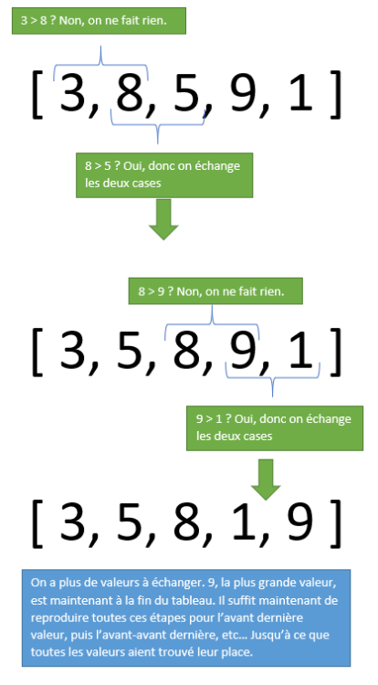
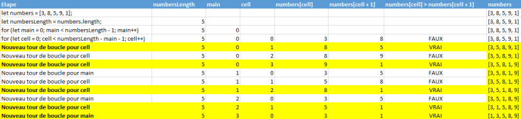

Hola, este es Bing. Estoy aquí para ayudarte con la traducción de la página web que tienes abierta en tu navegador Microsoft Edge. Aquí está la traducción del francés al español en el formato markdown:

# Tri a bulles

## Objetivos

- Comprender el principio del tri a bulles
- Descubrir el funcionamiento de los arreglos
- Ver cómo recorrer un arreglo

## Mise en situation

En programación, a menudo tenemos que manejar listas de valores, como listas de nombres de usuarios o números. Para poder manipular estas listas, usamos arreglos, que son una forma de almacenar varios valores en una misma variable. Los representamos como valores entre corchetes y separados por comas. Por ejemplo, la lista que contiene los números 5, 4, 9, 78 y 12 se representa: `[5, 4, 9, 78, 12]`. Cada valor se encuentra en una celda del arreglo, pero el arreglo en sí se almacena en una variable. Para acceder a una celda específica de nuestro arreglo, debemos poner el número de la celda entre corchetes: `tab[2]` para acceder a la celda n°2 del arreglo `tab`. ¡Cuidado, los números de celda empiezan en 0, así que la primera celda es `tab[0]`!

Para dar un ejemplo de manipulación de este tipo de datos, vamos a ver un ejemplo de ordenamiento de arreglos: el tri a bulles.

## Clasificación de burbujas

Imaginemos una lista de números que debemos ordenar de forma ascendente. Sin embargo, como con las cadenas de caracteres, solo podemos procesar cada valor uno por uno, desde el principio hasta el final, gracias a un bucle. Una solución simple sería recorrer el arreglo desde el principio hasta el final buscando el número más grande de la lista, y luego colocarlo al final de la lista. Luego, volvemos a recorrer el arreglo desde el principio hasta el penúltimo valor buscando el número más grande, y luego lo colocamos en el penúltimo lugar, y así sucesivamente. Este método es el tri por selección. Este funciona bien, pero requeriría el uso de una variable adicional para almacenar el valor durante la búsqueda del elemento más grande, por lo que usaría más memoria.

Por lo tanto, vamos a realizar una variante de esta técnica: el tri a bulles. El principio es básicamente el mismo, excepto que al recorrer el arreglo, vamos a comparar cada valor con su vecino para saber cuál es el más grande. Si el más grande está colocado antes, entonces intercambiamos los valores de las dos celdas: esto tendrá el efecto de "empujar" el valor más grande hacia el final del arreglo. Luego podremos repetir esta operación para el penúltimo valor, y así sucesivamente hasta tener un arreglo ordenado.



Para hacer esto, necesitaremos un bucle que nos permita recorrer cada celda del arreglo y permutar los valores si es necesario. Pero este tratamiento solo permite colocar un solo valor: este bucle deberá estar contenido en un bucle principal que nos permita repetir esta operación para cada posición (última, penúltima, etc.). Además, vimos al principio de este capítulo que podíamos intercambiar el contenido de dos variables numéricas sin usar una variable intermedia: es este procedimiento el que vamos a usar para invertir dos celdas de nuestro arreglo. Esto permitirá realizar el ordenamiento sin tener que usar una variable adicional.

Aquí está el código en JavaScript:

```javascript
let numbers = [3 , 8 , 5 , 9 , 1];
let numbersLength = numbers.length;
for (let main = 0; main < numbersLength - 1; main++) {
    for (let cell = 0; cell < numbersLength - main - 1; cell++) {
        if (numbers[cell] > numbers[cell + 1]) {
            // Si la valeur de la case actuelle est supérieure à la valeur de la case d'après,
            // on permute les valeurs (en utilisant l'échange de variables précédement vu)
            numbers[cell] = numbers[cell] + numbers[cell + 1];
            numbers[cell + 1] = numbers[cell] - numbers[cell + 1];
            numbers[cell] = numbers[cell] - numbers[cell + 1];
        }
    }
}
console.log(numbers);
```

Dos bucles anidados se crean aquí. El primero, donde definimos un iterador `main`, nos servirá para determinar qué valor vamos a recuperar: en la primera vuelta del bucle, colocaremos el último valor, en la segunda vuelta, el penúltimo, y así sucesivamente. El segundo bucle, con el iterador `cell`, se encargará de realizar las permutaciones (es este bucle el que sigue el esquema de arriba). Se llamará tantas veces como elementos haya en el arreglo.

## Ejemplo

Aquí está la traza del algoritmo anterior. Para simplificar la traza, las permutaciones no aparecen: cada línea de la traza (a partir de los bucles) representa el resultado de una vuelta de bucle (es decir, si hemos intercambiado valores o no). Las líneas en amarillo son las líneas donde ha habido una permutación.



## A recordar

- Para manejar listas de valores, se puede usar arreglos. Cada valor está contenido en una celda y tiene un número de celda que permite recuperar el valor. Los números de celda empiezan en 0.

## Complément

**El tri a bulles ([Wikipédia](https://fr.wikipedia.org/wiki/Tri_%C3%A0_bulles)**