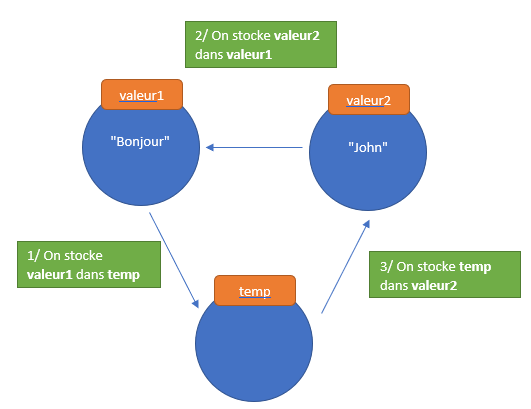

# Intercambiar dos palabras

## Objetivos

- Comprender el concepto de variable
- Intercambiar el contenido de dos variables

## Contexto

Como desarrollador, vamos a manipular valores a los que habremos dado previamente un nombre. Esto se llama variables. Así, si tenemos que manipular un nombre de usuario, vamos a crear una variable llamada username que contendrá este dato. Se puede ver las variables como una pequeña caja que contiene un valor. Cada caja tiene una etiqueta en la que se pone el nombre de su contenido, y estas solo pueden contener un único valor. Veamos cómo se traduce esto en JavaScript, analizando un algoritmo que permite intercambiar el contenido de dos variables.

## Invertir dos palabras

Para intercambiar el contenido de dos variables, vamos a proceder de la misma manera que para intercambiar el contenido de dos vasos de agua: vamos a usar una variable intermedia para almacenar temporalmente el valor de la primera variable.



Aquí está el código JavaScript que permite esta operación:

```javascript
// El objetivo es intercambiar los valores de estas dos variables
let value1 = "Bonjour" ;
let value2 = "John" ;
let temp = value1 ; // El valor de value1 se asigna a una nueva variable "temp"
value1 = value2 ; // Se asigna "John" a value1
value2 = temp ; // Se asigna el valor de temp a value2
```

En JavaScript, la palabra clave let permite crear nuevas variables. Aquí, creamos primero las variables value1 y value2 que contienen respectivamente Bonjour y John .

## La traza de un algoritmo

Para entender mejor lo que pasa durante la ejecución de un algoritmo, se puede hacer una traza . Una traza es el estado de todas las variables en cada paso del algoritmo. Aquí está la traza del algoritmo anterior:


## Nota

>A diferencia de los vasos de agua, una variable no se "vacía" cuando se pone su contenido en otra variable. En su lugar, su valor se copia.

## Para recordar

- Las variables son la base de la programación informática. Están compuestas por un nombre que les permite ser manipuladas y por un valor .
- En JavaScript, se declaran con la palabra clave let .
- Para seguir la ejecución de un programa, se puede realizar una traza , es decir, escribir el contenido de cada variable en cada paso de nuestro algoritmo.

## Complemento

**[Traza](https://fr.wikipedia.org/wiki/Trace_(informatique)), en Wikipedia**