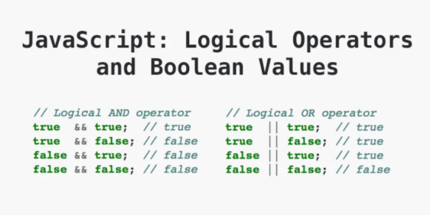

# Los operadores de comparación

Los operadores de comparación se usan para evaluar si dos valores son iguales, diferentes, mayores o menores. Los operadores de comparación devuelven un valor booleano, que puede ser `true` (verdadero) o `false` (falso).

## Los operadores lógicos

Los operadores lógicos se usan para combinar varias condiciones en una sola expresión. Los operadores lógicos devuelven un valor booleano, que puede ser `true` (verdadero) o `false` (falso).

## Objetivo

- Saber realizar pruebas lógicas

## Contexto

Para probar una igualdad, las estructuras de prueba se basan en un tipo llamado `boolean`, que puede contener el valor `false` (falso) o `true` (verdadero). Si el valor de la igualdad es verdadero, entonces se ejecutará el conjunto de instrucciones contenidas en la estructura de prueba¹[1].

## Definición

Para obtener el valor de la igualdad, es posible realizar pruebas simples (comparar los valores de las variables), pero también es posible realizar varias comparaciones en la misma estructura²[2]. Para ello, utilizaremos los operadores lógicos³[3]. Veremos aquí los tres operadores lógicos siguientes:

- Y: representado por `&&`, las dos partes de la prueba deben ser verdaderas para que el resultado sea verdadero.
- O: representado por `||`, al menos una de las dos partes debe ser verdadera para que la afirmación sea verdadera.
- NO: representado por `!` delante de una prueba, va a devolver el contrario del valor de la prueba que precede.

### Ejemplo

```javascript
const number1 = 9;
const number2 = 10;

let result = number1 === 9 && number2 === 10;
console.log(result); // true, las 2 afirmaciones son verdaderas

result = number1 === 9 && number2 !== 10;
console.log(result); // false, solo la primera afirmación es verdadera

result = number1 === 9 || number2 !== 10;
console.log(result); // true, una de las 2 afirmaciones es verdadera

result = !(number1 === 9 && number2 === 10);
console.log(result); // false, !(expresión) devuelve su contrario
```

Aquí está la tabla resumen de los resultados obtenidos al usar los operadores lógicos:



## A recordar

Es posible realizar varias pruebas en una estructura condicional. Para ello, hay que usar los operadores lógicos: el Y cuyas dos partes de la igualdad deben ser verdaderas para que la afirmación sea verdadera, y el O cuya única forma de obtener false es que las dos partes de la afirmación sean falsas.