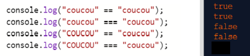

# Las igualdades

## Objetivo

- Saber utilizar los operadores de igualdad

## Contexto

Podríamos necesitar escribir una prueba "Si llueve fuera, entonces debo tomar mi paraguas", pero para llegar al resultado "Tomo mi paraguas", tuvimos que comparar "lluvia" con una variable: el clima. Tendremos que determinar primero lo que significa "vale": ¿se trata de una comparación estricta o de una comparación llamada débil?

## Definición

Entonces tendremos que distinguir entre igualdad estricta e igualdad débil al momento de realizar las pruebas:

- La igualdad débil `==`: solo comparará el valor de las dos variables, su tipo se convierte antes de la comparación.
- La igualdad estricta `===`: no se realizará ninguna conversión de este tipo, el operador comparará el valor de las variables Y su tipo.

### Ejemplo

Ejemplo de igualdad débil:

```javascript
'2' == 2 // devuelve true
```

Porque las dos partes de la igualdad tienen el mismo valor después de la conversión de tipo. Si el número '2' se convierte en texto '2', el valor es el mismo.

Ejemplo de igualdad estricta:

```javascript
'2' === 2 // devuelve false
```

Porque comparamos el carácter 2 (de tipo `string`) con el número 2 (de tipo `number`), la igualdad de tipos no se respeta, por lo que esta prueba devuelve falso.

## Definición

También es posible comparar la diferencia entre dos valores: si los dos valores son diferentes, se realizará la acción. Para realizar este tipo de comparación, basta con reemplazar el primer `=` por un `!` a los operadores de igualdad.

Para probar la diferencia entre dos valores:

- La diferencia débil `!=`, de la misma manera que la igualdad débil, comparará los dos valores de la expresión convirtiendo el tipo.
- La diferencia estricta `!==` comparará las dos variables en tipo y valor¹[1].

En la práctica, esto puede ser útil para verificar que un valor no esté vacío, por ejemplo: "Si el usuario no ha ingresado información en el campo, entonces mostrar un error" se traduciría por una prueba: `valorIngresado !== null`.

### Ejemplo

Ejemplo de diferencia débil:

```javascript
'2' != 2 // devuelve false
```

Porque después de la conversión de tipo, los dos valores son iguales.

```javascript
3 != 2 // devuelve true
```

Porque el número 3 es diferente del número 2.

Ejemplo de diferencia estricta:

```javascript
'2' !== 2 // devuelve true
```

Porque la primera parte representa el carácter dos y la otra parte representa el número dos, por lo que hay una diferencia de tipo entre las dos partes de la igualdad.

## Nota: Igualdad de cadenas

>Independientemente del tipo de igualdad, débil o estricta, si comparamos dos cadenas de caracteres, es importante prestar atención a la mayúscula y minúscula (la presencia de mayúsculas y minúsculas porque dos palabras iguales escritas de manera diferente no son iguales.



## Para recordar

Para asegurarnos de la igualdad de dos valores, es posible utilizar los operadores de igualdad:

- El operador de igualdad débil `==` permite realizar la comparación solo sobre el valor.
- El operador de igualdad estricta `===` permite realizar la comparación sobre el valor y sobre el tipo.

Es posible utilizar operadores de negación para verificar que dos valores son diferentes. Para ello, de la misma manera que los operadores de igualdad, utilizamos los siguientes operadores:

- El operador de desigualdad débil `!=` realiza la comparación solo sobre el valor.
- El operador de desigualdad estricta `!==` realiza la comparación sobre el valor y sobre el tipo de los elementos a comparar.