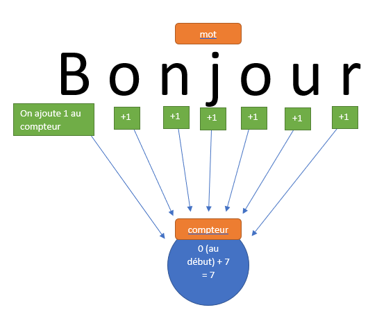
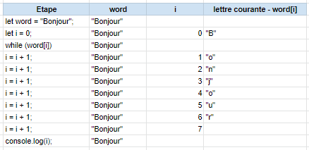

# Las bucles y las iteraciones

## Objetivos

- Contar el número de letras en una palabra
- Ver un ejemplo de bucle

## Contexto

En algunos de nuestros algoritmos, vamos a tener que realizar la misma operación un cierto número de veces. Para ello, vamos a utilizar **bucles**. Ellos nos van a permitir, por ejemplo, realizar una acción para cada letra de una palabra o para cada elemento de una lista. Veamos un ejemplo gracias a un algoritmo que permite contar el número de letras de una palabra.

## Contar las letras

Como humanos, si queremos contar el número de letras que hay en una palabra, vamos a empezar por el principio de la palabra y contar cada letra una por una.



En informática, es exactamente lo mismo: manipular una palabra entera es algo complejo para un ordenador, así que vamos a preferir descomponer el tratamiento letra por letra.

Aquí está el código JavaScript que permite contar el número de letras de una palabra (aquí, "Bonjour"):

```javascript
let word = "Bonjour";
let i = 0;

/*
 * Creamos un bucle para recorrer la palabra contenida en word
 * word[i] devuelve la letra de la palabra word en la posición indicada por "i", por ejemplo: 0 = "B"
 * si no hay más letras para el valor de "i", salimos del bucle.
 */
while (word[i]) {
  i = i + 1;
}

// Una vez salido del bucle, i contendrá el número de letras. Lo mostramos con console.log:
console.log(i);
```

Observamos la declaración de una variable `i` que nos va a servir para recorrer la palabra letra por letra: es una variable llamada **iteradora**. Aumentar un valor de 1 es una **incrementación**. En nuestro ejemplo, hemos incrementado nuestro contador.

### Ejemplo

Aquí está la traza del algoritmo anterior:



## A recordar

- Los bucles permiten repetir instrucciones un cierto número de veces.
- Podemos utilizarlos para realizar una acción para cada letra de una palabra, por ejemplo.
- Cuando recorremos una palabra con ayuda de un bucle, se crea una variable que contiene cada letra.
- Incrementar una variable de 1 significa aumentarla de 1.