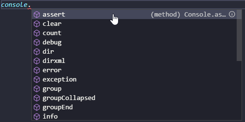
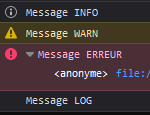
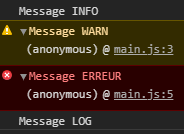
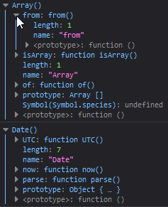
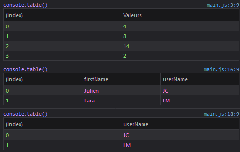

# El objeto `console`
## Objetivos
- Descubrir el objeto `console`.
- Aprender a utilizarlo para satisfacer tus necesidades.

## Contexto
Para visualizar la consola de tu navegador y ver sus mensajes, tienes dos opciones. Haz clic derecho en la página web seleccionada para acceder a las herramientas del navegador, y luego haz clic en "Examinar" o "Inspeccionar" y finalmente dirígete a la pestaña "Consola". Alternativamente, puedes presionar directamente la tecla "F12" y acceder a la misma pestaña.

## Mostrar la consola de tu navegador web
Para visualizar la consola de tu navegador y así ver sus mensajes, tienes dos opciones:

- Haz clic derecho en la página web seleccionada para acceder a las herramientas del navegador. Luego haz clic en "Examinar" o "Inspeccionar" y finalmente dirígete a la pestaña "Consola".
  
- O bien, presiona directamente la tecla "F12" y accede a la misma pestaña.

## En el código JavaScript: Uso del objeto `console`
Para usar el objeto `console`, solo tienes que escribir `console` en el código y luego añadir un punto para llamar al método deseado.

Los buenos editores de código te mostrarán entonces una lista de métodos disponibles para este objeto, como en el siguiente ejemplo con Visual Studio Code.





### Ejemplo de código
```javascript
console.info("¡Hola mundo!")
```

## El método `info()`
Muestra un mensaje de información en la consola y acepta como parámetro un mensaje o una lista de objetos para mostrar.

El mensaje se muestra sin ningún formato especial (con un icono de "Información" en Firefox).

### Ejemplo de código
```javascript
const val = 4;
const min = 8;
const infoMessage = 'Inicio de la función';
console.info('¡VAMOS!');
console.info({val, min, infoMessage});
```

### Salida en la consola

```
¡VAMOS!

{val: 4, min: 8, infoMessage: "Inicio de la función"}
```

Esto es lo que se mostrará en la consola al ejecutar el código de ejemplo.

## El método `log()`

El método `log()` muestra un mensaje en la consola. Es una de las funcionalidades que te será más útil para mostrar los valores de tus variables durante las fases de desarrollo o depuración.

Acepta como parámetro un mensaje o una lista de objetos para mostrar.

### Ejemplo de código

```javascript
const val = 4;
const numbers = [4, 8, 14, 2];
console.log('Debug');
console.log(val);
console.log(numbers);
```

### Salida en la consola

```
Debug

4

Array(4) [4, 8, 14, 2]
```

Esto es lo que se mostrará en la consola al ejecutar el código de ejemplo.

## El método `error()`
Esta método muestra un error en la consola.

Ayuda a encontrar el origen del error indicando la traza de pila (stack trace), es decir, el camino recorrido desde el inicio del programa hasta llegar al error, señalando en cada etapa el archivo y la línea correspondientes.

`console.error` toma como parámetro un mensaje o una lista de objetos para mostrar.

El mensaje se muestra en rojo con un icono de error también en rojo.

### Ejemplo de código
```javascript
console.error('Ha ocurrido un error');
```

El mensaje "Ha ocurrido un error" aparecerá en la consola en color rojo, junto con un icono de error rojo.

## El método `warn()`

Este método muestra un mensaje de advertencia en la consola. 

Acepta como parámetro un mensaje o una lista de objetos para mostrar.

El mensaje se muestra en color amarillo, acompañado de un icono de advertencia también en amarillo.

### Ejemplo de código
```javascript
console.info('Mensaje INFO');
console.warn('Mensaje WARN');
console.error('Mensaje ERROR');
console.log('Mensaje LOG');
```

### Visualización del método `warn()` en diferentes navegadores



```
👆 Visualización de un mensaje Warn() en Firefox
```



```
👆 Visualización de un mensaje Warn() en Chrome
```

## El método `assert()`
Este método muestra un mensaje de error en la consola solo si la condición definida es falsa.

- El primer parámetro es la condición que se debe verificar.

- El segundo parámetro es una lista de objetos JavaScript que se mostrarán si la condición es falsa.

### Ejemplo de código
```javascript
const age = 16;
const majority = 18;
const assertReason = 'La edad debe ser mayor que la mayoría de edad';
console.assert(age > majority, {age, majority, assertReason});
```

### Funcionamiento del método `assert()`
En el ejemplo anterior, queremos verificar que `age` sea mayor que `majority`. Si no es así, queremos mostrar un mensaje de error en la consola.

Como la condición es falsa, la consola mostrará:
```
Assertion failed: Object { age: 16, majority: 18, assertReason: 'La edad debe ser mayor que la mayoría de edad' }
```

## El método `clear()`
Este método simplemente vacía la consola.

### Ejemplo de código
```javascript
const age = 16;
const majority = 18;
const assertReason = 'La edad debe ser mayor que la mayoría de edad';
console.assert(age > majority, {age, majority, assertReason});
console.clear();
```

### Funcionamiento del método `clear()`
En el ejemplo anterior, el mensaje del método `assert()` no se mostrará, porque el método `clear()` se activa justo después y, por lo tanto, vacía la consola. Solo se mostrará el mensaje: "La consola ha sido limpiada".

🤖🤖

## El método `count()`
Este método permite mostrar en la consola la cantidad de veces que ha sido llamado.

Opcionalmente acepta un parámetro `label` que permite saber cuántas veces `count()` ha sido llamado con esa etiqueta.

### Ejemplo de código
```javascript
console.count();
for(let i = 0; i < 4; i++) {
  console.count('En el bucle');
}
console.count();
```

### Funcionamiento del método `count()`
En el ejemplo anterior, recorremos un bucle que comienza en 0, se incrementa en pasos de 1 y termina cuando el resultado es estrictamente menor que 4. Por lo tanto, la consola mostrará:

```
default: 1
En el bucle: 1
En el bucle: 2
En el bucle: 3
En el bucle: 4
default: 2
```

En total, tenemos cuatro llamadas a `count()` dentro del bucle y dos llamadas a `count()` fuera de él.

## El método `countReset()`
Este método simplemente reinicia el contador mencionado anteriormente a cero.

También puede aceptar un parámetro `label` para poder reiniciar un contador específico declarado con una etiqueta.

### Ejemplo de código
```javascript
console.countReset();
console.countReset('superior');
```

### Funcionamiento del método `countReset()`
Al usar este método, el contador o contadores especificados se reiniciarán a cero.

## El método `dir()`
Este método muestra la lista de propiedades del objeto pasado como parámetro. Las flechas permiten expandir la información.

### Ejemplo de Código
```javascript
// Objeto Array
console.dir(Array)
// Objeto Date
console.dir(Date)
```



### Funcionamiento del método `dir()`
Al utilizar este método, podrás ver una lista completa de todas las propiedades del objeto especificado. Las flechas que aparecen en la consola permiten expandir y ver más detalles sobre cada propiedad.

## Complemento: `dirxml()`
La función `dirxml()` muestra un árbol de los elementos hijos del elemento XML especificado. También es posible especificar un elemento HTML.

### Ejemplo de código HTML
```html
<!DOCTYPE html>
<html lang="es">
<head>
  <meta charset="UTF-8">
  <title>Entradas, salidas</title>
  <script src="main.js"></script>
</head>
<body>
</body>
</html>
```

### Ejemplo de código JavaScript
```javascript
console.dirxml(document.head)
```

### Resultado en la consola de Chrome

```markdown
<head>
  <meta charset="UTF-8">
  <title>Entradas, salidas</title>
  <script src="main.js"></script>
</head>
```

Este método es útil para inspeccionar elementos XML o HTML y visualizar su estructura en un formato de árbol en la consola del navegador.

## Métodos `group()`, `groupCollapsed()` y `groupEnd()`
Estos tres métodos trabajan conjuntamente para mejorar la legibilidad de los mensajes en la consola.

- **`group()`:**

    - Este método permite agrupar varios mensajes de la consola en un elemento plegable.

- **`groupCollapsed()`:**

    - Realiza la misma función que `group()`, pero el grupo estará plegado por defecto. El usuario deberá hacer clic en el botón para ver el contenido.

- **`groupEnd()`:**

    - Este método cierra el grupo actual. Todos los mensajes de la consola que se muestren después de esta línea no se incluirán en el elemento plegable.

### Ejemplo de Uso
```javascript
console.group('Grupo Expandido');
console.log('Mensaje 1');
console.log('Mensaje 2');
console.groupEnd();

console.groupCollapsed('Grupo Plegado');
console.log('Mensaje 3');
console.log('Mensaje 4');
console.groupEnd();
```

En este ejemplo, "Grupo Expandido" mostrará los mensajes 1 y 2 de forma expandida, mientras que "Grupo Plegado" mostrará los mensajes 3 y 4 de forma plegada por defecto.

## Método `table()`
Este método muestra los datos de los arrays de JavaScript (`Array()`) o de los objetos en forma de una tabla en la consola.

### Parámetros
1. **Primer parámetro (obligatorio)**: Debe ser un array o un objeto.
2. **Segundo parámetro (opcional)**: Un array que contiene los nombres de las columnas que se deben mostrar en la salida.

### Ejemplo de uso
```javascript
const numbers = [4, 8, 14, 2];
console.table(numbers);

const persons = [
  {
    firstName: 'Julien',
    userName: 'JC',
  },
  {
    firstName: 'Lara',
    userName: 'LM',
  },
];
console.table(persons);
console.table(persons, ['userName']);
```

En este ejemplo, el código mostrará una tabla en la consola con los datos especificados en las variables `numbers` y `persons`. También es posible especificar qué columnas mostrar, como en el último `console.table(persons, ['userName'])`.



## Métodos `time()`, `timeLog()` y `timeEnd()`
Estos métodos se utilizan para medir el tiempo que toma una operación específica en JavaScript.

- **`time()`:**

    - Inicia un cronómetro, lo cual puede ser útil para medir el tiempo que toma realizar una operación.

- **`timeEnd()`:**

    - Detiene el cronómetro iniciado con `time()`. La consola mostrará entonces el tiempo transcurrido en milisegundos.

- **`timeLog()`:**

    - Muestra el tiempo actual del cronómetro en la consola. Se puede usar `time()` y `timeEnd()` sin necesidad de utilizar `timeLog()`. Este método permite mostrar el tiempo del cronómetro en momentos específicos.

### Parámetros

Los tres métodos aceptan un parámetro opcional `label` que se utiliza para iniciar, mostrar y detener un cronómetro específico. Esto permite tener varios cronómetros funcionando simultáneamente y manipularlos a través de sus etiquetas (`labels`).

### Ejemplo de Uso
```javascript
// Iniciar el cronómetro con una etiqueta "miCronometro"
console.time('miCronometro');

// Código cuyo tiempo quieres medir
// ...

// Mostrar el tiempo actual del cronómetro
console.timeLog('miCronometro');

// Detener el cronómetro y mostrar el tiempo total
console.timeEnd('miCronometro');
```

Con este ejemplo, podrás ver el tiempo que ha tardado en ejecutarse el bloque de código entre `console.time()` y `console.timeEnd()`, y podrás usar `console.timeLog()` para conocer el tiempo transcurrido en un momento específico.

## Método `trace()`
Este método muestra la traza de llamada (stack trace) en la consola. Es especialmente útil, al igual que `console.error` / `console.log`, para la depuración de código.

### Ejemplo de uso
```javascript
// Primer método llamado
function first() {
  second();
}

// Segundo método llamado
function second() {
  third();
}

// Tercer método llamado
function third() {
  console.trace();
}

// Iniciar la traza de llamada
first();
```

En el código de ejemplo, llamamos al método `first()`, que a su vez llama a `second()`, que luego llama a `third()`, donde se ejecuta `console.trace()`.

### Salida en la Consola
La consola proporciona detalles del camino seguido:

```plaintext
console.trace

third @ main.js:12
second @ main.js:8
first @ main.js:4
(anonymous) @ main.js:1
```

Este método es muy útil para rastrear cómo se ha llegado a un determinado punto en el código, lo que facilita el proceso de depuración.

🤖🤖

## Resumen de Métodos de la Consola en Programación
Aquí tienes un resumen de algunas de las funciones más útiles de la consola que probablemente utilizarás para mostrar los valores de tus variables durante las fases de desarrollo o depuración.

- **Método `log()`:**

  - Es una de las funciones más útiles para mostrar las variables durante el desarrollo y la depuración.

- **Método `assert()`:**

  - Muestra un mensaje de error dado en la consola, solo si la condición definida es falsa.

- **Método `table()`:**

  - Muestra los datos de los arreglos de JavaScript (`Array()`) o de los objetos en forma de una tabla en la consola.

- **Método `trace()`:**

  - Muestra la traza de llamada (stack trace) en la consola, es decir, el camino seguido para llegar al punto del código donde se llamó a este método.

Estos métodos son herramientas poderosas que pueden ayudarte significativamente en las fases de desarrollo y depuración de tu código.

🤖🤖

## Advertencia Sobre el Uso de la Consola en Producción
El objeto `console` es muy útil durante el desarrollo para permitirte depurar rápidamente o visualizar el comportamiento de tu aplicación. 

### Consideraciones para Producción
Cuando tu aplicación esté lista para funcionar en un entorno de producción, es conveniente eliminar todas las líneas de `console` de tu código. Esto se debe a dos razones principales:

1. **Rendimiento**: Aunque la pérdida de rendimiento es mínima, todavía existe.
  
2. **Seguridad**: Dejar las líneas de `console` en tu código podría proporcionar pistas a un atacante potencial sobre cómo funciona tu aplicación.

Es crucial tener esto en cuenta para asegurarte de que tu aplicación funcione de manera eficiente y segura en un entorno de producción.

## Complemento

- **[Console (MDN web docs)](https://developer.mozilla.org/fr/docs/Web/API/Console)**

- **[Console API Reference (Chrome DevTools)](https://developer.chrome.com/docs/devtools/)**

- **[Traces d'appel (Stack traces)](https://developer.mozilla.org/fr/docs/Web/API/console#Traces_d'appel)**