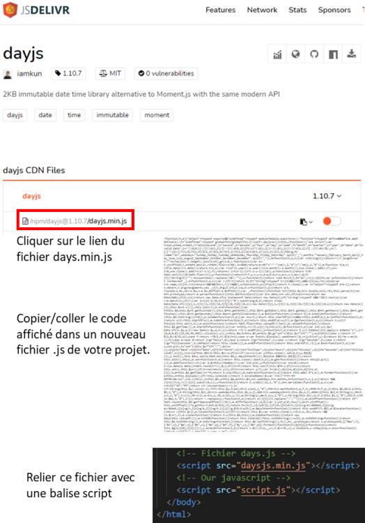

# Days.js

## Objetivo

- Aprender las bases sobre Days.js

## Contexto

Manipular las fechas es posible en JavaScript. Pero para los tratamientos complejos, será necesario escribir mucho código para llegar al resultado deseado. Existen herramientas que han sido creadas para simplificar estas manipulaciones: vamos a abordar ahora Days.js, que es una librería especializada en la gestión de fechas.

## Método

- Para descargar el archivo, hay que ir a la página: https://day.js.org/docs/en/installation/browser

- Haga clic en jsDeliv en "Day.js can be included by way of a CDN provider like cdnjs.com, unpkg and jsDelivr ..."¹[1]

- Si la página no aparece: https://cdn.jsdelivr.net/npm/dayjs@1/dayjs.min.js

- Añada un archivo que se puede nombrar por ejemplo: dayjs.min.js y copie este código librería

- Luego, en el código HTML, enlace este archivo dayjs.min.js es decir escriba aquí el código siguiente:

```html
<script src="dayjs.min.js"></script>
```

Vamos a ver aquí cómo instalar esta librería en su proyecto gracias a los enlaces CDN y en descarga. Days.js propone otras posibilidades de instalación, pero eso requiere nociones que no han sido abordadas todavía a este nivel. Toda la información está disponible en la pestaña instalación del sitio oficial.

## Instalación vía CDN:

Tendrá que integrar los enlaces CDN antes de su propio Javascript y antes de la etiqueta de cierre del </body`>`.

```html
<!-- nuestro código -->
<!-- CDN Daysjs -->
<script src="https://unpkg.com/dayjs@1.8.21/dayjs.min.js"></script>
<!-- nuestro Javascript -->
<script src="script.js"></script>
</body>
</html>
```

## Instalación en descarga:

Para descargar el archivo, hay que ir primero al sitio jsdelivr.com. Tendrá que hacer clic en el enlace con el nombre de archivo "dayjs.min.js". Se abrirá una nueva página que contiene el código de la librería en versión minificada. Solo tendrá que copiar/pegar este código en un archivo javascript que integre en su proyecto. Finalmente le queda enlazar este último archivo con una etiqueta script en su página html.



La instalación de Days.js está entonces finalizada, podemos empezar a utilizarla.

Days.js permite crear fechas, formatearlas, recuperar sus datos (como el año, el mes, el día de la semana, el día del año, etc.), manipular las fechas (adición / sustracción / diferencia entre 2 fechas), conocer el número de días en el mes, y muchas otras funcionalidades que podrá encontrar en la documentación.

### Ejemplo

```js
let date = dayjs('10-09-2021 10:30:04')
console.log(date.format()) // Muestra: 2021-10-09T00:00:00+02:00
console.log(date.format('dddd D MMMM YYYY')) // Muestra: sábado 9 octubre 2021
console.log(date.year()) // Muestra: 2021
console.log(date.month()) // Muestra: 9
console.log(date.day()) // Muestra: 6 (que corresponde al 7º día con una semana que empieza el domingo para un valor a 0)
console.log(date.hour()) // Muestra: 10
console.log(date.minute()) // Muestra: 30
console.log(date.second()) // Muestra: 4
console.log(date.add(7, 'day').format('el DD/MM/YYYY a hh:mm:ss')) // Muestra: el 16/10/2021 a 10:30:04
console.log(date.subtract(7, 'year').format('el DD/MM/YYYY a hh:mm:ss')) // Muestra: el 09/10/2014 a 10:30:04
console.log(date.startOf('year').format('el DD/MM/YYYY')) // Muestra: el 01/01/2021
console.log(date.endOf('month').format('el DD/MM/YYYY')) // Muestra: el 31/10/2021...
```

## A recordar

Days.js es una librería para manipular y mostrar las fechas y horas en JavaScript.

## Complemento

**[Day.js](https://day.js.org/)** / **[En GitHub](https://github.com/iamkun/dayjs)**