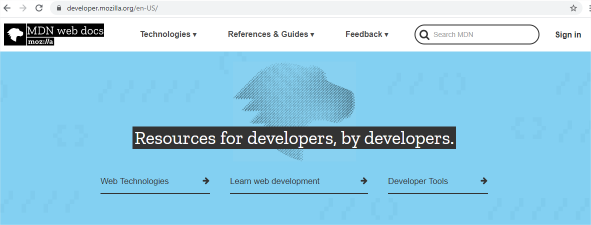
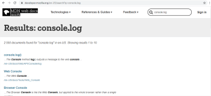
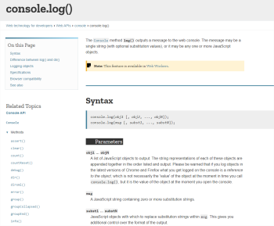
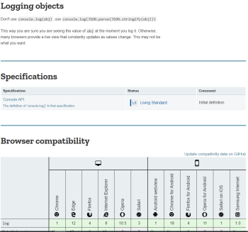

# La documentación oficial

## Objetivos

- Identificar cómo seguir la evolución del lenguaje
- Saber leer y buscar en la documentación oficial

## Contexto

JavaScript y un lenguaje muy completo y que no deja de evolucionar. Por lo tanto, es importante saber cómo seguir su evolución y dónde encontrar la información relevante en la documentación oficial.

## Seguir la evolución del lenguaje

JavaScript tiene como base un lenguaje de scripts: **ECMAScript**. Este lenguaje evoluciona al ritmo de las publicaciones de las normas **ECMA-262** y **ECMA-402** de la empresa **ECMA International**.

En 2015, una sexta evolución mayor de ECMAScript salió: **ECMAScript 2015**, frecuentemente llamada **ECMAScript 6** o **ES6**. Desde entonces, el ritmo de las publicaciones ha aumentado para ser anual, el número de versión hace referencia al año de publicación. 2019 = ECMAScript 2019, 2020 = ECMAScript 2020, etc. A pesar de todo, las evoluciones siendo menores, es frecuente hablar de la última versión del lenguaje con el término **ES6+**.

Todas las versiones de ECMA-262 y ECMA-402 son accesibles en el sitio oficial de ECMA International, bajo el menú Standards: [ECMA Standards](https://www.ecma-international.org/publications/standards/Standard.htm). También es posible seguir y participar en la evolución de la norma a través del GitHub de ECMA International: [GitHub ECMA TC39](https://github.com/tc39/ecma262).

## El sitio de referencia: MDN Web Docs

MDN Web Docs (Mozilla Developer Network) es una plataforma creada por la Fundación Mozilla que aloja documentación dedicada a las tecnologías del Web, como JavaScript, HTML y CSS. Con el tiempo y las innumerables contribuciones de la comunidad de los desarrolladores, MDN se ha convertido en el sitio de documentación de referencia para JavaScript y las API Web ([MDN Web Docs](https://developer.mozilla.org/en-US/)).

MDN propone un motor de búsqueda eficaz, que permite encontrar rápidamente la documentación sobre un elemento del lenguaje, o sobre una API Web.

## Buscar en la documentación

Si se desea tener más información sobre el uso del muy común `console.log`, basta con introducir el término en la barra de búsqueda, y MDN nos propondrá la documentación en relación.

En esta página, MDN pone a nuestra disposición una definición del método `.log()` de la API Web `console`. También hay información sobre la sintaxis del método y una definición de cada uno de sus parámetros.

MDN podrá proporcionar también:

- Consejos y ejemplos de uso,
- Un enlace hacia la especificación oficial,
- Y, si se trata de una API Web, la lista de los navegadores que lo implementan.

## Complemento: De la documentación, y un poco más

Sería injusto reducir el sitio de MDN a una simple documentación. Más allá de los aspectos documentales, se encuentran también numerosos **[tutoriales](https://developer.mozilla.org/fr/docs/Web/Tutorials)** o **[diferentes guías](https://developer.mozilla.org/fr/docs/Web/Guide)** para los desarrolladores, sea cual sea su nivel. Este sitio es una verdadera mina de oro que no hay que dudar en explorar.

De numerosos casos de uso con las demostraciones asociadas también están presentes. **[La API Web Audio](https://developer.mozilla.org/fr/docs/Web/API/Web_Audio_API)**, por ejemplo, propone muchos métodos para manipular datos audio en el navegador. Los casos de uso pueden ser vagos, pero, si se navega por la página, se puede darse cuenta que un ejemplo completo de uso está proporcionado.

## Nota: Atención al idioma

>Aunque MDN Web Docs esté disponible en español, es preferible realizar sus búsquedas en el sitio inglés. La documentación será generalmente un poco más rica y más reciente.

## A recordar

MDN Web Docs aloja una documentación oficial de JavaScript de una gran calidad. Es fuente de verdad, y es esencial referirse a ella para asegurarse que se utiliza correctamente las herramientas puestas a nuestra disposición.

## Complemento

- **[MDN Web Docs](https://developer.mozilla.org/es/)**