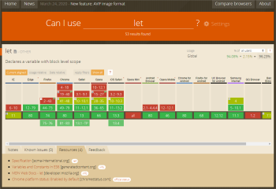

# Verificar y gestionar la compatibilidad

## Objetivos

- Verificar la compatibilidad de una funcionalidad
- Hacer compatible una funcionalidad

## Contexto

Si JavaScript es una herramienta que ofrece muchas funcionalidades, no todos los navegadores permiten utilizarlas, o al menos no lo permiten de forma nativa. Así, un código, aunque sea válido, no podrá ejecutarse tal cual en un navegador demasiado antiguo. Es importante, antes de usar funcionalidades específicas, verificar la compatibilidad de estas con los diferentes navegadores.

## Verificar la compatibilidad de las funcionalidades

Uno de los problemas más frecuentes en el desarrollo web es la gestión de la compatibilidad del código producido con un conjunto de navegadores web. De hecho, no todos implementan necesariamente el conjunto de API que se pueden querer usar, o no las implementan de la misma forma. Por consiguiente, escribir un código compatible con todos los navegadores es a menudo un rompecabezas. Afortunadamente, existen herramientas que listan las compatibilidades entre API y navegadores. Aunque el sitio MDN lista esta información, el sitio más avanzado en este tema es sin duda **[CanIUse.com](https://caniuse.com/)**.

CanIUse permite conocer rápidamente la compatibilidad del elemento buscado (aquí, la palabra clave let ) con cada versión de los diferentes navegadores web populares: Desktop o Mobile . Además, el peso de cada uno de los navegadores en el uso global se muestra. Lo que podrá, por ejemplo, darnos una indicación sobre la pertinencia de pasar tiempo en escribir un código compatible con un navegador muy poco utilizado.

## Polyfill

Un polyfill es un trozo de código (escrito la mayoría de las veces en Javascript) que permite proporcionar funcionalidades recientes en navegadores más antiguos que no las soportan de forma nativa.

## Complemento

Asegurar la inter-compatibilidad

Si se desea usar una característica reciente de JavaScript, pero que no es compatible con todos los navegadores que se apuntan, existe una herramienta capaz de escribir el polyfill que permitirá seguramente la compatibilidad: **[BabelJs](https://babeljs.io/)**. Se podrá probar los polyfills propuestos directamente en línea o referenciar el transpilador JavaScript en sus proyectos para convertir ES6 en ES5.

## A recordar

- Es muy importante verificar la compatibilidad de los diferentes navegadores con las funcionalidades un poco demasiado específicas que se puede estar tentado a usar, con **[CanIUse](https://caniuse.com/)** por ejemplo.

- Para hacer compatible una funcionalidad, existen herramientas como **[BabelJS](https://babeljs.io/)**.