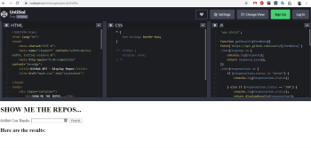
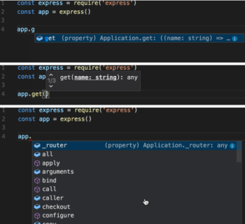

# Las otras fuentes de conocimiento

## Objetivo

- Identificar las fuentes de conocimiento y sus límites

## Contexto

La documentación oficial no siempre permite dar respuestas claras a las preguntas que un desarrollador se plantea en la práctica, y el contexto al que se enfrenta. Aunque la documentación sigue siendo la única fuente de verdad, a veces es útil tener otras fuentes de información para explorar un concepto o una tecnología.

## La comunidad

En el desarrollo, es frecuente hablar de comunidad. Este término no está desgastado, existe un verdadero espíritu de ayuda y colaboración que se expresa a través de diferentes plataformas.

**[StackOverflow](https://stackoverflow.com/)** es sin duda el foro más "cualitativo" sobre informática y desarrollo. Exclusivamente en inglés, este foro cuenta con varios millones de miembros activos y trata todos los temas relacionados con el desarrollo (identificables por etiquetas). Algunos de los mayores especialistas mundiales en JavaScript están presentes. Si nos hacemos una pregunta, es muy probable que ya haya sido planteada en este foro. Y el muy eficaz motor de búsqueda permitirá encontrar las respuestas asociadas, valoradas por los miembros. Es posible plantear sus preguntas, siguiendo las reglas muy estrictas del servicio, y la comunidad seguramente responderá. Sin embargo, hay que tener cuidado de no publicar elementos sensibles (dirección IP, nombre de usuario, contraseña...).

**Atención**

Hay que tener en cuenta que todas las respuestas que se puedan encontrar en un foro son potencialmente falsas, o al menos mal adaptadas al problema concreto al que nos enfrentamos. Es necesario contrastar sistemáticamente la información con la documentación oficial, única fuente de verdad. Es fundamental estar seguro de entender cada línea del código que se proponga y, para ello, se recomienda encarecidamente no copiar y pegar.

## Las plataformas de Proof Of Concept (P.O.C.)

A veces es útil tener un entorno fuera del proyecto en curso, para probar un trozo de código. Existen varias plataformas que ofrecen gratuitamente un entorno de desarrollo y prueba.

**[Codepen](https://codepen.io/)** es una de estas plataformas dedicadas a la escritura y prueba de código, destinada a las tecnologías front-end. Es posible escribir HTML, CSS y JavaScript (con o sin framework) y tener directamente el resultado en la ventana inferior. Es posible guardar sus trabajos y explorar los de todos los demás miembros. El contenido es público, así que hay que tener cuidado de no publicar nada sensible.

Existen multitud de plataformas del mismo tipo, como **[JSFiddle](https://jsfiddle.net/)**.

## La auto-completación

Es difícil recordar todos los métodos y propiedades que componen un objeto. Por eso Visual Studio Code ofrece varias ayudas a la escritura del código, agrupadas bajo el término IntelliSense. Se encuentran funcionalidades como:

- **Code completion:**

    - al escribir, el IDE nos propone, en un menú contextual, los elementos que pueden corresponder a los caracteres que hemos empezado a escribir y al contexto.

    ---

- **Parameter info:**

    - al situar el cursor sobre un método, el IDE nos muestra información sobre los parámetros esperados.

    ---

- **Member list:**

    - al situar el cursor sobre un objeto, el IDE nos muestra la lista de sus miembros.

    ---

    

Visual Studio Code viene con IntelliSense para JavaScript, TypeScript, HTML, CSS, SCSS y Less.

Es posible instalar otros, como para PHP o C#, a través del market place.

## A recordar

La comunidad JavaScript es una de las más activas del mundo. Por lo tanto, es fácil encontrar información sobre las diferentes plataformas de intercambio.

Sin embargo, esta información debe ser siempre verificada antes de ser utilizada.

## Complemento

- **[StackOverflow](https://stackoverflow.com/)**

- **[CodePen](https://codepen.io/)**

- **[JSFiddle](https://jsfiddle.net/)**

- **[Visual Studio Code](https://code.visualstudio.com/)**

- **[IntelliSense](https://code.visualstudio.com/docs/editor/intellisense)**