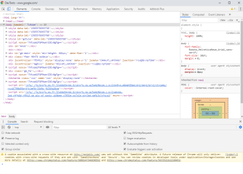
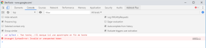
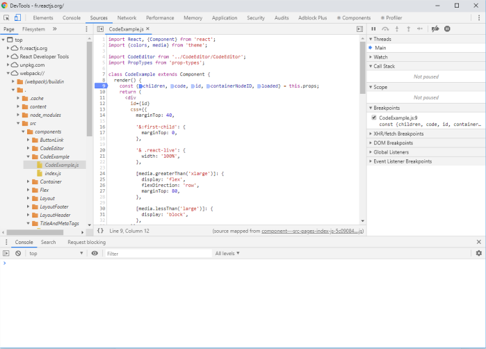
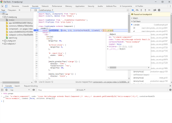
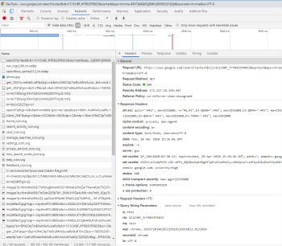

# Depurar en el navegador

## Objetivo

- Conocer las herramientas a disposición del desarrollador por el navegador

## Contexto

Los navegadores modernos ofrecen todo un conjunto de herramientas que facilitan la depuración de JavaScript, entre otras cosas.

## Herramientas de desarrollo Firefox y Chrome

Todos los navegadores modernos tienen herramientas de desarrollo o DevTools. Actualmente, los más avanzados son los de Firefox y Chrome. Para acceder a ellos, basta con abrir el navegador y pulsar la tecla F12 del teclado o Ctrl + Shift + i en Windows y Linux y Cmd + Opt + i en macOS. Aparece la ventana DevTools. Se podrá acoplar o desacoplar de la ventana del navegador en curso.

Varios pestañas están presentes y relacionadas con la página web que se muestra actualmente en el navegador.

### La pestaña elements



Aquí, la pestaña activa es Elements. Esta pestaña permite mostrar y modificar el código HTML y CSS de la página actual para un renderizado inmediato. Ctrl + Mayús + C (o Cmd + Opt + C en macOS) permitirá seleccionar elementos de la página web en la ventana principal y centrar el código HTML correspondiente.

### La pestaña console



La consola está presente en forma de una pestaña aparte, pero también en cada una de las pestañas de DevTools (pulsa ESC en cualquier pestaña para mostrar/ocultar). La consola tiene varias utilidades:

- Aquí se mostrarán todos los mensajes de error y advertencia generados durante la ejecución del código.
- También aquí se mostrarán todos los retornos de console.log().
- Es posible ejecutar código JavaScript directamente en la consola, pulsando ENTER después de haber escrito tu script. La consola ejecutará el código y podrá devolver un mensaje de información, error, advertencia, etc.

### La pestaña sources

La pestaña Sources es sin duda una de las pestañas más útiles para los desarrolladores. Permite explorar el código fuente de la aplicación web. Por ejemplo, podremos navegar por el árbol de la aplicación y explorar todos los archivos que la componen.

Consola Google chrome:



Consola Mozilla Firefox:


Uno de los grandes servicios que ofrece la pestaña Sources es la posibilidad de insertar puntos de parada y hacer un "paso a paso" sobre el código de la aplicación. Para añadir un punto de parada, basta con hacer clic en el número de la línea en la que queremos detenernos, y volver a ejecutar el código.



La línea actual se muestra resaltada. Ahora es posible evaluar los objetos JavaScript, ya sea pasando el cursor por encima, o escribiendo el nombre del objeto en la consola. También es posible instanciar variables, propiedades u otras cosas a través de la consola. Para avanzar "paso a paso" en el código, usaremos las flechas que hay arriba a la derecha de la ventana.

## Complemento: La palabra clave debugger

En JavaScript, existe la palabra clave debugger. La ventaja de esta palabra clave es que, si DevTools está abierto, el ejecutor JavaScript hará una pausa cuando encuentre la palabra clave debugger en el código.

```javascript
function Sum ( first , second ) {
  var result = first + second ;
  debugger //la ejecución del código se detendrá aquí
  return result ;
}
```

### La pestaña network



La pestaña Network nos permitirá interceptar todas las solicitudes HTTP enviadas desde la aplicación web. Para cada una de estas solicitudes, obtendremos información útil, como:

- La URL de destino
- El método HTTP
- El estado de la solicitud
- Los encabezados de la solicitud y de la respuesta
- La respuesta
- El tiempo de procesamiento de la solicitud
- etc.

Estas solicitudes podrán ser filtradas según sus tipos respectivos. Podremos elegir, por ejemplo, mostrar sólo las solicitudes XHR o Fetch.

## Complemento: Extensiones

Existen multitud de extensiones para el navegador que permiten facilitar el desarrollo en casos concretos. Estarán disponibles en las MarketPlaces respectivas de cada navegador. Se puede citar, por ejemplo, React Developer Tools para el desarrollo React.

## A recordar

Todos los navegadores web modernos ofrecen herramientas de ayuda al desarrollo de aplicaciones web. Para Chrome y Firefox, herramientas indispensables como el inspector, la consola web, el depurador JavaScript, y el interceptor Network son accesibles mediante la tecla F12.

## Complemento

- **[Chrome DevTools](https://developer.chrome.com/docs/devtools/)**

- **[Firefox DevTools](https://firefox-source-docs.mozilla.org/devtools-user/index.html)**