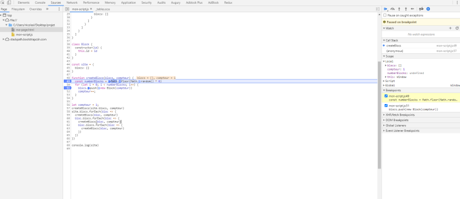
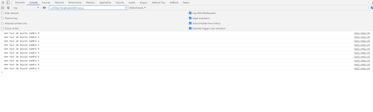

# Resolución de un bug: los pasos

## Objetivo

- Aprender una metodología de análisis y resolución de bugs.

## Contexto

El depuración es un aspecto particular y muy exigente del oficio de desarrollador. Sin las herramientas adecuadas y una buena metodología, puede convertirse rápidamente en un rompecabezas. Este curso aporta los principales pasos para una depuración eficaz.

## Reproducir el error

Cuando se reporta un bug, es primordial lograr reproducir el error. De lo contrario, ¿cómo asegurarse de la buena resolución del bug? Por lo tanto, es importante tener un escenario de reproducción completo con datos. A pesar de todo, hay que simplificar al máximo la redacción de un escenario, mantener solo los pasos indispensables para la reproducción. Este escenario se jugará muchas veces durante la depuración, lo ideal sería poder desencadenar el bug con un clic, como con una prueba unitaria.

La aparición de un bug a veces está relacionada con el contexto de ejecución del código. De hecho, los entornos de producción, integración o desarrollo pueden tener diferencias de infraestructura, software, datos, que van a influir en la aparición de bugs. Se recomienda encarecidamente tener un entorno de desarrollo que se parezca lo más posible al entorno de producción. Además, hacer debug en local es mucho más sencillo que en un entorno de integración o en producción. Cuanto antes se detecte el bug, menos costará corregirlo.

Si el bug no es reproducible, hay que averiguar por qué:

- ¿Ha sido corregido por una modificación del programa? Hay que encontrar cuál.
- ¿Está relacionado con los datos? Hay que importar o crear datos en local (mock).
- ¿Es debido al entorno? Si no es posible reproducir la configuración en local, habrá que depurar en ese entorno, con ayuda de logs por ejemplo.

Una vez definido el escenario, es importante extenderlo a otros datos para identificar los límites del bug.

### Ejemplo

Error detectado: Cuando se hace clic en el enlace "Usuario 1", su página de perfil no se abre.

Escenario principal de reproducción: Desde la página X, se hace clic en el enlace "Usuario 1".

Vamos a crear un escenario con un clic en el enlace "Usuario 2". Si el bug aparece, probablemente sea un problema con la apertura de la página, si no es así, seguramente sea un problema con los datos del usuario 1.

## Producir hipótesis

Ahora que podemos reproducir el error, es hora de formular hipótesis sobre su origen. Un bug puede aparecer en tres condiciones:

- Es la primera vez que se prueba el comportamiento en error,
- El entorno del proyecto ha cambiado (datos, librerías externas...),
- El error ha sido introducido con un nuevo código añadido al proyecto.

Para poder formular hipótesis correctas, hay que dominar todas las variables que van a ser utilizadas en la parte del proyecto incriminada. Para ello, a menudo es conveniente crear Mocks de datos.

## Consejo

No hay que subestimar la importancia de la experiencia en el diagnóstico, puede que un error similar ya le haya ocurrido a un compañero. No dudes en intercambiar.

## Realizar un diagnóstico

La estrategia más empleada para establecer un diagnóstico es el Back-tracking. Se trata de partir de la línea de código donde se ha detectado el bug, y remontar las instrucciones hasta encontrar el origen del bug.

Los pasos son sencillos:

- Añade un punto de parada al nivel de la línea de código en error,
- Ejecuta el código, según el escenario de reproducción del bug,
- Llegado al punto de parada, analiza los valores de las variables y define cuál provoca el error,
- Remonta hasta la instanciación de esa variable con el valor en error y añade un punto de parada. Elimina los puntos de parada añadidos anteriormente, para más claridad,
- Repite los pasos 2 a 4, hasta el origen del bug.

## Ejemplo: Un punto de parada en la consola Google Chrome

Para crear un punto de parada, hay que empezar por abrir la consola de tu navegador. La sección fuente está dividida en 3 partes. A la izquierda se encuentran los archivos del sitio (HTML, JavaScript, etc.). Haz clic en el archivo JavaScript que quieres probar. En el centro se encuentra el código del archivo seleccionado. Las líneas del código están numeradas. Para colocar el punto de parada, haz clic en el número de la línea a probar. A la derecha se encuentra el resumen del debug (número de puntos de parada, scope, etc.). El menú scope permite ver los valores de las variables en el momento en que se ejecuta el punto de parada.



## Consejo

Muchos depuradores permiten mostrar la pila de llamadas (callstack): puede ser útil utilizarla para remontar el origen de la llamada a la instrucción.

### Nota

>Si el bug ha sido introducido por una nueva versión del código, puede ser interesante jugar el caso de prueba en una versión anterior del código para comprobar si el bug ya estaba presente. Si no se levanta, prueba con el commit siguiente y así sucesivamente, hasta identificar la modificación responsable del error.

>Si, por ejemplo, no es posible colocar puntos de parada en un entorno de integración o en caso de bug imposible de reproducir, los logs serán nuestros mejores aliados. ¡Cuidado, sin embargo, la adición de logs puede modificar el comportamiento del programa y por tanto influir en el bug!

## Complemento: console.log

Otra estrategia de depuración utilizada es el uso del método console.log(). Este método devuelve en consola el resultado de la variable pasada como parámetro. Es un método muy práctico en el caso de una depuración dentro de un bucle, por ejemplo. De hecho, permite tener un resultado visual de la lista de valores devueltos o asignados en cada vuelta de bucle.

## Ejemplo: Un bucle simple

```javascript
for (let counter = 0; counter < 10; counter++) {
  const text = 'mi vuelta de bucle número ' + counter;
  console.log(text);
}
```



**Atención**

Siempre hay que eliminar los console.log()

No hay que olvidar eliminar los console.log() del código. Cuando vaya a producción y sea accesible por los usuarios, estos podrán ver los datos devueltos por los console.log() del código. Si se han probado códigos sensibles, como una contraseña de administrador por ejemplo, se mostrará en claro a todos los usuarios. Esto puede generar fallos de seguridad.

## Corregir un bug

Una vez identificado, reproducible y localizado el bug, hay que corregirlo respetando el nivel de calidad del código esperado en el proyecto. A veces, por falta de tiempo, el desarrollador se ve obligado a hacer una corrección rápida que no respeta el nivel de calidad o que deja a propósito partes no funcionales. La decisión no debe ser tomada únicamente por el desarrollador, sino que deberá ser capaz de argumentar y dar los límites del parche. Este quickfix debe ser temporal , fácilmente identificable en el código, rastreado en un gestor de tareas y sobre todo ¡debe ser extremadamente raro!

En cualquier caso, una vez corregido el bug, no dudes en compartir tu experiencia con el equipo del proyecto. Esto contribuirá a la mejora de los procesos y de la calidad del código en general.

## Complemento

La depuración es uno de los aspectos más exigentes del oficio de desarrollador. Hay una actitud que hay que tener para favorecer el trabajo:

- Todas las partes del código son potencialmente responsables del error,
- No hay que descuidar los errores más pequeños, un error tipográfico puede provocar enormes problemas,
- Antes de empezar el debug , hay que asegurarse de no tener modificaciones del código en curso,
- Hay que reservar suficiente tiempo para poder concentrarse sin ser molestado,
- El intercambio de experiencias es fundamental.

## A recordar

La presencia de bugs en un código es inevitable. Además, la depuración es uno de los aspectos más exigentes del oficio de desarrollador. Requiere mucha rigurosidad y método. Pero, si se respetan estos pasos, siempre será posible encontrar la fuente del problema.
