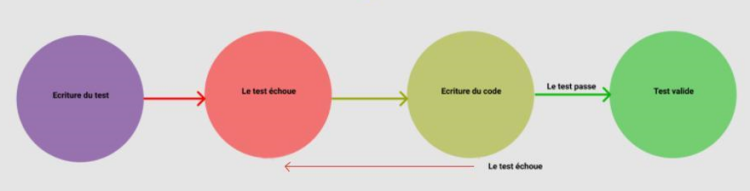
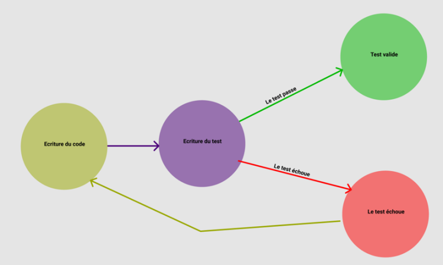
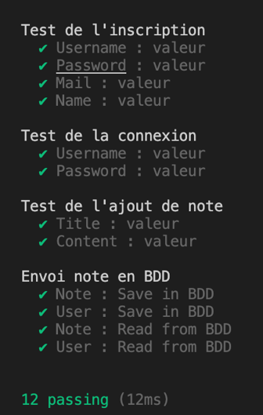
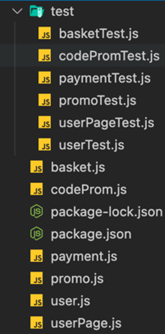

# Notiones generales

## Objetivo

- Definir qué es una prueba unitaria y su utilidad
- Conocer el funcionamiento de un desarrollo con pruebas

## Contexto

Las pruebas permiten gestionar eficazmente los errores y fallos (bugs) a lo largo del desarrollo. Para ello, los desarrolladores se organizan de tal manera que su código sea probado de forma óptima.

## ¿Qué es una prueba?

Una prueba permite verificar el código para encontrar posibles bugs, ralentizaciones, casos no tratados y varios otros puntos. Los códigos de un sitio web o de una aplicación suelen ser bastante extensos y evolucionan de forma regular (creación de la aplicación, corrección de bug, añadido de funcionalidad, modificación de una funcionalidad existente), por lo que hay que poder estar seguro de que estos añadidos no crearán problemas en el código existente. Las pruebas permiten evitar que sea el usuario final quien sufra estos posibles problemas.

Ejemplo simple, en el caso de que desarrolles solo, creas una función de cálculo de suma y tu aplicación espera categóricamente un número positivo como retorno. Si tu usuario lanza un cálculo de -7 + 3, tu aplicación podría fallar, una prueba habría permitido verificar que tu función sabía gestionar este caso.

## El desarrollo de la prueba

Las pruebas, como has podido entender anteriormente, son muy importantes. Permiten asegurar el despliegue de una aplicación pero también sus futuras actualizaciones. Esto conlleva una mejor experiencia de cliente por la reducción de fallos. Para la redacción de estas pruebas, hay varias formas de hacerlo:

- Antes de codificar la función: algunos desarrolladores empiezan por escribir las pruebas antes incluso de codificar la parte aplicativa. Es una práctica bastante habitual, el desarrollador conoce lo que va a proporcionar como información y lo que quiere recuperar. Es el principio mismo de una práctica de desarrollo (el TDD que veremos más abajo)

- Después de haber codificado la función: en este caso, estamos más en una óptica de probar lo que hemos creado, independientemente del tipo de prueba, recuperamos nuestra función y probamos todos los casos posibles

Sin conocimiento en los métodos de prueba, ya realizas naturalmente la segunda opción en prueba manual, vas a tu sitio y pruebas la función que acabas de crear, para verificar su buen funcionamiento.

## La automatización de las pruebas

El problema con las pruebas manuales, a pesar de sus cualidades, es que son lentas y no son repetibles. Para solucionar este problema, los desarrolladores tienen una opción llamada prueba automatizada. Estas pruebas se crean para poder ser repetidas cada vez que sea necesario. Están diseñadas para probar varios casos, facilitar la organización y su escritura y permiten tener resultados más legibles:

Puedes ver que el resultado de las pruebas está estructurado en categoría y con nombres para cada prueba. Cada prueba se valida 1 por 1 y se notifica el resultado de cada una para conocer la información del que falla.

Los herramientas de prueba automatizada poseen, la mayoría de las veces, un sistema para especificar dónde se encontrarán las pruebas:

- Archivo terminando por <Nombre del archivo>.test.js
- Archivo terminando por <Nombre del archivo>Test.js
- Carpeta test (como en el ejemplo anterior)

Esto permite mantener una coherencia global en la aplicación.

## Complemento

### El TDD (Test Driven Development)

El TDD (o Desarrollo guiado por las pruebas) invierte la tendencia que era codificar y luego probar. Con esta metodología, es al código al que hay que adaptarse a la prueba y no a la prueba al código. El desarrollo con este método se hace de la siguiente manera:

- Escritura de la prueba describiendo lo esperado
- Fallo voluntario de la prueba
- Escritura de la funcionalidad
- Paso de la prueba y corrección de los posibles errores
- Optimización del código
- Paso a la funcionalidad siguiente volviendo al principio de nuestra lista

A cada nueva funcionalidad, se prueban las anteriores. Esta práctica permite tener un código 100% probado y funcional.

## A recordar

Las pruebas unitarias son un aspecto primordial del trabajo de desarrollador.

Permiten asegurarse del buen funcionamiento del código, independientemente de las acciones del usuario o de los datos de entrada y salida.