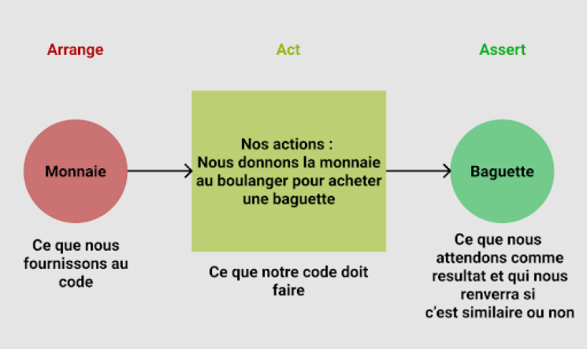
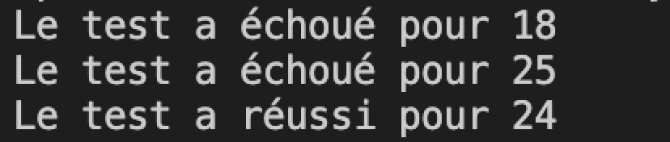
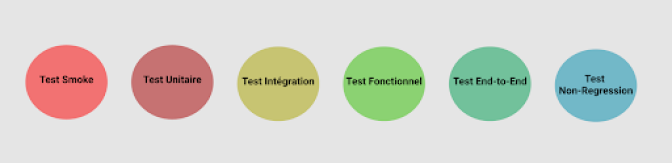

# Los diferentes tipos de pruebas

## Objetivos

- Conocer los diferentes tipos de pruebas y su sector de actividad
- Conocer el modelo de escritura de una prueba unitaria

## Contexto

En una aplicación, hay muchos elementos que hay que probar, por lo que existen varios tipos de pruebas, cada uno de los cuales tiene una utilidad y una complementariedad.

## Prueba unitaria

Una prueba unitaria permite probar una parte específica del código de forma individual e independiente del resto de la aplicación. Esto permite probar la calidad del código, los errores y el rendimiento de una parte específica del código. Por ejemplo: probar un tipo de datos para un campo de correo electrónico. Para ello, probamos los casos válidos pero también los inválidos.

### Ejemplo

Nuestra aplicación tiene un formulario de entrada de edad mayor, que verifica durante la entrada la validez de la información proporcionada. Nuestra prueba unitaria se centrará únicamente en el método que verifica la validez de la edad introducida.

```javascript
//Función test con la edad en parámetros
function valueAge(age) {
  //Test del input: ¿Es un número?
  //La función isNaN (isNotaNumber) devuelve verdadero si el valor no es un número
  if (isNaN(age)) {
    return false;
  }
  //Test del input: ¿Es este número mayor que 18?
  if (age < 18) {
    return false;
  }
  return true;
}

function testAge(input, result) {
  if (valueAge(input) === result) {
    console.log(`Test exitoso para ${input}`);
    return true;
  } else {
    console.log(`Test fallido para ${input}`);
    return false;
  }
}

//Podemos lanzar el test con el siguiente comando:
testAge(25, true);
testAge("nano", false);
testAge(12, false);
//De los 3 tests lanzados, solo 1 devolverá true
testAge(5, true);
//El último pasará como inválido porque le hemos marcado esperar un true
//Sin embargo la edad siendo inferior a 18, la respuesta será false.
...
```


El parámetro `input`, que corresponde a la edad del usuario, se definirá en la escritura del test y no dependerá de una entrada del usuario. El parámetro `result` será el resultado que esperamos. La función que probamos:

- Comprueba si la edad es un número con el test `isNaN` y si es mayor que 18 con `<18` que devolverán falso si no es así y detendrán el test, si el valor es inválido.

### Escribir una prueba unitaria, el patrón AAA

Para crear una prueba unitaria, utilizamos el modelo (patrón) AAA (Arrange, Act, Assert) principalmente.

Consiste en dividir la redacción de una prueba unitaria en 3 partes:

1. Arrange : Inicialización de los objetos, definición de los valores transmitidos al método a probar. (En nuestro ejemplo anterior, se trata de `input`)
2. Act : Llamada al método probado con los parámetros definidos en la sección Arrange. ( En nuestro ejemplo, se trata de las llamadas a `valueAge`, pero también podría haber llamado a una función externa)
3. Assert : Verificación de que el método probado es conforme a lo que esperamos. (En nuestro ejemplo `testAge`)

Si en nuestra vida cotidiana, por ejemplo, realizamos una prueba con el modelo AAA para ir a comprar una barra de pan a la panadería, tendría este esquema:



## Pruebas funcionales

Una prueba funcional permite comparar la conformidad de la aplicación con las necesidades iniciales. Esta prueba, a diferencia de la prueba unitaria, permite tratar una parte más importante del código. Esto permite probar la calidad funcional de nuestro código. Por ejemplo: si retomamos nuestro ejemplo del input del campo de correo electrónico, en el caso de la prueba funcional, podría realizarse sobre la reacción del código al enviar el formulario. En caso de datos inválidos ¿qué pasa? ¿Se guardan bien las informaciones en la base de datos?

### Ejemplo

Imaginemos una aplicación que tiene un formulario de entrada de edad que permite probar la mayoría del usuario. Esta aplicación deberá devolver el número de años antes de la mayoría ficticia (25 años) - por ejemplo en el marco de un sitio sobre las diferencias entre la mayoría francesa y ficticia. Nuestra prueba funcional probará lo que pasa después del envío de la edad por el usuario a través de un botón calcular.

```javascript
//Nuestra función de base que se lanza al click sobre el botón
//El input representa el valor de la edad usuario
function calculAge(input) {
  if (isNaN(input) || input < 18) {
    return false;
  }
  if (input > 25) {
    return `Eres mayor y listo`;
  } else if (input < 25) {
    return `Te quedan ${25 - input} años antes de ser mayor`;
  }
}

// Función test con nuestro valor en 1er parámetro y nuestro resultado esperado en 2º
function testSubmit(input, result) {
  let test = calculAge(input);
  if (test === result) {
    console.log(`La prueba ha sido exitosa para ${input}`);
  } else {
    console.log(`La prueba ha fallado para ${input}`);
  }
}

//Lanzamos nuestra prueba con nuestro valor en 1er parámetro y nuestro resultado esperado en 2º
testSubmit(18, false);
testSubmit(25, `Eres mayor y listo`);
testSubmit(24, `Te quedan 1 años antes de ser mayor`);
...
```



Partimos del principio de que la función `calculAge` es la función llamada en cada `onClick` y ésta debe devolver el mensaje final. Creamos entonces una función que va a probar si el resultado de esta función `calculAge` corresponde bien al esperado. En el caso presente, un fallo no quiere decir que el dato sea malo, sino que el resultado no es el esperado con respecto a un funcionamiento deseado. Tomemos los resultados 1 por 1:

- El primero es un fallo voluntario : Proporcionamos un resultado falso, pero la lógica querría que el resultado fuera "Te quedan 7 años antes de ser mayor en América", la prueba devuelve entonces un fallo.
- El segundo es un fallo involuntario : Hemos proporcionado un input y un resultado que deberían coincidir, sólo que la prueba termina en fallo. Efectivamente, si miramos atentamente, nos damos cuenta de que el caso donde el input es igual a 25 no está gestionado por nuestra función (en nuestro ejemplo, la prueba unitaria no habría podido señalarnos este error).
- El último es una prueba exitosa : El input dado corresponde bien al resultado esperado.

Esta prueba nos habrá permitido encontrar un error en nuestro funcionamiento (un olvido en la gestión de las condiciones).

## Otros tipos de prueba

Existen muchos otros tipos de pruebas, de las que veremos algunas a continuación, para centrarnos en las 2 pruebas citadas más arriba.

- Las pruebas de integración permiten probar la integración de los diferentes módulos en su entorno final, esto permite ver problemas de interfaz por ejemplo entre 2 módulos (ejemplo, el usuario introduce una edad, ¿esto desencadena bien la función que sigue?).
- Las pruebas de no regresión permiten probar la integridad de las funciones existentes al añadir funcionalidades (ejemplo, la adición de un botón que crea un mal funcionamiento en una función debido a su nombre ya utilizado).
- Las pruebas E2E (End-to-End) son pruebas de la aplicación de principio a fin, por ejemplo:
  - El usuario entra en la ficha edad
  - El input se muestra
  - El usuario introduce su edad
  - El usuario valida con el botón Calcular
  - La función calcula y muestra el resultado
- El Sanity testing (test smoke) es una prueba unitaria o funcional de una funcionalidad crítica, si esta prueba falla, las demás pruebas no son útiles. Ejemplo, sobre nuestro ejemplo End to End: "¿Se muestra bien el input?"

## Esquema de prueba

Como habrás podido comprobar, existe un número considerable de tipos de pruebas (y no los hemos citado todos). Sin embargo, no se lanzan de forma aleatoria, una esquematización de su funcionamiento podría parecerse al ejemplo siguiente:



Por supuesto, a medida que han ido saliendo soluciones optimizadas se ha facilitado el trabajo del desarrollador en la creación de estos tests y de la lógica de prueba.

## A recordar

- Los tests unitarios son un aspecto primordial del trabajo de desarrollador. Permiten asegurar el buen funcionamiento del código, cualesquiera que sean las acciones del usuario o los datos de entrada y salida1.

- Los tests funcionales, tan importantes como los tests unitarios, prueban el buen funcionamiento de la lógica y de las funciones2.

- Existen numerosos tests (Smoke, Integración, End-to-End, No-Regresión y otros) que permiten controlar la viabilidad del código de la aplicación y minimizar al máximo los errores3.