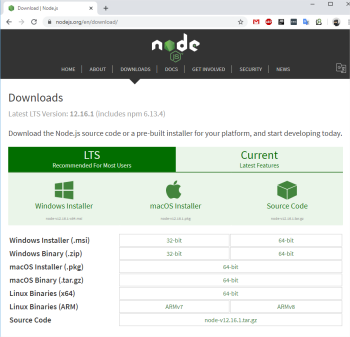
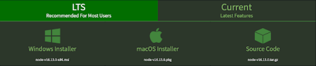
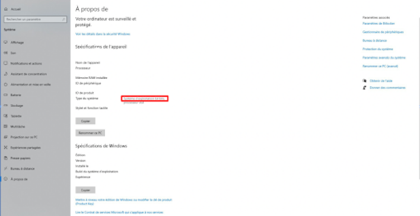
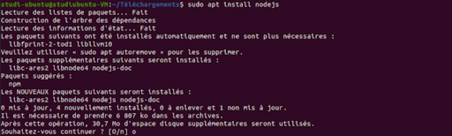
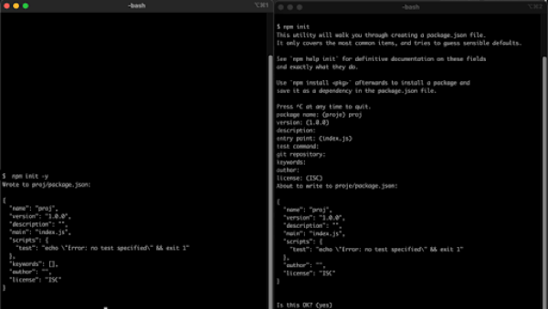
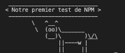

# Node.js y NPM

## Objetivos

- Descubrir Node.js y NPM
- Instalar Node.js y NPM
- Saber usar Node.js y NPM para el desarrollo front-end en JavaScript

## Contexto

Node.js es un entorno de ejecución basado en el motor JavaScript V8 de Chrome. Node.js permite, entre otras cosas, ejecutar JavaScript en el lado del servidor. Esto permite, por ejemplo, poder ejecutar código JavaScript sin navegador. Provisto con la herramienta NPM, esta última permite, entre otras cosas, obtener herramientas de prueba eficientes y automatizadas para JavaScript.

## Node.js

Para instalar **[Node.js](https://nodejs.org/en/download)**, basta con ir al sitio del proyecto nodejs.org, y en la sección Downloads.



Node.js ofrece dos versiones:

- Current: última versión mayor de Node.js, incluye las últimas novedades y el soporte no será necesariamente asegurado. Esta versión está destinada a los desarrolladores que quieren probar las últimas novedades y adaptar el código a una versión futura.

- LTS (Long-Term Support): designa una versión cuyo soporte técnico será asegurado durante un largo período. Es esta versión la que se debe utilizar en producción y en un ciclo de desarrollo clásico, esta versión se considera más estable y reduce la tasa de problemas.



La versión más sencilla para la instalación de node.js es:

- Windows Installer (.msi) para Windows
- macOS Installer (.pkg) para Mac OS X
- Por el repo apt para Ubuntu, Debian, etc
- Linux Binaries para Linux que está disponible en la lista


Atención sin embargo a tu arquitectura de procesador (32/64 bits) para Windows. Puedes conocerla pulsando el atajo: Win + R y luego escribiendo el comando: ms-settings:about en el menú Ejecutar que aparece. Encontrarás entonces tu arquitectura indicada como a continuación.



La ventaja de la instalación de node.js es que basta con lanzar el paquete (mac OS) o el ejecutable (Windows) para instalarlo y seguir los pasos. Para su instalación en los derivados de Debian, vía apt, basta con actualizar el gestor de paquetes apt y lanzar la instalación:

```bash
sudo apt update
sudo apt install nodejs
```



Puedes verificar la buena instalación con node -v.

## NPM

Con node.js viene una herramienta muy práctica, NPM, esta herramienta nos permite gestionar los paquetes node y ejecutarlos. Es gracias a estas herramientas que vamos a poder instalar y utilizar un Framework de prueba.

### NPM

NPM es el gestor de paquetes oficial de Node.js:

- Paquete (package): un paquete es un conjunto de funciones utilitarias agrupadas y puestas a disposición para poder ser reutilizadas o ejecutadas sin tener que reescribir el código. Cada paquete tiene un número de versión que permite garantizar la coherencia en su uso.
- Gestor de paquetes: un gestor de paquetes es una herramienta que va a permitir descargar, actualizar y eliminar los paquetes referenciados en una aplicación, y gestionar sus dependencias. Si el paquete A referencia el paquete B y nuestra aplicación referencia el paquete A, entonces NPM descargará el paquete A y el paquete B.

NPM siendo el gestor de paquetes oficial de Node.js, está incluido en la instalación de Node.js. Para probar la buena instalación del ejecutable NPM, se puede ejecutar el siguiente comando en la consola:

```bash
npm --version
```

La versión debería aparecer entonces.

## Consejo

Después de la instalación, a menudo es necesario reiniciar.

Para probar la buena instalación de node.js, se puede probar su instalación con el mismo comando que para NPM, verificando su versión.

```bash
node --version
```

## Comando

Node tiene un comando, útil e indispensable: Node <nombre del archivo>.js permite lanzar el archivo JavaScript con el motor de node.js, por ejemplo node index.js, el archivo JavaScript se lanza entonces sin navegador (atención, esto significa también que los console.log se mostrarán en tu terminal).

NPM tiene muchas funciones que se utilizan así: npm <nombre del comando>, vamos a ver algunas aquí:

- init permite inicializar un proyecto node.js, esta función crea un archivo package.json que almacenará la información necesaria para el buen funcionamiento de node.js. Este comando pedirá sin embargo mucha información para crear un archivo package.json personalizado. Es necesario para cada nuevo proyecto que utilice node.js.
- install `<nombre del paquete>` permite instalar un paquete en su última versión gracias a su nombre, podemos por ejemplo instalar un paquete de prueba llamado: cowsay, el comando completo será: npm install cowsay.
- uninstall `<nombre del paquete>` permite desinstalar un paquete gracias a su nombre, su funcionamiento es similar a install: npm uninstall cowsay.
- update `<nombre del paquete>` permite actualizar el paquete indicado, su funcionamiento es similar a install: npm update cowsay.

Vamos a ver ahora los "flags" que son parámetros que podemos añadir a estos comandos para mejorar su comportamiento.

## flags

NPM funciona con flags, 3 en particular te serán útiles:

- --save-dev permite notificar que el paquete instalado será únicamente necesario durante el desarrollo, esto evita tener el módulo en cuestión durante la etapa de producción (despliegue para los usuarios finales) cuando el proyecto tiene una (ejemplo: npm install cowsay -save-dev).
- -g para global, permite, al instalar o desinstalar un paquete, hacerlo de forma global. El paquete se instalará entonces en la máquina en lugar de hacerlo en tu proyecto únicamente (ejemplo: npm install cowsay -g).
- -y que podrás ver más abajo, permite durante un npm init, especificar que deseas una creación rápida de proyecto (ejemplo: npm init -y).

## Utilización básica de NPM

Para gestionar las diferentes versiones de los paquetes en una aplicación, NPM se basa en el archivo package.json presente en la base del proyecto. Si no existe ningún archivo package.json, hay que crearlo inicializando el proyecto node con npm init. Basta con rellenar la descripción del proyecto en la consola. Si no necesitas personalizar la información de tu proyecto node.js, puedes utilizar directamente el comando npm init -y, este comando permite dejar los valores por defecto.

A continuación, para añadir un paquete a nuestro proyecto, habrá que pedir a NPM que lo descargue y lo instale con el comando npm install `<nombre-del-paquete>`. Los paquetes se añadirán al directorio node-modules en el directorio del proyecto y la información del paquete se añadirá en el archivo package.json.



Como puedes ver, el método con el flag -y es más rápido, pero no podrás personalizar: el nombre, la versión, la descripción, las palabras clave, el autor y la licencia. Sin embargo, si necesitas modificar esta información más tarde, podrás modificar el archivo package.json.

### Ejemplo

Vamos a crear un proyecto para probar el paquete citado más arriba como ejemplo (cowsay que permite mostrar una vaca en texto y un mensaje). Para empezar, nos hará falta una carpeta para acoger nuestro proyecto. La creamos entonces y nos posicionamos dentro. Inicializaremos nuestro packag.json con npm init (para este proyecto utilizaremos el flag -y porque una configuración por defecto es suficiente para un proyecto de prueba).

```bash
mkdir cowProject
cd cowProject
npm init -y
```

Wrote to ./cowProject/package.json:

```json
{
  "name": "cowproject",
  "version": "1.0.0",
  "description": "",
  "main": "index.js",
  "scripts": {
    "test": "echo \"Error: no test specified\" && exit 1"
  },
  "keywords": [],
  "author": "",
  "license": "ISC"
}
```

…

Luego instalaremos nuestro paquete:

```bash
npm install cowsay
```

added 41 packages, and audited 42 packages in 2s

3 packages are looking for funding
run `npm fund` for details

4 moderate severity vulnerabilities
To address all issues (including breaking changes), run:
npm audit fix --force

Run `npm audit` for details.

…

Nuestro paquete ya está instalado y listo para ser utilizado. Vamos a crear un archivo `index.js` que contendrá nuestro código para el entorno de ejecución de node.js.

```javascript
const cowsay = require('cowsay');
const message = cowsay.say({ text: 'Nuestra primera prueba de NPM' });
console.log(message);
```

Explicamos este código:

- La primera línea es nuestra importación de `cowsay`.
    Puedes notar que no especificamos una ruta en el `require`, solo el nombre del módulo.
    Por defecto, node buscará el módulo en la carpeta `node_modules`.

- La segunda línea crea una variable `message` y llama a la función `say` de nuestro módulo pasándole el mensaje 'Nuestra primera prueba de NPM' como parámetro.

- Finalmente, registramos el resultado en la consola.

Vamos a lanzar nuestro proyecto con:

```bash
cmd > node index.js
```

Veamos el resultado:



Con este resultado, quizás estés dudando acerca de nuestra pequeña vaca que anuncia orgullosamente nuestra primera prueba. Pero es realmente asombroso.

Hasta ahora, nuestro código JavaScript necesitaba un navegador para funcionar porque es un lenguaje basado en el lado del cliente.

Pero con esta prueba, lo hemos ejecutado únicamente en línea de comandos, sin navegador.

Esto es lo que nos propone node.js, un entorno JavaScript utilizable sin navegador, tanto para uso del lado del cliente como del servidor.

## A recordar

- Node.js es una plataforma de ejecución (runtime) que permite ejecutar JavaScript sin pasar por el navegador.
- Viene con su gestor de paquetes NPM, que permite descargar paquetes seleccionados de la colección open source más grande del mundo y gestionar sus versiones.
- Gracias a node, JavaScript ya no está limitado al lado del cliente sino que puede realizar tareas del lado del servidor.

## Complemento

- **[Node.js](https://nodejs.org/en)**

- **[NPM](https://www.npmjs.com/)**
