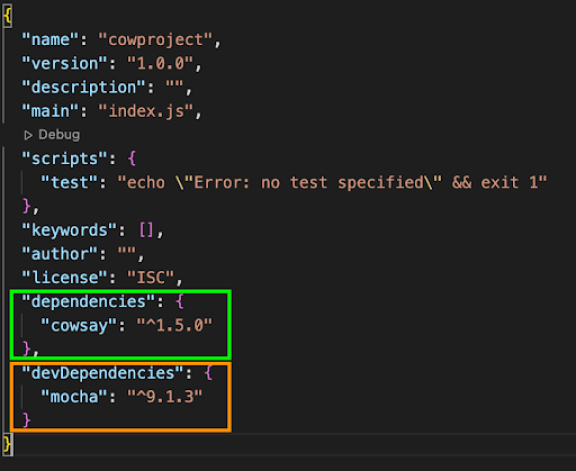
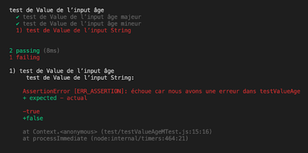
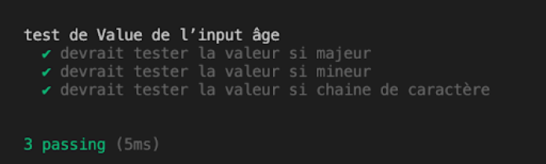

# Herramientas de prueba de JavaScript

## Objetivos

- Conocer varias herramientas de prueba de JavaScript
- Aprender los conceptos básicos del uso de las herramientas de prueba

## Contexto

Para escribir y ejecutar pruebas unitarias o de integración, el ecosistema JavaScript ofrece varias herramientas avanzadas. Vamos a ver aquí el uso de una de estas herramientas, Mocha, que es representativa del uso de las herramientas más potentes. Tendrás la oportunidad de ver algunas otras a medida que avances en tu experiencia, especialmente Jest, que se usa nativamente con la biblioteca React (una biblioteca JavaScript que permite crear interfaces de usuario dinámicas).

## Mocha

Mocha es un marco de prueba de JavaScript. Es una herramienta simple, extensible y rápida que se puede usar para escribir pruebas unitarias o de integración. Hay 2 soluciones para su instalación:

- `npm install --save-dev mocha`: Puedes instalar mocha como una dependencia de desarrollo en tu proyecto, npm lo ignorará en modo Producción.
- `npm install -g mocha`: Puedes instalarlo globalmente, mocha entonces no será específico para tu proyecto sino que estará instalado en tu máquina. (Atención: Esto implicará que tendrás que actualizarlo tú mismo con el comando `npm update -g mocha` porque sino la dependencia local se quedará en su versión de instalación).

## Ejemplo

Para este ejemplo, lo instalaremos como una dependencia de desarrollo en nuestro proyecto `cowproject`, esto nos permitirá ver la reacción del archivo `package.json`.

```bash
cmd> npm install --save-dev mocha
```



Si miramos nuestro `package.json`, podemos ver que la dependencia mocha está separada de los otros módulos. Las dependencias de producción están en verde mientras que las específicas del desarrollo están en el cuadro naranja. El archivo `package.json` también nos permite ver cómo se organizan nuestros paquetes.

Para el resto lo instalaremos globalmente (con `npm install -g mocha`) para mayor facilidad. El comando para llamar a mocha será simplemente `mocha` para una instalación global y `/node_modules/.bin/mocha` para una instalación en el proyecto.

## Mocha: Funcionamiento

Mocha tiene varias interfaces que definen la metodología de escritura de nuestras pruebas, las 2 más comunes son:

- TDD (una interfaz diseñada para la metodología de prueba antes del aplicativo)
- BDD (la más extendida)

Nos basaremos en la interfaz BDD, que nos aportará las funciones `describe`, `context`, `it`, `specify` y otras. Vamos a explicar estas 4 primeras funciones y verlas en acción en nuestro ejemplo. Para ello importaremos un módulo que contiene nuestro código de prueba de valor para el input sobre la mayoría y realizaremos nuestras pruebas sobre él.

## Nota

> ¿No conoces la exportación-importación de módulos? Efectivamente, este punto aún no se ha abordado. Más allá de los comandos de node y npm en la línea de comandos, node.js aporta muchas funcionalidades para hacer que JavaScript sea más potente y agradable. La exportación de módulos es una buena representación, esta última permite poner una parte de tu código en un archivo JS y exportarlo desde este último (con la palabra clave `export`). Puedes exportar una sola variable (o función) y hacerla EL módulo de tu archivo `module.exports = <Variable o Function>`. O exportar varias encapsulándolas en un objeto JS con:

```js
module.exports = { variable1, function , Variable2 }
```

Luego podrás importarlas como módulos node, con la diferencia de que tendrás que especificar la ruta. Por ejemplo:

```js
import testValueAge from './function/testValueAge.JS'
```

### Preparación y diseño de una prueba con Mocha

Para poder realizar nuestra prueba, vamos a crear un proyecto con `npm init` en una nueva carpeta, luego una carpeta `test` en la raíz de nuestro proyecto. Por defecto, mocha busca esta carpeta como base de pruebas. También crearemos un archivo `testValueAge.js` que pondremos en la raíz y que tendrá el siguiente código:

```js
function testValueAge ( input ) {
  if ( isNaN ( input )){
    return true
  }
  if ( input < 18 ){
    return false
  }
  return true
}
module . exports = testValueAge
```

Finalmente crearemos un archivo `testValueAgeMTest.js` en la carpeta `test` que contendrá el siguiente código:

```js
const testValueAge = require ( '../testValueAge.js' )
const assert = require ( `assert` )
describe ( `test de Value de l’input âge` , function (){
  it ( `devrait tester la valeur si majeur` , function (){
    assert . equal ( testValueAge ( 20 ), true )
    assert . equal ( testValueAge ( 50 ), true )
    assert . equal ( testValueAge ( 44 ), true )
  })
  it ( `devrait tester la valeur si mineur` , function (){
    assert . equal ( testValueAge ( 12 ), false )
    assert . equal ( testValueAge ( 8 ), false )
  })
  it ( `devrait tester la valeur si chaine de caractère` , function (){
    assert . equal ( testValueAge ( 'Hello World' ), false , 'échoue car nous avons une erreur dans testValueAge' )
  })
})
```

Intentemos leer nuestro código:

- La importación de nuestra función con `require('../testValueAge.js'`, esto nos permitirá usarla para nuestras pruebas. Además, si modificamos la función en su archivo original y volvemos a ejecutar las pruebas, se probará la nueva versión del código, porque se exporta en el archivo de prueba.
- La importación del módulo `assert`: `assert` es un módulo que nos permitirá verificar que el resultado coincida con nuestras expectativas. Por defecto mocha no tiene ninguna dependencia de `assert`, así que usamos la que viene con node.js.
- La función `describe`: Permite crear una categoría, un contexto para nuestras pruebas. Toma 2 parámetros: el nombre de la categoría y la función que contendrá sus pruebas.
- La función `it`: Define la prueba it = eso. Si resumimos esta línea de nuestra prueba, equivaldría a decirnos: "eso debería probar el valor si mayor". Como `describe`, toma 2 parámetros: su nombre y la función que contendrá sus pruebas.
- La función `assert.equal`: Esta función toma2 parámetros (y 1 opcional), es ella la que hará el grueso del trabajo, verificará que el valor obtenido en el primer parámetro sea igual al valor esperado (que especificamos en el segundo parámetro). El tercer parámetro (opcional) permite crear un mensaje de error específico.
- El resto del código es una repetición de estas acciones.

Si ejecutamos el comando `mocha` (en el caso de una instalación global de mocha). Si no, instalar mocha con `npm install --save-dev mocha` y ejecutar el comando `/node_modules/.bin/mocha`⁵[5]. Recibimos este resultado:



Podemos ver entonces que 2 pruebas pasan pero no la tercera¹⁹[19]. La que concierne al caso de otro tipo que un number como input. Si miramos nuestro código `testValueAge.js`, podemos detectar rápidamente el error:

```js
if ( isNaN ( input )){
  return true
}
```

Esta condición debería devolver `false`, porque no nos conviene si el input no es un número. Al modificar esto, obtendremos un mejor resultado:



## Nota: El caso de context, specify y otras funciones
>
> context y specify son alias para describe e it, por lo que puedes usarlos para reemplazarlos. Sin embargo, hay otras 2 funciones interesantes:
>
> - before(), que se coloca antes de cualquier it, esta función permite lanzar cualquier acción antes de iniciar las pruebas.
> - after(); esta función permite como before() lanzar cualquier acción, pero después de las pruebas.

Por supuesto, aquí está la traducción en formato markdown:

## Las funciones de assert

Assert es proporcionado por node.js, ofrece más que la simple función equal mencionada anteriormente¹[1].

Aquí hay una lista de algunas funciones útiles que funcionan bajo el mismo principio que equal:

- `assert.match` permite verificar un valor con un resultado esperado en forma de REGEX (ejemplo: `assert.match('Je fonctionne bien',/fonctionne/)`).

- `assert.notEqual` es lo contrario de equal, verificará que los valores dados y esperados no sean iguales.

- `assert.doesNotMatch` es lo contrario de match, verificará que el valor dado no coincida con la REGEX esperada.

- `assert.ifError` solo toma un parámetro que representa la variable de error, esperará la presencia de un error, mientras que su valor sea null el test pasará.

## Complemento: Los otros frameworks de pruebas

Jest o Jasmine son frameworks de pruebas que compiten con Mocha. Se usan de forma muy similar, con la diferencia de que Jest y Jasmine se consideran frameworks completos, es decir, que el desarrollador no tendrá que añadir paquetes externos (no hay que importar assert en este caso, Jest y Jasmine tienen su propia función assert).

### ¿Cuál elegir?

Como siempre, dependerá de tus necesidades específicas para el proyecto. Si es un proyecto grande, que requiere tener una herramienta perfectamente adaptable a cada caso, Mocha será probablemente el más adecuado.

Si, por el contrario, el proyecto es de tamaño más pequeño, Jest o Jasmine evitarán una importante fase de configuración de la herramienta de prueba. A pesar de todo, también depende, como para los lenguajes, de la afinidad del desarrollador con su herramienta.

## Para recordar

El rico ecosistema de JavaScript nos ofrece varios paquetes acabados para escribir y ejecutar pruebas unitarias, de integración o funcionales.

Estas herramientas deberán ser elegidas por el desarrollador al inicio del proyecto, en función de las necesidades futuras.

Mocha permite dar un primer paso en los tests a través de node.js.

El módulo assert proporcionado por node.js posee varias funciones que permiten comparar nuestro resultado con lo esperado.

## Complemento

- **[Mocha](https://mochajs.org/)**

- **[Jest](https://jestjs.io/)**

- **[Jasmine](https://jasmine.github.io/)**

- **[Chai](https://www.chaijs.com/)**

- **[Sinon](https://sinonjs.org/)**
