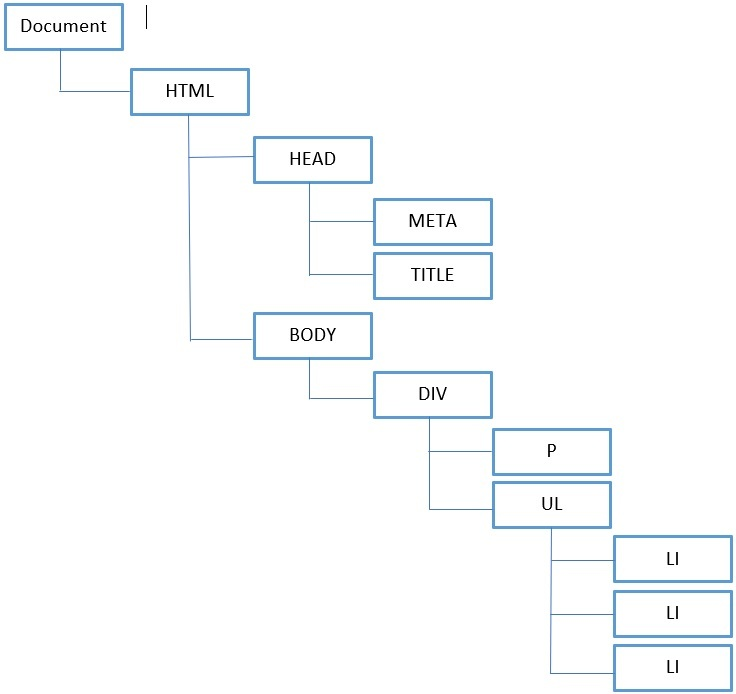
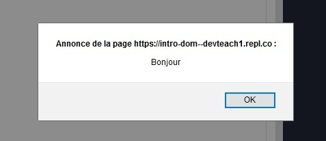
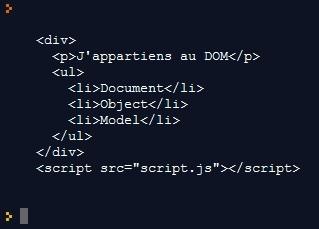
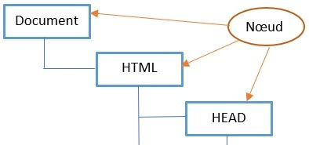

# Introducción a la API DOM

## Objetivos

- Saber definir el DOM
- Saber definir un nodo
- Describir el DOM

## Contexto

Una página web es un documento HTML que puede ser mostrado en un navegador. El DOM permite representar esta página como un conjunto de objetos. Se representa generalmente como un árbol en el que las ramas son los elementos HTML y CSS. Vamos a ver aquí los elementos que lo componen.

## Definición del DOM

El DOM (por Document Object Model) es una interfaz de programación para los documentos HTML y XML. Proporciona una página cuyos programas pueden modificar la estructura, su estilo y su contenido. Esta representación del documento permite verlo como un grupo estructurado (un árbol) de nodos y objetos que tienen diferentes propiedades y métodos. Básicamente, conecta las páginas web con los scripts o lenguajes de programación. Está regido por las normas de la W3C.

Todos los elementos de un documento, es decir, el documento mismo, los encabezados, los bloques de contenido `<div></div>`, los párrafos `<p></p>`, el estilo `color: #FFFFFF`, el texto y muchos otros forman parte del DOM.

### Ejemplo

```html
<!DOCTYPE html>
<html>
<head>
  <meta charset="utf-8">
  <title>Document web</title>
</head>
<body>
  <div>
    <p>J'appartiens au DOM</p>
    <ul>
      <li>Document</li>
      <li>Object</li>
      <li>Model</li>
    </ul>
  </div>
</body>
</html>
```

La página web representada por el código HTML anterior puede ser modelada por el esquema siguiente.



## ¿Cómo acceder al DOM?

No hay nada que instalar o descargar para manipular el DOM. Es nuestro navegador el que implementa un DOM para hacer accesibles nuestras páginas web a JavaScript. Podemos empezar a usar la API. Los puntos de entrada principales son los elementos `document` y `window`:

- `document` representa el contenido de la página web, es decir, el árbol del DOM: vamos a recorrer los elementos, añadir o eliminarlos gracias a él.
- `window` representa la ventana del navegador, en la que se carga un documento.

## Ejemplo Window

```javascript
window.addEventListener('load', () => {
  window.alert('Bonjour')
})
```

En este ejemplo, se mostrará una ventana emergente con el mensaje "Bonjour" cuando la página web esté completamente cargada.



## Ejemplo Document

```javascript
window.addEventListener('load', () => {
  console.log(document.body.innerHTML)
})
```

En este ejemplo, accedemos a nuestro `<body></body>` gracias al elemento `document`, luego `body`, luego la propiedad `innerHTML` que permite mostrar el árbol del DOM a partir del elemento deseado (aquí, `body`).



## ¿Qué es un nodo?

Un nodo (o node) es simplemente un elemento del DOM: un texto, una etiqueta HTML, o un atributo por ejemplo. Podremos acceder a los nodos, modificarlos, crear nodos hermanos, padres, hijos... gracias a los métodos de la API.



- Nodo hermano: se sitúa al mismo nivel en el árbol.
  `<div><p class="frere"></p><p class="frere"></p></div>`
- Nodo padre: se sitúa un nivel por encima en el árbol.
  `<div id="parent-de-p"><p></p></div>`
- Nodo hijo: se sitúa un nivel por debajo en el árbol.
  `<div><p id="enfant-de-div"></p></div>`

### Ejemplo de acceso a un nodo

```html
<body>
  <div>
    <p>J'appartiens au DOM</p>
    <ul>
      <li>Document</li>
      <li id="noeud">Object</li>
      <li>Model</li>
    </ul>
  </div>
</body>
```

Para seleccionar el nodo que tiene el atributo `id="noeud"`, usamos el selector `getElementById()`, que veremos en detalle en el próximo capítulo.

```javascript
let noeud = document.getElementById('noeud');
console.log(noeud) // Muestra la etiqueta <li id="noeud">
console.log(noeud.parentNode) // Muestra el padre de <li> que es <ul>
```

Mostramos en la consola nuestro nodo y su nodo padre.


## Explicación de innerHTML, innerText y textContent

### ¿Qué es innerHTML?

La propiedad `innerHTML` te permite obtener o definir el marcado HTML contenido en una etiqueta HTML.

### Ejemplo:

```javascript
document.getElementById("texte").innerHTML = "<span>Le Paragraphe a changé !</span>";
```

### ¿Qué es innerText?

`innerText` define o devuelve el contenido textual del nodo especificado y de todos los nodos hijos.

### Ejemplo:

```javascript
console.log(document.getElementById("monBouton").innerText);
```

### ¿Qué es textContent?

La propiedad `textContent` define o devuelve el contenido textual del nodo especificado, y de todos sus hijos. Si se define la propiedad `textContent`, todos los nodos hijos serán eliminados y reemplazados por un solo nodo Text que contiene la cadena especificada.

### Ejemplo:

```javascript
document.getElementById("monBouton").textContent = "Envoyer";
```

## A recordar

El acceso a los elementos del DOM es posible gracias al elemento `document`. Es nuestro punto de entrada principal para todas las manipulaciones que queramos hacer en nuestra página web: `document.body`, `document.getElementById('id')`.

## Complemento

- **[Definición oficial del DOM](https://developer.mozilla.org/fr/docs/Web/API/Document_Object_Model/Introduction)**

- **[W3C](https://www.w3c.fr/)**