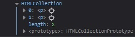
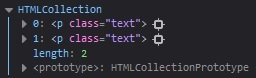

# Los selectores

## Objetivos

- Conocer los selectores disponibles
- Seleccionar elementos del DOM

## Contexto

Como hemos visto anteriormente, para manipular el DOM, necesitaremos seleccionar sus elementos. Podremos utilizar métodos de la interfaz Document. Vamos a ver aquí el conjunto de estos métodos y sus sutilezas.

## `document.getElementsByTagName('p')`

Este método devuelve la lista de los elementos del DOM que tienen el nombre pasado como parámetro. Lo utilizaremos para seleccionar directamente etiquetas HTML.

## `element.item(0).name`

El método `item()` devuelve un nodo especificado en un objeto NodeList. Los nodos están ordenados como aparecen en el código fuente, y el índice empieza en 0. Es decir, este método devuelve el valor del atributo name en la etiqueta input.

### Ejemplo

```html
<body>
  <p>paragraphe1</p>
  <p>paragraphe2</p>
  <span>span1</span>
  <span>span2</span>
</body>
```

```javascript
let p = document.getElementsByTagName("p");
console.log(p);
```



Obtenemos una HTMLCollection, es decir, un array de los elementos `<p></p>` presentes en el DOM.

## `document.getElementById('element')`

Este método devuelve el elemento del DOM que tiene el ID `#element`. Lo utilizaremos para seleccionar un elemento muy preciso.

### Ejemplo

```html
<body>
  <p id="element">paragraphe1</p>
  <p>paragraphe2</p>
</body>
```

```javascript
let element = document.getElementById("element");
console.log(element.innerText);
```


El elemento seleccionado es la etiqueta p que tiene el ID `#element`.

## **Fundamental**

Un identificador debe ser único en una página web. Si varios elementos tienen el mismo ID, el método devolverá el primer elemento encontrado.

```html
<p id="element">paragraphe1</p>
<p id="element">paragraphe2</p>
```

.jpg)

El elemento seleccionado es el primer elemento que tiene el ID `#element` encontrado.

## `document.getElementsByName('element')`

Este método devuelve la lista de los elementos del DOM que tienen el atributo name pasado como parámetro. Nos será especialmente útil para seleccionar elementos de formulario.

### Ejemplo

```html
<body>
  <form>
    <input type name="lastname" />
  </form>
</body>
```

```javascript
let element = document.getElementsByName("lastname");
console.log(element.item(0).name);
```


Obtenemos una HTMLCollection que contiene los elementos que tienen el atributo `name="lastname"`.

## `document.getElementsByClassName('success')`

Este método devuelve la lista de los elementos del DOM que tienen el atributo `class="success"`. Lo utilizaremos para seleccionar un conjunto de elementos que no son necesariamente las mismas etiquetas.

### Ejemplo

```html
<body>
  <p class="success">success</p>
  <p class="success">success</p>
  <p>warning</p>
  <p class="error">error</p>
</body>
```

```javascript
let success = document.getElementsByClassName("success");
console.log(success);
```


Obtenemos una HTMLCollection con los dos elementos que tienen la clase `success`.

## `document.querySelector('p.color')`

Este método devuelve el primer elemento del DOM que corresponde al selector CSS `p.color`.

### Ejemplo

```html
<p class="success">success</p>
<p class="color">success</p>
<p>warning</p>
```

```javascript
let success = document.querySelector("p.color");
console.log(success);
```


Obtenemos el elemento p que tiene la clase `color`.

También es posible utilizar el selector `document.querySelectorAll()`: este último devolverá esta vez todos los elementos que corresponden al selector CSS `p.color`.

## Nota

>Los selectores se pueden encadenar. Por cuestiones de rendimiento, esta técnica nos permitirá precisar nuestra búsqueda en el DOM y así evitar las búsquedas demasiado largas.

## Atención

En términos de rendimiento, preferiremos el uso de los selectores `querySelector` y `getElementById`, porque, una vez encontrado el elemento, la búsqueda en el DOM se interrumpirá. En comparación, `getElementsByClassName` o `getElementsByTagName` tendrán que recorrer todo el DOM para encontrar todos los elementos correspondientes. Sin embargo, es preferible utilizar `querySelector` porque permite devolver el primer elemento que corresponde a uno o varios selectores CSS especificados en la página HTML. Se trata del selector más utilizado en lenguaje JavaScript. Pero para devolver todas las coincidencias, hay que utilizar el método `querySelectorAll()`.

De forma general, la manipulación del DOM es lenta y puede ralentizar significativamente tu aplicación. Evitaremos por ejemplo las búsquedas demasiado genéricas sobre elementos que se repiten a menudo, tales como:

`document.getElementsByTagName('div')`
`document.getElementsByClassName('maClass')`

### Ejemplo

```html
<body>
  <div id="p1">
    <p class="text"></p>
    <p class="text"></p>
  </div>
  <div id="p2">
    <p class="text"></p>
    <p class="text"></p>
  </div>
</body>
```

```javascript
let text = document.getElementById("p1").getElementsByClassName("text");
console.log(text);
```



Aquí, el encadenamiento de los selectores `getElementById` y `getElementsByClassName` nos permite buscar únicamente los elementos que tienen la clase `text` en el elemento que tiene el ID `#p1`. La búsqueda en el elemento `p2` no tiene lugar.

## Interactuar con el CSS con `.style`

En JavaScript, a veces puedes querer recuperar los estilos CSS aplicados a un elemento por medio de las hojas de estilo. Existen varias formas de hacerlo, según si quieres recuperar los estilos en línea o los estilos renderizados. La propiedad DOM `style` se utiliza para aplicar el CSS a un elemento HTML.

## Para recordar

El uso de un selector se hace a partir del elemento `document`.
Tiene métodos que podemos invocar según nuestras necesidades:

  - **`document.getElementById`** para seleccionar un elemento por su id.
  
  - **`document.getElementsByClassName`** para seleccionar elementos por su atributo class.
  
  - **`document.getElementsByName`** para seleccionar elementos por su atributo name.
  
  - **`document.getElementsByTagName`** para seleccionar elementos por su nombre de etiqueta HTML.
  
  - **`document.querySelector`** para seleccionar elementos por los selectores CSS.

## Complemento

**[HTMLCollection](https://developer.mozilla.org/fr/docs/Web/API/HTMLCollection)**