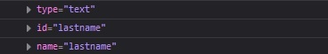
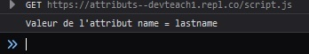
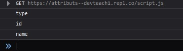
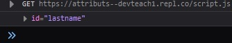
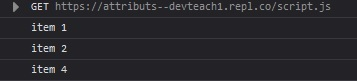
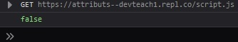
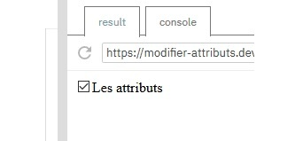
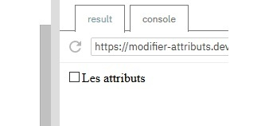

# Acceder a los atributos

## Objetivos

- Verificar si un elemento tiene atributos o un atributo específico
- Acceder a los atributos de un elemento

## Contexto

Para ir más allá en el recorrido del DOM, veremos que la API DOM nos proporciona propiedades y métodos para acceder a los atributos de los elementos seleccionados. Esto nos permitirá, por ejemplo, filtrar el resultado de nuestra búsqueda.

## Element.attributes

Esta propiedad nos permite acceder a una lista de atributos declarados en el nodo especificado. La utilizaremos para analizar todos los atributos de una etiqueta HTML.

### Ejemplo:

```html
<form>
  <input type="text" id="lastname" name="lastname">
</form>
```

```javascript
let lastname = document.getElementById('lastname')
console.log(lastname.attributes)
```



`attributes` nos permite obtener todos los atributos del campo del formulario. Gracias a un bucle, podemos acceder a cada uno de ellos.

## Element.getAttribute('name')

Este método nos devuelve el valor del atributo pasado como parámetro, si existe en el DOM. Lo utilizaremos para acceder al valor de un atributo específico de un elemento.

### Ejemplo:

```html
<form>
  <input type="text" id="lastname" name="lastname">
</form>
```

```javascript
let lastname = document.getElementById('lastname')
let attributName = lastname.getAttribute('name')
console.log(`Valor del atributo name = ${attributName}`)
// Muestra el valor del atributo name, es decir, lastname
```



`getAttribute` nos permitirá filtrar los resultados de una búsqueda en el DOM. Por ejemplo, podremos seleccionar todas las etiquetas `input` de un formulario, excepto las que tengan el atributo `class="info"`.

## Element.getAttributeNames()

Este método nos devuelve una lista de los nombres de los atributos de un elemento del DOM.

### Ejemplo:

```html
<form>
  <input type="text" id="lastname" name="lastname">
</form>
```

```javascript
let lastname = document.getElementById('lastname')
console.log(lastname.getAttributeNames())
```



`getAttributeNames()` nos permitirá verificar si un elemento tiene un atributo, por ejemplo, si una etiqueta `input` tiene el atributo `type`.

## Element.getAttributeNode('id')

Este método nos devuelve el nodo de atributo especificado como parámetro. Lo utilizaremos para acceder a un elemento atributo específico en el DOM.

### Ejemplo:

```html
<form>
  <input type="text" id="lastname" name="lastname">
</form>
```

```javascript
let lastname = document.getElementById('lastname')
console.log(lastname.getAttributeNode('id'))
```



Obtenemos el nodo de atributo `id` correspondiente a la etiqueta `input` con el ID `#lastname`.

## Element.hasAttribute('id')

Este método nos devuelve un valor booleano (verdadero o falso) si el elemento tiene el nombre de atributo pasado como parámetro. Lo utilizaremos para filtrar nuestro resultado de búsqueda en el DOM o para asociar scripts a algunos elementos y no a otros.

### Ejemplo:

```html
<ul>
  <li class="item">item 1</li>
  <li class="item">item 2</li>
  <li>item 3</li>
  <li class="item">item 4</li>
</ul>
```

```javascript
let elements = document.getElementsByTagName('li')
for (let element of elements) {
  if (element.hasAttribute('class')) {
    console.log(element.innerText)
  }
}
```



Obtenemos todos los elementos correspondientes a las etiquetas `li`, excepto la que no tiene el atributo `class`.

## Element.hasAttributes()

Este método nos devuelve un valor booleano (verdadero o falso) si el elemento tiene al menos un atributo o ninguno. También podremos utilizarlo para filtrar nuestros resultados de búsqueda en el DOM y para asociar o no scripts a algunos elementos.

### Ejemplo:

```html
<ul>
  <li id="item">item 1</li>
  <li>item 2</li>
</ul>
```

```javascript
let elements = document.getElementsByTagName('ul')
for (let element of elements) {
  console.log(element.hasAttributes())
}
```



La etiqueta `ul` no tiene ningún atributo: `hasAttributes` nos devuelve el valor `false`.

## Complemento

Uno de los intereses de poder recorrer y seleccionar los atributos del DOM es añadirlos, modificarlos o eliminarlos. Para ello, podremos utilizar dos métodos de la API: `setAttribute('name', 'value')` y `removeAttribute('name')`.

`setAttribute` nos permitirá añadir un nuevo atributo o modificar un atributo existente especificando como parámetros el nombre del atributo y su valor.

```html
<input type="checkbox" name="box" id="box">
Los atributos
```

```javascript
let checkbox = document.getElementById('box')
checkbox.setAttribute('checked', 'checked')
```



`removeAttribute` nos permitirá eliminar un atributo especificando como parámetro su nombre.

```html
<input type="checkbox" name="box" id="box" checked="checked">
Los atributos
```

```javascript
let checkbox = document.getElementById('box')
checkbox.removeAttribute('checked')
```



## A recordar

El acceso a los atributos se hace a partir de un elemento seleccionado en el DOM:

- **`element.attributes`:** propiedad que permite acceder a la lista de atributos de un nodo.

- **`element.getAttribute('name')`:** método que permite obtener el valor del atributo dado para un nodo.

- **`element.getAttributeNames()`:** método que permite obtener la lista de nombres de atributos de un nodo.

- **`element.getAttributeNode('id')`:** método que permite obtener un nodo de atributo dado.

- **`element.hasAttribute('id')`:** método que permite verificar si un nodo tiene el atributo dado.