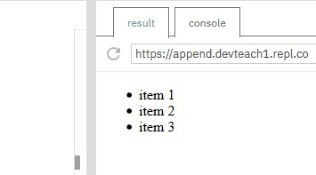
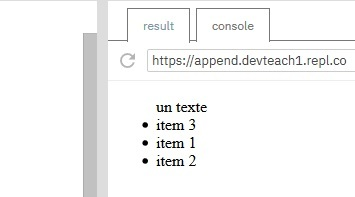
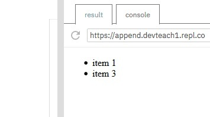

# Modificar el DOM

## Objetivo

- Modificar una página web

## Contexto

Ya sabemos cómo recorrer el DOM y seleccionar elementos. Puede ser interesante conocer los métodos que nos permiten modificarlo. Concretamente, podríamos crear una página web completamente en JavaScript gracias a la API DOM, pero veremos que es preferible concentrarnos en cosas útiles para evitar que nuestra aplicación se ralentice.

## document.createElement('div')

Este método nos permite crear el elemento HTML especificado como parámetro.

## Atención

No añade el elemento al DOM: lo usaremos con uno de los métodos que veremos a continuación.

### Ejemplo

```html
<ul id="liste">
  <li>item 1</li>
  <li>item 2</li>
</ul>
```

```javascript
let liste = document.getElementById('liste')
let li = document.createElement('li')
```

Hemos creado aquí un tercer elemento li listo para ser añadido a nuestra página web.

## Element.append()

Este método nos permite añadir nodos después del último hijo del elemento sobre el que se invoca. Lo usaremos para añadir elementos a nuestra página después de otros elementos.

### Ejemplo

```html
<ul id="liste">
  <li>item 1</li>
  <li>item 2</li>
</ul>
```

```javascript
let liste = document.getElementById('liste')
// Creación del elemento li
let li = document.createElement('li')
// Añadir un texto a nuestro item de lista
li.innerText = 'item 3'
// Añadir el item al final de la lista
liste.append(li)
```



El método append() permite añadir elementos HTML, pero también directamente texto. Así, podríamos haber reemplazado li.innerText = 'item3' por li.append('item 3').

## Complemento: appendChild()

Existe un método `appendChild()` que también permite añadir un elemento después de otro en la página. A diferencia de `append()`, no permite añadir texto directamente y no permite la adición de varios elementos.

## Element.prepend('div')

Este método nos permite añadir nodos antes del primer hijo del elemento sobre el que se invoca. Lo usaremos para añadir elementos a nuestra página antes de otros elementos.

### Ejemplo

```html
<ul id="liste">
  <li>item 1</li>
  <li>item 2</li>
</ul>
```

```javascript
let liste = document.getElementById('liste')
// Creación del elemento li
let li = document.createElement('li')
li.innerText = 'item 3'
// Añadir el item al principio de la lista
liste.prepend(li)
// Añadir un texto antes de nuestra lista
liste.prepend('un texto')
```



Al igual que append(), podemos añadir elementos HTML y texto a nuestra página web con prepend().

## Element.remove()

Este método nos permite simplemente eliminar un nodo del DOM.

### Ejemplo

```html
<ul id="liste">
  <li id="item1">item 1</li>
  <li id="item2">item 2</li>
  <li id="item3">item 3</li>
</ul>
```

```javascript
let item2 = document.getElementById('item2')
item2.remove()
```



Hemos eliminado el elemento con el ID #item2 de la lista.

## Complemento

Podríamos tener ganas de no eliminar definitivamente un elemento del DOM: ya sea para volverlo a poner después, o para moverlo. El método removeChild() podrá ser útil entonces. Va a eliminar el nodo hijo especificado y nos lo devolverá. Podremos guardarlo para usarlo de nuevo más tarde.

## Atención

En términos de rendimiento, la modificación del DOM puede ser costosa. Implica un recorrido en profundidad y el desplazamiento de objetos con respecto a otros, lo que puede ser pesado dependiendo del tamaño de nuestra aplicación. De manera general, hay que evitar:

- el uso de la API DOM para escribir CSS
- la escritura completa de una página en JavaScript
- la creación de una estructura demasiado profunda

## A recordar

Después de haber seleccionado un elemento en el DOM, podemos modificarlo usando varios métodos de la API DOM:

- **`createElement()`:** que permite crear un elemento HTML.

- **`append()`:** que permite añadir un elemento HTML o texto después de otro elemento del DOM.

- **`prepend()`:** que permite añadir un elemento HTML o texto antes de otro elemento del DOM.

- **`remove()`:** que permite eliminar un elemento del DOM.

## Complemento

- **[appendChild()](https://developer.mozilla.org/fr/docs/Web/API/Node/appendChild)** que permite también añadir después de otro elemento de la página. A diferencia de append(), no permite añadir directamente texto y no permite el añadido de varios elementos.

- **[removeChild()](https://developer.mozilla.org/fr/docs/Web/API/Node/removeChild)** que permite eliminar un elemento hijo y devolverlo.