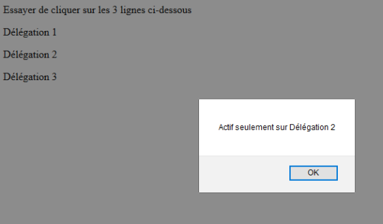

# Añadir/Quitar un evento al DOM

## Objetivos

- Añadir un evento a la lista de oyentes de eventos del DOM
- Quitar un evento de la lista de oyentes de eventos del DOM

## Situación

Según las necesidades de nuestra aplicación y las funcionalidades que tendremos que desarrollar, debemos añadir o quitar eventos. Vamos a ver qué métodos JavaScript están a nuestra disposición para manipular eventos.

## Método

Para crear un evento sobre un elemento del DOM, hay que empezar por seleccionar ese elemento. Como hemos visto, hay métodos disponibles en el objeto `document`, llamados selectores.

- `document.getElementById('title')`: devuelve el elemento de DOM que tiene el id `#title`. Como recordatorio, un identificador debe ser único en la página. En caso de que haya varios elementos con el mismo id, el navegador mostrará una advertencia en la consola y `getElementById` tendrá un resultado impredecible.
- `document.getElementsByName('email-input')`: devuelve un array de elementos de DOM que tienen un atributo `name` `email-input`. Como sugiere el nombre del método con la palabra "element" en plural, en caso de que solo se encuentre un elemento por el selector, este elemento estará incluido en un array.
- `document.getElementsByTagName('p')`: devuelve un array de elementos de DOM que corresponden a la etiqueta `p`.
- `document.getElementsByClassName('navbar')`: devuelve un array de elementos de DOM que corresponden a la clase CSS `navbar`.

Estos 4 métodos son eficientes pero limitados con páginas o aplicaciones complejas. Se revelan poco flexibles porque requieren hacer uso de bucles, diversas operaciones algorítmicas y filtros sobre los resultados obtenidos para poder obtener una lista de elementos. Con dos nuevas funciones introducidas por la API Selectors, la sintaxis permite hacer uso de los selectores CSS. Se aplican generalmente estos dos métodos a partir de la raíz `document`.

- `document.querySelector('h3.subtitle')`: devuelve el elemento DOM encontrado que corresponde al selector CSS `h3.subtitle`. Este selector devolverá `null` si no se encuentra ningún valor. En caso de que el selector encuentre varios resultados, se devolverá el primer resultado encontrado.
- `document.querySelectorAll('h3.subtitle')`: devuelve todos los elementos que satisfacen al selector `h3.subtitle`, en el orden en el que aparecen en el árbol del documento. El tipo de retorno es una `NodeList`, que está vacía si no se encuentra nada.

## Fundamental

Los selectores nos van a permitir seleccionar uno o varios elementos del DOM. Deben ser utilizados sobre el objeto JavaScript `document`, que es el punto de entrada de nuestra página web.

## Ejemplo

```html
<button id="button">Bouton</button>
<div name="text">Une zone de texte</div>
<span>Balise span<span>
<h1 class="title">Titre</h1>
<p class="class-css">classe css</p>
```

```javascript
// Selección del elemento que tiene el atributo id="button"
var element = document.getElementById("button");
// Selección del elemento que tiene el atributo name="text"
var element = document.getElementsByName("text");
// Selección del elemento que es una etiqueta HTML span
var element = document.getElementsByTagName("span");
// Selección del elemento que tiene el atributo class="title"
var element = document.getElementsByClassName("title");
// Selección del elemento que tiene la clase css .class-css
var element = document.querySelector(".class-css");
```

## Complemento

También podemos encadenar los selectores:

```html
<div id="myDiv">
  <p>un paragraphe</p>
  <span>un span</span>
</div>
```

```javascript
document.getElementById("myDiv").getElementsByTagName("p");
```

## AddEventListener

Una vez seleccionado nuestro elemento de DOM, podemos llamar al método `addEventListener()` para asociarle un evento. Como hemos visto, este método toma generalmente dos parámetros: el tipo de evento y una función, que se llamará en el momento del desencadenamiento de ese evento.

```javascript
const button = document.getElementById("button");
button.addEventListener("click", maFonction);
```

Parámetros obligatorios:

- `type`: una cadena de caracteres que representa el tipo de evento a escuchar (`click`, `mouseenter`, `keyup`, etc.).
- `listener`: nuestra función JavaScript que se ejecutará al emitirse el evento.

Parámetros opcionales:

- `options`: un objeto que especifica las características del oyente de eventos.
  - `capture`: un booleano que indica el sentido de propagación del evento: padre luego elemento, o elemento luego padre.
  - `once`: un booleano que indica si el evento debe ser eliminado después de su llamada, si el valor es `true` entonces solo se emitirá una vez.
  - `passive`: un booleano que indica que el evento nunca será emitido.

## RemoveEventListener

Podemos quitar un evento invocando la función `removeEventListener()`. Quitar un eventListener cuando ya no lo necesitamos es una excelente práctica, porque puede ser costoso para el navegador que tiene que observar un nodo de DOM adicional. Adivinaremos fácilmente que, cuanto más elementos haya que cargar en el DOM, más lenta será nuestra página web al mostrarse.

```javascript
const button = document.getElementById("button");

button.removeEventListener("click", maFonction);
```

Hay que tener en cuenta que `removeEventListener` toma los mismos parámetros que la función de añadir. Para realizar la supresión, los parámetros `type` y `listener` deben ser obligatoriamente idénticos a la creación y a la supresión.

```javascript
element.addEventListener("click", clickMe);
element.removeEventListener("click", myFunction); // No funcionará porque el parámetro listener no es el mismo
element.removeEventListener("mousedown", clickMe); // No funcionará porque el parámetro type no es el mismo
element.removeEventListener("click", clickMe); // Funcionará
```

## Complemento

La delegación de evento

La delegación de evento es una práctica que consiste en vincular un evento no sobre el elemento objetivo, sino sobre uno de sus ancestros. La delegación es muy útil en el caso de que queramos vincular un evento sobre un elemento de DOM que no existe todavía en el momento de la carga de la página, como por ejemplo un botón que sería añadido dinámicamente al DOM por una acción de script. Crear un evento sobre ese elemento usando `addEventListener` al cargar la página no funcionará. Es necesario entonces modificar la sintaxis de `addEventListener` para crear una delegación.

Considera el código HTML de abajo:

```html
<body>
  <div id="event">
    <p>délégation des événements</p>
  </div>
</body>
```

Si colocamos un evento `click` sobre la `div`, el clic sobre el texto del párrafo `<p>` desencadenará el evento, aunque este último oculte la `div`. Esto es posible gracias a la delegación de evento. Imaginemos que queremos definir un evento al hacer clic en uno de los párrafos de la `div`. En lugar de vincular tantos eventos como `<p>`, podremos definir solo uno y colocarlo directamente sobre la `div`. La propiedad `target` obtiene el elemento sobre el que se produjo el evento originalmente.

```html
<body>
  <div id="event">
    <p class="no-event">délégation des événements 1</p>
    <p>délégation des événements 2</p>
    <p class="no-event">délégation des événements 3</p>
  </div>
</body>
```

```javascript
var element = document.getElementById("event");
element.addEventListener("click", function (e) {
  var initElem = e.target;
  if (initElem.className == "no-event") {
    return;
  }
  alert("Actif seulement sur Délégation 2");
});
```



## A recordar

El método de añadir un oyente de eventos es la firma de este. Para quitarlo, debemos obligatoriamente indicar los mismos parámetros.

```javascript
element.addEventListener("click", functionEvent, true);¹⁴[14]

element.removeEventListener("click", functionEvent, true);
```