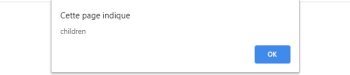

# La propagación de los eventos

## Objetivo

- Comprender y dominar la propagación de los eventos.

## Captura y burbujeo

En JavaScript, los eventos están sujetos a dos fases: la fase de captura y la fase de burbujeo (bubbling). Cuando se dispara un evento, JavaScript recorre todo el código desde el ancestro más alto (html) y desciende hasta el elemento que ha desencadenado el evento. A esto se le llama la fase de captura. Una vez terminada la fase de captura, JavaScript recorre el código en sentido inverso, y solo entonces ejecuta el evento cuando lo encuentra. A esta acción se le llama la fase de burbujeo.

### Ejemplo

Consideremos el siguiente código:

```html
<!doctype html>
<html lang="fr">
<head>
  <meta charset="utf-8">
  <title>propagación</title>
</head>
<body>
  <div id="parent">
    <p>padre</p>
    <div id="children">
      <p>hijo</p>
    </div>
  </div>
</body>
<script>
  const parent = document.getElementById('parent');
  const children = document.getElementById('children');
  parent.addEventListener('click', () => {
    alert('parent')
  })
  children.addEventListener('click', () => {
    alert('children')
  })
</script>
</html>
```

Hemos vinculado un evento click a parent y a children. ¿Qué pasa cuando hacemos click en children?

La primera alerta que se muestra es la provocada por children. La fase de captura ha descendido hasta el elemento que escucha el evento.



Al inicio de la fase de burbujeo, JavaScript ha ejecutado el evento. Se muestra una segunda alerta. Durante la fase de burbujeo, JavaScript ha ejecutado el evento escuchado por el parent.


## Modificar el comportamiento de un evento

Existen dos métodos para modificar este comportamiento:

- El primero pertenece al objeto Event: Event.stopPropagation(),
- El segundo consiste en modificar el tercer parámetro opcional del método document.addEventListener().

### Event.stopPropagation()

Este método se coloca dentro de la función de callback del elemento que escucha el evento. El método stopPropagation() cancela la fase de burbujeo a partir del momento en que el código encuentre la instrucción. Así, el evento no subirá hasta el div parent.

### Ejemplo

```javascript
const parent = document.getElementById('parent');
const children = document.getElementById('children');
parent.addEventListener('click', () => {
  alert('parent')
})
// event como parámetro de la función de callback representa el evento.
children.addEventListener('click', (event) => {
  event.stopPropagation();
  alert('children')
})
```

### addEventListener('event', callback, capture?)

Esta solución consiste en modificar el parámetro opcional del método addEventListener() y pasarlo a true. En este caso, el código ejecutará el evento durante la fase de captura y cancelará la fase de burbujeo.

### Ejemplo

```javascript
const parent = document.getElementById('parent');
const children = document.getElementById('children');
parent.addEventListener('click', () => {
  alert('parent')
}, true)
children.addEventListener('click', () => {
  alert('children')
}, true)
```

En este caso, ignoramos la fase de burbujeo y los eventos se ejecutan durante la fase de captura. Así, al hacer clic en children, la alerta parent se mostrará primero, y luego la alerta children en segundo lugar. El comportamiento es inverso.

## A recordar

- Existen dos fases cuando se dispara un evento: la fase de captura y la fase de burbujeo.
- La fase de captura parte del ancestro más alto hacia el elemento que escucha el evento.
- La fase de burbujeo hace el camino en sentido inverso y ejecuta los eventos.
- stopPropagation() permite detener la fase de burbujeo.
- El tercer parámetro del método addEventListener() delega la ejecución de los eventos a la fase de captura y cancela la fase de burbujeo.